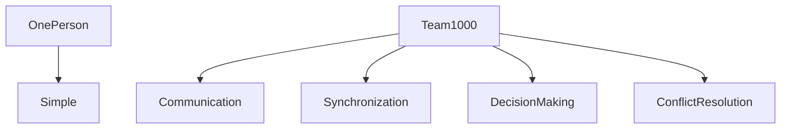
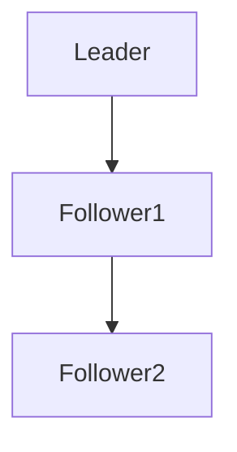
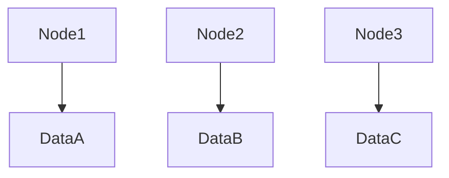
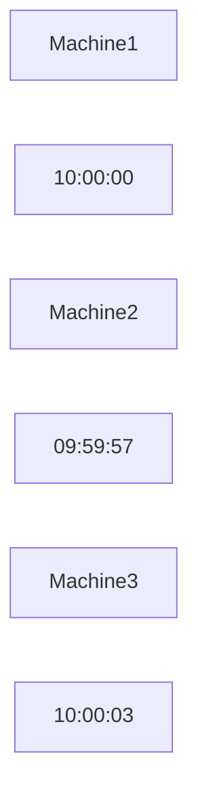
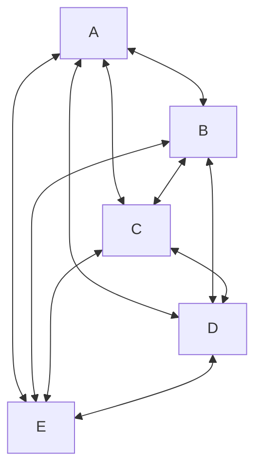
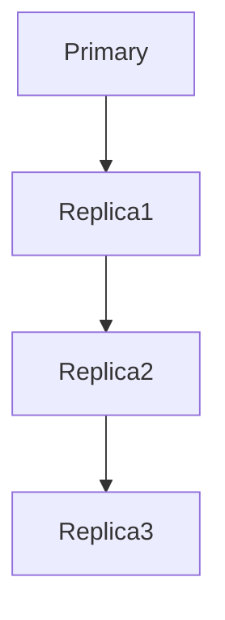
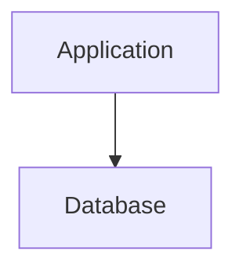
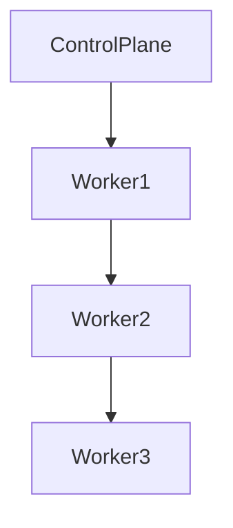
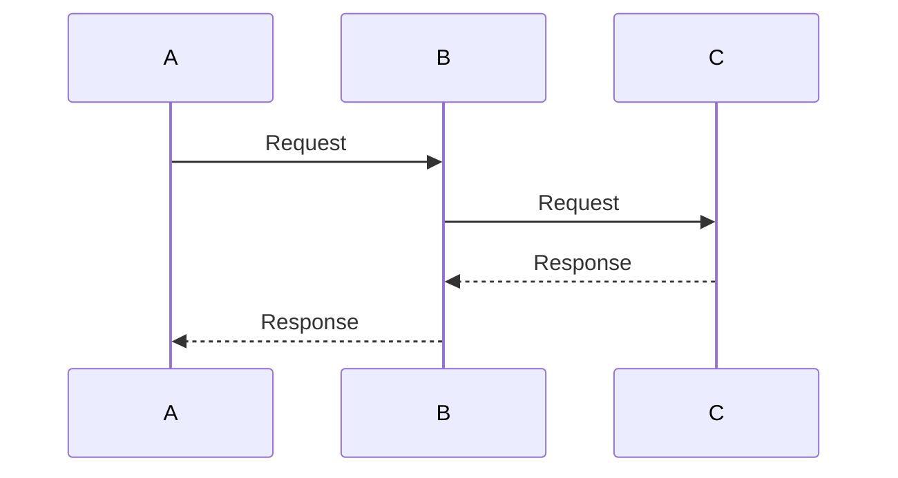
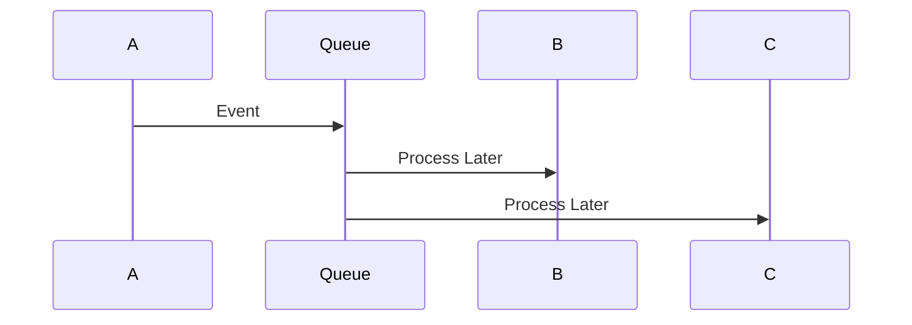

# Coordination Is Expensive

# Why this file exists

Many engineers think distributed systems are about adding more computers.

This is incomplete.

The difficult part is not adding machines.

The difficult part is making machines agree.

This file exists to teach one of the deepest truths in software engineering.

> Distributed systems are coordination systems.

As systems grow, computation becomes cheaper.

Coordination becomes expensive.

This single idea explains most of distributed systems.

---

# The Biggest Misconception

Many engineers think:

```text
More machines

=

More performance
```

Reality:

```text
More machines

=

More communication

=

More coordination

=

More complexity
```

That is the hidden cost.

---

# Mental Model: A Team Project

Imagine:

```text
1 person
```

Easy.

No coordination required.

Now imagine:

```text
1000 people
```

Questions appear.

```text
Who is leader?

Who owns tasks?

Who synchronizes work?

Who resolves conflicts?

Who makes decisions?
```

Coordination becomes the real work.

Distributed systems behave exactly the same.

---

## Visual



---

# The Universal Rule

As machines increase:

```text
Coordination cost increases.
```

Always.

No exceptions.

---

# What Is Coordination?

Definition:

> Coordination is the process of making multiple independent machines work together correctly.

Questions coordination answers:

```text
Who does the work?

Who stores data?

Who is leader?

Who owns responsibility?

Who recovers from failures?

Who synchronizes updates?
```

---

# Single Machine World

Easy.

```text
CPU

Memory

Disk

One clock

One operating system
```

No coordination needed.

---

## Visual

```mermaid
flowchart TD

Application

↓

Linux

↓

CPU

Linux --> Memory

Linux --> Disk
```

Simple.

---

# Distributed World

Now everything multiplies.

```text
100 machines

100 CPUs

100 memories

100 disks

100 clocks
```

Chaos appears.

---

## Visual


Everything must cooperate.

---

# Why Coordination Exists

Machines are independent.

Machines do not share:

```text
Memory

Clocks

State

Knowledge
```

Machines know nothing automatically.

Everything must be communicated.

---

# The Five Coordination Questions

Every distributed system eventually answers these.

```text
Who is leader?

Who owns data?

Who handles requests?

Who recovers from failures?

Who synchronizes state?
```

Almost every technology exists because of these questions.

---

# The Leader Problem

Imagine:

```text
3 database nodes
```

Who accepts writes?

---

## Visual



Someone must coordinate.

Otherwise chaos occurs.

---

# What Happens Without Leaders?

Imagine:

```text
Node1 writes A

Node2 writes B

Node3 writes C
```

Conflicts appear.

---

## Visual



Who is correct?

Coordination solves this.

---

# The State Problem

Machines have local state.

Example:

```text
Server1

User balance = 100

Server2

User balance = 90
```

Who is right?

---

## Visual


State synchronization is difficult.

---

# The Clock Problem

Machines disagree about time.

---

## Visual



Time coordination becomes expensive.

---

# Why Consensus Exists

Consensus means:

> Multiple machines agree on one truth.

Examples:

```text
Raft

Paxos

etcd

ZooKeeper
```

These are coordination technologies.

---

## Visual

```mermaid
flowchart TD

Proposal

↓

Voting

↓

Agreement

↓

Commit
```

Agreement is expensive.

---

# The Communication Explosion

This is one of the most important visuals.

Imagine:

```text
1 machine
```

Connections:

```text
0
```

---

## Visual


---

# Two Machines


1 connection.

---

# Five Machines



Connections explode.

---

# Coordination Complexity

Approximation:

```text
Machines

↓

Connections

1 -> 0

2 -> 1

5 -> 10

10 -> 45

100 -> 4950
```

Coordination scales poorly.

---

# Why Databases Become Complex

Databases are coordination systems.

Questions they solve:

```text
Who owns data?

Who accepts writes?

Who replicates data?

Who recovers failures?
```

Databases coordinate constantly.

---

## Visual



---

# Why Microservices Become Dangerous

People split code.

But communication grows.

---

# Monolith



Simple.

---

# Microservices

```mermaid
flowchart TD

Gateway

↓

Auth

↓

User

↓

Payment

↓

Inventory

↓

Notification
```

Coordination explodes.

---

# Every Arrow Is Coordination

Architects see this:

```text
ServiceA → ServiceB
```

Senior engineers see:

```text
Coordination cost
```

Every arrow is expensive.

---

# Kubernetes Is A Coordination Platform

Kubernetes is not a container runner.

It is a coordination engine.

Questions Kubernetes answers:

```text
Where do containers run?

Who is healthy?

Who is dead?

Who gets traffic?

Who gets restarted?
```

---

## Visual



Kubernetes coordinates machines.

---

# Why etcd Exists

Kubernetes needs a source of truth.

etcd solves:

```text
Who knows the current state?
```

Without etcd:

```text
Chaos
```

---

# Why Kafka Exists

Kafka coordinates events.

Questions:

```text
Who produced data?

Who consumed data?

Who owns offsets?

Who replays events?
```

Kafka is a coordination engine.

---

## Visual

```mermaid
flowchart TD

Producer

↓

Broker

↓

Consumer
```

---

# Why CAP Theorem Exists

CAP is a coordination theorem.

Question:

```text
How do we coordinate during failures?
```

Coordination becomes impossible under some conditions.

Tradeoffs appear.

---

# Why Latency Increases

Coordination requires communication.

Communication requires waiting.

Waiting creates latency.

---

## Visual

```mermaid
flowchart TD

Coordination

↓

Communication

↓

Waiting

↓

Latency
```

Everything is connected.

---

# Why Coordination Becomes Bottlenecks

Example:

```text
100 servers

↓

One coordinator
```

Coordinator becomes overloaded.

---

## Visual

```mermaid
flowchart TD

Server1

Server2

Server3

Server4

Server5

↓

Coordinator
```

Centralization creates bottlenecks.

---

# How Engineers Reduce Coordination

This is one of the biggest engineering skills.

Strategies:

```text
Partitioning

Caching

Replication

Asynchronous systems

Event-driven architecture

Eventual consistency
```

Goal:

```text
Reduce coordination.
```

---

# Synchronous Systems

Everyone waits.

---

## Visual



Slow.

---

# Asynchronous Systems

Nobody blocks.

---

## Visual



Scales better.

---

# Eventual Consistency Exists To Reduce Coordination

Strong consistency:

```text
Everyone agrees now.
```

Expensive.

Eventual consistency:

```text
Everyone agrees later.
```

Cheaper.

---

# Linux Connection

Linux helps reduce coordination costs.

Linux components:

Networking:

```text
TCP stack
```

Scheduling:

```text
CFS
```

I/O:

```text
epoll
```

Isolation:

```text
cgroups

namespaces
```

Linux enables coordination.

---

## Visual

```mermaid
flowchart TD

Application

↓

Linux Kernel

Linux Kernel --> Networking

Linux Kernel --> Scheduling

Linux Kernel --> Storage

Linux Kernel --> Memory
```

Linux is coordination infrastructure.

---

# Production Example: Google Docs

Millions edit simultaneously.

Questions:

```text
Who wrote first?

Who wins conflicts?

Who synchronizes edits?
```

Coordination everywhere.

---

# Production Example: Uber

Questions:

```text
Who gets driver?

Who processes payment?

Who updates maps?

Who sends notifications?
```

Uber is a giant coordination engine.

---

# Production Example: Kubernetes

Questions:

```text
Where should containers run?

Which node is healthy?

Who should restart?

Who gets traffic?
```

Kubernetes is mostly coordination.

---

# Performance Implications

Coordination increases:

```text
Latency

Network traffic

CPU usage

Complexity
```

---

# Security Implications

Coordination requires trust.

Secure:

```text
Identity

TLS

Certificates

Authentication

Authorization
```

---

# Observability Implications

Observe coordination.

Metrics:

```text
Latency

Queue depth

Replication lag

Leader elections

Consensus failures
```

---

# Common Beginner Mistakes

## Mistake 1

Thinking more machines equals more performance.

Wrong.

More machines increase coordination.

---

## Mistake 2

Creating too many microservices.

---

## Mistake 3

Using synchronous communication everywhere.

---

## Mistake 4

Ignoring leader bottlenecks.

---

## Mistake 5

Ignoring network costs.

---

# Engineering Mindset

Junior engineer:

```text
How do I add servers?
```

Mid engineer:

```text
How do these servers communicate?
```

Senior engineer:

```text
How much coordination is happening?
```

Staff engineer:

```text
How do I eliminate unnecessary coordination?
```

Principal engineer:

```text
How do I build systems that need almost no coordination?
```

---

# Interview Questions

## Beginner

1. What is coordination?

2. Why is coordination expensive?

3. Why do machines need leaders?

4. Why do machines disagree?

5. Why is communication expensive?

---

## Intermediate

6. Why do databases become coordination systems?

7. Why does Kubernetes need etcd?

8. Why do microservices increase coordination costs?

9. Why is eventual consistency useful?

10. Why do synchronous systems scale poorly?

---

## Advanced

11. Why are distributed systems mostly coordination systems?

12. Why do connections explode?

13. Why does CAP theorem exist?

14. Why does latency emerge from coordination?

15. How do senior engineers reduce coordination?

---

# Cheat Sheet

```text
Coordination Is Expensive

Questions:

Who leads?

Who owns data?

Who synchronizes?

Who recovers?

Who decides?

More Machines

↓

More Communication

↓

More Coordination

↓

More Complexity

Solutions:

Caching

Partitioning

Asynchronous systems

Replication

Eventual consistency

Golden Rule:

The enemy is not computation.

The enemy is coordination.
```

---

# Final Thought

This sentence explains most of distributed systems.

```text
Computers are cheap.

Communication is expensive.

Coordination is even more expensive.
```

Everything else in distributed systems is an attempt to reduce coordination.
