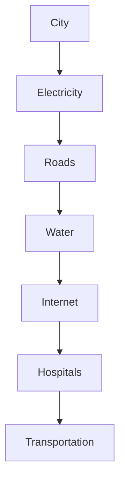
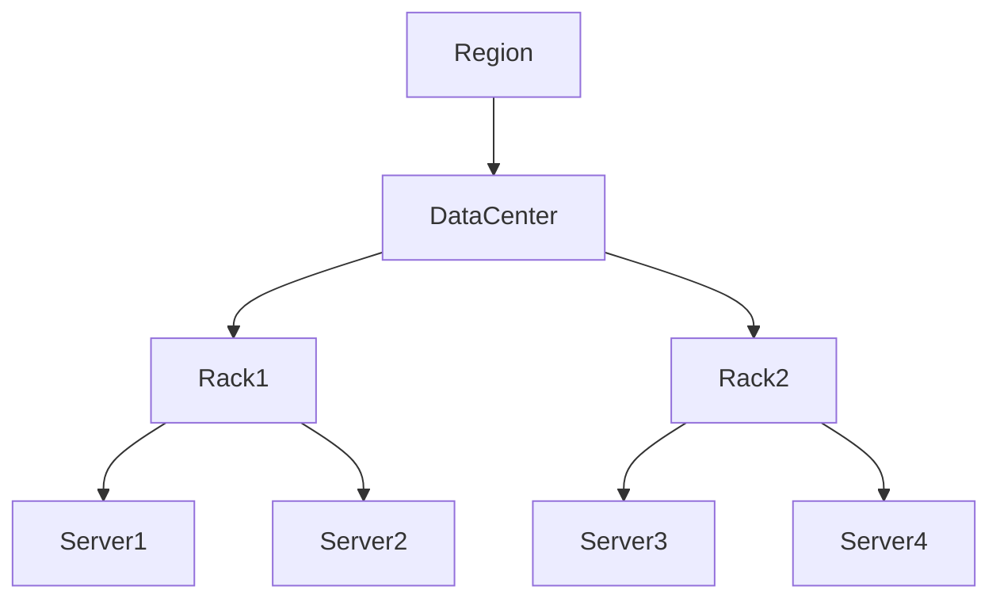
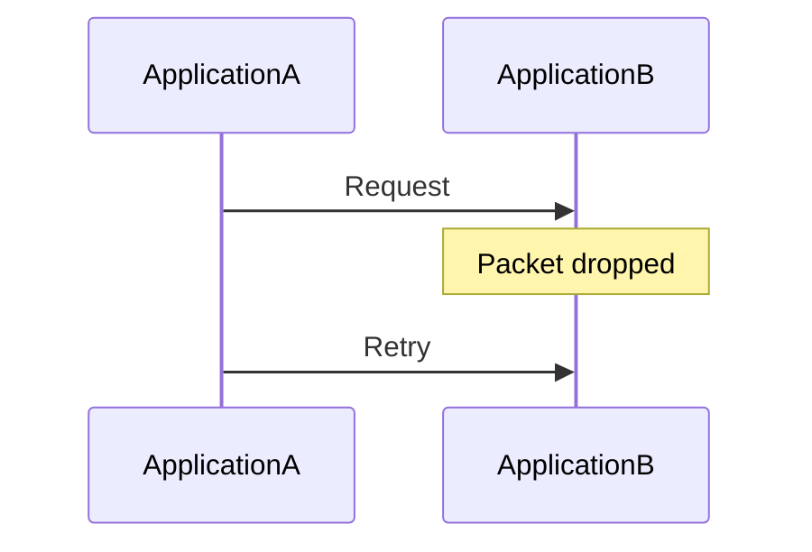
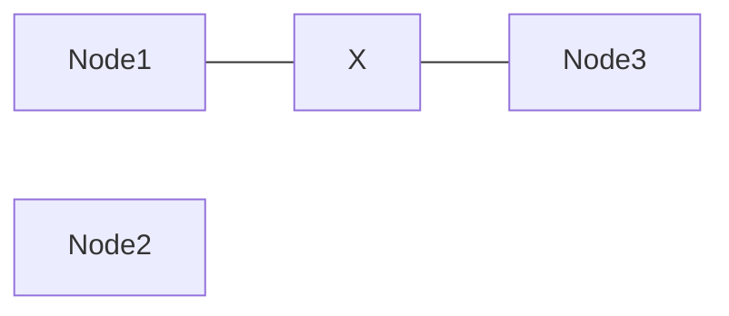
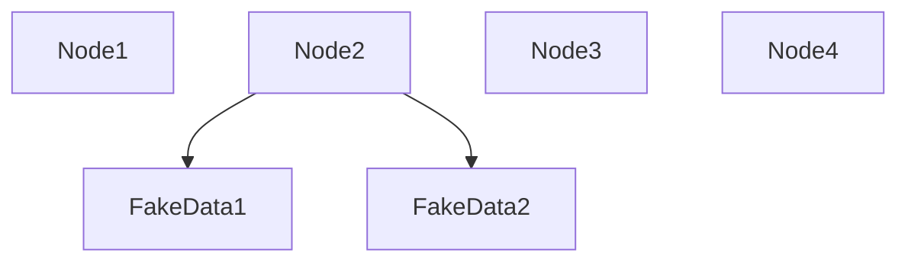
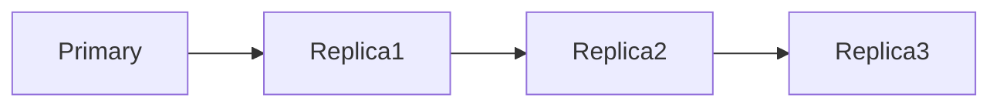
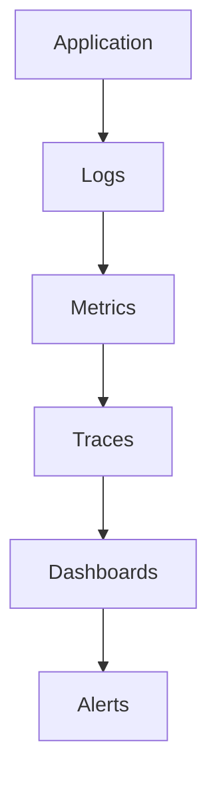

# Distributed Failure Models

# Why this file exists

Distributed systems are fundamentally different from normal applications.

Traditional programming mindset:

```text
Build software

↓

Software works
```

Distributed systems mindset:

```text
Build software

↓

Expect failures

↓

Survive failures

↓

Users should never notice
```

This file exists to teach the most important engineering truth.

> Failures are not exceptions.

Failures are normal operating conditions.

If your system cannot survive failures, it is already broken.

---

# The Most Important Mental Shift

Stop thinking:

```text
If failures happen...
```

Start thinking:

```text
When failures happen...
```

Failures are guaranteed.

Not possible.

Not probable.

Guaranteed.

---

# Mental Model: A City

Imagine a city.

At any moment:

```text
Road accidents

Power outages

Traffic jams

Human mistakes

Equipment failures
```

Yet the city continues functioning.

Why?

Because cities are designed to tolerate failures.

Distributed systems work the same way.

---

## Visual



Each subsystem may fail.

The city survives.

---

# What Is A Failure Model?

Definition:

> A failure model describes all the ways components can stop behaving correctly.

It is a blueprint for disaster planning.

Instead of asking:

```text
How does the system work?
```

We ask:

```text
How can this break?
```

---

# Why Failure Models Exist

Single machine systems:

```text
Machine fails

↓

Application stops
```

Simple.

Distributed systems:

```text
Thousands of machines

↓

Millions of interactions

↓

Billions of messages
```

Failures become inevitable.

---

# The Universal Rule

Every component eventually fails.

Everything.

No exceptions.

---

# What Can Fail?

```text
CPU

Memory

Disk

Network

Switches

Routers

Services

Databases

Regions

Humans
```

---

## Visual

```mermaid
mindmap

root((Failures))

Hardware

CPU

Memory

Disk

Power

Network

DNS

Router

Switch

Software

Bugs

Crashes

Humans

Misconfiguration

Regions

Outages
```

---

# Failure Domains

A failure domain is:

> A boundary inside which one failure can affect multiple systems.

Examples:

```text
Machine

Rack

Availability Zone

Data Center

Region

Cloud Provider
```

---

## Visual



Failures can propagate.

---

# The Hierarchy Of Failures

```mermaid
flowchart TD

Hardware

↓

Machine

↓

Rack

↓

DataCenter

↓

Region

↓

Cloud Provider
```

As scale increases, blast radius increases.

---

# Failure Type 1

# Crash Failures

The simplest failure.

Component stops completely.

Examples:

```text
Machine dies

Container exits

Service crashes
```

---

## Visual

```mermaid
flowchart LR

Users

↓

Server1

Server1 -.Crash.-> Server2

Server2 --> HealthyResponse
```

---

# Linux Examples

Machine crashes because:

```text
Kernel panic

OOM Killer

Disk corruption

CPU overheating
```

Commands:

```bash
dmesg

journalctl

free -h

top

uptime
```

---

# Failure Type 2

# Omission Failures

The component is alive.

But messages disappear.

Examples:

```text
Packets dropped

Requests ignored

Responses never arrive
```

---

## Visual



---

# Failure Type 3

# Network Partition

One of the most important failures.

Machines are alive.

But cannot communicate.

---

## Visual



The network split.

This is called:

```text
Split Brain risk
```

---

# Example

India region:

```text
Healthy
```

USA region:

```text
Healthy
```

Undersea cable breaks.

Communication dies.

Machines are alive.

System is partitioned.

---

# Failure Type 4

# Timing Failures

Everything works.

Just too slowly.

Examples:

```text
Slow database

Slow network

Slow DNS

Slow storage
```

Slow systems are often more dangerous than dead systems.

---

## Visual


One slow component affects everything.

---

# Failure Type 5

# Response Failures

Component returns wrong results.

Examples:

```text
Corrupted data

Incorrect computations

Stale cache
```

These are dangerous.

System appears healthy.

But is lying.

---

# Failure Type 6

# Byzantine Failures

The hardest failure.

Definition:

> A component behaves unpredictably.

Examples:

```text
Wrong data

Random behavior

Malicious behavior

Inconsistent responses
```

---

## Visual



Node2 is compromised.

---

# Failure Type 7

# Human Failures

The most common failure.

Examples:

```text
Wrong deployment

Wrong DNS entry

Deleting databases

Invalid certificates

Misconfiguration
```

Humans cause many outages.

---

## Visual

```mermaid
flowchart TD

Engineer

↓

Configuration

↓

Production

↓

Outage
```

---

# The Eight Fallacies Of Distributed Computing

Beginners unknowingly believe these.

Wrong assumptions:

```text
1. Network is reliable.

2. Latency is zero.

3. Bandwidth is infinite.

4. Network is secure.

5. Topology never changes.

6. One administrator exists.

7. Transport cost is zero.

8. Network is homogeneous.
```

All are false.

---

# The Blast Radius Concept

Question:

> If this component dies, how much breaks?

Small blast radius:

```text
One server
```

Large blast radius:

```text
Entire world
```

---

## Visual

```mermaid
flowchart TD

OneServer

↓

Rack

↓

DataCenter

↓

Region

↓

GlobalOutage
```

Reduce blast radius.

Always.

---

# Cascading Failures

One failure causes another.

Then another.

Then another.

---

## Visual

```mermaid
flowchart TD

DatabaseSlow

↓

APIQueueBuilds

↓

CPUUsageSpikes

↓

ContainersCrash

↓

LoadBalancerOverloads

↓

Outage
```

Most outages happen this way.

---

# Distributed Failure Chain

```mermaid
flowchart TD

SlowDNS

↓

SlowAPI

↓

RequestTimeout

↓

RetryStorm

↓

DatabaseOverload

↓

Outage
```

Failures compound.

---

# Retry Storms

Bad retry logic can kill systems.

Visual:

```mermaid
flowchart TD

Request

↓

Timeout

↓

Retry

↓

MoreTraffic

↓

DatabaseOverload

↓

Outage
```

Retries are dangerous.

---

# Why Distributed Systems Are Hard

Single machine:

```text
1 failure source
```

Distributed systems:

```text
Thousands of failure sources
```

Complexity explodes.

---

# How Engineers Fight Failures

Tools:

```text
Redundancy

Replication

Retries

Timeouts

Circuit Breakers

Caching

Load Balancing

Autoscaling
```

These are all failure mitigation techniques.

---

# Redundancy Model

Never trust one machine.

---

## Visual



Replication is insurance.

---

# Health Check Model

```mermaid
flowchart TD

LoadBalancer

↓

HealthCheck

HealthCheck --> Healthy

HealthCheck -.Fail.-> RemoveNode
```

Bad nodes are removed.

---

# Multi-Region Model


One region can die.

System survives.

---

# Linux Connection

Linux is the foundation of failure handling.

Linux manages:

```text
Processes

Networking

Memory

Storage

Security

Isolation
```

Linux failures become distributed failures.

---

# Linux Failure Examples

## OOM Killer

```text
Memory exhausted

↓

Kernel kills process
```

---

## Disk Full

```text
Disk usage 100%

↓

Database stops
```

---

## DNS Failure

```text
Service unreachable
```

---

## Network Saturation

```text
Packets dropped
```

---

# Production Example: Netflix

Goal:

```text
Users should never notice failures.
```

If a server dies:

```text
Remove it.

Redirect traffic.

Continue streaming.
```

Netflix assumes failures constantly happen.

---

# Observability Is Mandatory

You cannot fix invisible failures.

Observe:

```text
Logs

Metrics

Traces

Alerts
```

---

## Visual



---

# Performance Implications

Failures increase:

```text
Latency

CPU usage

Retry traffic

Memory usage
```

Performance degrades before outages occur.

---

# Security Implications

Attackers intentionally create failures.

Examples:

```text
DDoS

DNS poisoning

Certificate attacks

Resource exhaustion
```

Security is failure engineering too.

---

# Common Beginner Mistakes

## Mistake 1

Treating failures as rare.

Wrong.

Failures are normal.

---

## Mistake 2

Testing only happy paths.

Wrong.

Test disasters.

---

## Mistake 3

Ignoring network partitions.

Wrong.

Partitions happen.

---

## Mistake 4

Adding infinite retries.

Wrong.

Retry storms kill systems.

---

## Mistake 5

Ignoring observability.

Wrong.

Invisible systems are impossible to debug.

---

# Engineering Mindset

Junior engineer:

```text
How does this work?
```

Mid engineer:

```text
How does this scale?
```

Senior engineer:

```text
How does this fail?
```

Staff engineer:

```text
What is the blast radius?
```

Principal engineer:

```text
How do I make failures invisible to users?
```

---

# Interview Questions

## Beginner

1. What is a failure model?

2. Why do distributed systems need failure models?

3. What is a crash failure?

4. What is a network partition?

5. Why are failures normal?

---

## Intermediate

6. What are omission failures?

7. What are timing failures?

8. What are response failures?

9. What is blast radius?

10. What are cascading failures?

---

## Advanced

11. What are Byzantine failures?

12. Why are retry storms dangerous?

13. Why are network partitions difficult?

14. Why are humans the biggest failure source?

15. How does Linux influence distributed failures?

---

# Cheat Sheet

```text
Distributed Failure Models

Crash Failure

Omission Failure

Network Partition

Timing Failure

Response Failure

Byzantine Failure

Human Failure

Golden Rules:

Everything fails.

Failures compound.

Failures spread.

Blast radius matters.

Observability is mandatory.

Goal:

Reliable systems

from

unreliable components.
```

---

# Final Thought

This sentence defines senior engineers.

```text
Junior engineers build systems that work.

Senior engineers build systems that survive failure.

Principal engineers build systems where users never notice failure.
```

That is distributed systems engineering.
