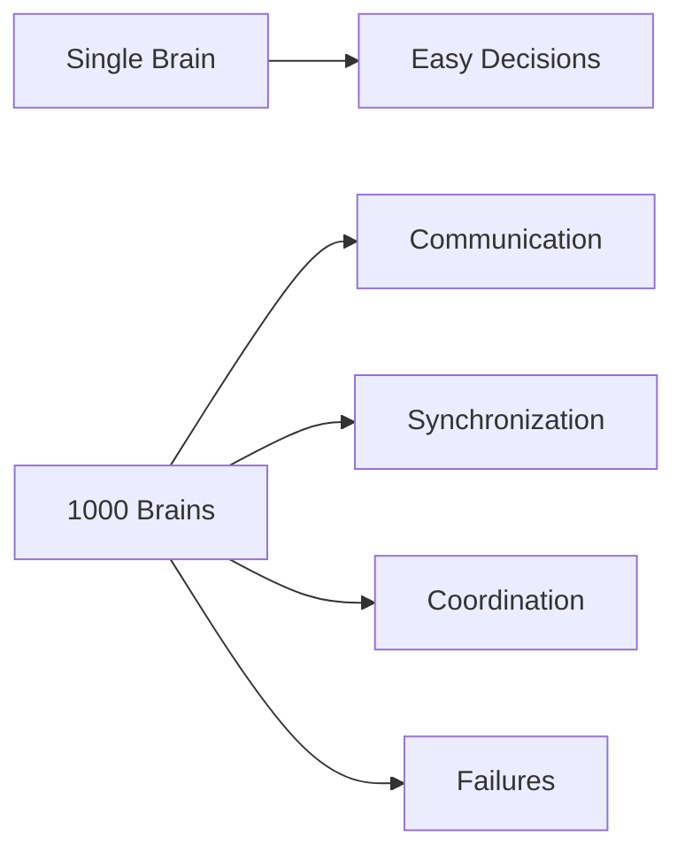
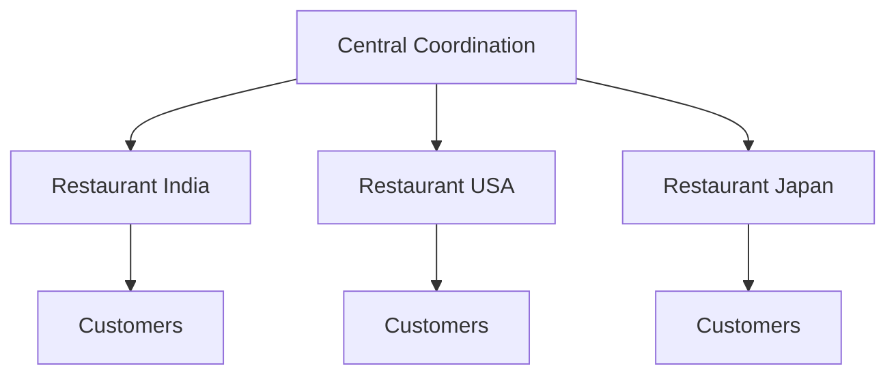
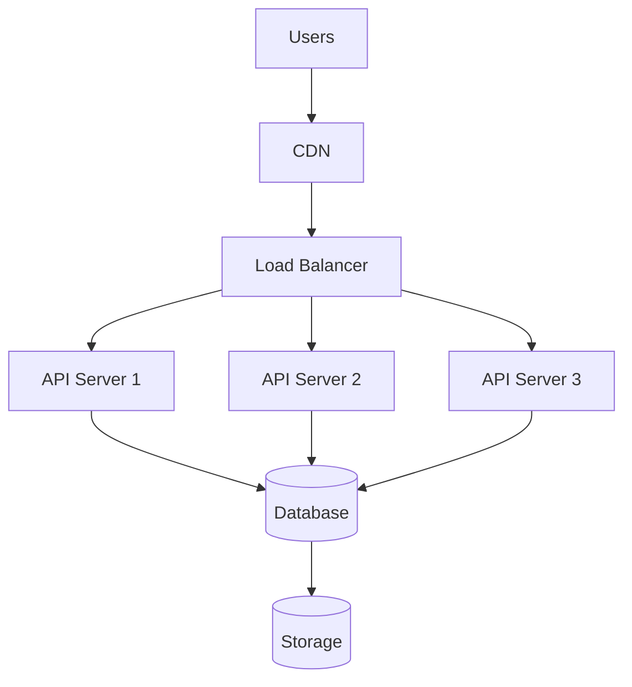
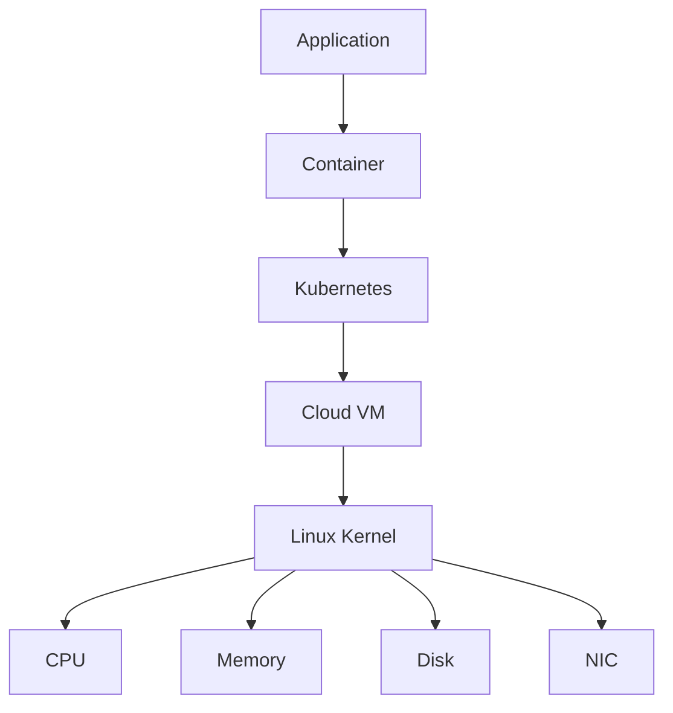
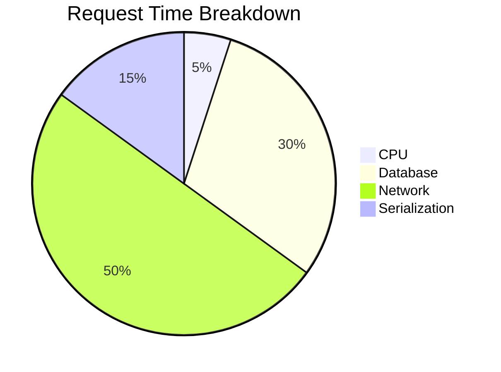
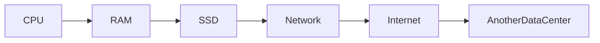
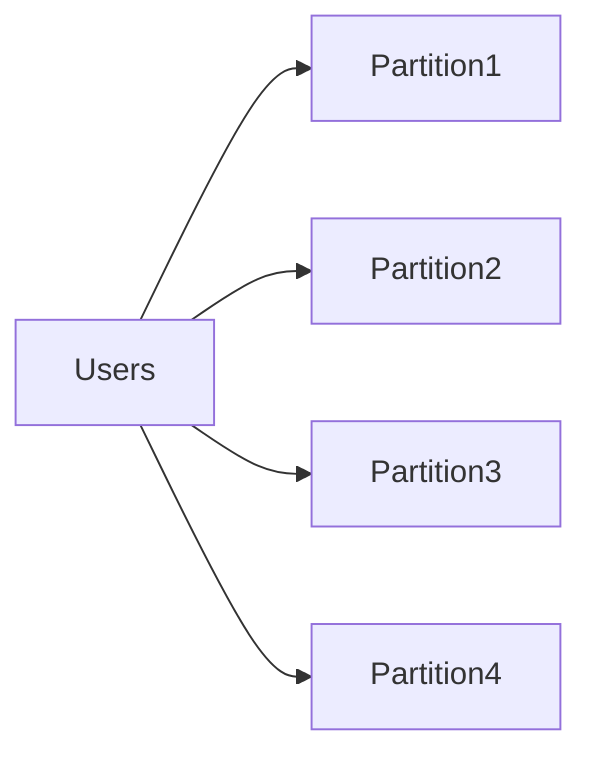
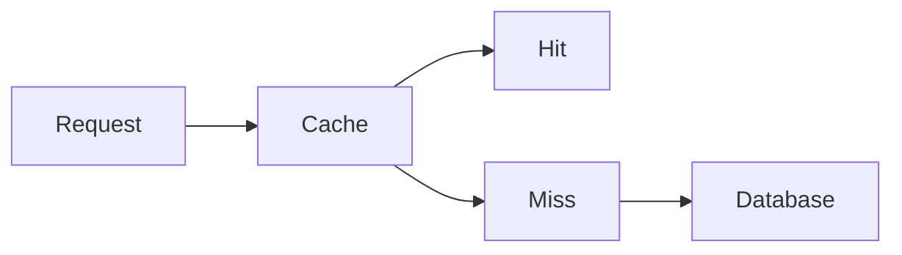
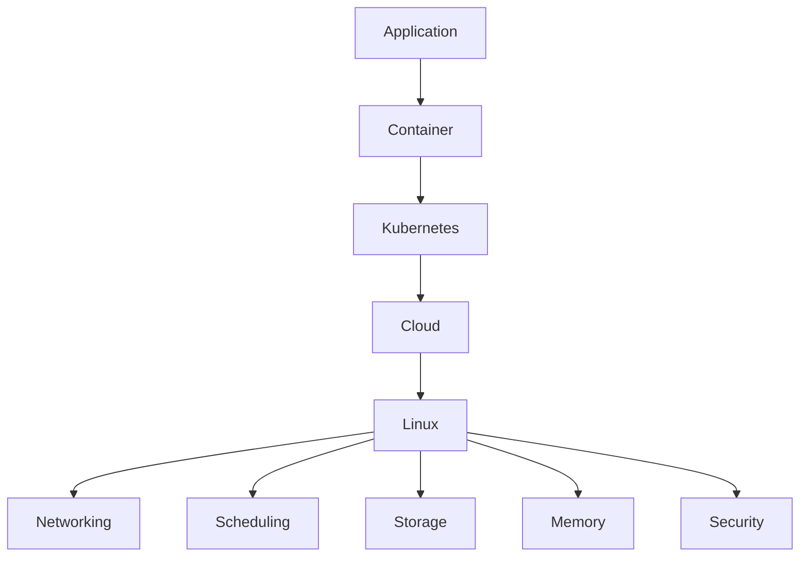

# Distributed Systems Mental Models

# Why this file exists

Most engineers struggle with distributed systems because they learn technologies instead of patterns.

They memorize:

- Docker
- Kubernetes
- Kafka
- Redis
- PostgreSQL
- Cassandra
- Cloud providers

But distributed systems is not about technologies.

Distributed systems is about patterns.

Technologies change.

Patterns survive.

This file exists to build engineering intuition.

If you understand these mental models, every future technology becomes easier to understand.

---

# The Universal Truth

Distributed systems is NOT:

```text
Many computers.
```

Distributed systems is:

```text
Many unreliable computers

↓

Working together

↓

To create one reliable experience.
```

Everything else is implementation.

---

# Mental Model 1

# One Brain → Many Brains

Single machine:

```text
One machine

↓

One CPU

↓

One memory

↓

One storage

↓

One clock
```

Easy.

Distributed systems:

```text
1000 machines

1000 CPUs

1000 memories

1000 disks

1000 clocks
```

Everything becomes coordination.

---

## Visual



---

# Mental Model 2

# The Restaurant Chain

Imagine a small restaurant.

```text
1 Chef

1 Waiter

10 Customers
```

Easy.

Now imagine:

```text
500 Restaurants

5000 Employees

10 Countries

Millions of Customers
```

New questions appear.

```text
Who coordinates inventory?

Who synchronizes menus?

Who handles failures?

Who manages traffic?
```

Distributed systems are global restaurant chains.

---

## Visual



---

# Mental Model 3

# The Traffic System

Applications are cities.

Requests are vehicles.

Servers are roads.

Databases are warehouses.

Load balancers are traffic police.

Traffic jams become bottlenecks.

---

## Visual

```mermaid
flowchart TD

Users

↓

CDN

↓

LoadBalancer

↓

API

↓

Database

↓

Storage
```

Expanded:



---

# Mental Model 4

# Every Layer Is Someone Else's Computer

Cloud illusion:

```text
Cloud
```

Reality:

```text
Cloud

↓

Data Centers

↓

Servers

↓

Linux

↓

Hardware
```

Nothing magical exists.

Everything is computers.

---

## Visual

```mermaid
flowchart TD

App

↓

Containers

↓

Kubernetes

↓

Cloud

↓

Linux

↓

Hardware
```

Expanded:



---

# Mental Model 5

# Distributed Systems Are Communication Systems

Machines spend enormous time waiting.

Very little time computing.

Example:

```text
CPU computation

2 ms

Network call

100 ms
```

Most time is waiting.

---

## Visual



---

# Mental Model 6

# Networks Are Expensive

Memory access:

```text
100 nanoseconds
```

SSD:

```text
100 microseconds
```

Network:

```text
1-100 milliseconds
```

Network is expensive.

Avoid unnecessary communication.

---

## Visual



Latency increases dramatically.

---

# Mental Model 7

# Distributed Systems Fight Physics

Physics creates limitations.

```text
Distance

↓

Latency

↓

Delays
```

Nothing can beat physics.

---

## Visual


Distance always costs time.

---

# Mental Model 8

# Everything Will Fail

This is the most important mindset.

Failures are normal.

Failures are expected.

Failures are guaranteed.

---

## What Can Fail?

```text
CPU

Memory

Disk

Network

Services

Databases

Regions

Humans
```

---

## Visual

```mermaid
mindmap

root((Failures))

Hardware

CPU

Memory

Disk

Software

Bugs

Crashes

Humans

Misconfiguration

Regions

Power Outage

Network
```

---

# Mental Model 9

# Build For Failure, Not Success

Bad architecture:

```text
Works normally

Dies under failures
```

Good architecture:

```text
Works normally

Survives failures
```

---

## Visual

```mermaid
flowchart TD

Request

↓

Server1

Server1 --> Healthy

Server1 -.Crash.-> Server2

Server2 --> HealthyResponse
```

---

# Mental Model 10

# Replication = Insurance

Never trust one machine.

Bad:

```text
1 copy
```

Good:

```text
3 copies
```

Better:

```text
3 regions
```

---

## Visual


---

# Mental Model 11

# Divide Work Into Smaller Pieces

Huge problems are split.

Example:

```text
100 million users
```

Split into:

```text
10 million users/server
```

This is partitioning.

---

## Visual



---

# Mental Model 12

# Caching Is Remembering

Human brain:

```text
Recent memories

↓

Fast access
```

Computer systems:

```text
Cache

↓

Fast access
```

---

## Visual

```mermaid
flowchart LR

User

↓

Cache

↓

Database
```

Expanded:



---

# Mental Model 13

# Load Balancers Are Traffic Police

Problem:

```text
100000 requests

↓

1 server
```

Server dies.

Solution:

```text
Distribute traffic.
```

---

## Visual

```mermaid
flowchart TD

Users

↓

LoadBalancer

↓

Server1

LoadBalancer --> Server2

LoadBalancer --> Server3

LoadBalancer --> Server4
```

---

# Mental Model 14

# Databases Become Cities

As systems grow.

Databases evolve.

```text
Database

↓

Cluster

↓

Shards

↓

Regions
```

---

## Visual

```mermaid
flowchart LR

SingleDB

↓

ReplicatedDB

↓

ShardedDB

↓

GlobalDB
```

---

# Mental Model 15

# The Entire Internet Is One Giant Distributed System

Everything connects.

---

## Visual

```mermaid
flowchart TD

Users

↓

ISP

↓

DNS

↓

CDN

↓

LoadBalancer

↓

Services

↓

MessageQueue

↓

Databases

↓

Storage

↓

Linux

↓

Hardware
```

---

# Universal Engineering Flow

Every modern company architecture looks similar.

```mermaid
flowchart TD

Users

↓

Edge

↓

CDN

↓

LoadBalancer

↓

API Gateway

↓

Services

↓

Cache

↓

MessageQueue

↓

Databases

↓

Storage
```

---

# Linux Connection

Everything eventually reaches Linux.



---

# The Distributed Systems Pyramid

```mermaid
pyramid-beta

title Distributed Systems Pyramid

"Applications":5

"Services":5

"Containers":5

"Kubernetes":5

"Cloud":5

"Linux":5

"Hardware":5
```

If Mermaid doesn't support `pyramid-beta`, use:

```text
            Applications
         Microservices
          Containers
         Kubernetes
       Cloud Infrastructure
              Linux
            Hardware
```

---

# The 10 Golden Rules

```text
1. Everything fails.

2. Networks are slow.

3. Distance creates latency.

4. More machines create complexity.

5. Communication is expensive.

6. Databases become bottlenecks.

7. Cache is mandatory at scale.

8. Observability is mandatory.

9. Linux powers everything.

10. Reliability is engineered.
```

---

# Engineering Mindset

Junior engineer:

```text
How do I build this?
```

Mid engineer:

```text
How does this scale?
```

Senior engineer:

```text
How does this fail?
```

Staff engineer:

```text
How do I make failures invisible?
```

Principal engineer:

```text
How do I make thousands of unreliable machines appear as one reliable machine?
```

That is distributed systems.

---

# Interview Questions

## Beginner

1. Why are mental models important?

2. Why do distributed systems become communication problems?

3. Why is network expensive?

4. Why are failures expected?

5. Why is Linux important?

---

## Intermediate

6. Why is physics important?

7. Why does adding machines increase complexity?

8. Why is caching mandatory?

9. Why are databases bottlenecks?

10. Why are load balancers necessary?

---

## Advanced

11. Why is communication the biggest cost?

12. Why does geography matter?

13. Why are distributed systems coordination systems?

14. Why is observability mandatory?

15. Why does every system eventually become distributed?

---

# Cheat Sheet

```text
Distributed Systems Mental Models

One Brain → Many Brains

Restaurant Chain

Traffic System

Communication System

Physics Problem

Failure System

Replication Insurance

Cache = Memory

Load Balancer = Traffic Police

Internet = Giant Distributed System

Linux = Foundation
```

---

# Final Thought

The entire field of distributed systems can be reduced to one sentence:

```text
The art of making thousands

of unreliable Linux computers

appear as one reliable computer.
```

Everything else is implementation details.
