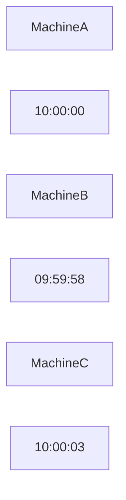

# Distributed Systems Thinking

# Why this file exists

Most engineers do not fail because they lack technical knowledge.

They fail because they think at the wrong level.

Junior engineers think about code.

Senior engineers think about systems.

Principal engineers think about constraints.

Distributed systems is not a collection of technologies.

It is a way of thinking.

This file exists to transform your brain.

After reading this file, you should stop seeing:

```text
Docker

Kubernetes

Kafka

Redis

Databases

Cloud
```

as separate technologies.

You should start seeing:

```text
Communication

Coordination

Latency

Failures

Tradeoffs

Physics
```

because those are the real problems.

---

# The Biggest Misconception

Many people think:

```text
Distributed Systems

=

Technology
```

Wrong.

Distributed systems is a mindset.

Technology changes.

Mindsets survive.

---

# The Universal Rule

Everything eventually becomes a systems problem.

Every application evolves like this:

```text
Code

↓

Application

↓

Services

↓

Infrastructure

↓

Systems

↓

Business
```

As scale increases.

The problems change.

---

## Visual

```mermaid
flowchart TD

Code

↓

Application

↓

Services

↓

Infrastructure

↓

DistributedSystems

↓

Business
```

---

# Mental Model: Building A City

Imagine building a city.

You don't start by asking:

```text
Which road is best?
```

You ask:

```text
How will millions of people live here?
```

Distributed systems are digital cities.

---

## Visual

```mermaid
mindmap

root((Digital City))

People

Roads

Power

Water

Storage

Communication

Security

Observability
```

Cities are systems.

Applications become cities.

---

# The Evolution Of Thinking

Every engineer evolves.

---

# Stage 1

# Code Thinking

Question:

```text
How do I write this?
```

Focus:

```text
Functions

Variables

Loops

Classes
```

---

## Visual

```mermaid
flowchart TD

Problem

↓

Code

↓

Solution
```

Simple.

---

# Stage 2

# Application Thinking

Question:

```text
How do I build this application?
```

Focus:

```text
Frontend

Backend

Database
```

---

## Visual

```mermaid
flowchart TD

Frontend

↓

Backend

↓

Database
```

---

# Stage 3

# Service Thinking

Question:

```text
How do multiple services work together?
```

Focus:

```text
APIs

Databases

Caches

Queues
```

---

## Visual

```mermaid
flowchart TD

Gateway

↓

Auth

Gateway --> User

Gateway --> Payment

Gateway --> Notification
```

---

# Stage 4

# Systems Thinking

Question:

```text
How does the entire ecosystem work?
```

Focus:

```text
Users

Infrastructure

Failures

Latency

Scale

Business
```

---

## Visual

```mermaid
flowchart TD

Users

↓

Infrastructure

↓

Services

↓

Data

↓

Business
```

---

# Stage 5

# Constraint Thinking

This is elite engineering.

Question:

```text
What limits this system?
```

Focus:

```text
Physics

Money

Humans

Latency

Complexity
```

Constraints become the primary concern.

---

# The Six Questions Systems Thinkers Ask

Every architecture eventually answers these.

---

# Question 1

# What Breaks First?

Do not ask:

```text
How does this work?
```

Ask:

```text
What fails first?
```

---

## Visual

```mermaid
flowchart TD

UsersIncrease

↓

Database

↓

CPU

↓

Network

↓

Outage
```

Bottlenecks appear.

---

# Question 2

# What Is The Bottleneck?

Everything has one.

Possible bottlenecks:

```text
CPU

Memory

Disk

Database

Network

Humans
```

---

## Visual

```mermaid
flowchart TD

Users

↓

API

↓

Database

↓

Storage
```

Database often becomes the bottleneck.

---

# Question 3

# What Is The Blast Radius?

Question:

```text
If this fails

What else fails?
```

---

## Visual

```mermaid
flowchart TD

Server

↓

Rack

↓

DataCenter

↓

Region

↓

GlobalOutage
```

Think about impact.

---

# Question 4

# Where Is Latency Coming From?

Every arrow has cost.

---

## Visual

```mermaid
flowchart TD

DNS

↓

Gateway

↓

Service

↓

Database

↓

Storage
```

Every hop adds latency.

---

# Question 5

# Where Is Coordination Happening?

Every system coordinates.

Questions:

```text
Who leads?

Who stores data?

Who synchronizes?

Who recovers?
```

---

## Visual

```mermaid
flowchart TD

Leader

↓

Follower1

Leader --> Follower2

Leader --> Follower3
```

Coordination is expensive.

---

# Question 6

# What Are The Tradeoffs?

Nothing is free.

Tradeoffs:

```text
Consistency

Availability

Performance

Security

Cost
```

---

## Visual

```mermaid
mindmap

root((Tradeoffs))

Performance

Security

Cost

Consistency

Availability

Scalability
```

---

# Learn To See Layers

Beginners see:

```text
Website
```

Systems thinkers see:

```text
Users

↓

DNS

↓

CDN

↓

LoadBalancer

↓

Gateway

↓

Services

↓

Cache

↓

Queues

↓

Databases

↓

Storage

↓

Linux

↓

Hardware
```

---

## Visual

```mermaid
flowchart TD

Users

↓

DNS

↓

CDN

↓

LoadBalancer

↓

Gateway

↓

Services

↓

Cache

↓

Queue

↓

Database

↓

Storage

↓

Linux

↓

Hardware
```

This is how senior engineers think.

---

# Learn To See Flows

Applications are flows.

---

## Visual

```mermaid
flowchart TD

UserAction

↓

Request

↓

Authentication

↓

BusinessLogic

↓

Database

↓

Response
```

Every system is a flow.

---

# Learn To See Bottlenecks

Applications naturally centralize work.

---

## Visual

```mermaid
flowchart TD

API1

API2

API3

API4

↓

Database
```

Centralized systems create bottlenecks.

---

# Learn To See Failures

Every box eventually dies.

---

## Visual

```mermaid
mindmap

root((Failures))

CPU

Memory

Storage

DNS

Cache

Database

Network

Humans
```

Failures are normal.

---

# Learn To See Physics

Physics always wins.

Enemies:

```text
Distance

Time

Heat

Electricity

Bandwidth
```

---

## Visual


Distance costs time.

---

# Learn To See Time

Machines disagree.

---

## Visual



Time is difficult.

---

# Learn To See Linux

Linux is invisible infrastructure.

---

## Visual

```mermaid
flowchart TD

Application

↓

Containers

↓

Kubernetes

↓

Cloud

↓

Linux

↓

Hardware
```

Linux powers everything.

---

# Learn To See Organizations

Companies are distributed systems too.

---

## Visual

```mermaid
flowchart TD

Company

↓

Teams

↓

Services

↓

Infrastructure

↓

Users
```

People become part of architecture.

---

# The Thinking Evolution Pyramid

```text
Principal Engineer

Staff Engineer

Senior Engineer

Mid Engineer

Junior Engineer
```

The questions change.

---

## Visual

```mermaid
flowchart TD

Junior

↓

Mid

↓

Senior

↓

Staff

↓

Principal
```

---

# Question Evolution

## Junior Engineer

```text
How do I code this?
```

---

## Mid Engineer

```text
How do I scale this?
```

---

## Senior Engineer

```text
How does this fail?
```

---

## Staff Engineer

```text
What is the blast radius?
```

---

## Principal Engineer

```text
How do I make failures invisible to users?
```

---

# The Universal Thinking Framework

Always ask these.

```text
1. What problem exists?

2. What bottleneck exists?

3. What fails first?

4. What tradeoffs exist?

5. What scales poorly?

6. What is expensive?

7. What is invisible?

8. What business goal exists?
```

This framework works everywhere.

---

# Distributed Systems Is Business Engineering

Eventually systems serve businesses.

Businesses optimize:

```text
Revenue

Reliability

Cost

Growth
```

Technology serves business.

Never the opposite.

---

# Production Example: Netflix

Junior sees:

```text
Video player.
```

Systems thinker sees:

```text
Users

↓

CDN

↓

Gateway

↓

Microservices

↓

Kafka

↓

Databases

↓

Storage

↓

Linux
```

Different perspectives.

---

# Production Example: Uber

Users see:

```text
Book ride.
```

Systems thinkers see:

```text
Maps

Payments

Notifications

Drivers

Traffic

Pricing

Infrastructure
```

Everything is a system.

---

# The Universal Systems Loop

```mermaid
flowchart TD

Users

↓

Traffic

↓

Infrastructure

↓

Failures

↓

Observability

↓

Optimization

↓

Users
```

This loop never ends.

---

# Common Beginner Mistakes

## Mistake 1

Thinking technologies are independent.

---

## Mistake 2

Optimizing code before systems.

---

## Mistake 3

Ignoring users.

---

## Mistake 4

Ignoring bottlenecks.

---

## Mistake 5

Ignoring business goals.

---

# Engineering Mindset

Bad:

```text
How do I build this?
```

Better:

```text
How does this work?
```

Senior:

```text
How does this fail?
```

Staff:

```text
How does this evolve?
```

Principal:

```text
How do I align technology, people, physics, and business?
```

---

# Interview Questions

## Beginner

1. What is distributed systems thinking?

2. Why is mindset important?

3. Why do applications become systems?

4. Why do bottlenecks appear?

5. Why does Linux matter?

---

## Intermediate

6. Why is architecture layered?

7. Why is latency expensive?

8. Why does coordination increase?

9. Why are failures normal?

10. Why do business goals matter?

---

## Advanced

11. Why is distributed systems a thinking discipline?

12. Why do senior engineers ask different questions?

13. Why do systems evolve predictably?

14. Why do technologies matter less than patterns?

15. Why do businesses influence architecture?

---

# Cheat Sheet

```text
Distributed Systems Thinking

Stop Seeing:

Docker

Kubernetes

Kafka

Redis

Cloud

Start Seeing:

Communication

Coordination

Latency

Failures

Tradeoffs

Physics

Golden Questions:

What breaks?

What bottlenecks?

What fails?

What scales?

What is expensive?

What business goal exists?
```

---

# Final Thought

This single sentence defines systems thinkers.

```text
Junior engineers build software.

Senior engineers build systems.

Principal engineers design ecosystems

where technology, physics, humans,

and business work together.
```

That is distributed systems thinking.
