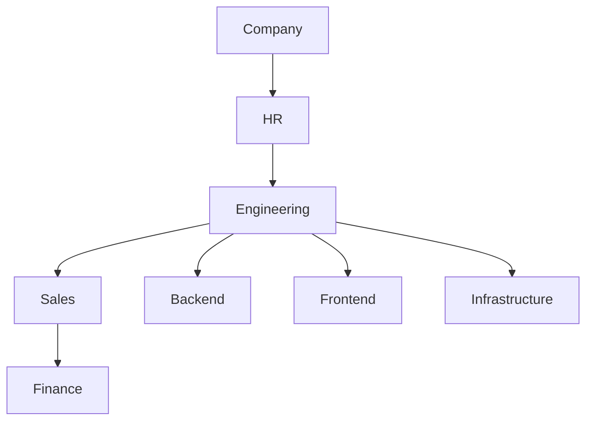
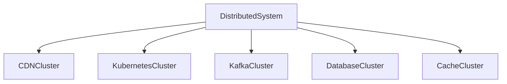
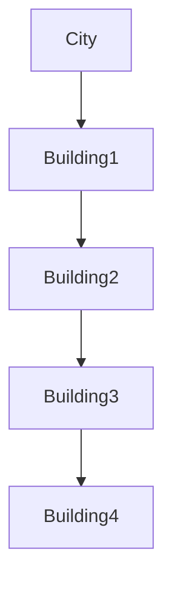
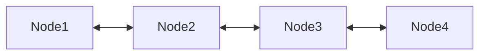
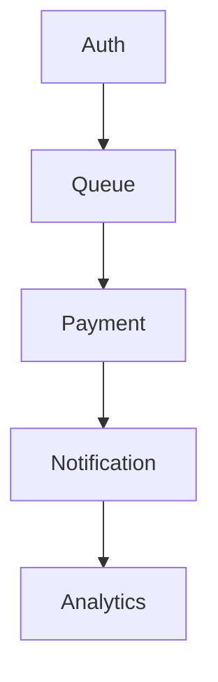
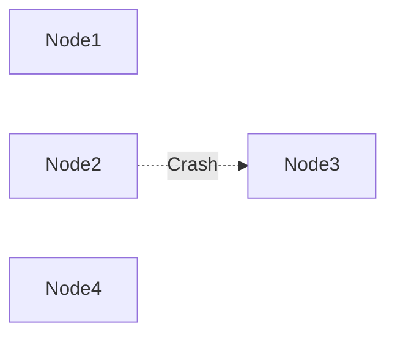
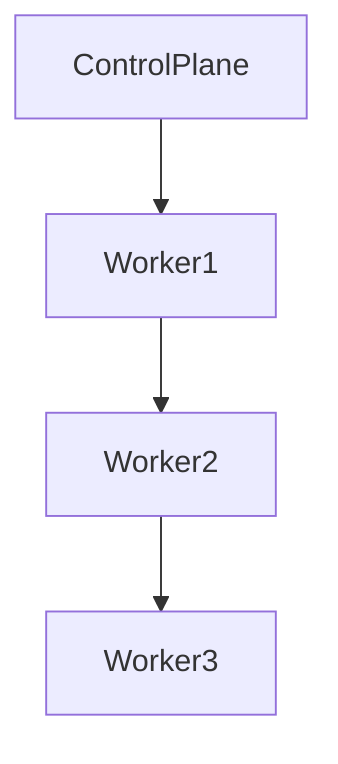
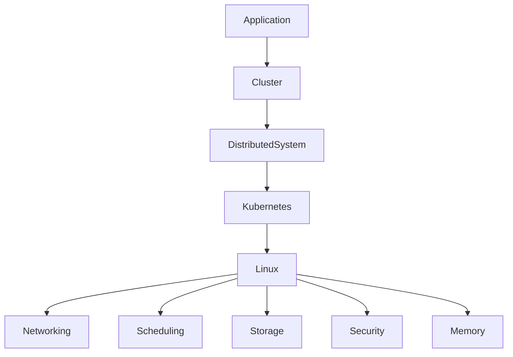

# Distributed Systems vs Cluster

# Why this file exists

One of the most common misconceptions in software engineering is this:

```text
Distributed System = Cluster
```

People use them interchangeably.

They are not the same thing.

This misunderstanding causes confusion when learning:

- Linux
- Kubernetes
- Databases
- Kafka
- Cloud infrastructure
- Microservices
- System Design

This file exists to build the correct mental model.

---

# The Short Answer

A cluster is a type of distributed system.

But a distributed system is much bigger.

Relationship:

```text
Distributed Systems

└── Clusters
```

Think:

```text
Animal

└── Dog
```

Not every animal is a dog.

Similarly:

```text
Distributed System

└── Cluster
```

Not every distributed system is a cluster.

---

# First Principles

Ask yourself:

> Why do multiple computers exist at all?

Answer:

```text
Single machines have limits.
```

Limits:

```text
CPU

Memory

Storage

Network

Geography

Failures
```

So we add more machines.

The moment machines start communicating:

```text
Distributed System
```

is born.

---

# What Is A Distributed System?

Definition:

> Multiple independent computers coordinate their actions and appear as a single system to users.

Users should not see complexity.

Users should experience:

```text
Fast

Reliable

Always available
```

---

# Mental Model

Imagine a company.

```text
CEO

Managers

Employees

Departments

Offices
```

Many independent units.

One company.

That is a distributed system.

---

## Visual



Many parts.

One experience.

---

# What Is A Cluster?

Definition:

> A cluster is a group of computers working closely together to perform a specific task.

Clusters are usually:

```text
Tightly coupled

Same location

Same network

Same goal
```

Examples:

```text
Kubernetes Cluster

Redis Cluster

Hadoop Cluster

Kafka Cluster

Elasticsearch Cluster
```

---

# Mental Model

Imagine one team inside a company.

```text
5 engineers

1 mission

One office
```

That is a cluster.

---

## Visual


---

# Distributed System Mental Model

Distributed systems are larger.

Example:

```mermaid
flowchart TD

Users

↓

CDN

↓

LoadBalancer

↓

API Gateway

↓

Microservices

↓

Message Queue

↓

Databases

↓

Storage
```

Each box may itself contain clusters.

---

# The Key Insight

Clusters are building blocks.

Distributed systems are ecosystems.

---

## Visual



---

# Analogy 1: City vs Building

Cluster:

```text
A building
```

Distributed system:

```text
An entire city
```

---

## Visual



---

# Analogy 2: Human Body

Cluster:

```text
Heart
```

Distributed System:

```text
Entire body
```

---

## Visual

```mermaid
mindmap

root((Human Body))

Brain

Heart

Lungs

Liver

Kidneys

Nervous System
```

Each subsystem coordinates.

---

# Architecture Comparison

## Cluster

Goal:

```text
Perform one task efficiently.
```

Example:

```text
Database cluster
```

---

## Visual

```mermaid
flowchart TD

Client

↓

LoadBalancer

↓

DB1

LoadBalancer --> DB2

LoadBalancer --> DB3
```

Single responsibility.

---

## Distributed System

Goal:

```text
Build an entire application ecosystem.
```

---

## Visual

```mermaid
flowchart TD

User

↓

CDN

↓

LoadBalancer

↓

Gateway

↓

AuthService

Gateway --> UserService

Gateway --> PaymentService

Gateway --> NotificationService

PaymentService --> Database

UserService --> Cache

NotificationService --> Queue
```

---

# Core Differences

| Feature | Cluster | Distributed System |
|---------|---------|-------------------|
| Scope | Narrow | Broad |
| Goal | One task | Entire ecosystem |
| Complexity | Medium | High |
| Components | Similar | Different |
| Communication | Internal | Everywhere |
| Geography | Usually same region | Multiple regions |
| Ownership | Often one service | Entire platform |
| Example | Redis Cluster | Netflix |

---

# Coupling Differences

## Cluster

Usually tightly coupled.



---

## Distributed System

Usually loosely coupled.



---

# Cluster Communication

Communication is usually faster.

Reasons:

```text
Same data center

Same network

Low latency
```

---

## Visual


---

# Distributed Communication

Communication is expensive.

Reasons:

```text
Different regions

Different services

Different networks
```

---

## Visual


Distance costs time.

---

# Failure Differences

## Cluster Failure

If one node dies:



Cluster survives.

---

# Distributed Failure

Failures happen everywhere.

```mermaid
mindmap

root((Failures))

DNS

API

Network

Cache

Queue

Database

Region

Human Error
```

---

# Cluster Examples

## Kubernetes Cluster

Purpose:

```text
Run containers
```

Visual:



---

# Redis Cluster

Purpose:

```text
Distributed caching
```

Visual:

```mermaid
flowchart LR

Client

↓

RedisNode1

RedisNode1 --> RedisNode2

RedisNode2 --> RedisNode3
```

---

# Kafka Cluster

Purpose:

```text
Event streaming
```

Visual:

```mermaid
flowchart TD

Producer

↓

Broker1

Broker1 --> Broker2

Broker2 --> Broker3

Broker3 --> Consumer
```

---

# Modern Distributed System Example

Netflix.

Contains many clusters.

```mermaid
flowchart TD

Users

↓

CDNCluster

↓

GatewayCluster

↓

AuthCluster

↓

VideoCluster

↓

RecommendationCluster

↓

KafkaCluster

↓

DatabaseCluster
```

Netflix is a distributed system.

Each component is a cluster.

---

# Linux Connection

Everything eventually runs on Linux.

Visual:



Linux powers everything.

---

# Where Linux Knowledge Becomes Important

Clusters require Linux knowledge.

Distributed systems require much deeper Linux knowledge.

Understand:

```text
TCP

DNS

epoll

Namespaces

cgroups

systemd

Filesystems

Observability
```

---

# Evolution Of Modern Systems

```mermaid
flowchart TD

SingleMachine

↓

Cluster

↓

Microservices

↓

DistributedSystem

↓

GlobalInfrastructure
```

---

# Internet Scale Architecture

```mermaid
flowchart TD

Users

↓

DNS

↓

CDN

↓

LoadBalancer

↓

API Gateway

↓

Services

↓

Cache Cluster

↓

Message Queue Cluster

↓

Database Cluster

↓

Storage Cluster
```

Every box is a cluster.

The entire diagram is a distributed system.

---

# Performance Considerations

## Clusters optimize:

```text
Parallelism

High availability

Fault tolerance
```

---

## Distributed systems optimize:

```text
Scalability

Global availability

Resilience

User experience
```

---

# Security Considerations

Cluster security:

```text
Node authentication

TLS

RBAC
```

Distributed system security:

```text
Zero Trust

Identity

Encryption

Secrets

Certificates

API security
```

---

# Observability Considerations

Cluster observability:

```text
Node health

CPU

Memory

Storage
```

Distributed observability:

```text
Logs

Metrics

Traces

Events

Business metrics
```

---

# Troubleshooting Mindset

Cluster problems:

```text
Node down

Storage full

CPU overloaded
```

Distributed problems:

```text
DNS latency

Network congestion

Cache misses

Replication lag

Queue buildup

Cross-region latency
```

---

# Common Beginner Mistakes

## Mistake 1

Thinking Kubernetes equals distributed systems.

Wrong.

Kubernetes is a cluster technology.

---

## Mistake 2

Thinking adding nodes creates distributed systems.

Architecture matters.

---

## Mistake 3

Thinking clusters are globally distributed.

Usually not.

---

## Mistake 4

Ignoring network costs.

Communication is expensive.

---

## Mistake 5

Learning tools instead of patterns.

Patterns survive.

Tools change.

---

# Engineering Mindset

Think hierarchically.

```text
Machine

↓

Cluster

↓

Service

↓

Platform

↓

Distributed System

↓

Global Infrastructure
```

Do not think in technologies.

Think in layers.

---

# Interview Questions

## Beginner

1. What is a cluster?

2. What is a distributed system?

3. Are they the same?

4. Which is larger in scope?

5. Why do clusters exist?

---

## Intermediate

6. Why are clusters building blocks?

7. Why is communication expensive?

8. Why do distributed systems become ecosystems?

9. Why does Linux matter?

10. Why do failures increase?

---

## Advanced

11. Why isn't Kubernetes itself a distributed system?

12. Why is Netflix a distributed system?

13. Why is a Redis cluster not a complete distributed system?

14. Why does coordination cost increase?

15. Why is observability mandatory?

---

# Cheat Sheet

```text
Distributed System

=

Entire ecosystem

Examples:

Netflix

Amazon

Google

Cloudflare


Cluster

=

One specialized subsystem

Examples:

Kafka

Redis

Kubernetes

Elasticsearch


Relationship:

Distributed Systems

└── Clusters


Mental Model:

Cluster = Building

Distributed System = City
```

---

# Final Thought

This single sentence will save years of confusion.

```text
Clusters build components.

Distributed systems build products.
```

Or even simpler:

```text
Clusters are teams.

Distributed systems are civilizations.
```

That is the difference.
