# Everything Is A Tradeoff

# Why this file exists

This may be one of the most important lessons in all of engineering.

Many beginners believe there is a perfect architecture.

There is not.

Many engineers spend years searching for:

```text
Fast

Cheap

Simple

Reliable

Secure

Scalable

Globally available
```

all at once.

This is impossible.

Every engineering decision gains something and loses something else.

This file exists to teach this universal truth.

> There are no perfect systems.

Only tradeoffs.

Senior engineers do not optimize systems.

They optimize tradeoffs.

---

# The Biggest Misconception

Beginners ask:

```text
Which technology is best?
```

Wrong question.

Senior engineers ask:

```text
Which tradeoffs are acceptable?
```

That is the real question.

---

# Mental Model: A Blanket

Imagine a blanket.

Pull one side.

Another side moves.

You cannot optimize every dimension simultaneously.

Distributed systems behave exactly like this.

---

## Visual

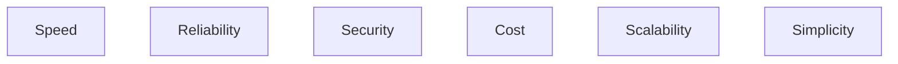

Improve one.

Others may suffer.

---

# The Universal Law

Engineering is resource allocation.

Resources are limited.

You are constantly balancing:

```text
Time

Money

Complexity

Performance

Reliability

Security
```

---

# Why Tradeoffs Exist

Everything is finite.

Finite:

```text
CPU

Memory

Storage

Network

Electricity

Humans

Budgets
```

You cannot maximize everything.

---

# The Tradeoff Wheel

This is one of the most important diagrams.

```mermaid
mindmap

root((Tradeoffs))

Performance

Cost

Security

Reliability

Scalability

Simplicity

Maintainability

Observability
```

These constantly compete.

---

# Tradeoff 1

# Performance vs Cost

Fast systems are expensive.

Cheap systems are slower.

---

## Visual

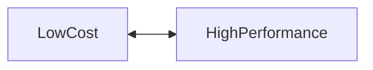

Example:

```text
One small server

↓

Cheap

↓

Slow
```

Versus:

```text
100 servers

↓

Expensive

↓

Fast
```

---

# Tradeoff 2

# Simplicity vs Scalability

Simple systems scale poorly.

Scalable systems become complex.

---

# Simple

```mermaid
flowchart TD

Users

↓

Application

↓

Database
```

Easy.

---

# Scalable

```mermaid
flowchart TD

Users

↓

CDN

↓

LoadBalancer

↓

Gateway

↓

Services

↓

Cache

↓

Queue

↓

Databases
```

Powerful.

Complex.

---

# Tradeoff 3

# Consistency vs Availability

One of the biggest tradeoffs.

Question:

```text
Should data always be correct?

Or

Should systems always respond?
```

Sometimes you cannot have both.

This becomes CAP theorem.

---

## Visual

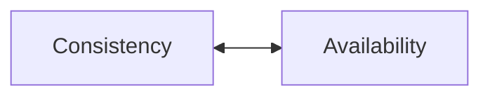

---

# Example

Banking systems:

Prefer:

```text
Consistency
```

Social media:

Prefer:

```text
Availability
```

Different problems.

Different tradeoffs.

---

# Tradeoff 4

# Latency vs Accuracy

Question:

```text
Do we answer immediately?

Or

Do we compute perfectly?
```

---

# Example

Google Search.

Do not wait forever.

Good answers quickly are often better.

---

## Visual

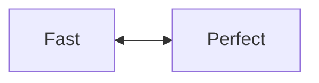

---

# Tradeoff 5

# Security vs Convenience

More security:

```text
More authentication

More verification

More friction
```

Less security:

```text
More convenience

More risk
```

---

## Visual

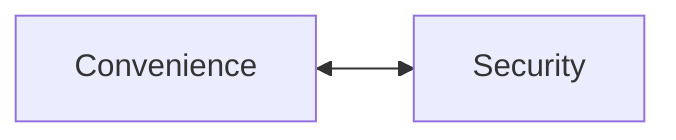

---

# Example

MFA.

Adds friction.

Improves security.

---

# Tradeoff 6

# Throughput vs Latency

Question:

```text
Do we process many requests?

Or

Do we process requests instantly?
```

---

## Visual

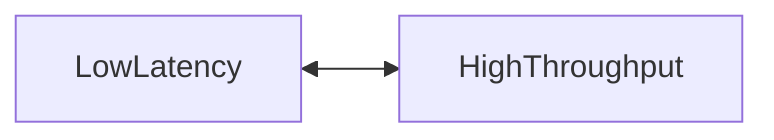

---

# Example

Batch processing.

Good throughput.

Higher latency.

---

# Tradeoff 7

# Reliability vs Cost

Reliable systems are expensive.

Why?

Because reliability requires redundancy.

---

## Visual

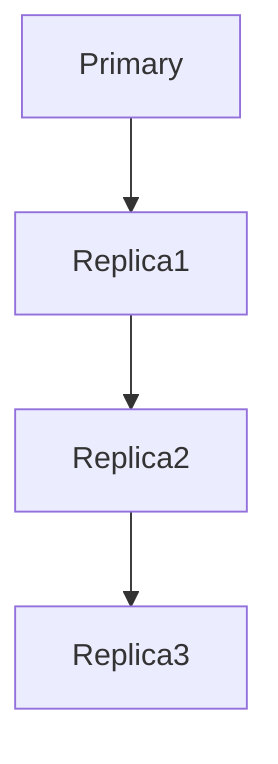

More machines.

More costs.

---

# Tradeoff 8

# Caching vs Freshness

Question:

```text
Do we serve fresh data?

Or

Do we serve fast data?
```

---

## Visual


---

# Example

Stock market systems:

Prefer:

```text
Freshness
```

Product catalog pages:

Prefer:

```text
Speed
```

---

# Tradeoff 9

# Vertical vs Horizontal Scaling

Vertical:

```text
Simple

Expensive

Limited
```

Horizontal:

```text
Complex

Scalable

Distributed
```

---

## Visual

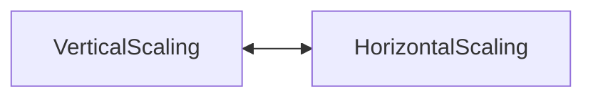

---

# Tradeoff 10

# Monolith vs Microservices

Monolith:

```text
Simple

Fast

Easy debugging
```

Microservices:

```text
Scalable

Flexible

Complex
```

---

## Visual

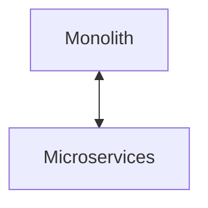

---

# Tradeoff 11

# Synchronous vs Asynchronous Systems

Synchronous:

```text
Simple

Predictable

Blocking
```

Asynchronous:

```text
Scalable

Complex

Eventually consistent
```

---

## Visual

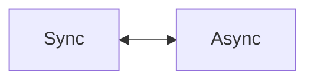

---

# Tradeoff 12

# Strong Consistency vs Eventual Consistency

Strong consistency:

```text
Everyone agrees now.
```

Eventual consistency:

```text
Everyone agrees later.
```

---

## Visual

```mermaid
flowchart TD

StrongConsistency

↓

Latency

↓

EventualConsistency

↓

Scalability
```

---

# Tradeoff 13

# Coordination vs Scalability

Coordination is expensive.

More coordination:

```text
More correctness

Less scalability
```

Less coordination:

```text
More scalability

Less correctness
```

---

## Visual

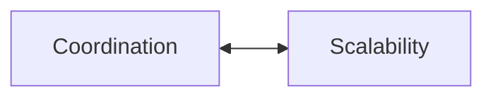

---

# The Architecture Tradeoff Matrix

```mermaid
mindmap

root((Architecture))

Simple

Fast

Cheap

Reliable

Secure

Scalable

Global

Observable
```

No architecture maximizes all.

---

# Why Cloud Exists

Cloud itself is a tradeoff.

Gain:

```text
Flexibility

Scalability

Automation
```

Lose:

```text
Control

Predictability

Simplicity
```

---

# Why Kubernetes Exists

Gain:

```text
Automation

Scalability

Resilience
```

Lose:

```text
Complexity
```

---

# Why Databases Become Complex

Gain:

```text
Scalability
```

Lose:

```text
Coordination simplicity
```

---

# Linux Connection

Linux constantly makes tradeoffs.

CPU scheduling:

```text
Fairness

vs

Performance
```

Memory:

```text
Caching

vs

Availability
```

Storage:

```text
Durability

vs

Speed
```

Networking:

```text
Reliability

vs

Latency
```

Linux is a giant tradeoff machine.

---

## Visual

```mermaid
flowchart TD

Applications

↓

Linux Kernel

Linux Kernel --> CPU

Linux Kernel --> Memory

Linux Kernel --> Network

Linux Kernel --> Storage
```

---

# Internet Scale Thinking

Small systems:

```text
Optimize simplicity.
```

Large systems:

```text
Optimize tradeoffs.
```

The bigger the system.

The more tradeoffs appear.

---

# The Evolution Of Engineers

Junior engineer:

```text
Find best technology.
```

Mid engineer:

```text
Find best architecture.
```

Senior engineer:

```text
Find acceptable tradeoffs.
```

Staff engineer:

```text
Choose which problems to accept.
```

Principal engineer:

```text
Optimize tradeoffs for business goals.
```

---

# Production Examples

## Banking

Optimize:

```text
Consistency

Security

Reliability
```

Sacrifice:

```text
Latency
```

---

## Social Media

Optimize:

```text
Availability

Speed

Scalability
```

Sacrifice:

```text
Consistency
```

---

## Streaming Platforms

Optimize:

```text
Latency

Availability
```

Sacrifice:

```text
Freshness
```

---

# Performance Implications

Performance competes with:

```text
Security

Cost

Reliability
```

Never optimize one metric blindly.

---

# Security Implications

Security always introduces:

```text
Latency

Complexity

Cost
```

This is normal.

---

# Observability Implications

Observability also has costs.

More observability:

```text
More storage

More CPU

More complexity
```

Tradeoffs exist here too.

---

# Common Beginner Mistakes

## Mistake 1

Searching for perfect architecture.

---

## Mistake 2

Copying Netflix architecture.

---

## Mistake 3

Optimizing everything.

---

## Mistake 4

Ignoring business requirements.

---

## Mistake 5

Thinking technologies solve tradeoffs.

---

# Engineering Mindset

Junior engineer:

```text
Which technology is best?
```

Mid engineer:

```text
What are the pros and cons?
```

Senior engineer:

```text
What am I sacrificing?
```

Staff engineer:

```text
Which pain am I choosing?
```

Principal engineer:

```text
Which tradeoffs align with business goals?
```

---

# Interview Questions

## Beginner

1. Why do tradeoffs exist?

2. Why is there no perfect architecture?

3. Why is scalability expensive?

4. Why is security costly?

5. Why is consistency difficult?

---

## Intermediate

6. Why is coordination expensive?

7. Why is caching a tradeoff?

8. Why is Kubernetes complex?

9. Why is cloud a tradeoff?

10. Why do microservices increase complexity?

---

## Advanced

11. Why do senior engineers optimize tradeoffs?

12. Why is CAP theorem a tradeoff theorem?

13. Why are distributed systems collections of tradeoffs?

14. Why do business goals influence architecture?

15. Why are all architectures imperfect?

---

# Cheat Sheet

```text
Everything Is A Tradeoff

No free lunch.

No perfect architecture.

Tradeoffs:

Performance vs Cost

Consistency vs Availability

Latency vs Accuracy

Security vs Convenience

Reliability vs Cost

Freshness vs Speed

Coordination vs Scalability

Simplicity vs Scale

Golden Rule:

Engineering

=

Choosing acceptable problems.
```

---

# Final Thought

This sentence defines senior engineers.

```text
Junior engineers solve problems.

Senior engineers choose which problems to keep.
```

That is architecture.

That is distributed systems.

That is engineering.
