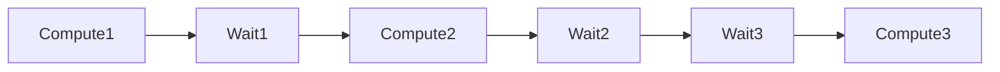
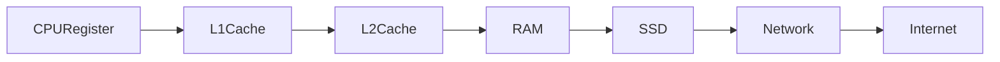
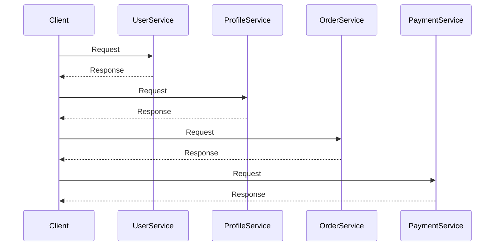
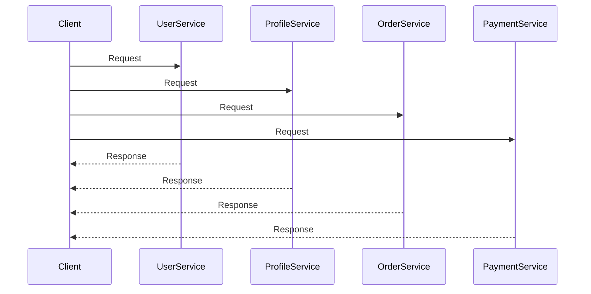
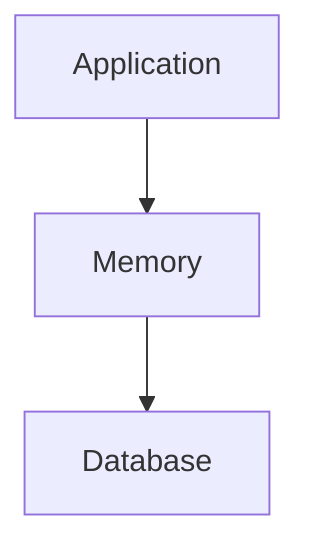
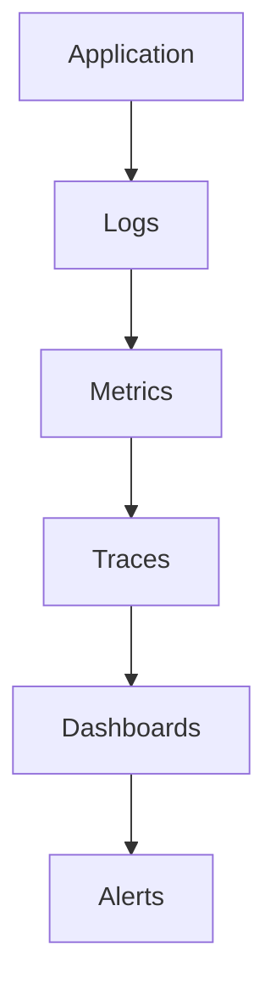

# Latency Is The Real Enemy

# Why this file exists

Many engineers spend years optimizing CPU performance.

They optimize algorithms.

They optimize loops.

They optimize code execution.

But at internet scale, code execution is often the smallest problem.

The real enemy is waiting.

Distributed systems spend enormous amounts of time waiting.

Waiting for:

- Networks
- Databases
- Storage
- DNS
- Other services
- Remote regions

This file exists to teach this fundamental truth.

> Most distributed systems are latency management systems.

---

# The Biggest Misconception

Many engineers believe:

```text
Computers spend most of their time computing.
```

Wrong.

Modern distributed systems spend most of their time waiting.

---

# The Universal Flow

Every request does this:

```text
Compute

↓

Wait

↓

Compute

↓

Wait

↓

Wait

↓

Compute

↓

Wait
```

Very little actual computation occurs.

---

## Visual



Waiting dominates.

---

# Mental Model: Ordering Food

Imagine ordering food.

Actual cooking:

```text
5 minutes
```

Waiting:

```text
Traffic

Queue

Payment

Delivery

20 minutes
```

The process is wait-bound.

Distributed systems behave the same way.

---

# The Great Latency Hierarchy

One of the most important engineering concepts.

Approximate access times:

```text
CPU Register

0.5 ns

L1 Cache

1 ns

L2 Cache

4 ns

RAM

100 ns

SSD

100 µs

Local Network

1 ms

Cross Region

50 ms

Global Internet

100-300 ms
```

Huge differences exist.

---

## Visual



Every step becomes dramatically slower.

---

# Nanoseconds vs Milliseconds

This difference is difficult to visualize.

Convert everything to seconds.

```text
CPU Register

1 second

RAM

200 seconds

SSD

55 hours

Network

23 days

Internet

6 years
```

Network is expensive.

---

# Why This Happens

Computers are extremely fast.

Moving data is extremely slow.

That is the entire problem.

---

# The Universal Architecture

Every application eventually becomes this.

```mermaid
flowchart TD

Users

↓

DNS

↓

CDN

↓

LoadBalancer

↓

API Gateway

↓

Services

↓

Cache

↓

Database

↓

Storage
```

Every connection introduces latency.

---

# Every Arrow Is Expensive

Beginners see:

```text
API → Database
```

Senior engineers see:

```text
50 milliseconds
```

Every arrow has cost.

---

# The Network Is Always The Enemy

The network is slower than:

```text
CPU

Memory

Storage

Local computation
```

Never forget this.

---

# The Dangerous Code Pattern

This looks innocent.

```javascript
const user = await userService();

const profile = await profileService();

const orders = await orderService();

const payments = await paymentService();
```

Reality:

```text
50 ms

+

50 ms

+

50 ms

+

50 ms

=

200 ms
```

Latency accumulates.

---

## Visual



Sequential calls are expensive.

---

# Better Solution

Parallel execution.

---

## Visual



Total latency decreases dramatically.

---

# Latency Multiplication

Distributed systems multiply latency.

Single machine:

```text
1 computation
```

Distributed system:

```text
10 services

↓

10 network calls

↓

10 opportunities to wait
```

---

## Visual

```mermaid
flowchart TD

Gateway

↓

Auth

↓

User

↓

Payment

↓

Inventory

↓

Notification

↓

Analytics
```

Microservices increase latency.

---

# Why Microservices Become Dangerous

People focus on decomposition.

They ignore communication.

---

# Monolith



Fast.

---

# Microservices

```mermaid
flowchart TD

Gateway

↓

ServiceA

↓

ServiceB

↓

ServiceC

↓

Database
```

Every hop costs time.

---

# The N+1 Query Problem

One request becomes many requests.

Bad:

```text
1 request

↓

100 database queries
```

Result:

```text
100 x latency
```

---

## Visual

```mermaid
flowchart TD

Request

↓

Query1

↓

Query2

↓

Query3

↓

...

↓

Query100
```

This kills performance.

---

# Databases Become Latency Magnets

Everything eventually goes here.

---

## Visual

```mermaid
flowchart TD

API1

API2

API3

API4

↓

Database
```

Databases centralize traffic.

---

# Why Caching Exists

Caching fights latency.

Instead of:

```text
User

↓

Database

↓

Disk
```

Use:

```text
User

↓

Cache
```

Nearby data wins.

---

## Visual

```mermaid
flowchart TD

Request

↓

Cache

Cache --> Hit

Cache --> Miss

Miss --> Database
```

Caching is latency optimization.

---

# Why CDNs Exist

CDNs fight distance.

Bad:

```text
India

↓

USA Server
```

Good:

```text
India

↓

India Edge Server
```

---

## Visual

```mermaid
flowchart TD

User

↓

CDN

↓

Origin
```

Reduce travel distance.

---

# Why Regions Exist

Users live everywhere.

Without regions:

```text
Entire world

↓

One USA server
```

Terrible.

Instead:

```text
India Region

USA Region

Europe Region
```

---

## Visual


---

# Tail Latency

One of the biggest production problems.

Most requests:

```text
50 ms
```

Some requests:

```text
5000 ms
```

Users remember the slow ones.

---

## Visual

```mermaid
flowchart TD

FastRequests

↓

SlowRequests

↓

UserExperience
```

Tail latency dominates perception.

---

# P50, P95, P99

Never optimize averages.

Observe percentiles.

Example:

```text
P50

50 ms

P95

200 ms

P99

1200 ms
```

Users experience P99.

Not averages.

---

# Cascading Latency

One slow component slows everything.

---

## Visual

```mermaid
flowchart TD

SlowDatabase

↓

APIQueueBuilds

↓

CPUIncreases

↓

ContainersCrash

↓

Outage
```

Latency causes failures.

---

# Retry Storms

Slow systems trigger retries.

Retries create more load.

---

## Visual

```mermaid
flowchart TD

SlowAPI

↓

Timeout

↓

Retry

↓

MoreTraffic

↓

Outage
```

Latency can kill systems.

---

# Why Observability Exists

You cannot optimize invisible latency.

Observe:

```text
Logs

Metrics

Traces

Alerts
```

---

## Visual



---

# Distributed Tracing Exists Because Of Latency

Tracing answers:

```text
Where are we waiting?
```

Example:

```text
DNS

5 ms

Auth

20 ms

Database

100 ms

Cache

2 ms
```

Now optimization becomes possible.

---

# Linux Connection

Linux fights latency constantly.

Linux components:

CPU:

```text
Scheduler
```

Storage:

```text
Page Cache
```

Networking:

```text
TCP Stack
```

I/O:

```text
epoll
```

Memory:

```text
Virtual Memory
```

Everything optimizes waiting.

---

## Visual

```mermaid
flowchart TD

Application

↓

Linux Kernel

Linux Kernel --> CPU

Linux Kernel --> Memory

Linux Kernel --> Disk

Linux Kernel --> Network
```

Linux is a latency optimization layer.

---

# Linux Commands For Latency Analysis

CPU:

```bash
top

htop

vmstat
```

Network:

```bash
ping

traceroute

ss

tcpdump
```

Storage:

```bash
iostat

iotop
```

Observability:

```bash
sar

perf
```

---

# Production Example: Netflix

Goal:

```text
Play video immediately.
```

Enemies:

```text
Distance

Storage

Network

Regions
```

Solutions:

```text
CDN

Caching

Replication

Compression
```

Netflix is a latency optimization company.

---

# Production Example: Google Search

Goal:

```text
Search results

< 300 ms
```

Every millisecond matters.

Google engineers obsess over latency.

---

# Security Implications

Security can increase latency.

Examples:

```text
TLS

Encryption

Authentication

Authorization
```

Balance security and performance.

---

# Common Beginner Mistakes

## Mistake 1

Optimizing algorithms first.

Latency often dominates.

---

## Mistake 2

Ignoring network costs.

---

## Mistake 3

Creating chatty microservices.

---

## Mistake 4

Ignoring caches.

---

## Mistake 5

Using sequential API calls.

---

## Mistake 6

Ignoring observability.

---

# Engineering Mindset

Junior engineer:

```text
How fast is my code?
```

Mid engineer:

```text
How many services are involved?
```

Senior engineer:

```text
How many network calls exist?
```

Staff engineer:

```text
Where are we waiting?
```

Principal engineer:

```text
How do I eliminate waiting entirely?
```

---

# Interview Questions

## Beginner

1. What is latency?

2. Why is latency dangerous?

3. Why is the network expensive?

4. Why do CDNs exist?

5. Why do caches exist?

---

## Intermediate

6. Why do microservices increase latency?

7. What is tail latency?

8. Why are percentiles important?

9. Why do databases become bottlenecks?

10. Why are sequential calls dangerous?

---

## Advanced

11. Why is Netflix a latency optimization company?

12. Why is Linux a latency optimization layer?

13. Why do retry storms happen?

14. Why is observability mandatory?

15. Why are distributed systems wait-bound?

---

# Cheat Sheet

```text
Latency Is The Real Enemy

Truth:

Distributed systems wait more than they compute.

Enemies:

Distance

Network

Storage

Databases

Sequential calls

Solutions:

Caching

CDNs

Parallelization

Replication

Observability

Golden Rule:

Every arrow

in an architecture diagram

is expensive.
```

---

# Final Thought

This single sentence changes how engineers design systems forever.

```text
At internet scale,

the bottleneck is rarely computation.

The bottleneck is waiting.
```

That is one of the deepest truths in distributed systems.
