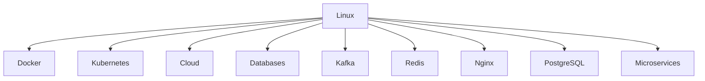

# Linux Is The Foundation

# Why this file exists

This may be one of the most important files in the entire repository.

Most engineers learn technologies separately.

They learn:

```text
Docker

Kubernetes

Cloud

Databases

Microservices

Distributed Systems
```

independently.

This is wrong.

Every modern technology eventually reaches Linux.

This file exists to permanently change how you think.

After reading this file, you should stop asking:

```text
How does Kubernetes work?
```

Instead ask:

```text
Which Linux capabilities make Kubernetes possible?
```

That is systems thinking.

---

# The Biggest Misconception

Many people believe:

```text
Cloud

=

Magic
```

Wrong.

Cloud is Linux.

People believe:

```text
Kubernetes

=

Magic
```

Wrong.

Kubernetes is Linux.

People believe:

```text
Containers

=

Magic
```

Wrong.

Containers are Linux.

Linux is the hidden engine of the internet.

---

# The Universal Architecture

Everything eventually reaches Linux.

```mermaid
flowchart TD

Applications

↓

Microservices

↓

Containers

↓

Kubernetes

↓

Cloud

↓

Linux

↓

Hardware
```

Linux is the invisible foundation.

---

# The Universal Truth

This sentence explains modern infrastructure.

> Everything above Linux is orchestration.

Everything below Linux is physics.

Linux sits in the middle.

---

# Mental Model: Building A City

Imagine a city.

Applications are citizens.

Containers are apartments.

Kubernetes is city management.

Cloud is land ownership.

Linux is the ground beneath everything.

Without ground.

Nothing exists.

---

## Visual

```mermaid
flowchart TD

Citizens

↓

Buildings

↓

Roads

↓

Ground
```

Linux is the ground.

---

# Why Linux Won

Linux won because it solves the hardest infrastructure problems.

Linux is excellent at:

```text
Networking

Memory Management

Storage

Process Scheduling

Security

Isolation
```

These are exactly the problems distributed systems need solved.

---

# The Linux Responsibility Pyramid

```mermaid
flowchart TD

Applications

↓

Runtime

↓

Kernel

↓

Hardware
```

Linux is the abstraction layer.

---

# Linux Solves Five Universal Problems

```text
Computation

Memory

Networking

Storage

Isolation
```

Everything else is built on these.

---

# Pillar 1

# Linux Manages Computation

Applications need CPU time.

Linux decides:

```text
Who runs?

When?

For how long?
```

Linux uses schedulers.

---

## Visual

```mermaid
flowchart TD

Processes

↓

Scheduler

↓

CPU
```

Without scheduling:

```text
Chaos
```

---

# Linux Scheduler

Modern Linux uses:

```text
CFS

Completely Fair Scheduler
```

Goal:

```text
Share CPU fairly.
```

---

# Pillar 2

# Linux Manages Memory

Memory is finite.

Linux decides:

```text
Who gets memory?

Who loses memory?

Who gets killed?
```

---

## Visual

```mermaid
flowchart TD

Applications

↓

VirtualMemory

↓

RAM

↓

Disk
```

Linux creates memory illusions.

---

# The OOM Killer

When memory is exhausted:

```text
Linux kills processes.
```

---

## Visual

```mermaid
flowchart TD

MemoryExhausted

↓

OOMKiller

↓

ProcessKilled
```

This directly affects distributed systems.

---

# Pillar 3

# Linux Manages Networking

Distributed systems are networking systems.

Linux powers:

```text
TCP

UDP

DNS

Sockets

Routing

Packet processing
```

Without Linux networking:

```text
No internet.
```

---

## Visual

```mermaid
flowchart TD

Application

↓

Socket

↓

TCPStack

↓

NIC

↓

Internet
```

Linux is the network engine.

---

# Linux Networking Components

Important components:

```text
Socket API

TCP/IP Stack

Routing Tables

ARP

iptables

nftables
```

All distributed systems use these.

---

# Pillar 4

# Linux Manages Storage

Applications generate enormous data.

Linux manages:

```text
Filesystems

Page Cache

Disks

I/O Scheduling
```

---

## Visual

```mermaid
flowchart TD

Application

↓

Filesystem

↓

PageCache

↓

Disk
```

Storage is expensive.

Linux optimizes it.

---

# Linux Storage Powers Everything

Examples:

Databases:

```text
PostgreSQL

MySQL

MongoDB
```

depend heavily on Linux storage.

---

# Pillar 5

# Linux Provides Isolation

Modern infrastructure depends on isolation.

Isolation prevents systems from interfering with each other.

Linux created:

```text
Namespaces

cgroups
```

Containers exist because of these.

---

## Visual

```mermaid
flowchart TD

Linux

↓

Namespaces

↓

cgroups

↓

Containers
```

Docker is built here.

---

# Why Containers Exist

Containers are Linux features.

Docker did not invent containers.

Linux did.

---

## Visual

```mermaid
flowchart TD

Namespaces

+

cgroups

+

OverlayFS

↓

Containers
```

Docker is orchestration.

Linux is implementation.

---

# Why Kubernetes Exists

Kubernetes does not run containers.

Linux runs containers.

Kubernetes coordinates Linux machines.

---

## Visual

```mermaid
flowchart TD

Kubernetes

↓

Nodes

↓

Linux

↓

Containers
```

Linux is the execution layer.

---

# Why Cloud Exists

Cloud providers rent Linux computers.

That is all.

---

## Visual

```mermaid
flowchart TD

AWS

↓

LinuxVM

↓

Hardware
```

Cloud is Linux at enormous scale.

---

# The Linux Internet Architecture

```mermaid
flowchart TD

Users

↓

DNS

↓

CDN

↓

LoadBalancer

↓

Gateway

↓

Services

↓

Databases

↓

Linux

↓

Hardware
```

Linux is everywhere.

---

# The Hidden Linux Dependency Graph

Almost every modern technology depends on Linux.



This is why Linux mastery is valuable.

---

# Linux Is A Resource Manager

Linux answers five questions.

```text
Who gets CPU?

Who gets memory?

Who gets network?

Who gets storage?

Who gets isolation?
```

Everything else is built on these answers.

---

# Linux And Distributed Systems

Distributed systems are collections of Linux machines.

---

## Visual

```mermaid
flowchart TD

Machine1

Machine2

Machine3

Machine4

↓

DistributedSystem
```

Every machine is Linux.

---

# Linux Is The Translator

Linux translates:

```text
Applications

↓

Physical Hardware
```

---

## Visual

```mermaid
flowchart TD

Application

↓

Linux Kernel

↓

CPU

Linux Kernel --> Memory

Linux Kernel --> Disk

Linux Kernel --> NIC
```

Linux translates software into electrical activity.

---

# Why Linux Engineers Become Valuable

Linux knowledge compounds.

Because Linux connects everything.

Knowledge tree:

```text
Linux

↓

Docker

↓

Kubernetes

↓

Cloud

↓

Distributed Systems

↓

Platform Engineering
```

Everything compounds.

---

# Linux And Observability

Observability begins at Linux.

Linux exposes:

```text
CPU usage

Memory usage

Disk usage

Network usage

Process state
```

Everything starts here.

---

## Visual

```mermaid
flowchart TD

Linux

↓

Metrics

↓

Dashboards

↓

Alerts
```

---

# Linux And Security

Linux secures infrastructure.

Examples:

```text
Users

Permissions

SELinux

AppArmor

Capabilities

Namespaces
```

Security is layered on Linux.

---

# Production Example: Netflix

Users see:

```text
Play button.
```

Reality:

```mermaid
flowchart TD

Users

↓

CDN

↓

Gateway

↓

Microservices

↓

Kafka

↓

Linux

↓

Hardware
```

Netflix is thousands of Linux computers.

---

# Production Example: Kubernetes

Users see:

```text
Container orchestration.
```

Reality:

```mermaid
flowchart TD

Kubernetes

↓

Linux Nodes

↓

Namespaces

↓

cgroups

↓

Hardware
```

Linux is the real engine.

---

# Production Example: ChatGPT

Users see:

```text
Chat interface.
```

Reality:

```text
Massive Linux infrastructure

+

Distributed systems

+

Networking

+

Storage

+

Scheduling
```

Everything reaches Linux.

---

# The Linux Thinking Pyramid

```text
Applications

Services

Containers

Kubernetes

Cloud

Linux

Hardware
```

Never skip layers.

---

# Performance Implications

Linux directly affects:

```text
Latency

Throughput

Memory efficiency

Storage speed

Network performance
```

Linux tuning matters.

---

# Security Implications

Linux secures:

```text
Processes

Containers

Networks

Storage

Users
```

Everything depends on Linux security.

---

# Common Beginner Mistakes

## Mistake 1

Thinking cloud replaces Linux.

---

## Mistake 2

Thinking Docker replaces Linux.

---

## Mistake 3

Thinking Kubernetes replaces Linux.

---

## Mistake 4

Ignoring kernel internals.

---

## Mistake 5

Learning tools before Linux.

---

# Engineering Mindset

Junior engineer:

```text
Learn Docker.
```

Mid engineer:

```text
Learn Kubernetes.
```

Senior engineer:

```text
Learn Linux deeply.
```

Staff engineer:

```text
Learn Linux internals.
```

Principal engineer:

```text
Everything eventually reaches Linux.
```

---

# Interview Questions

## Beginner

1. Why is Linux important?

2. Why do distributed systems need Linux?

3. Why are containers Linux features?

4. Why is cloud built on Linux?

5. Why is Linux foundational?

---

## Intermediate

6. Why does Kubernetes depend on Linux?

7. Why does Linux networking matter?

8. Why does Linux storage matter?

9. Why does Linux isolation matter?

10. Why is Linux a resource manager?

---

## Advanced

11. Why is Linux the invisible internet?

12. Why does Linux win at infrastructure?

13. Why is Linux an abstraction layer?

14. Why does Linux compound engineering knowledge?

15. Why do senior engineers learn Linux internals?

---

# Cheat Sheet

```text
Linux Is The Foundation

Everything Eventually Reaches:

Applications

↓

Containers

↓

Kubernetes

↓

Cloud

↓

Linux

↓

Hardware

Linux Solves:

CPU

Memory

Networking

Storage

Isolation

Golden Rule:

Everything above Linux

is orchestration.

Everything below Linux

is physics.
```

---

# Final Thought

This single sentence defines your entire repository philosophy.

```text
The internet

is not built on Docker.

It is not built on Kubernetes.

It is not built on cloud.

The internet

is built on Linux.
```

Everything else is layers above it.
