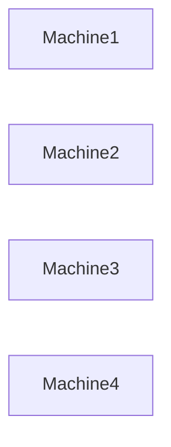

# Physics Of Distributed Systems

# Why this file exists

Many engineers believe software engineering is purely about code.

It is not.

As systems grow, software engineers eventually stop fighting code and start fighting physics.

At small scale:

```text
Code is the problem.
```

At internet scale:

```text
Physics is the problem.
```

Physics imposes limits that software cannot remove.

You cannot optimize around physical laws.

You can only design around them.

This file exists to teach this hidden truth.

After reading this file, you should stop asking:

```text
How do I optimize code?
```

Start asking:

```text
What physical limitations am I fighting?
```

That is how senior engineers think.

---

# The Biggest Misconception

Many engineers think:

```text
Cloud

=

Infinite computers
```

Wrong.

Cloud is simply:

```text
Someone else's physical computers.
```

Those computers still obey physics.

---

# Distributed Systems Is A Physics Problem

At small scale:

```text
Software

↓

Computer

↓

User
```

Simple.

At internet scale:

```text
Software

↓

Networks

↓

Distance

↓

Electricity

↓

Heat

↓

Storage

↓

Users
```

Now physics enters.

---

## Visual

```mermaid
flowchart TD

Software

↓

Networks

↓

Physics

↓

Infrastructure

↓

Users
```

---

# The Five Physical Enemies

Every distributed system fights these.

```text
Distance

Time

Heat

Electricity

Resource limitations
```

Everything else is a consequence.

---

# Enemy 1

# Distance

Distance is expensive.

There is no way around it.

Every meter costs time.

---

# Mental Model

Imagine talking to someone.

Nearby:

```text
Instant communication
```

On another continent:

```text
Delay exists
```

Computers have the same problem.

---

## Visual


Distance always costs time.

---

# Why Distance Matters

Every request must physically travel.

Example:

```text
Browser

↓

ISP

↓

Router

↓

Undersea Cable

↓

Data Center

↓

Server
```

Software cannot teleport.

---

## Visual

```mermaid
flowchart TD

Browser

↓

ISP

↓

Router

↓

UnderseaCable

↓

DataCenter

↓

Server
```

Every hop adds latency.

---

# Enemy 2

# Speed Of Light

The ultimate bottleneck.

Nothing can travel faster.

Not even Google.

Not even Cloudflare.

Not even AWS.

Physics wins.

---

# Approximate Speeds

Vacuum:

```text
300,000 km/s
```

Fiber optic cables:

```text
~200,000 km/s
```

Light slows down inside cables.

---

# Why This Matters

Distance:

```text
India → USA

≈ 13,000 km
```

Even under ideal conditions:

```text
65+ milliseconds
```

Round trip:

```text
130+ milliseconds
```

Physics already consumed your latency budget.

---

## Visual


---

# Why CDNs Exist

Content Delivery Networks fight distance.

Instead of:

```text
India

↓

USA
```

Do:

```text
India

↓

India Edge Server
```

---

## Visual

```mermaid
flowchart TD

Users

↓

CDN

↓

OriginServer
```

This is a physics optimization.

---

# Enemy 3

# Time

Distributed systems struggle with time.

There is no universal clock.

Every machine has its own clock.

---

## Visual


Which one is correct?

Nobody knows.

---

# Why Time Is Difficult

Problems:

```text
Clock drift

Clock skew

Synchronization delays
```

Time itself becomes unreliable.

---

# Consequences

Distributed systems invent solutions.

Examples:

```text
NTP

Logical clocks

Lamport clocks

Vector clocks
```

Entire technologies exist because of time.

---

# Enemy 4

# Heat

Heat is a silent killer.

Computers generate heat.

More computation:

```text
More electricity

↓

More heat
```

Too much heat:

```text
CPU throttling

↓

Performance loss
```

---

## Visual

```mermaid
flowchart TD

CPUWork

↓

Electricity

↓

Heat

↓

Cooling

↓

Performance
```

---

# Why Data Centers Exist

Data centers are giant cooling systems.

Servers are secondary.

Modern data centers optimize:

```text
Power

Cooling

Airflow

Energy efficiency
```

---

## Visual

```mermaid
flowchart TD

Electricity

↓

Servers

↓

Heat

↓

Cooling

↓

StablePerformance
```

---

# Enemy 5

# Electricity

Everything needs power.

No electricity:

```text
No servers

No cloud

No internet
```

---

# The Hidden Dependency Chain

```mermaid
flowchart TD

Electricity

↓

DataCenter

↓

Servers

↓

Linux

↓

Applications

↓

Users
```

People forget the bottom layers exist.

---

# Resource Limitations

Every computer is finite.

Resources:

```text
CPU

Memory

Storage

Network bandwidth
```

Nothing is infinite.

---

## Visual

```mermaid
flowchart TD

CPU

↓

Memory

↓

Storage

↓

Network
```

These become bottlenecks.

---

# The Latency Hierarchy

One of the most important engineering visuals.

```text
CPU Register

0.5 ns

L1 Cache

1 ns

RAM

100 ns

SSD

100 µs

Network

1 ms

Internet

100 ms
```

Huge differences exist.

---

## Visual


Every step becomes slower.

---

# The Universal Truth

The network is always slower than memory.

Memory is always slower than cache.

Storage is always slower than memory.

Distance is always slower than local resources.

---

# Why Databases Become Bottlenecks

Many systems fail here.

Example:

```text
API

↓

Database

↓

Storage
```

Databases centralize work.

Physics limits throughput.

---

## Visual

```mermaid
flowchart TD

Users

↓

API

↓

Database

↓

Storage
```

Everything converges here.

---

# Why Caching Exists

Caching fights physics.

Instead of:

```text
User

↓

Database

↓

Storage
```

Use:

```text
User

↓

Cache
```

Nearby resources are faster.

---

## Visual

```mermaid
flowchart TD

Request

↓

Cache

Cache --> Hit

Cache --> Miss

Miss --> Database
```

Caching is a physics optimization.

---

# Why Horizontal Scaling Exists

Vertical scaling eventually hits physics.

Problem:

```text
More CPU

↓

More heat

↓

More cost
```

Eventually impossible.

Solution:

```text
Add more machines.
```

---

## Visual



But communication complexity increases.

---

# The Communication Cost Explosion

More machines:

```text
More communication

↓

More latency

↓

More complexity
```

---

## Visual

```mermaid
flowchart TD

1 Machine

↓

5 Machines

↓

50 Machines

↓

500 Machines

↓

5000 Machines
```

Complexity grows rapidly.

---

# Why Cloud Regions Exist

Physics forced cloud providers to distribute globally.

Example:

```text
India Region

USA Region

Europe Region

Japan Region
```

---

## Visual


Closer servers reduce latency.

---

# Linux Connection

Linux is physics management software.

Linux manages:

```text
CPU scheduling

Memory allocation

Storage I/O

Network packets

Power management
```

Linux sits between software and physics.

---

## Visual

```mermaid
flowchart TD

Application

↓

Linux Kernel

Linux Kernel --> CPU

Linux Kernel --> Memory

Linux Kernel --> Disk

Linux Kernel --> NetworkCard
```

Linux is the translator.

---

# Linux Components Fighting Physics

CPU:

```text
CFS Scheduler
```

Memory:

```text
Virtual Memory
```

Storage:

```text
Page Cache
```

Networking:

```text
TCP Stack
```

Isolation:

```text
cgroups

namespaces
```

Everything optimizes physical resources.

---

# Production Example: Netflix

Goal:

```text
Play videos instantly.
```

Problems:

```text
Distance

Bandwidth

Latency

Storage

Regions
```

Solutions:

```text
CDNs

Caching

Compression

Replication
```

Netflix is a physics optimization company.

---

# Production Example: Cloudflare

Goal:

```text
Move servers closer to users.
```

Cloudflare fights physics every day.

Strategy:

```text
Reduce distance.

Reduce latency.

Reduce hops.
```

---

# Observability Is Physics Monitoring

Metrics are simply measurements.

Observe:

```text
CPU

Memory

Network

Storage

Temperature
```

You are measuring physics.

---

## Visual

```mermaid
flowchart TD

Application

↓

Metrics

↓

Dashboards

↓

Alerts
```

---

# Security Implications

Distance also affects security.

Problems:

```text
Cross-region attacks

DDoS

Certificate propagation

Network interception
```

Security must account for physical infrastructure.

---

# Common Beginner Mistakes

## Mistake 1

Thinking cloud is magic.

Wrong.

Cloud is physical infrastructure.

---

## Mistake 2

Ignoring geography.

Distance matters.

---

## Mistake 3

Ignoring latency.

Latency dominates.

---

## Mistake 4

Thinking more CPUs solve everything.

Physics limits growth.

---

## Mistake 5

Ignoring Linux internals.

Linux is the physics abstraction layer.

---

# Engineering Mindset

Junior engineer:

```text
How do I optimize code?
```

Mid engineer:

```text
How do I optimize infrastructure?
```

Senior engineer:

```text
How do I optimize physics?
```

Staff engineer:

```text
How do I reduce distance?
```

Principal engineer:

```text
How do I build around physical limitations?
```

---

# Interview Questions

## Beginner

1. Why is distributed systems a physics problem?

2. Why does distance matter?

3. Why is latency unavoidable?

4. Why do CDNs exist?

5. Why is Linux important?

---

## Intermediate

6. Why is the speed of light important?

7. Why does heat matter?

8. Why is time difficult?

9. Why does communication cost increase?

10. Why do databases become bottlenecks?

---

## Advanced

11. Why is Netflix a physics optimization company?

12. Why is caching a physics optimization?

13. Why are cloud regions necessary?

14. Why can't software beat physics?

15. How does Linux abstract physical resources?

---

# Cheat Sheet

```text
Physics Of Distributed Systems

Enemies:

Distance

Speed Of Light

Time

Heat

Electricity

Resource Limits

Golden Rules:

Physics always wins.

Distance creates latency.

Communication is expensive.

Heat limits scaling.

Linux manages physical resources.

Goal:

Design around physics.

Never fight physics directly.
```

---

# Final Thought

This single sentence changes how engineers think.

```text
Distributed systems

are not large software systems.

They are software systems

that are constrained

by physical laws.
```

Everything else is implementation details.
