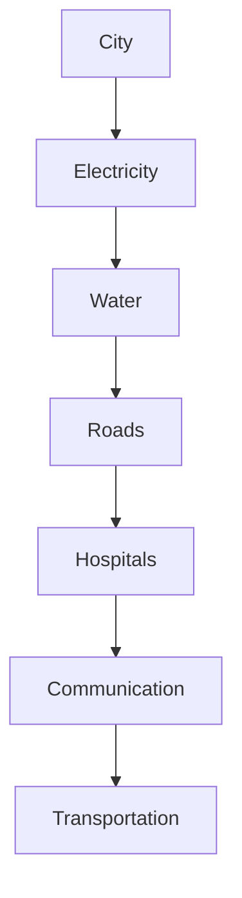
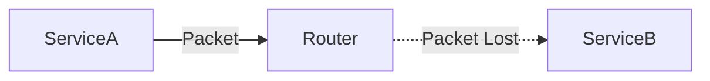
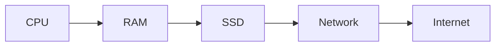
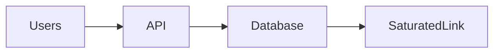
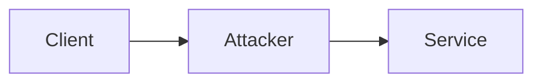
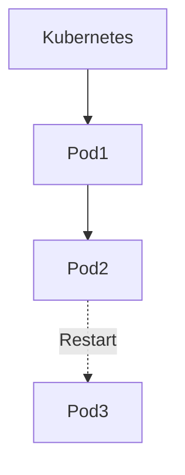
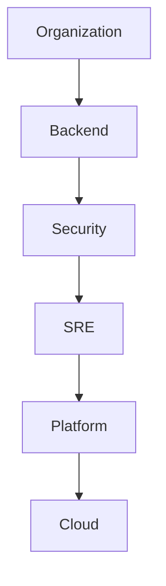
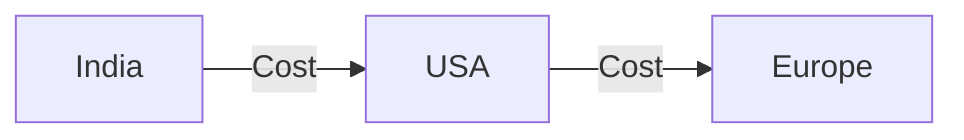
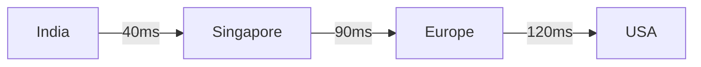
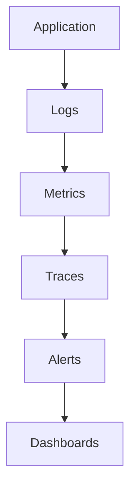

# The Fallacies of Distributed Computing

# Why this file exists

This may be the most important file in the entire distributed systems section.

Most distributed systems do not fail because of algorithms.

They fail because engineers accidentally believe things that are not true.

These false assumptions are called:

> The Fallacies of Distributed Computing

The term was introduced by engineers at Sun Microsystems in the 1990s.

These assumptions still break systems today.

This file exists to permanently change how you think.

After reading this file, you should stop asking:

```text
How does this system work?
```

Start asking:

```text
Which false assumptions am I making?
```

That is how senior engineers think.

---

# What Is A Fallacy?

Definition:

> A fallacy is a belief that seems true but is actually false.

Distributed systems are dangerous because many false assumptions appear correct during development.

Everything works locally.

Then production happens.

Reality destroys assumptions.

---

# The Eight Fallacies

There are eight famous fallacies.

```text
1. The network is reliable.

2. Latency is zero.

3. Bandwidth is infinite.

4. The network is secure.

5. Topology never changes.

6. There is one administrator.

7. Transport cost is zero.

8. The network is homogeneous.
```

Every production outage eventually touches one of these.

---

# The Universal Mental Model

Distributed systems are essentially:

```text
Computers

+

Networks

+

Humans

+

Physics

+

Failures
```

The fallacies come from forgetting one of these components exists.

---

## Visual

```mermaid
mindmap

root((Distributed Systems))

Computers

Networks

Humans

Physics

Failures
```

---

# Mental Model: Building A Global City

Imagine building a city.

Would you assume:

```text
Roads never close?

Electricity never fails?

People never make mistakes?

Traffic never exists?
```

No.

Cities are built expecting failures.

Distributed systems are digital cities.

---

## Visual



Each subsystem can fail.

The city survives anyway.

---

# Fallacy 1

# The Network Is Reliable

This is the biggest lie in software engineering.

Reality:

Networks fail constantly.

Examples:

```text
Packet loss

DNS failures

Router failures

Switch failures

Cable cuts

Cloud outages

Firewall misconfigurations
```

---

## Visual



---

# Real World Example

2021.

A misconfiguration caused a major outage for a social media giant.

Machines were healthy.

The network was not.

Entire services disappeared.

---

# Linux Connection

Commands:

```bash
ping

traceroute

ss

ip route

dig

tcpdump
```

Networking failures are daily realities.

---

# Engineering Rule

Never trust the network.

Always design for failure.

---

# Fallacy 2

# Latency Is Zero

Another dangerous assumption.

Many developers write code like:

```javascript
await serviceA();

await serviceB();

await serviceC();
```

Looks harmless.

Reality:

```text
Every call

↓

Network latency

↓

Waiting
```

---

# The Latency Pyramid

Approximate values:

```text
CPU Register

0.5 ns

RAM

100 ns

SSD

100 µs

Network

1 ms

Internet

100 ms
```

Network dominates.

---

## Visual



Latency grows dramatically.

---

# Real Example

Local function:

```text
0.001 ms
```

Remote API:

```text
50 ms
```

Difference:

```text
50000x slower
```

Remote calls are expensive.

---

# Engineering Rule

Every network call must justify its existence.

---

# Fallacy 3

# Bandwidth Is Infinite

Reality:

Bandwidth is expensive.

Resources are finite.

Examples:

```text
1 Gbps NIC

10 Gbps NIC

100 Gbps NIC
```

Eventually limits appear.

---

## Visual



Traffic exceeds capacity.

Everything slows.

---

# Example

Sending:

```text
1 KB

vs

10 GB
```

is not equivalent.

Data movement has costs.

---

# Engineering Rule

Move computation to data.

Not data to computation.

---

# Fallacy 4

# The Network Is Secure

Reality:

Networks are hostile environments.

Assume attackers exist.

Threats:

```text
DDoS

MITM attacks

Packet sniffing

DNS poisoning

Certificate attacks
```

---

## Visual



Never trust networks.

---

# Engineering Rule

Encrypt everything.

---

# Zero Trust Principle

Trust nothing.

Verify everything.

---

## Visual

```mermaid
flowchart TD

ServiceA

↓

Authentication

↓

Authorization

↓

Encryption

↓

ServiceB
```

---

# Fallacy 5

# Topology Never Changes

Reality:

Infrastructure constantly changes.

Things come and go.

Examples:

```text
Containers start

Containers stop

Pods restart

Servers replaced

Regions added
```

Infrastructure is dynamic.

---

## Visual



Static assumptions break systems.

---

# Engineering Rule

Never hardcode infrastructure.

Use discovery systems.

Examples:

```text
DNS

Consul

etcd

Kubernetes Service Discovery
```

---

# Fallacy 6

# There Is One Administrator

Reality:

Modern systems have many teams.

Examples:

```text
Backend Team

DevOps Team

Cloud Team

Security Team

SRE Team

Platform Team
```

No single person owns everything.

---

## Visual



Human coordination becomes difficult.

---

# Engineering Rule

Automate everything.

Documentation is mandatory.

---

# Fallacy 7

# Transport Cost Is Zero

Reality:

Moving data costs money.

Examples:

```text
Cloud egress fees

Cross-region traffic

Storage transfers

CDN costs
```

Data movement is expensive.

---

## Visual



Distance costs money.

---

# Engineering Rule

Minimize unnecessary data movement.

---

# Fallacy 8

# The Network Is Homogeneous

Reality:

Nothing is uniform.

Examples:

```text
Different hardware

Different regions

Different ISPs

Different latency

Different bandwidth
```

Infrastructure is heterogeneous.

---

## Visual



Every location is different.

---

# The Universal Architecture Reality

Many beginners imagine:

```text
Everything connected.
```

Reality:

```mermaid
flowchart TD

Users

↓

DNS

↓

CDN

↓

LoadBalancer

↓

API Gateway

↓

Microservices

↓

Cache

↓

Message Queue

↓

Database

↓

Storage
```

Every connection is a failure point.

---

# The Compound Failure Problem

The dangerous part is not one fallacy.

Multiple fallacies combine.

Example:

```text
Network slow

+

Latency ignored

+

Infinite retries

+

Bandwidth saturation

=

Outage
```

---

## Visual

```mermaid
flowchart TD

SlowDNS

↓

RetryStorm

↓

DatabaseOverload

↓

CPUSpike

↓

Outage
```

Failures compound.

---

# The Hidden Ninth Fallacy

I would add one for modern engineers.

```text
Cloud solves everything.
```

Wrong.

Cloud simply moves infrastructure.

Problems still exist.

```text
Latency

Failures

Security

Observability

Coordination
```

Cloud is still distributed systems.

---

# Linux Connection

Linux sits underneath everything.

```mermaid
flowchart TD

Application

↓

Containers

↓

Kubernetes

↓

Cloud

↓

Linux

↓

Hardware
```

Linux provides:

```text
Networking

Storage

Processes

Security

Isolation
```

Many distributed failures start at Linux.

---

# Linux Tools Every Engineer Should Know

Networking:

```bash
ping

dig

nslookup

ss

netstat

traceroute

tcpdump
```

System health:

```bash
top

htop

free -h

vmstat

iostat

journalctl

dmesg
```

Observability:

```bash
sar

iftop

iotop
```

---

# Production Example: Netflix

Netflix engineers never ask:

```text
Will failures happen?
```

They ask:

```text
Which failure is happening now?
```

The architecture is built expecting:

```text
Network failures

Service failures

Region failures

Human failures
```

---

# Performance Implications

These fallacies create bottlenecks.

Common bottlenecks:

```text
Network

Databases

DNS

Storage

Cross-region traffic
```

---

# Security Implications

Never trust internal systems.

Adopt:

```text
Zero Trust

TLS everywhere

Identity verification

Least privilege access
```

---

# Observability Implications

You cannot debug assumptions.

You can only debug data.

Observe:

```text
Logs

Metrics

Traces

Alerts
```

---

## Visual



---

# The Evolution Of Engineering Thinking

Junior engineer:

```text
Write code.
```

Mid engineer:

```text
Make code scalable.
```

Senior engineer:

```text
Remove assumptions.
```

Staff engineer:

```text
Design for failures.
```

Principal engineer:

```text
Assume reality is hostile.
```

---

# Common Beginner Mistakes

## Mistake 1

Trusting networks.

---

## Mistake 2

Ignoring latency.

---

## Mistake 3

Moving huge amounts of data.

---

## Mistake 4

Hardcoding infrastructure.

---

## Mistake 5

Ignoring security.

---

## Mistake 6

Ignoring observability.

---

## Mistake 7

Trusting cloud blindly.

---

# Interview Questions

## Beginner

1. What are the eight fallacies?

2. Why do they exist?

3. Why is the network unreliable?

4. Why is latency important?

5. Why is bandwidth finite?

---

## Intermediate

6. Why is topology dynamic?

7. Why is transport expensive?

8. Why is the network insecure?

9. Why is infrastructure heterogeneous?

10. Why do failures compound?

---

## Advanced

11. Which fallacy causes the most outages?

12. Why is cloud not a solution to distributed systems?

13. How does Linux influence these fallacies?

14. Why is observability mandatory?

15. How do you design around these assumptions?

---

# Cheat Sheet

```text
The Eight Fallacies

1. Network is reliable ❌

2. Latency is zero ❌

3. Bandwidth is infinite ❌

4. Network is secure ❌

5. Topology never changes ❌

6. One administrator exists ❌

7. Transport cost is zero ❌

8. Network is homogeneous ❌

Golden Rule:

Assume reality is hostile.

Build systems that survive reality.
```

---

# Final Thought

The difference between junior and senior engineers is often this:

Junior engineers trust assumptions.

Senior engineers remove assumptions.

Distributed systems can be summarized in one sentence:

```text
The art of building systems

that continue working

after every assumption becomes false.
```
