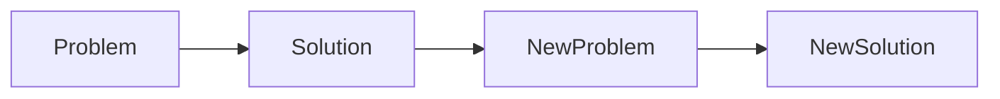
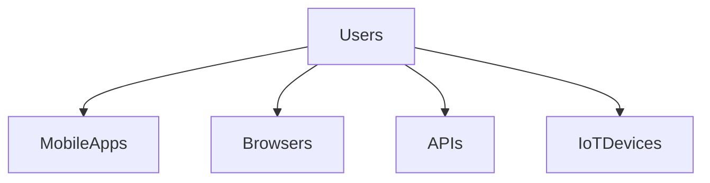
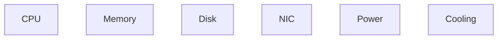

# The Universal Distributed Architecture

# Why this file exists

One of the biggest misconceptions in software engineering is this:

> Every company has a unique architecture.

Reality:

No.

Most companies eventually converge toward a very similar architecture.

Google.

Netflix.

Amazon.

Uber.

Spotify.

Discord.

Cloudflare.

Airbnb.

They all build different products.

But their infrastructure eventually looks surprisingly similar.

This file exists to teach the hidden architecture of the internet.

After reading this file, you should stop seeing technologies.

You should start seeing layers.

Because technologies change.

Architectural patterns survive.

---

# The Universal Pattern

At internet scale almost every company eventually becomes this:

```text
Users

↓

DNS

↓

CDN

↓

Load Balancer

↓

API Gateway

↓

Services

↓

Cache

↓

Message Queue

↓

Databases

↓

Storage
```

Everything else is implementation details.

---

# The Entire Internet In One Diagram

```mermaid
flowchart TD

Users

↓

DNS

↓

CDN

↓

LoadBalancer

↓

APIGateway

↓

Microservices

↓

Cache

↓

MessageQueue

↓

Databases

↓

Storage

↓

Linux

↓

Hardware
```

This diagram explains most of modern infrastructure.

---

# The Layering Principle

Every layer solves a problem.

```text
Problem

↓

Solution

↓

New Problem

↓

New Solution
```

This cycle never ends.

---

## Visual



Architecture evolves this way.

---

# Mental Model: Building A City

Imagine a city.

You need:

```text
Citizens

Roads

Traffic systems

Buildings

Warehouses

Power systems

Security systems
```

Distributed systems are digital cities.

---

## Visual

```mermaid
mindmap

root((Digital City))

Users

Roads

Services

Storage

Security

Observability

Infrastructure
```

---

# Layer 1

# Users

Everything begins here.

Users generate traffic.

Users create unpredictability.

Users are chaos generators.

---

## Visual



---

# Problems Users Create

```text
Traffic spikes

Unpredictable behavior

Global access patterns

Bot traffic

Security risks
```

Architecture exists because users are unpredictable.

---

# Layer 2

# DNS

Question:

> How do users find servers?

DNS solves this.

It converts:

```text
google.com

↓

142.x.x.x
```

DNS is the internet phonebook.

---

## Visual

```mermaid
flowchart TD

User

↓

DNS

↓

IPAddress

↓

Server
```

---

# Why DNS Exists

Without DNS:

```text
Users memorize IPs
```

Impossible.

---

# Layer 3

# CDN

Question:

> How do we reduce distance?

CDN solves this.

Move content closer to users.

---

## Visual

```mermaid
flowchart TD

Users

↓

NearestCDN

↓

OriginServer
```

CDNs fight physics.

---

# CDN Responsibilities

```text
Static assets

Images

Videos

Caching

DDoS protection
```

Examples:

```text
Cloudflare

Akamai

Fastly
```

---

# Layer 4

# Load Balancer

Question:

> How do we distribute traffic?

Load balancers solve this.

---

## Visual

```mermaid
flowchart TD

Users

↓

LoadBalancer

↓

Server1

LoadBalancer --> Server2

LoadBalancer --> Server3
```

No single server gets overloaded.

---

# Load Balancer Responsibilities

```text
Traffic distribution

Health checks

Failover

SSL termination
```

Examples:

```text
Nginx

HAProxy

AWS ALB

Cloudflare LB
```

---

# Layer 5

# API Gateway

Question:

> How do we control access to internal systems?

API gateways solve this.

---

## Visual

```mermaid
flowchart TD

Users

↓

APIGateway

↓

Auth

APIGateway --> UserService

APIGateway --> PaymentService
```

---

# API Gateway Responsibilities

```text
Authentication

Authorization

Rate limiting

Routing

Observability
```

---

# Layer 6

# Services

This is where business logic lives.

Examples:

```text
Auth

Payments

Inventory

Notifications

Analytics
```

---

## Visual

```mermaid
flowchart TD

APIGateway

↓

Auth

APIGateway --> User

APIGateway --> Payment

APIGateway --> Inventory

APIGateway --> Notification
```

Services communicate constantly.

---

# The Service Explosion Problem

Small applications:

```text
1 application
```

Large applications:

```text
1000 services
```

Coordination becomes expensive.

---

# Layer 7

# Cache

Question:

> Why repeatedly compute the same thing?

Caches solve this.

---

## Visual

```mermaid
flowchart TD

Request

↓

Cache

Cache --> Hit

Cache --> Miss

Miss --> Database
```

Cache fights latency.

---

# Cache Responsibilities

```text
Speed

Reduce database load

Reduce latency
```

Examples:

```text
Redis

Memcached
```

---

# Layer 8

# Message Queue

Question:

> How do systems communicate asynchronously?

Queues solve this.

---

## Visual

```mermaid
flowchart TD

Producer

↓

Queue

↓

Consumer
```

Queues reduce coordination.

---

# Responsibilities

```text
Decoupling

Retries

Event processing

Buffering
```

Examples:

```text
Kafka

RabbitMQ

SQS
```

---

# Layer 9

# Databases

Question:

> Where does truth live?

Databases solve this.

---

## Visual

```mermaid
flowchart TD

Services

↓

Database

Database --> Replica1

Database --> Replica2
```

Databases become bottlenecks.

---

# Responsibilities

```text
Store state

Transactions

Queries

Consistency
```

Examples:

```text
PostgreSQL

MySQL

MongoDB

Cassandra
```

---

# Layer 10

# Storage

Question:

> Where do enormous amounts of data live?

Storage solves this.

---

## Visual

```mermaid
flowchart TD

Database

↓

ObjectStorage

↓

BlockStorage

↓

FileStorage
```

Examples:

```text
S3

EBS

NFS
```

---

# Layer 11

# Linux

This is the hidden layer.

Most engineers stop at cloud.

That is wrong.

Everything eventually reaches Linux.

---

## Visual

```mermaid
flowchart TD

Application

↓

Container

↓

Kubernetes

↓

Cloud

↓

Linux

↓

Hardware
```

Linux powers everything.

---

# Linux Responsibilities

```text
Networking

Processes

Memory

Storage

Scheduling

Security

Isolation
```

---

# Layer 12

# Hardware

Everything eventually reaches atoms.

---

## Visual



Physics always wins.

---

# The Universal Data Flow

User opens YouTube.

---

## Visual

```mermaid
flowchart TD

Browser

↓

DNS

↓

CDN

↓

LoadBalancer

↓

APIGateway

↓

VideoService

↓

Cache

↓

Database

↓

Storage
```

This is modern internet.

---

# The Layer Dependencies

Every layer depends on another.

---

## Visual

```mermaid
flowchart TD

Users

↓

Applications

↓

Services

↓

Containers

↓

Kubernetes

↓

Cloud

↓

Linux

↓

Hardware
```

This is systems thinking.

---

# The Evolution Of Architectures

Stage 1:

```text
Users

↓

Application

↓

Database
```

---

Stage 2:

```text
Users

↓

Load Balancer

↓

Applications

↓

Database
```

---

Stage 3:

```text
Users

↓

CDN

↓

Gateway

↓

Services

↓

Caches

↓

Queues

↓

Databases
```

---

Stage 4:

```text
Global Infrastructure
```

---

# The Three Invisible Systems

Every architecture also contains:

---

# Observability System

```text
Logs

Metrics

Traces

Alerts
```

---

# Security System

```text
Identity

TLS

Certificates

Secrets
```

---

# Deployment System

```text
CI/CD

Containers

Kubernetes
```

---

# The Expanded Architecture

```mermaid
flowchart TD

Users

↓

DNS

↓

CDN

↓

LoadBalancer

↓

APIGateway

↓

Services

↓

Cache

↓

Queue

↓

Database

↓

Storage

Services --> Observability

Services --> Security

Services --> CICD
```

Real systems are bigger.

---

# Why Linux Fundamentals Matter

This entire repository connects here.

Linux knowledge powers:

```text
Networking

Storage

Processes

Memory

Containers

Cloud

Distributed Systems
```

Everything converges here.

---

# Production Example: Netflix

Netflix architecture roughly contains:

```text
Users

↓

CDN

↓

Gateway

↓

Microservices

↓

Kafka

↓

Databases

↓

Storage

↓

Linux
```

The same universal architecture appears.

---

# Performance Implications

Every layer adds:

```text
Latency

Complexity

Coordination
```

Every arrow is expensive.

---

# Security Implications

Every layer increases attack surface.

Secure:

```text
DNS

Gateway

Services

Databases

Storage
```

Security is layered.

---

# Common Beginner Mistakes

## Mistake 1

Learning technologies separately.

---

## Mistake 2

Ignoring Linux.

---

## Mistake 3

Ignoring infrastructure layers.

---

## Mistake 4

Thinking cloud is magic.

---

## Mistake 5

Thinking architecture is unique.

---

# Engineering Mindset

Junior engineer:

```text
How do I build an app?
```

Mid engineer:

```text
How do I scale the app?
```

Senior engineer:

```text
Which layers exist?
```

Staff engineer:

```text
Which layers are bottlenecks?
```

Principal engineer:

```text
How do these layers evolve over 10 years?
```

---

# Interview Questions

## Beginner

1. What is the universal distributed architecture?

2. Why do CDNs exist?

3. Why do caches exist?

4. Why do queues exist?

5. Why do API gateways exist?

---

## Intermediate

6. Why do databases become bottlenecks?

7. Why are services expensive?

8. Why does every layer exist?

9. Why does Linux matter?

10. Why does architecture converge?

---

## Advanced

11. Why do most companies eventually build similar architectures?

12. Why are layers more important than technologies?

13. Why is Linux foundational?

14. Why is the network expensive?

15. Why do architectures evolve predictably?

---

# Cheat Sheet

```text
Universal Architecture

Users

↓

DNS

↓

CDN

↓

Load Balancer

↓

API Gateway

↓

Services

↓

Cache

↓

Queue

↓

Database

↓

Storage

↓

Linux

↓

Hardware

Golden Rule:

Technologies change.

Layers survive.
```

---

# Final Thought

This sentence changes how engineers think forever.

```text
Modern software companies

are not collections of technologies.

They are collections

of architectural layers

stacked on top of Linux.
```

That is the universal distributed architecture.
