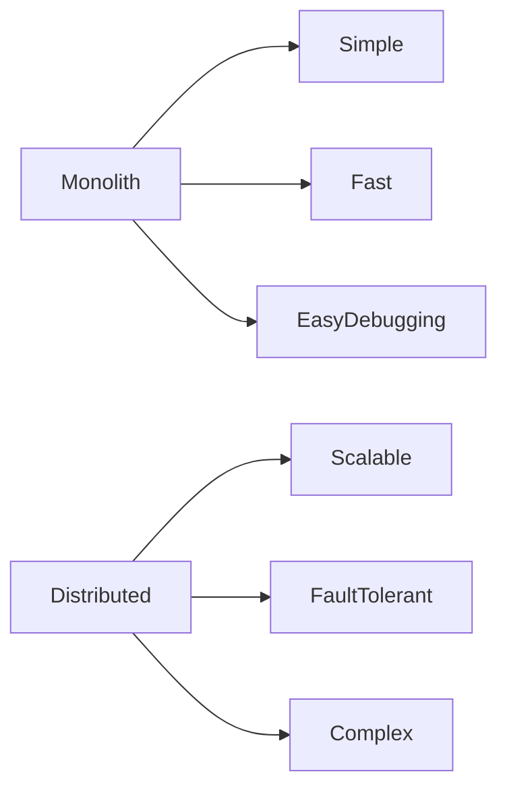
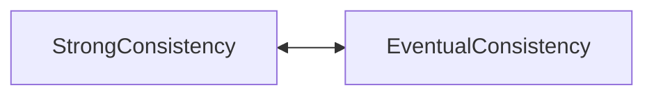
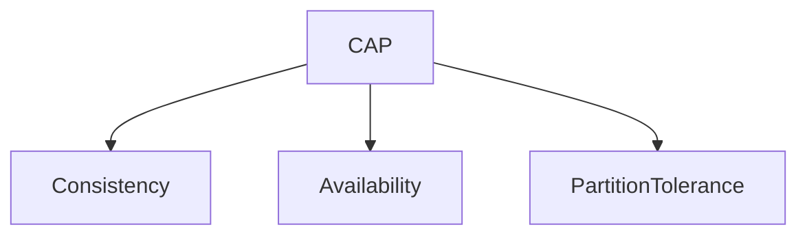

# Distributed Systems Foundations Visual Atlas

> Purpose:
>
> This file is a visual brain map of distributed systems foundations.
>
> Do not memorize technologies.
>
> Understand relationships.
>
> Think in systems.

---

# The Big Picture

```mermaid
flowchart TD

Users

↓

Applications

↓

Services

↓

Infrastructure

↓

Linux

↓

Hardware

↓

Physics
```

Everything eventually reaches physics.

---

# The Distributed Systems Stack

```mermaid
flowchart TD

Business

↓

Users

↓

Applications

↓

DistributedSystems

↓

Cloud

↓

Containers

↓

Linux

↓

Hardware
```

Every layer depends on lower layers.

---

# The Universal Internet Architecture

```mermaid
flowchart TD

Users

↓

DNS

↓

CDN

↓

LoadBalancer

↓

APIGateway

↓

Services

↓

Cache

↓

MessageQueue

↓

Database

↓

Storage

↓

Linux

↓

Hardware
```

This explains most modern internet companies.

---

# Linux Is The Foundation

```mermaid
flowchart TD

Applications

↓

Microservices

↓

Containers

↓

Kubernetes

↓

Cloud

↓

Linux

↓

Hardware
```

Everything eventually reaches Linux.

---

# Distributed Systems Core Problems

```mermaid
mindmap

root((Distributed Systems))

Communication

Coordination

Latency

Failures

Tradeoffs

Physics

Observability

Security
```

These are the real topics.

---

# Monolith Evolution

```mermaid
flowchart TD

Users

↓

Application

↓

Database
```

Simple.

Fast.

Easy.

---

# Distributed Evolution

```mermaid
flowchart TD

Users

↓

Gateway

↓

Services

↓

Cache

↓

Queues

↓

Databases
```

Scalable.

Complex.

---

# Monolith vs Distributed



Tradeoffs appear.

---

# Growth Evolution

```mermaid
flowchart TD

100Users

↓

1000Users

↓

10000Users

↓

100000Users

↓

1MillionUsers

↓

10MillionUsers

↓

100MillionUsers

↓

1BillionUsers
```

Architectures evolve.

---

# Bottleneck Evolution

```mermaid
flowchart TD

Code

↓

Database

↓

Cache

↓

Network

↓

Coordination

↓

Geography

↓

Physics
```

The bottleneck always moves.

---

# Failure Domains

```mermaid
flowchart TD

Server

↓

Rack

↓

DataCenter

↓

Region

↓

CloudProvider
```

Blast radius increases upward.

---

# Cascading Failures

```mermaid
flowchart TD

SlowDatabase

↓

APIQueueBuilds

↓

CPUSpike

↓

ContainersCrash

↓

Outage
```

Failures compound.

---

# Retry Storm

```mermaid
flowchart TD

SlowAPI

↓

Timeout

↓

Retry

↓

MoreTraffic

↓

Outage
```

Retries can kill systems.

---

# Building Reliability

```mermaid
flowchart TD

UnreliableMachines

↓

Redundancy

↓

Replication

↓

LoadBalancing

↓

Observability

↓

ReliableExperience
```

Reliable systems come from unreliable components.

---

# Coordination Explosion

```mermaid
flowchart TD

OneMachine

↓

FiveMachines

↓

FiftyMachines

↓

FiveHundredMachines

↓

FiveThousandMachines
```

Coordination complexity grows rapidly.

---

# Consensus Simplified

```mermaid
flowchart TD

Proposal

↓

Voting

↓

Agreement

↓

Commit
```

Machines agree on truth.

---

# Distributed Data Flow

```mermaid
flowchart TD

Client

↓

DNS

↓

Gateway

↓

Service

↓

Cache

↓

Database

↓

Storage

↓

Response
```

Applications are flows.

---

# Strong vs Eventual Consistency



Tradeoffs everywhere.

---

# CAP Theorem



Choose wisely during partitions.

---

# Tradeoff Engine

```mermaid
mindmap

root((Tradeoffs))

Performance

Cost

Security

Reliability

Scalability

Simplicity

Maintainability

Observability
```

Everything competes.

---

# The Eight Fallacies

```mermaid
mindmap

root((False Assumptions))

ReliableNetwork

ZeroLatency

InfiniteBandwidth

SecureNetwork

StaticTopology

SingleAdmin

ZeroTransportCost

HomogeneousNetwork
```

Assumptions break systems.

---

# Physics Of Distributed Systems

```mermaid
mindmap

root((Physics))

Distance

Time

Heat

Electricity

Bandwidth

ResourceLimits
```

Physics always wins.

---

# Latency Hierarchy

```mermaid
flowchart LR

CPURegister

--> L1Cache

--> RAM

--> SSD

--> Network

--> Internet
```

Every step is slower.

---

# Communication Cost

```mermaid
flowchart TD

ServiceA

↓

ServiceB

↓

ServiceC

↓

ServiceD
```

Every arrow is expensive.

---

# Event Driven Architecture

```mermaid
flowchart TD

Producer

↓

Queue

↓

Consumer1

Queue --> Consumer2

Queue --> Consumer3
```

Reduce coordination.

---

# Cache Data Flow

```mermaid
flowchart TD

Request

↓

Cache

Cache --> Hit

Cache --> Miss

Miss --> Database
```

Cache fights latency.

---

# Global Architecture

```mermaid
flowchart LR

India

<-->

Europe

<-->

USA

<-->

Japan
```

Geography matters.

---

# Linux Networking Path

```mermaid
flowchart TD

Application

↓

Socket

↓

TCP

↓

NIC

↓

Internet
```

Linux powers communication.

---

# Linux Resource Management

```mermaid
flowchart TD

Applications

↓

LinuxKernel

LinuxKernel --> CPU

LinuxKernel --> Memory

LinuxKernel --> Storage

LinuxKernel --> Network
```

Linux manages resources.

---

# Observability Pipeline

```mermaid
flowchart TD

Application

↓

Logs

↓

Metrics

↓

Traces

↓

Dashboards

↓

Alerts
```

Invisible systems cannot be fixed.

---

# Security Layers

```mermaid
flowchart TD

Identity

↓

Authentication

↓

Authorization

↓

Encryption

↓

AuditLogs
```

Security is layered.

---

# Engineering Evolution

```mermaid
flowchart TD

Junior

↓

Mid

↓

Senior

↓

Staff

↓

Principal
```

The questions evolve.

---

# Question Evolution

```text
Junior

How do I build this?

↓

Mid

How do I scale this?

↓

Senior

How does this fail?

↓

Staff

What is the blast radius?

↓

Principal

How do I hide failures from users?
```

---

# The Universal Distributed Systems Equation

```text
Distributed Systems

=

Computers

+

Networks

+

Humans

+

Physics

+

Failures

+

Tradeoffs

+

Observability
```

---

# The Entire Repository In One Diagram

```mermaid
flowchart TD

Linux

↓

Networking

↓

Storage

↓

Containers

↓

Kubernetes

↓

Cloud

↓

DistributedSystems

↓

PlatformEngineering

↓

SystemsThinking
```

---

# Golden Rules

```text
Everything fails.

Everything scales.

Everything is a tradeoff.

Everything has bottlenecks.

Everything eventually reaches Linux.

Physics always wins.

Users should never notice failures.
```

---
