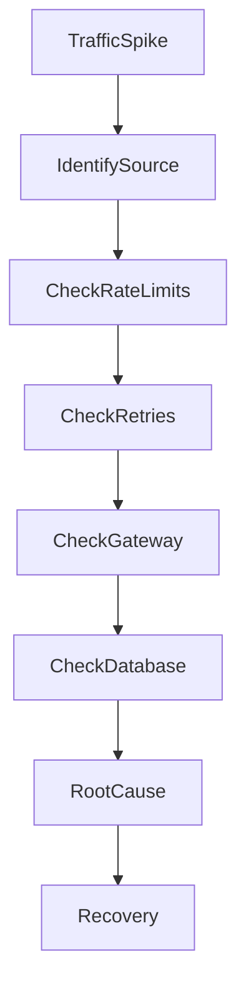
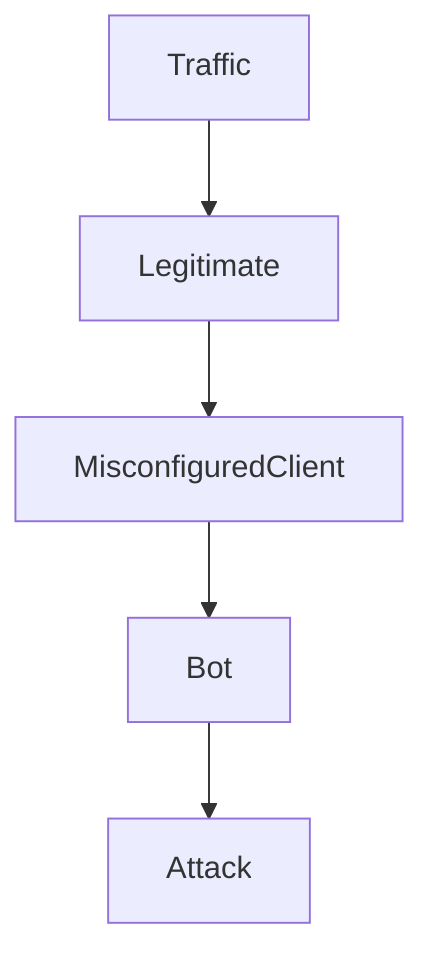
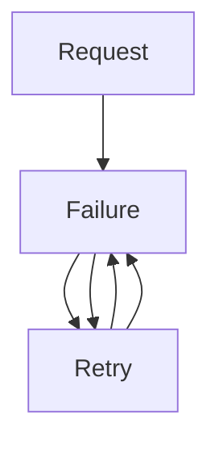
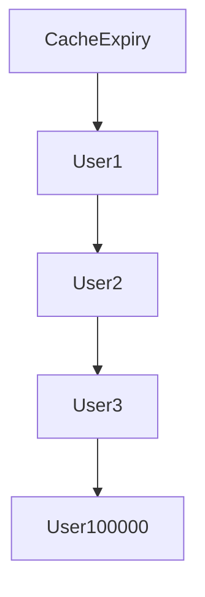
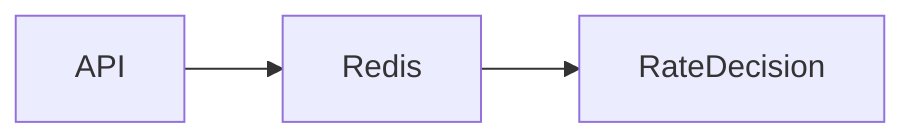
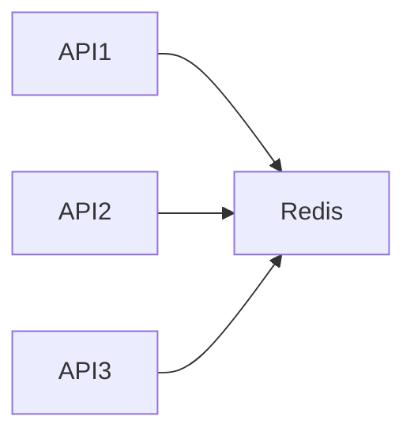

# API Rate Limit Disaster

## Production Incident Case Study

---

# Scenario

Time: **02:11 PM**

The API team receives alerts.

```text
WARNING

API Requests/sec: 8,000

Normal: 700
```

A few minutes later:

```text
CRITICAL

API Error Rate: 68%

Response Time: 9.2s

Database CPU: 97%
```

Customer complaints begin flooding in.

```text
Mobile App Not Working

Checkout Failing

Search Timing Out

Login Slow
```

Application servers are still running.

No deployments occurred.

No infrastructure changes occurred.

Yet the entire platform is becoming unusable.

Investigation reveals:

```text
A Broken Rate Limiting System
```

One API consumer is generating millions of requests and overwhelming the entire platform.

---

# Learning Objectives

After completing this case study you should understand:

* API rate limiting
* Traffic shaping
* Retry storms
* Thundering herd problems
* API gateway failures
* Distributed rate limiting
* Redis-based rate limiting
* Token bucket algorithms
* Sliding window algorithms
* Abuse detection
* Production traffic protection

---

# Why Rate Limiting Exists

Without rate limiting:


Any client can generate:

```text
1 request
100 requests
10,000 requests
1,000,000 requests
```

The server cannot distinguish legitimate traffic from abuse.

---

# What Rate Limiting Protects

Rate limiting protects:

* APIs
* Databases
* Authentication services
* Payment systems
* External integrations

Architecture:


The rate limiter acts as a traffic gate.

---

# First Rule

High traffic does not automatically mean success.

Sometimes:

```text
More Traffic
=
More Failure
```

Understand traffic quality before scaling infrastructure.

---

# Initial Symptoms

Monitoring shows:

```text
Traffic Spike
```

Metrics:

```text
Requests/sec

700 → 2,000 → 10,000 → 50,000
```

Response times increase.

Eventually:

```text
Timeouts
5xx Errors
Connection Failures
```

appear.

---

# Investigation Workflow



---

# Step 1: Identify Traffic Sources

Check logs.

Example:

```bash
awk '{print $1}' access.log \
| sort \
| uniq -c \
| sort -nr
```

Example output:

```text
4,500,000 203.0.113.5

8,000 198.51.100.10

4,000 198.51.100.11
```

One IP dominates traffic.

---

# Step 2: Analyze Request Patterns

Questions:

```text
Is traffic legitimate?

Is it a bot?

Is it a broken application?

Is it an attack?
```

---

# Traffic Visualization



Different causes require different responses.

---

# Common Cause #1

## Missing Rate Limiting

No protection exists.

---

# Architecture


---

# Consequence

A single client can consume:

```text
100% CPU

100% Connections

100% Database Capacity
```

Everyone else suffers.

---

# Detection

Check API gateway configuration.

Examples:

```text
Nginx

Kong

Traefik

Envoy

AWS API Gateway
```

Verify limits exist.

---

# Common Cause #2

## Retry Storm

One of the most destructive incidents.

---

# What Happens

Service returns:

```text
500 Error
```

Clients retry immediately.

---

# Flow



---

# Example

10,000 clients.

Each retries:

```text
5 times
```

Result:

```text
50,000 extra requests
```

System overload worsens.

---

# Detection

Traffic increases immediately after failures begin.

Logs show:

```text
Same Request Repeated
```

many times.

---

# Prevention

Use:

```text
Exponential Backoff
```

instead of immediate retries.

---

# Common Cause #3

## Thundering Herd

A shared event triggers simultaneous requests.

---

# Example

Cache expires.

Millions of users refresh data.

---

# Architecture



All requests arrive simultaneously.

---

# Result

```text
Database Overload
API Saturation
```

---

# Common Cause #4

## Mobile App Bug

Mobile app enters loop.

Example:

```javascript
while(true){
 fetch("/api/user");
}
```

Millions of requests generated.

---

# Symptoms

```text
Traffic Spike
```

immediately after app release.

---

# Investigation

Correlate:

```text
Deployment Time
```

with:

```text
Traffic Increase
```

---

# Common Cause #5

## Broken Web Crawler

Crawler ignores:

```text
robots.txt
```

or enters infinite URL generation.

---

# Example

```text
/search?q=1

/search?q=2

/search?q=3
```

Millions of unique requests.

---

# Detection

Logs reveal:

```text
Single User-Agent
```

creating huge traffic.

---

# Common Cause #6

## Credential Stuffing Attack

Attackers attempt:

```text
Millions Of Login Requests
```

using leaked credentials.

---

# Architecture


---

# Symptoms

```text
Huge Login Volume

Authentication Failures
```

---

# Detection

Monitor:

```text
Failed Login Rate
```

---

# Common Cause #7

## Distributed Abuse

Traffic comes from:

```text
100,000 IPs
```

instead of one.

Traditional IP limits fail.

---

# Investigation

Analyze:

```text
User IDs

Tokens

API Keys
```

instead of IPs alone.

---

# Common Cause #8

## API Gateway Misconfiguration

Rate limits exist.

But configuration incorrect.

---

# Example

Expected:

```text
100 req/min
```

Configured:

```text
100,000 req/min
```

Protection ineffective.

---

# Investigation

Review gateway settings.

---

# Common Cause #9

## Redis Rate Limiter Failure

Distributed rate limiting often depends on Redis.

Architecture:



Redis unavailable.

Rate limiter disabled.

Traffic floods system.

---

# Detection

Check:

```bash
redis-cli ping
```

---

# Common Cause #10

## API Key Abuse

Customer API key leaked.

External systems generate:

```text
Millions Of Requests
```

using valid credentials.

---

# Detection

Check:

```text
Requests Per API Key
```

rather than IPs.

---

# Understanding Rate Limiting Algorithms

---

# Fixed Window

Example:

```text
100 Requests

Per Minute
```

Simple.

But causes burst problems.

---

# Sliding Window

Tracks requests continuously.

More accurate.

---

# Token Bucket

Most common.

---

# Visualization


Requests consume tokens.

Tokens refill gradually.

---

# Benefits

Allows:

```text
Controlled Bursts
```

while protecting infrastructure.

---

# Leaky Bucket

Traffic exits queue at fixed rate.

Smooths bursts.

---

# Distributed Rate Limiting

Single-server limits are insufficient.

Modern systems require:



Shared counters.

---

# Rate Limiting Dimensions

Limit by:

```text
IP

User

API Key

Organization

Region

Endpoint
```

Often combine multiple strategies.

---

# Useful Investigation Commands

Top IPs:

```bash
awk '{print $1}' access.log \
| sort \
| uniq -c \
| sort -nr
```

---

# Request Volume

```bash
wc -l access.log
```

---

# Nginx Metrics

```bash
nginx_status
```

---

# Connection Count

```bash
ss -s
```

---

# Active Connections

```bash
netstat -an | wc -l
```

---

# Production Investigation Example

Timeline:

```text
14:11 Alert Triggered

14:13 Traffic Spike Confirmed

14:15 Top IP Analysis

14:18 Retry Storm Detected

14:22 Mobile App Bug Found

14:28 Rate Limit Applied

14:34 Traffic Reduced

14:40 Platform Stable
```

---

# Recovery Checklist

### Identify Traffic Source

```text
IPs

API Keys

Users
```

---

### Verify Rate Limiter

```text
Gateway Rules

Redis

Counters
```

---

### Check Retries

```text
Client Behavior
```

---

### Check Database

```text
Connection Count

CPU

Latency
```

---

### Apply Emergency Limits

```text
Block

Throttle

Rate Limit
```

---

### Verify Recovery

```text
Traffic Normalized

Latency Reduced
```

---

# Root Cause Analysis Example

```text
Incident:
API Outage

Impact:
70% Request Failure Rate

Root Cause:
Mobile Application Retry Storm

Contributing Factors:
Missing Rate Limits
No Backoff Logic

Detection:
Traffic Spike Monitoring

Resolution:
Emergency Rate Limiting
Client Patch

Prevention:
Distributed Rate Limiting
Retry Controls
Traffic Analytics
```

---

# Monitoring Recommendations

Monitor:

* Requests/sec
* Error rates
* Retry rates
* API key usage
* Top consumers
* Gateway latency
* Redis health
* Authentication failures

---

# Prevention Strategies

## Layered Rate Limiting

Apply limits at:

```text
CDN

Load Balancer

API Gateway

Application
```

---

## Exponential Backoff

Never allow unlimited retries.

---

## Circuit Breakers

Prevent cascading failures.

---

## Abuse Detection

Automatically identify anomalies.

---

## Emergency Controls

Allow engineers to:

```text
Block IP

Disable Key

Reduce Rate Limit
```

within seconds.

---

# What Senior Engineers Do Differently

Junior Engineer:

```text
Traffic High

Add More Servers
```

Senior Engineer:

```text
Who Is Sending Traffic?

Why?

Legitimate?

Bug?

Attack?

Fix Root Cause
```

Scaling without understanding traffic often makes incidents more expensive rather than solving them.

---

# Interview Questions

### What is rate limiting?

### What is a retry storm?

### What is a thundering herd problem?

### How does a token bucket algorithm work?

### Why is distributed rate limiting difficult?

### What metrics would you monitor for API abuse?

### How would you investigate a sudden traffic spike?

### Why can retries make outages worse?

---

# Key Takeaway

API rate limiting is not merely a security feature.

It is a reliability feature.

Without proper controls:

```text
One Client

Can Impact

Millions Of Users
```

The best production engineers understand that traffic is a resource.

And like every resource:

```text
CPU
Memory
Disk
Network
```

it must be managed, protected, and controlled.

Because reliability is not just about handling traffic.

It is about handling traffic safely.
