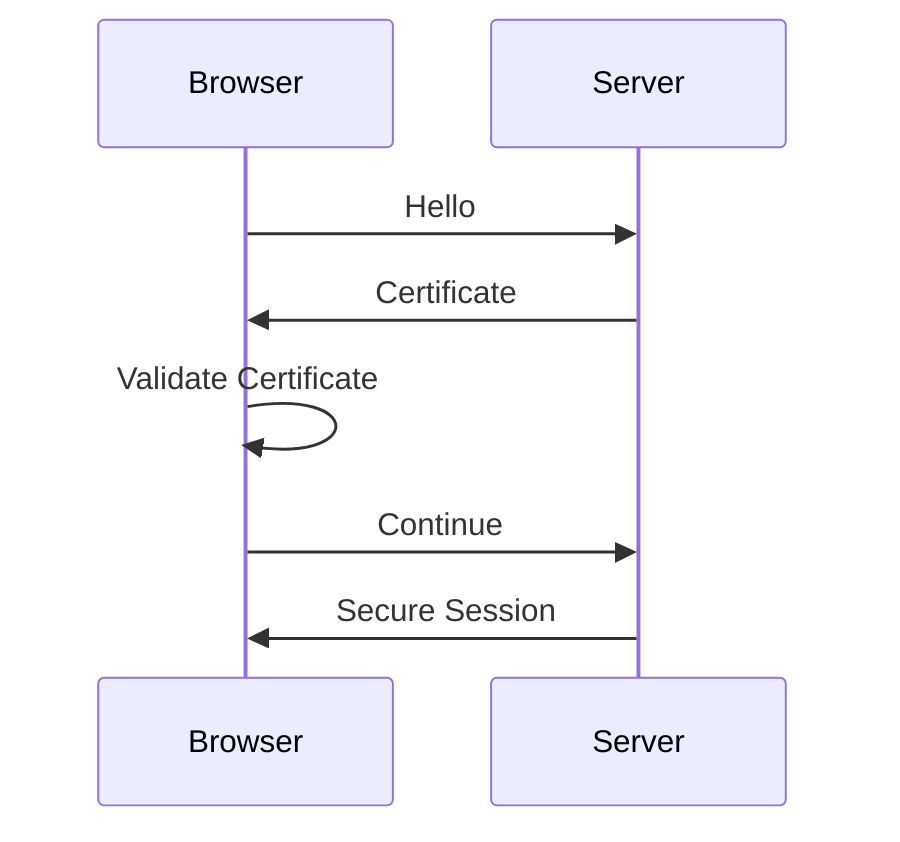
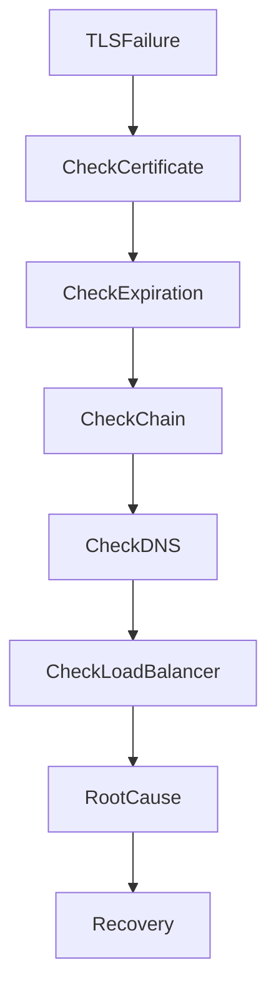
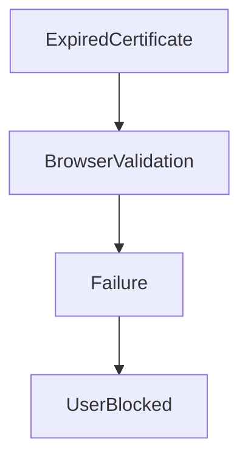
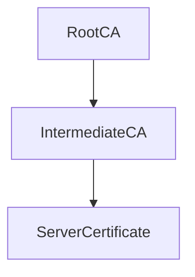
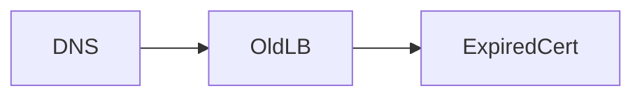
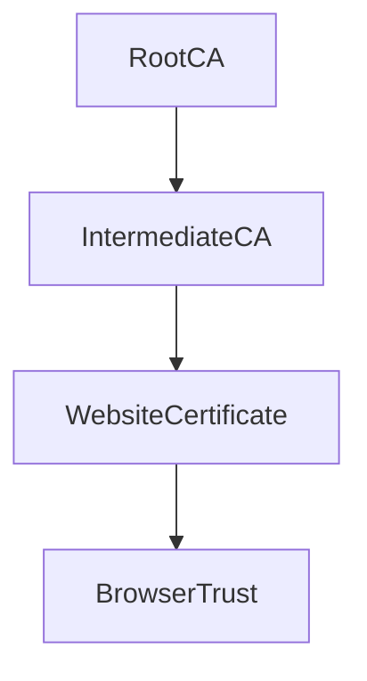

# Certificate Expiration Incident

## Production Incident Case Study

---

# Scenario

Time: **07:02 AM**

Customer support tickets begin arriving.

```text id="zj6fxt"
Users Cannot Access Website
```

Soon after:

```text id="lxv9uh"
Mobile App Login Failing
API Requests Failing
Checkout Not Working
```

Users report browser warnings:

```text id="fd7ryp"
Your Connection Is Not Private
```

Others report:

```text id="7m5s4s"
NET::ERR_CERT_DATE_INVALID
```

Monitoring shows:

```text id="s55vmt"
Servers Healthy
Database Healthy
Load Balancer Healthy
Applications Healthy
```

Everything appears operational.

Yet users cannot use the platform.

After investigation:

```text id="u9gx4z"
TLS Certificate Expired
```

A small certificate problem has become a full production outage.

---

# Learning Objectives

After completing this case study you should understand:

* TLS fundamentals
* SSL certificate architecture
* Certificate chains
* Certificate expiration
* Certificate renewal automation
* Let's Encrypt workflows
* Browser trust model
* Load balancer TLS termination
* Certificate troubleshooting
* Production prevention strategies

---

# Why Certificates Matter

Without TLS:

```text id="n1qg9y"
User
 ↓
Internet
 ↓
Server
```

Traffic is exposed.

With TLS:

```text id="t2zqpk"
User
 ↓
Encrypted Connection
 ↓
Server
```

Communication becomes secure.

---

# Modern Request Flow


TLS happens before application traffic.

If TLS fails:

```text id="af1s34"
Application Never Receives Requests
```

---

# First Rule

Do not restart application servers.

A certificate issue is usually not an application issue.

Investigate the TLS layer first.

---

# Initial Symptoms

Users see:

```text id="4pb3jh"
Certificate Warning
```

or

```text id="r5y9h0"
Secure Connection Failed
```

Mobile applications show:

```text id="lm0x9n"
SSL Handshake Failure
```

API clients report:

```text id="j3yz6j"
Certificate Validation Error
```

---

# Understanding TLS Handshake

Before a request is processed:



If validation fails:

```text id="5vg7r4"
Connection Terminated
```

---

# Investigation Workflow



---

# Step 1: Verify Certificate

Check website certificate.

```bash id="u2g5sk"
openssl s_client \
-connect company.com:443
```

---

# Example Output

```text id="s7m5yl"
Verify return code: 10
certificate has expired
```

Root cause identified immediately.

---

# Alternative Check

```bash id="w2v7sl"
curl -v https://company.com
```

Possible output:

```text id="1wrzxe"
SSL certificate problem
```

---

# Common Cause #1

## Certificate Expired

The most common incident.

Certificate validity:

```text id="hl0t9m"
Start Date
End Date
```

After expiration:

```text id="3n7v2q"
Browser Trust Removed
```

---

# Example

```text id="w4v5cx"
Valid Until:

2026-06-15

Current Date:

2026-06-16
```

Certificate invalid.

---

# Architecture



---

# Investigation

Check expiration.

```bash id="7t1zmd"
openssl x509 \
-enddate \
-noout \
-in cert.pem
```

---

# Common Cause #2

## Renewal Automation Failure

Many organizations use:

```text id="0zn6qm"
Let's Encrypt
```

with automated renewals.

---

# Expected Flow


---

# Failure

```text id="8z8i1f"
Renewal Job Failed
```

Certificate expires.

---

# Investigation

Check:

```bash id="8m3n7t"
systemctl status certbot.timer
```

or

```bash id="v6px6j"
crontab -l
```

---

# Common Cause #3

## Service Not Reloaded

Certificate renewed successfully.

But:

```text id="pgsx2m"
Nginx
HAProxy
Apache
```

never reloaded.

Old certificate still served.

---

# Investigation

Check active certificate:

```bash id="hfj9bw"
openssl s_client \
-connect company.com:443
```

Compare with filesystem certificate.

---

# Common Cause #4

## Wrong Certificate Installed

Example:

```text id="px84v4"
staging.company.com
```

certificate installed on:

```text id="7x0p4k"
api.company.com
```

---

# Symptoms

```text id="4j1w0x"
Hostname Mismatch
```

Browser rejects certificate.

---

# Investigation

Check:

```bash id="s3ov3g"
openssl x509 \
-noout \
-text
```

Review:

```text id="u65c8f"
Subject Alternative Names
```

---

# Common Cause #5

## Incomplete Certificate Chain

Many certificates depend on:

```text id="pf63tf"
Root CA
Intermediate CA
Server Certificate
```

---

# Chain Architecture



---

# Problem

Intermediate certificate missing.

Browsers fail validation.

---

# Symptoms

```text id="y0v0u3"
Unable To Verify Certificate
```

---

# Investigation

```bash id="f9ozm2"
openssl s_client \
-showcerts
```

Check chain completeness.

---

# Common Cause #6

## DNS Pointing To Old Endpoint

DNS still points to:

```text id="kz5pxf"
Old Load Balancer
```

with expired certificate.

---

# Architecture



---

# Investigation

Verify:

```bash id="a8v1zh"
dig company.com
```

Compare IPs.

---

# Common Cause #7

## Load Balancer Certificate Failure

TLS often terminates at:

```text id="3pyz4n"
Nginx
HAProxy
AWS ALB
Cloudflare
```

---

# Request Path


Backend healthy.

Load balancer certificate broken.

Users blocked.

---

# Investigation

Check load balancer configuration.

---

# Common Cause #8

## Certificate Revoked

Rare but important.

Certificate authority revokes certificate.

---

# Reasons

```text id="l5d2ux"
Private Key Leak
Fraudulent Issuance
Security Incident
```

---

# Browser Behavior

```text id="t1r6mb"
Certificate No Longer Trusted
```

---

# Common Cause #9

## System Clock Problems

Certificates depend on time.

Example:

```text id="7mq6ca"
Server Date: 2030
```

Certificate appears invalid.

---

# Investigation

```bash id="7k4bnv"
timedatectl
```

Verify clock synchronization.

---

# Common Cause #10

## Let's Encrypt Validation Failure

Renewal requires validation.

Example:

```text id="5b3dwm"
DNS Changed
Firewall Changed
Port 80 Blocked
```

Renewal fails.

Certificate expires later.

---

# Investigation

Check logs.

```bash id="j1a6wz"
journalctl -u certbot
```

Example:

```text id="u8c8m0"
Challenge Validation Failed
```

---

# Common Cause #11

## Wildcard Certificate Failure

Wildcard:

```text id="n2v5xp"
*.company.com
```

expires.

Impact:

```text id="9j1jmo"
api.company.com
app.company.com
admin.company.com
```

all fail simultaneously.

---

# Common Cause #12

## Private Key Mismatch

Certificate and key differ.

---

# Symptoms

Service startup failure.

Example:

```text id="6czkgw"
SSL: private key does not match certificate
```

---

# Investigation

Verify fingerprints.

---

# Understanding Browser Trust

Browsers trust:



Any break:

```text id="8wt3mn"
Connection Rejected
```

---

# Useful Commands

## Check Certificate

```bash id="5e3fkk"
openssl s_client \
-connect company.com:443
```

---

## Check Expiration

```bash id="4nzb17"
openssl x509 \
-enddate \
-noout
```

---

## Show Certificate Details

```bash id="4r5b7h"
openssl x509 \
-text \
-noout
```

---

## Verify DNS

```bash id="v0tx6e"
dig company.com
```

---

## Check System Time

```bash id="s6r6ef"
timedatectl
```

---

## Test Renewal

```bash id="r7t4uc"
certbot renew --dry-run
```

---

# Production Investigation Example

Timeline:

```text id="1xt9ik"
07:02 User Reports Begin

07:05 Monitoring Alert

07:08 Website Tested

07:10 Certificate Error Confirmed

07:12 Expiration Verified

07:18 Certificate Renewed

07:22 Load Balancer Reloaded

07:24 Service Restored
```

---

# Recovery Checklist

### Verify Certificate

```bash id="u9c5h1"
openssl s_client
```

---

### Check Expiration

```bash id="2f5jhg"
openssl x509
```

---

### Verify Chain

```bash id="1okd1x"
-showcerts
```

---

### Verify DNS

```bash id="e4vm8h"
dig
```

---

### Verify Renewal

```bash id="j7h7m4"
certbot renew --dry-run
```

---

### Reload Service

```bash id="z7x4cl"
systemctl reload nginx
```

---

# Root Cause Analysis Example

```text id="s8n4g5"
Incident:
Website Unavailable

Impact:
100% Users Affected

Root Cause:
TLS Certificate Expired

Contributing Factors:
Renewal Job Failed
No Expiration Monitoring

Detection:
Customer Reports

Resolution:
Certificate Renewed
Services Reloaded

Prevention:
Expiration Alerts
Renewal Monitoring
Dry Run Validation
```

---

# Monitoring Recommendations

Monitor:

* Certificate expiration dates
* Renewal job success
* TLS handshake failures
* Certificate chain validity
* DNS changes
* Load balancer configuration
* Time synchronization

---

# Prevention Strategies

## Expiration Alerts

Alert at:

```text id="y6k7o4"
90 Days
60 Days
30 Days
14 Days
7 Days
```

before expiration.

---

## Renewal Testing

Run:

```bash id="z3k2cw"
certbot renew --dry-run
```

regularly.

---

## Multiple Contacts

Ensure multiple engineers receive expiration notices.

---

## Certificate Inventory

Track:

```text id="m4y7w0"
Domain
Certificate
Expiration
Owner
Renewal Method
```

---

## Monitoring Dashboards

Never rely solely on email reminders.

---

# What Senior Engineers Do Differently

Junior Engineer:

```text id="q5v9x0"
Website Broken

Restart Nginx
```

Senior Engineer:

```text id="j4w3x7"
Browser Error

Check TLS

Check Certificate

Check Expiration

Check Trust Chain

Find Root Cause
```

---

# Interview Questions

### What happens during a TLS handshake?

### Why can an expired certificate cause a complete outage?

### What is a certificate chain?

### What is the role of an intermediate CA?

### How would you investigate a certificate warning?

### Why is time synchronization important for TLS?

### What causes automated certificate renewals to fail?

### How would you prevent certificate expiration incidents?

---

# Key Takeaway

Certificate incidents are deceptive.

The infrastructure may be completely healthy:

```text id="x5j9u2"
Servers Healthy
Applications Healthy
Databases Healthy
```

Yet users cannot connect.

Because security happens before application traffic.

The best engineers treat certificates as critical production dependencies, not administrative paperwork.

A certificate is not merely a file.

It is the trust relationship that allows users to reach your platform at all.
