# Cloud Region Failure

## Production Incident Case Study

---

# Scenario

Time: **10:18 AM**

Monitoring dashboards suddenly light up.

```text id="crf001"
CRITICAL ALERT

Region: us-east-1

Availability: 0%

API Success Rate: 4%

Database Connectivity: Failed
```

Customers begin reporting:

```text id="crf002"
Cannot Login

Checkout Failing

Mobile App Offline

Website Unavailable
```

Engineers investigate.

Application code has not changed.

No deployment occurred.

No database migration occurred.

No infrastructure update occurred.

Yet the platform is unavailable.

After investigation:

```text id="crf003"
Cloud Region Failure
```

An entire cloud region has become unavailable.

---

# Learning Objectives

After completing this case study you should understand:

* Cloud region architecture
* Availability zones
* Multi-region design
* Disaster recovery
* Active-passive systems
* Active-active systems
* DNS failover
* Data replication
* RTO and RPO
* Region outage response

---

# Understanding Cloud Geography

Cloud providers organize infrastructure hierarchically.

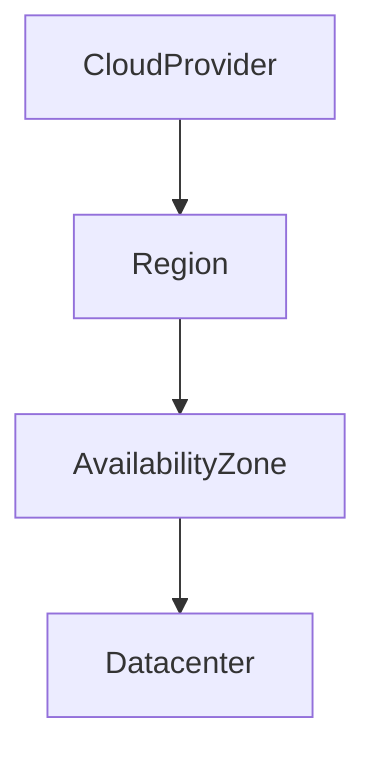

Example:

```text id="crf005"
AWS

Region:
us-east-1

AZ:
us-east-1a
us-east-1b
us-east-1c
```

---

# Common Misconception

Many engineers believe:

```text id="crf006"
Multiple Availability Zones

=
Disaster Recovery
```

Not true.

Availability zones protect against:

```text id="crf007"
Datacenter Failure
```

They do not protect against:

```text id="crf008"
Region Failure
```

---

# Typical Production Architecture

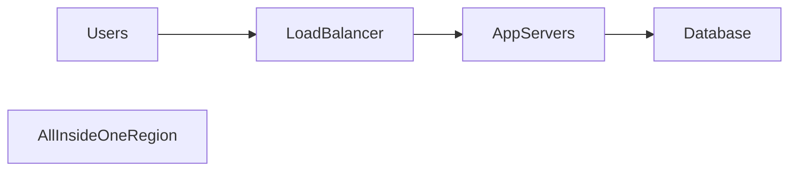

Looks redundant.

Still vulnerable.

---

# What Happens During A Region Failure?

```mermaid id="crf010"
flowchart TD

Region

X LoadBalancer

X AppServers

X Database

X Storage
```

Everything disappears simultaneously.

---

# First Rule

Do not assume:

```text id="crf011"
Application Failure
```

Investigate infrastructure health first.

---

# Initial Symptoms

Monitoring:

```text id="crf012"
100% Failure Rate
```

Applications:

```text id="crf013"
Offline
```

Databases:

```text id="crf014"
Unreachable
```

Logs:

```text id="crf015"
Connection Timeout
```

Every component appears broken.

---

# Investigation Workflow

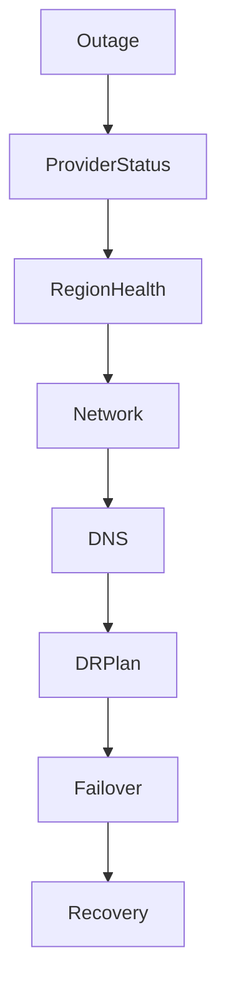

---

# Step 1: Verify Cloud Provider Status

Before touching infrastructure:

Check provider status page.

Possible findings:

```text id="crf017"
Networking Incident

Storage Incident

Control Plane Incident

Region Outage
```

---

# Important Lesson

Sometimes:

```text id="crf018"
Nothing Is Wrong With Your System
```

The provider is experiencing problems.

---

# Cloud Failure Layers

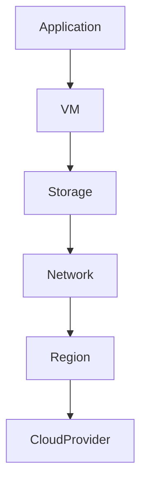

Outages can occur at any layer.

---

# Common Cause #1

## Availability Zone Failure

Single AZ fails.

Architecture:

```mermaid id="crf020"
flowchart LR

AZ1

X Failure

AZ2

AZ3
```

---

# Symptoms

```text id="crf021"
Partial Outage
```

Some workloads survive.

Some fail.

---

# Investigation

Verify:

```text id="crf022"
Which AZ Is Affected?
```

---

# Common Cause #2

## Regional Network Failure

Infrastructure running.

Network unavailable.

---

# Architecture

```mermaid id="crf023"
flowchart LR

Users

X RegionalNetwork

--> Application
```

---

# Symptoms

```text id="crf024"
Instances Healthy

Applications Unreachable
```

---

# Investigation

Check:

```text id="crf025"
Load Balancer

Routing

Internet Gateway
```

---

# Common Cause #3

## Control Plane Failure

Cloud APIs unavailable.

---

# Example

```text id="crf026"
Cannot Launch Instances

Cannot Scale

Cannot Modify Resources
```

Running systems may continue working.

Management becomes impossible.

---

# Architecture

```mermaid id="crf027"
flowchart LR

CloudAPI

X Failure

--> Operators
```

---

# Common Cause #4

## Storage Service Outage

Applications depend on:

```text id="crf028"
Block Storage

Object Storage

File Storage
```

---

# Example

```text id="crf029"
EBS

S3

EFS
```

unavailable.

---

# Symptoms

```text id="crf030"
Read Failures

Write Failures

Application Crashes
```

---

# Common Cause #5

## Database Service Failure

Managed database unavailable.

---

# Architecture

```mermaid id="crf031"
flowchart LR

Application

X Database

--> Failure
```

---

# Symptoms

```text id="crf032"
Connection Refused

Timeouts
```

---

# Common Cause #6

## DNS Failure During Failover

Disaster recovery exists.

Failover occurs.

DNS not updated.

---

# Architecture

```mermaid id="crf033"
flowchart LR

Users

--> OldRegion

X Failure
```

Traffic never reaches backup region.

---

# Investigation

Check:

```text id="crf034"
DNS Records

TTL

Failover Policies
```

---

# Common Cause #7

## Replication Failure

Backup region exists.

Data outdated.

---

# Architecture

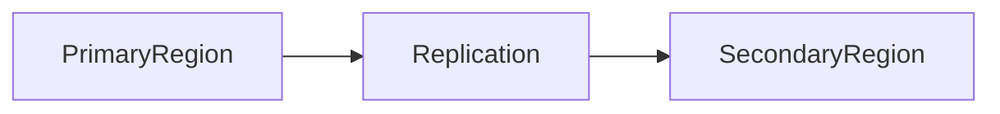

---

# Problem

Replication stopped.

Failover succeeds.

Data missing.

---

# Symptoms

```text id="crf036"
Users Lose Recent Data
```

---

# Common Cause #8

## Active-Passive Failover Failure

Backup region exists.

Never tested.

---

# Flow

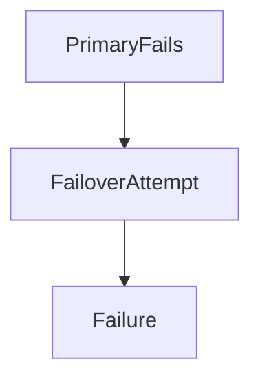

---

# Reality

Many DR systems fail the first time they are used.

---

# Common Cause #9

## Active-Active Consistency Problems

Architecture:

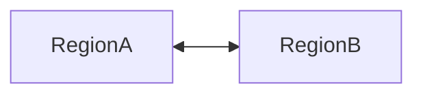

Both accept traffic.

---

# Problem

Network partition.

---

# Result

```text id="crf039"
Conflicting Writes
```

---

# Consequence

```text id="crf040"
Data Divergence
```

---

# Common Cause #10

## Shared Dependency Failure

Applications replicated.

Dependency not replicated.

---

# Example

```text id="crf041"
Redis

Message Queue

Authentication Service
```

single-region only.

---

# Architecture

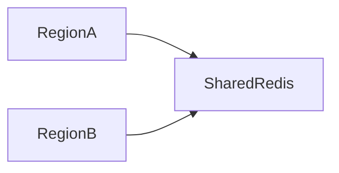

Redis fails.

Both regions impacted.

---

# Disaster Recovery Concepts

---

# RTO

Recovery Time Objective.

```text id="crf043"
How Fast Must Recovery Occur?
```

Example:

```text id="crf044"
15 Minutes
```

---

# RPO

Recovery Point Objective.

```text id="crf045"
How Much Data Loss Is Acceptable?
```

Example:

```text id="crf046"
5 Minutes
```

---

# Example

```text id="crf047"
RTO = 30 Minutes

RPO = 5 Minutes
```

Business accepts:

```text id="crf048"
30 Minutes Downtime

5 Minutes Data Loss
```

---

# Disaster Recovery Models

---

# Backup Only


Cheapest.

Slowest recovery.

---

# Active-Passive

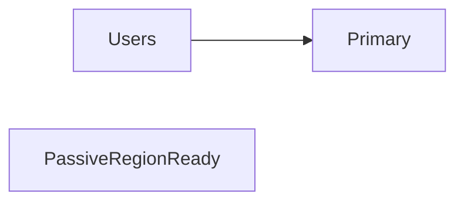

Fast recovery.

Moderate cost.

---

# Active-Active

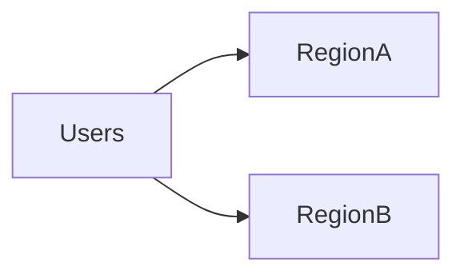

Highest availability.

Highest complexity.

---

# DNS Failover

Common DR mechanism.

---

# Architecture

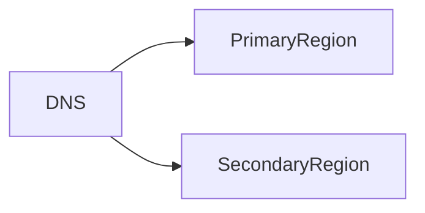

---

# Failure

```text id="crf053"
Primary Unhealthy
```

DNS routes traffic elsewhere.

---

# Challenge

DNS caching delays failover.

---

# Investigation Example

Timeline:

```text id="crf054"
10:18 Alert Triggered

10:21 Region Connectivity Lost

10:24 Provider Status Confirmed

10:28 DR Plan Activated

10:34 Secondary Region Enabled

10:39 DNS Updated

10:46 Traffic Returning

10:58 Service Stable
```

---

# Recovery Checklist

### Verify Provider Status

```text id="crf055"
Regional Incident?
```

---

### Verify Scope

```text id="crf056"
Single Service?

Single AZ?

Entire Region?
```

---

### Verify DR Readiness

```text id="crf057"
Applications

Databases

Networking
```

---

### Verify Replication

```text id="crf058"
Data Current?
```

---

### Execute Failover

```text id="crf059"
Traffic Routing

DNS

Load Balancers
```

---

### Validate Recovery

```text id="crf060"
Users Healthy

Applications Healthy

Data Consistent
```

---

# Root Cause Analysis Example

```text id="crf061"
Incident:
Platform Outage

Impact:
100% Users Affected

Root Cause:
Cloud Region Network Failure

Contributing Factors:
Single Region Architecture

Detection:
Availability Monitoring

Resolution:
Failover To Secondary Region

Prevention:
Multi-Region Deployment
DR Testing
Failover Automation
```

---

# Monitoring Recommendations

Monitor:

* Region health
* AZ health
* Replication status
* DNS failover readiness
* Disaster recovery systems
* Storage replication
* Database replication
* External dependencies

---

# Prevention Strategies

## Multi-Region Architecture

Avoid:

```text id="crf062"
Single Region Dependency
```

for critical systems.

---

## Regular DR Testing

Practice:

```text id="crf063"
Region Failure Simulations
```

---

## Replication Monitoring

Ensure backup systems remain current.

---

## Automated Failover

Reduce manual intervention.

---

## Dependency Mapping

Identify:

```text id="crf064"
Hidden Single Points Of Failure
```

---

# What Senior Engineers Do Differently

Junior Engineer:

```text id="crf065"
Everything Broken

Restart Servers
```

Senior Engineer:

```text id="crf066"
What Is The Blast Radius?

AZ?

Region?

Provider?

Determine Scope

Execute DR Plan
```

---

# Interview Questions

### What is the difference between an availability zone and a region?

### What are RTO and RPO?

### What is active-passive architecture?

### What is active-active architecture?

### How would you fail over during a region outage?

### What causes split-brain scenarios?

### Why is disaster recovery testing important?

### How would you design a highly available multi-region system?

---

# Key Takeaway

Cloud providers offer massive reliability.

But:

```text id="crf067"
Regions Can Fail
```

The question is not:

```text id="crf068"
Will A Region Fail?
```

The answer is:

```text id="crf069"
Eventually, Yes
```

The real question is:

```text id="crf070"
What Happens To Your Business
When It Does?
```

The best production engineers design systems assuming infrastructure will fail.

Because resilience is not the ability to avoid failure.

It is the ability to continue operating despite it.
