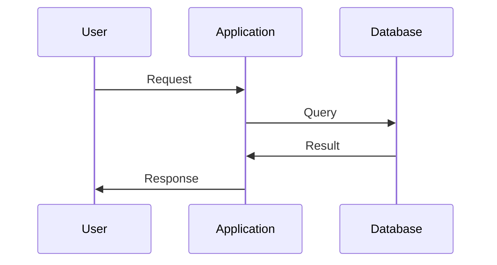
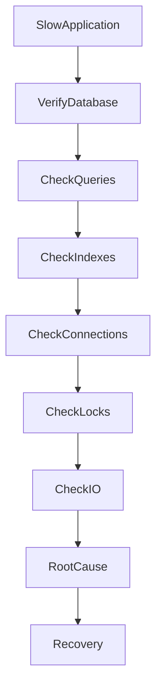
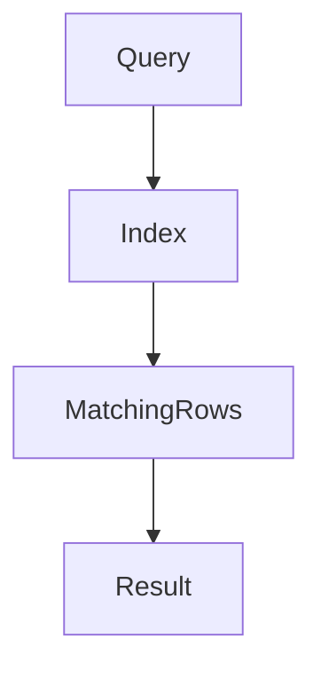
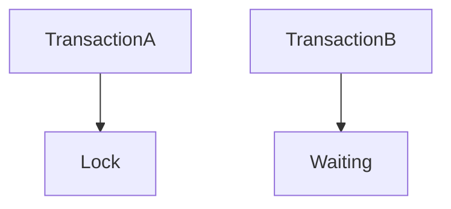
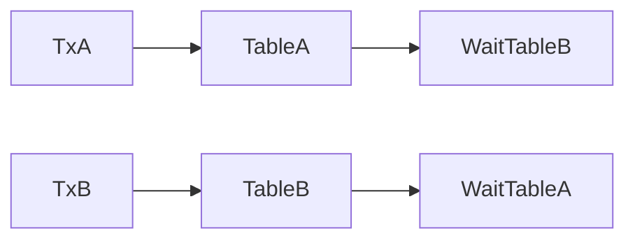
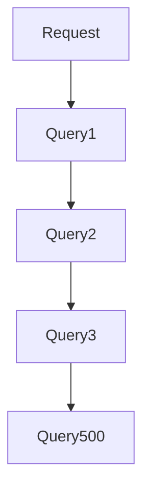

# Database Performance Issue

## Production Incident Case Study

---

# Scenario

Time: **02:43 PM**

Your monitoring system triggers a warning.

```text
API Response Time Increased

Normal: 120ms
Current: 3.8s
```

A few minutes later:

```text
Users Reporting:

- Slow dashboard loading
- Delayed login responses
- Checkout failures
- Mobile app timeouts
```

Infrastructure dashboards show:

```text
CPU: Normal
Memory: Normal
Network: Normal
Disk: Normal
```

Application servers are healthy.

Containers are healthy.

Load balancer is healthy.

Yet the application is becoming unusable.

After investigation, engineers discover:

```text
Database Performance Degradation
```

One slow database can bring down an entire platform.

---

# Learning Objectives

After completing this case study you should understand:

* Database bottlenecks
* Slow query analysis
* Query execution plans
* Indexing failures
* Connection pool exhaustion
* Lock contention
* Disk I/O bottlenecks
* Cache effectiveness
* Replication lag
* Database troubleshooting methodology
* Performance optimization techniques

---

# Why Databases Become Bottlenecks

Most modern applications follow:


Every request eventually reaches the database.

Examples:

```text
Login
User Profile
Orders
Payments
Reports
Analytics
```

When the database slows:

```text
Everything Slows
```

---

# Understanding Request Flow

A single user request may trigger:



If query execution becomes slow:

```text
User Waits
```

Response times increase.

---

# First Rule

Never assume the database is the problem.

Verify.

Many incidents blamed on databases actually originate in:

* Application code
* Network
* Cache
* Storage
* DNS

Evidence matters.

---

# Initial Symptoms

Users report:

```text
Application Feels Slow
```

Monitoring shows:

```text
API Latency Rising
```

Example:

```text
Normal: 100ms

Current:
1s
3s
5s
10s
```

Error rates begin increasing.

---

# Step 1: Verify Database Health

Check connectivity.

PostgreSQL:

```bash
pg_isready
```

MySQL:

```bash
mysqladmin ping
```

Expected:

```text
accepting connections
```

If database is unavailable:

```text
Availability Problem
```

Not performance.

---

# Step 2: Check Resource Usage

CPU:

```bash
top
```

or

```bash
htop
```

Memory:

```bash
free -h
```

Disk:

```bash
iostat -x 1
```

Load:

```bash
uptime
```

---

# Example

```text
Load Average

72.5
68.3
61.9
```

Potential overload.

---

# Database Investigation Flow



---

# Common Cause #1

## Slow Queries

Most performance incidents originate here.

Example query:

```sql
SELECT *
FROM orders
WHERE customer_id = 123;
```

Looks harmless.

But table contains:

```text
50 Million Rows
```

Without an index:

```text
Full Table Scan
```

---

# Understanding Table Scan


Database reads everything.

Performance collapses.

---

# Detecting Slow Queries

PostgreSQL:

```sql
SELECT *
FROM pg_stat_activity;
```

or

```sql
SELECT *
FROM pg_stat_statements;
```

MySQL:

```sql
SHOW PROCESSLIST;
```

---

# Example

```text
Query Runtime:

37 seconds
```

Immediate investigation required.

---

# Query Execution Plans

Never guess.

Use:

PostgreSQL:

```sql
EXPLAIN ANALYZE
SELECT *
FROM orders
WHERE customer_id = 123;
```

---

# Bad Output

```text
Seq Scan on orders
```

Meaning:

```text
Full Table Scan
```

---

# Good Output

```text
Index Scan
```

Much faster.

---

# Root Cause #2

## Missing Index

Very common production issue.

Application grows.

Data grows.

Indexes never added.

---

# Example

```sql
SELECT *
FROM users
WHERE email='user@example.com';
```

Without index:

```text
Millions of comparisons
```

With index:

```text
Milliseconds
```

---

# Index Architecture



Instead of scanning entire table.

---

# Recovery

Create index.

```sql
CREATE INDEX idx_users_email
ON users(email);
```

Performance improves dramatically.

---

# Root Cause #3

## Connection Pool Exhaustion

Architecture:


Database connections are limited.

Example:

```text
Max Connections: 200
```

Application uses:

```text
200 Active Connections
```

New requests wait.

---

# Symptoms

```text
Timeout Errors
```

Example:

```text
Unable to acquire database connection
```

---

# Detection

PostgreSQL:

```sql
SELECT count(*)
FROM pg_stat_activity;
```

MySQL:

```sql
SHOW STATUS LIKE 'Threads_connected';
```

---

# Root Cause

Possible causes:

* Traffic spike
* Connection leak
* Long-running queries

---

# Root Cause #4

## Lock Contention

Two transactions want same data.

Example:

Transaction A:

```sql
UPDATE accounts
SET balance=100
WHERE id=1;
```

Transaction B:

```sql
UPDATE accounts
SET balance=200
WHERE id=1;
```

One must wait.

---

# Lock Architecture



---

# Symptoms

```text
Queries Hanging
```

Application appears frozen.

---

# Detection

PostgreSQL:

```sql
SELECT *
FROM pg_locks;
```

MySQL:

```sql
SHOW ENGINE INNODB STATUS;
```

---

# Root Cause #5

## Deadlocks

Example:

Transaction A:

```text
Lock Table A
Wait Table B
```

Transaction B:

```text
Lock Table B
Wait Table A
```

---

# Result

```text
Circular Wait
```

Neither can continue.

---

# Deadlock Visualization



Database eventually kills one transaction.

---

# Root Cause #6

## Disk I/O Bottleneck

Database performance depends heavily on storage.

Check:

```bash
iostat -x 1
```

---

# Example

```text
Disk Utilization

100%
```

Storage saturated.

---

# Architecture


Slow storage means slow queries.

---

# Root Cause #7

## Memory Pressure

Database caches data.

Example:

```text
Shared Buffers
Buffer Pool
```

If cache too small:

```text
Frequent Disk Reads
```

Performance decreases.

---

# Detection

PostgreSQL:

```sql
SELECT *
FROM pg_stat_database;
```

Check cache hit ratio.

---

# Healthy Cache

```text
99%
```

---

# Poor Cache

```text
60%
```

Many disk reads.

---

# Root Cause #8

## Replication Lag

Architecture:


Replicas fall behind.

---

# Symptoms

```text
Old Data Returned
```

or

```text
Read Performance Problems
```

---

# PostgreSQL Check

```sql
SELECT *
FROM pg_stat_replication;
```

---

# Example

```text
Replication Lag

20 Minutes
```

Unacceptable for many systems.

---

# Root Cause #9

## Traffic Spike

Sudden growth:

```text
100 Requests/sec
```

becomes:

```text
5000 Requests/sec
```

Database overloaded.

---

# Detection

Compare:

```text
Normal Traffic
vs
Current Traffic
```

Check application metrics.

---

# Root Cause #10

## N+1 Query Problem

Common application bug.

Example:

```text
Load User
Load Orders
Load Products
Load Details
```

Repeated unnecessarily.

---

# Example

```text
1 Request

500 Queries
```

Database overwhelmed.

---

# Visualization



---

# Production Investigation Example

Timeline:

```text
14:43 Alert Triggered

14:45 API Latency Rising

14:48 Database CPU Normal

14:52 Slow Queries Found

14:56 Missing Index Identified

15:03 Index Created

15:06 Query Runtime Reduced

15:10 Application Healthy
```

---

# Recovery Checklist

### Verify Connectivity

```bash
pg_isready
```

---

### Check Connections

```sql
SELECT count(*)
FROM pg_stat_activity;
```

---

### Identify Slow Queries

```sql
SELECT *
FROM pg_stat_statements;
```

---

### Analyze Query Plan

```sql
EXPLAIN ANALYZE
```

---

### Check Locks

```sql
SELECT *
FROM pg_locks;
```

---

### Check I/O

```bash
iostat -x
```

---

### Verify Cache

```sql
Check Buffer Statistics
```

---

# Root Cause Analysis Example

```text
Incident:
Application Performance Degradation

Impact:
Users experienced 5-10 second delays

Root Cause:
Missing index on orders.customer_id

Contributing Factors:
Rapid database growth
No query monitoring

Detection:
Slow query analysis

Resolution:
Created index

Prevention:
Query reviews
Index monitoring
Performance testing
```

---

# Monitoring Recommendations

Monitor:

* Query latency
* Connection count
* Slow queries
* Lock wait time
* Cache hit ratio
* Disk I/O
* Replication lag
* Transaction throughput

---

# Prevention Strategies

## Query Reviews

Review expensive queries before deployment.

---

## Index Audits

Regularly analyze:

```text
Unused Indexes
Missing Indexes
Large Tables
```

---

## Connection Pooling

Use:

```text
PgBouncer
ProxySQL
```

Reduce connection pressure.

---

## Capacity Planning

Track:

```text
Data Growth
Traffic Growth
Query Growth
```

Avoid surprise bottlenecks.

---

## Performance Testing

Load-test before production releases.

---

# What Senior Engineers Do Differently

Junior Engineer:

```text
Database Slow
Add More CPU
```

Senior Engineer:

```text
Identify Query
Analyze Plan
Find Bottleneck
Fix Root Cause
```

Most database problems are not hardware problems.

They are design problems.

---

# Interview Questions

### What is a full table scan?

### Why are indexes important?

### What does EXPLAIN ANALYZE show?

### What causes connection pool exhaustion?

### How do lock contention and deadlocks differ?

### What metrics indicate database health?

### How would you investigate a database that suddenly became slow?

### What is the N+1 query problem?

---

# Key Takeaway

Databases are often the heart of modern applications.

When database performance degrades:

```text
Users Feel It Everywhere
```

The best engineers do not immediately scale infrastructure.

They first ask:

```text
Which query,
which resource,
which bottleneck,
is actually causing the slowdown?
```

Because most performance incidents are solved through understanding, not hardware.

A single missing index can be more powerful than an entire server upgrade.
