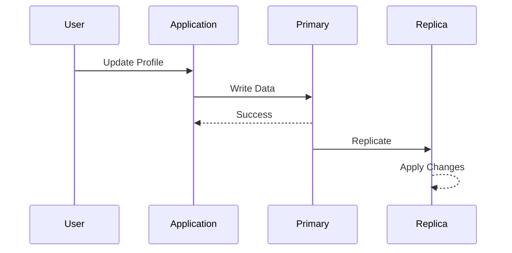
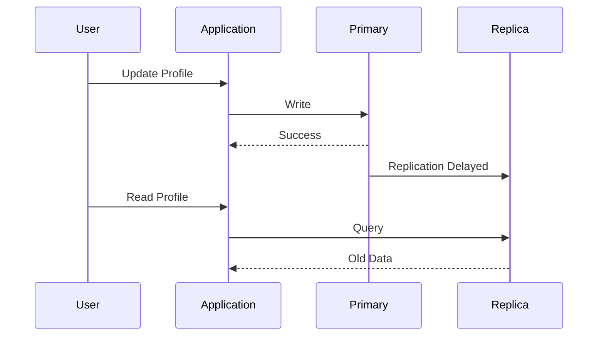
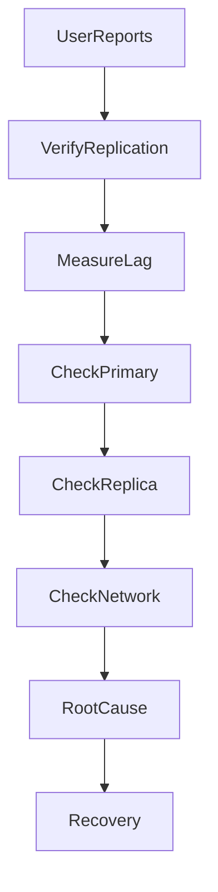
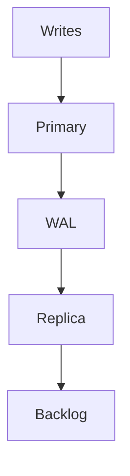
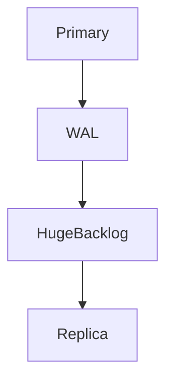
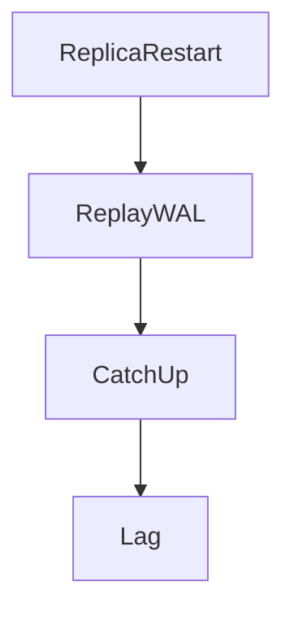
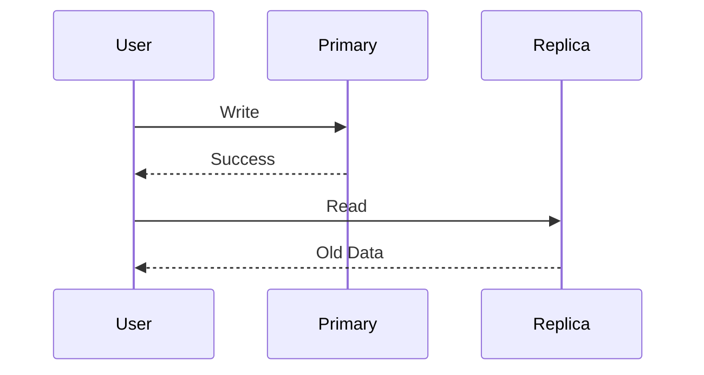
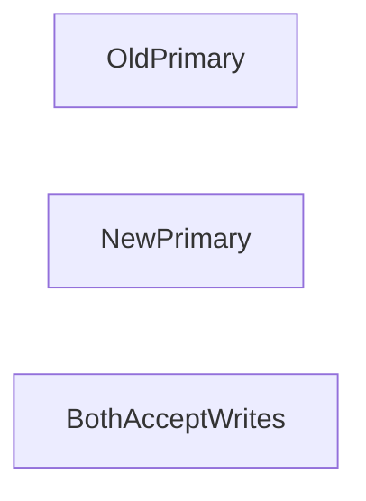

# Database Replication Lag

## Production Incident Case Study

---

# Scenario

Time: **01:47 PM**

Customer support receives strange complaints.

```text
"I updated my profile, but I still see the old data."

"I placed an order, but it doesn't appear."

"I changed my password, but login still uses the old one."
```

The engineering team investigates.

Application servers are healthy.

```text
CPU: Normal
Memory: Normal
Network: Healthy
```

Primary database is healthy.

```text
Connections: Normal
Queries/sec: Normal
Replication: Enabled
```

Yet users continue reporting inconsistent behavior.

Some users see new data.

Some users see old data.

After investigation:

```text
Database Replica Lag
```

The system is functioning.

But it is no longer consistent.

---

# Learning Objectives

After completing this case study you should understand:

* Database replication architecture
* Primary-replica topologies
* Replication lag
* WAL and Binlog internals
* Read-after-write consistency
* Failover challenges
* Split-brain scenarios
* Replication troubleshooting
* Production recovery strategies

---

# Why Replication Exists

Modern databases use replication for:

* High availability
* Read scaling
* Disaster recovery
* Backup systems

Architecture:


Applications often:

```text
Write → Primary

Read → Replicas
```

This improves scalability.

---

# The Hidden Problem

Replication is rarely instantaneous.

Data must travel from:

```text
Primary
 ↓
Network
 ↓
Replica
```

This introduces delay.

---

# Normal Request Flow



Normally lag is tiny.

Milliseconds.

---

# During Problems



User sees stale information.

---

# First Rule

Do not assume:

```text
Database Healthy
=
Replication Healthy
```

These are different systems.

---

# Investigation Workflow



---

# Understanding Replication

---

# PostgreSQL

Primary generates:

```text
WAL
Write Ahead Log
```

Replicas replay WAL.

---

# Architecture


---

# MySQL

Primary generates:

```text
Binary Logs
```

Replicas consume binlogs.

---

# Architecture


---

# Step 1: Verify Replication Status

PostgreSQL:

```sql
SELECT *
FROM pg_stat_replication;
```

---

# Example

```text
Replica Lag

15 minutes
```

Severe problem.

---

# MySQL

```sql
SHOW REPLICA STATUS\G
```

Check:

```text
Seconds_Behind_Master
```

---

# Example

```text
1200 seconds
```

20 minutes behind.

---

# Common Cause #1

## Traffic Spike

Primary receives:

```text
10x Write Volume
```

Replicas cannot keep up.

---

# Flow



Replication queue grows.

---

# Symptoms

```text
Lag Increasing

Replica Healthy

Primary Healthy
```

---

# Detection

Compare:

```text
Write Throughput

vs

Replication Throughput
```

---

# Common Cause #2

## Slow Replica

Replica resources exhausted.

Example:

```text
CPU 100%

Disk I/O Saturated
```

---

# Result

```text
WAL Applied Slowly
```

Lag grows.

---

# Investigation

```bash
top

iostat -x

vmstat
```

---

# Common Cause #3

## Network Problems

Replication depends on networking.

---

# Architecture

```mermaid
flowchart LR

Primary

X Network

--> Replica
```

---

# Symptoms

```text
Replication Delays

Connection Drops

Intermittent Lag
```

---

# Investigation

Check:

```bash
ping

traceroute

mtr
```

between databases.

---

# Common Cause #4

## Long Running Query

Replica executing:

```sql
SELECT *
FROM huge_table;
```

for hours.

---

# Result

Replication waits.

Lag accumulates.

---

# Detection

PostgreSQL:

```sql
SELECT *
FROM pg_stat_activity;
```

---

# MySQL

```sql
SHOW PROCESSLIST;
```

---

# Common Cause #5

## WAL Explosion

Primary generates WAL faster than replicas consume.

---

# Architecture



---

# Causes

```text
Bulk Imports

Mass Updates

Large Transactions
```

---

# Investigation

Monitor:

```text
WAL Generation Rate
```

---

# Common Cause #6

## Large Transaction

Example:

```sql
UPDATE users
SET active=true;
```

on:

```text
100 Million Rows
```

---

# Result

Huge replication backlog.

---

# Symptoms

```text
Lag Spikes Immediately
```

after transaction.

---

# Common Cause #7

## Replica Disk Saturation

Replication requires disk writes.

---

# Example

```text
Disk Utilization

100%
```

Replica cannot apply changes quickly.

---

# Investigation

```bash
iostat -x 1
```

---

# Common Cause #8

## Replication Slot Issues

PostgreSQL uses:

```text
Replication Slots
```

---

# Problem

Replica disconnected.

Primary continues retaining WAL.

---

# Result

```text
Disk Growth

Replication Problems
```

---

# Investigation

```sql
SELECT *
FROM pg_replication_slots;
```

---

# Common Cause #9

## Replica Restart

Replica restarts unexpectedly.

---

# Flow



---

# Symptoms

```text
Temporary Staleness
```

---

# Common Cause #10

## Backup Process Impact

Backup consumes:

```text
CPU

Memory

Disk I/O
```

Replication slows.

---

# Detection

Compare:

```text
Backup Time

vs

Lag Increase
```

---

# Common Cause #11

## Read-After-Write Failure

Classic distributed systems issue.

---

# Flow



---

# User Experience

```text
"I Just Changed It"

"But I Don't See It"
```

---

# Solutions

```text
Read From Primary

Sticky Reads

Session Consistency
```

---

# Common Cause #12

## Failover Gone Wrong

Primary fails.

Replica promoted.

Old primary returns.

---

# Architecture



---

# Result

```text
Split Brain
```

Extremely dangerous.

---

# Split Brain

Two databases accept writes independently.

---

# Consequences

```text
Data Corruption

Conflicting Updates

Lost Transactions
```

---

# Investigation

Verify:

```text
Exactly One Primary
```

at all times.

---

# Understanding Consistency

Replication creates a tradeoff.

---

# Strong Consistency

```text
Read Always Latest Data
```

Usually:

```text
Read From Primary
```

---

# Eventual Consistency

```text
Replica Eventually Catches Up
```

Most replicated systems behave this way.

---

# Useful Commands

## PostgreSQL

Replication Status:

```sql
SELECT *
FROM pg_stat_replication;
```

---

Replica Lag:

```sql
SELECT now() - pg_last_xact_replay_timestamp();
```

---

Activity:

```sql
SELECT *
FROM pg_stat_activity;
```

---

## MySQL

Replication Status:

```sql
SHOW REPLICA STATUS\G
```

---

Process List:

```sql
SHOW PROCESSLIST;
```

---

# Production Investigation Example

Timeline:

```text
13:47 User Reports

13:50 Application Healthy

13:54 Primary Healthy

13:58 Replica Lag Detected

14:02 Lag = 17 Minutes

14:07 Bulk Import Identified

14:15 Import Paused

14:28 Replicas Catching Up

14:41 Lag Eliminated

14:45 Incident Closed
```

---

# Recovery Checklist

### Verify Replication

```sql
pg_stat_replication

SHOW REPLICA STATUS
```

---

### Measure Lag

```text
Seconds

Minutes

Hours
```

---

### Check Network

```bash
ping

mtr
```

---

### Check Disk

```bash
iostat
```

---

### Check CPU

```bash
top
```

---

### Check Long Queries

```sql
pg_stat_activity

SHOW PROCESSLIST
```

---

### Validate Recovery

```text
Lag Returning To Normal
```

---

# Root Cause Analysis Example

```text
Incident:
Users Seeing Stale Data

Impact:
Order Status Delayed

Root Cause:
Bulk Data Import Generated Excessive WAL

Contributing Factors:
No Import Throttling

Detection:
Customer Reports

Resolution:
Paused Import
Allowed Replicas To Catch Up

Prevention:
Replication Monitoring
Import Rate Limits
Replica Capacity Planning
```

---

# Monitoring Recommendations

Monitor:

* Replication lag
* WAL generation rate
* Binlog growth
* Replica CPU
* Replica memory
* Replica disk I/O
* Network latency
* Replication slot status

---

# Prevention Strategies

## Lag Alerts

Alert at:

```text
30 Seconds

60 Seconds

5 Minutes

15 Minutes
```

---

## Read Routing

Critical reads:

```text
Primary
```

Non-critical reads:

```text
Replica
```

---

## Capacity Planning

Replicas must scale with primary workload.

---

## Controlled Bulk Operations

Avoid massive transactions.

---

## Failover Testing

Regularly test:

```text
Promotion

Recovery

Rollback
```

---

# What Senior Engineers Do Differently

Junior Engineer:

```text
Database Works

Problem Must Be Application
```

Senior Engineer:

```text
Primary Healthy

Replica Healthy

But Are They Consistent?

Measure Replication
Measure Lag
Find Reality
```

---

# Interview Questions

### What is replication lag?

### Why do replicas become stale?

### What is WAL in PostgreSQL?

### What are binlogs in MySQL?

### What causes read-after-write consistency problems?

### What is split brain?

### How would you investigate replica lag?

### When should reads go to primary instead of replicas?

---

# Key Takeaway

Replication improves:

```text
Availability
Scalability
Reliability
```

But introduces:

```text
Consistency Challenges
```

The most dangerous replication incidents are not outages.

They are situations where:

```text
Everything Appears Healthy

But Data Is Wrong
```

Because users rarely care whether a database is running.

They care whether the information they see is correct.

And replication lag is the gap between those two realities.
