# DDoS Attack Investigation

## Production Incident Case Study

---

# Scenario

Time: **08:43 PM**

Monitoring systems begin reporting unusual traffic patterns.

```text
WARNING

Incoming Traffic:
18 Gbps

Normal:
300 Mbps
```

A few minutes later:

```text
CRITICAL

Traffic:
85 Gbps

Requests/sec:
2.4 Million

Availability:
42%
```

Users report:

```text
Website Not Loading

API Timeout

Mobile App Errors

Checkout Unavailable
```

Engineers investigate.

Servers appear healthy.

Applications appear healthy.

Databases appear healthy.

Yet customers cannot access the platform.

After investigation:

```text
Distributed Denial of Service (DDoS) Attack
```

The infrastructure is being overwhelmed by malicious traffic.

---

# Learning Objectives

After completing this case study you should understand:

* DDoS fundamentals
* L3, L4, and L7 attacks
* Botnets
* Traffic amplification
* SYN floods
* HTTP floods
* CDN protection
* WAF protection
* DDoS mitigation strategies
* Incident response during attacks

---

# What Is A DDoS Attack?

DDoS stands for:

```text
Distributed Denial of Service
```

Goal:

```text
Make Legitimate Users
Unable To Access Services
```

---

# Simple Request Flow

Normal:

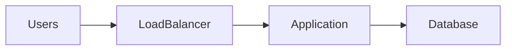

---

# During DDoS

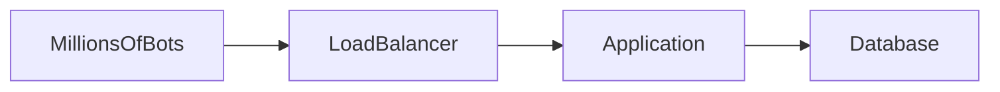

Infrastructure becomes overloaded.

---

# Why "Distributed"?

Attack traffic comes from:

```text
Thousands

Millions

Of Devices
```

across the world.

---

# Architecture

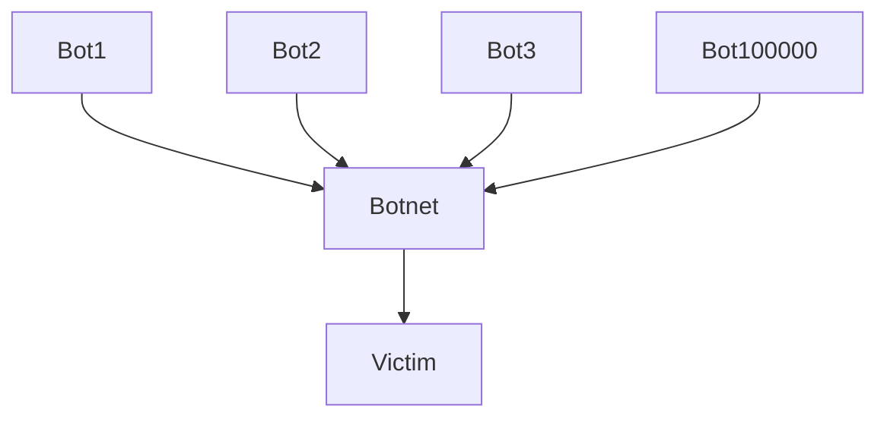

Blocking one IP does nothing.

---

# First Rule

Do not immediately scale servers.

Many engineers think:

```text
More Traffic

Add More Servers
```

This often fails.

Attackers can usually generate traffic faster than you can add servers.

---

# Initial Symptoms

Monitoring shows:

```text
Massive Traffic Spike
```

Metrics:

```text
CPU Rising

Network Saturated

Connection Count Exploding
```

---

# Investigation Workflow

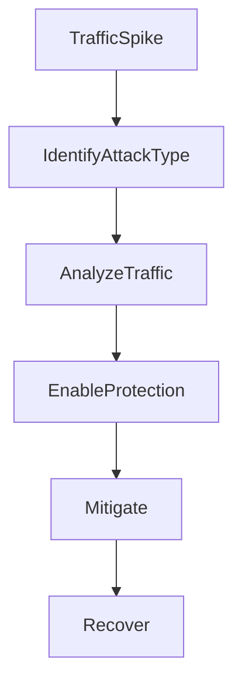

---

# Understanding DDoS Layers

---

# Layer 3 (Network Layer)

Targets:

```text
IP

Routing

Bandwidth
```

---

# Examples

```text
ICMP Flood

IP Flood

Amplification Attack
```

---

# Layer 4 (Transport Layer)

Targets:

```text
TCP

UDP
```

---

# Examples

```text
SYN Flood

UDP Flood
```

---

# Layer 7 (Application Layer)

Targets:

```text
HTTP

HTTPS

APIs
```

---

# Examples

```text
HTTP Flood

Search Flood

Login Flood
```

---

# Most Dangerous Type

Layer 7 attacks.

Because:

```text
Traffic Appears Legitimate
```

---

# Common Cause #1

## SYN Flood

TCP handshake:

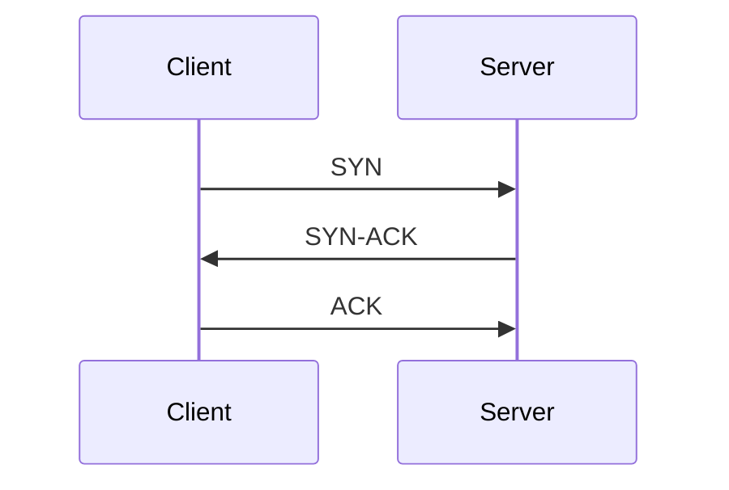

Connection established.

---

# Attack

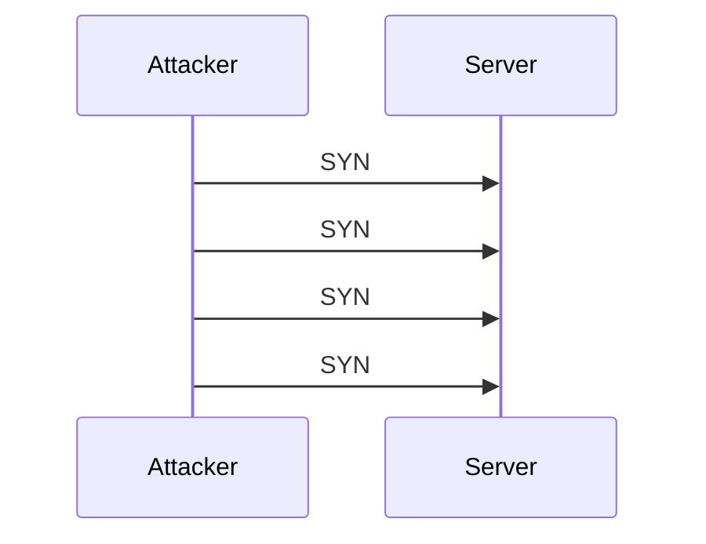

Never completes handshake.

---

# Result

Server resources consumed.

---

# Symptoms

```text
Many Half-Open Connections
```

---

# Investigation

```bash
ss -ant
```

Look for:

```text
SYN_RECV
```

large numbers.

---

# Common Cause #2

## UDP Flood

Massive UDP traffic.

---

# Architecture

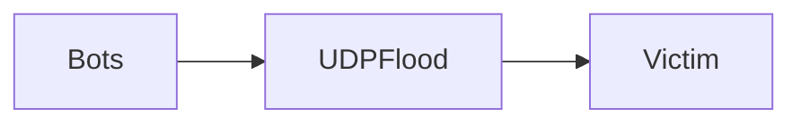

---

# Symptoms

```text
Bandwidth Saturation
```

Network links overwhelmed.

---

# Investigation

```bash
iftop

nload

sar -n DEV
```

---

# Common Cause #3

## HTTP Flood

Bots send legitimate HTTP requests.

---

# Architecture

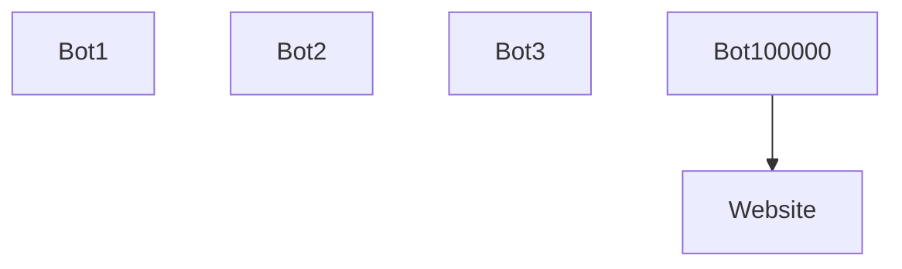

---

# Problem

Requests look normal.

---

# Symptoms

```text
High Requests/sec

Normal Bandwidth

High CPU
```

---

# Detection

Analyze:

```text
User Agents

IP Distribution

Request Patterns
```

---

# Common Cause #4

## Login Flood

Attackers target:

```text
/login
```

endpoint.

---

# Result

```text
Authentication Database Overloaded
```

---

# Symptoms

```text
Failed Logins Spike
```

---

# Investigation

Review:

```text
Authentication Logs
```

---

# Common Cause #5

## Search Flood

Search endpoints are expensive.

Example:

```text
/search?q=*
```

Millions of requests.

---

# Result

```text
Database Saturation
```

---

# Common Cause #6

## API Abuse

Public API targeted.

---

# Architecture

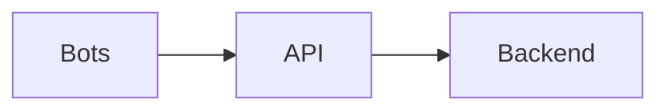

---

# Symptoms

```text
API Requests/sec Explodes
```

---

# Common Cause #7

## DNS Amplification

Attacker sends small requests.

Victim receives huge responses.

---

# Flow

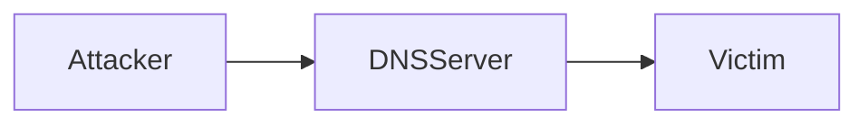

Amplification factor:

```text
50x

100x

500x
```

possible.

---

# Common Cause #8

## NTP Amplification

Similar concept.

Uses NTP servers.

---

# Result

```text
Massive Traffic Generation
```

from small requests.

---

# Common Cause #9

## CDN Bypass

Normally:

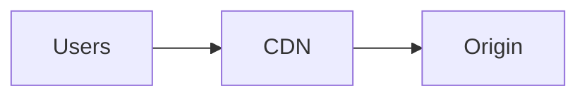

---

# Problem

Attacker discovers:

```text
Origin IP
```

and attacks directly.

---

# Result

CDN protection bypassed.

---

# Investigation

Verify:

```text
Origin Not Publicly Accessible
```

---

# Common Cause #10

## WAF Misconfiguration

WAF exists.

Rules ineffective.

---

# Example

```text
Rate Limits Disabled

Bot Protection Disabled
```

---

# Result

Attack traffic passes through.

---

# Common Cause #11

## Cache Bypass Attack

Normally:

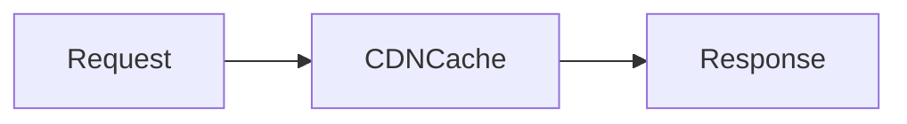

---

# Attacker

Forces cache misses.

---

# Result

Every request reaches origin.

Infrastructure overloaded.

---

# Common Cause #12

## Multi-Vector Attack

Modern attacks combine:

```text
SYN Flood

UDP Flood

HTTP Flood

API Abuse
```

simultaneously.

---

# Understanding Botnets

A botnet is:

```text
Large Collection Of Compromised Devices
```

---

# Examples

```text
IoT Devices

Routers

Servers

Computers
```

---

# Architecture

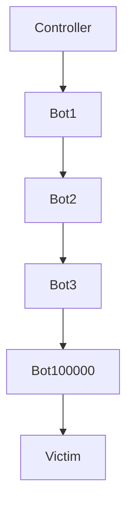

---

# Useful Investigation Commands

Top Connections:

```bash
ss -s
```

---

# Active Connections

```bash
netstat -an | wc -l
```

---

# Top IPs

```bash
awk '{print $1}' access.log \
| sort \
| uniq -c \
| sort -nr
```

---

# Network Usage

```bash
iftop
```

---

# Traffic Statistics

```bash
sar -n DEV 1
```

---

# CDN Protection

Modern DDoS defense begins with:

```text
Cloudflare

Cloud CDN

Fastly

Akamai
```

---

# Architecture


Attack absorbed at edge.

---

# WAF Protection

WAF filters:

```text
Bots

Malicious Requests

Known Attack Patterns
```

before applications see them.

---

# Rate Limiting

Emergency controls:

```text
100 Requests/Minute

1000 Requests/Hour
```

per client.

---

# Blackholing

Extreme measure.

Traffic discarded.

---

# Tradeoff

```text
Availability Reduced

Infrastructure Survives
```

---

# Production Investigation Example

Timeline:

```text
20:43 Traffic Spike

20:46 Availability Impact

20:49 Attack Confirmed

20:52 CDN Protection Enabled

20:56 Rate Limits Applied

21:04 WAF Rules Added

21:18 Traffic Stabilized

21:26 Service Fully Restored
```

---

# Recovery Checklist

### Identify Attack Type

```text
L3

L4

L7
```

---

### Analyze Traffic

```text
IPs

Countries

User Agents

Endpoints
```

---

### Enable CDN Protection

```text
DDoS Mitigation Mode
```

---

### Enable WAF

```text
Bot Protection

Threat Rules
```

---

### Apply Rate Limits

```text
Per IP

Per User

Per API Key
```

---

### Protect Origin

```text
Restrict Direct Access
```

---

### Monitor Recovery

```text
Traffic

Latency

Availability
```

---

# Root Cause Analysis Example

```text
Incident:
Platform Availability Loss

Impact:
65% User Requests Failed

Root Cause:
Layer 7 HTTP Flood

Contributing Factors:
Missing Rate Limiting
Origin Exposure

Detection:
Traffic Spike Monitoring

Resolution:
CDN Mitigation
WAF Rules
Rate Limits

Prevention:
Origin Protection
Bot Detection
Traffic Analytics
```

---

# Monitoring Recommendations

Monitor:

* Requests/sec
* Bandwidth
* Active connections
* SYN rate
* HTTP error rate
* Top IPs
* Top user agents
* WAF events

---

# Prevention Strategies

## CDN First

Never expose origin directly.

---

## WAF Protection

Enable managed rules.

---

## Rate Limiting

Protect critical endpoints.

---

## Traffic Analytics

Understand normal traffic patterns.

---

## Origin Isolation

Only CDN should reach origin.

---

## DDoS Drills

Practice response procedures.

---

# What Senior Engineers Do Differently

Junior Engineer:

```text
Traffic High

Scale Servers
```

Senior Engineer:

```text
Traffic High

Who Is Sending It?

Legitimate?

Bot?

Attack?

Mitigate Before Scaling
```

---

# Interview Questions

### What is a DDoS attack?

### What is the difference between L3, L4, and L7 attacks?

### What is a SYN flood?

### How does DNS amplification work?

### Why are Layer 7 attacks difficult to detect?

### What role does a CDN play in DDoS mitigation?

### How would you investigate a sudden traffic spike?

### Why can scaling infrastructure fail to stop a DDoS attack?

---

# Key Takeaway

DDoS attacks are not software failures.

They are resource exhaustion attacks.

The attacker wins by making:

```text
CPU

Memory

Network

Connections
```

unavailable to legitimate users.

The best production engineers understand that availability is not just about building systems.

It is about defending them.

Because in internet-scale systems:

```text
Being Reachable

And

Being Resilient

Are Two Different Things
```
