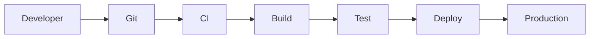
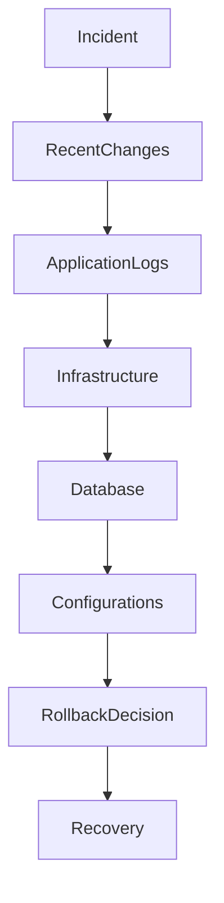
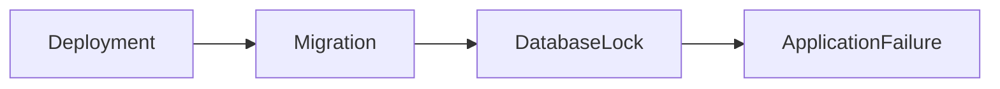
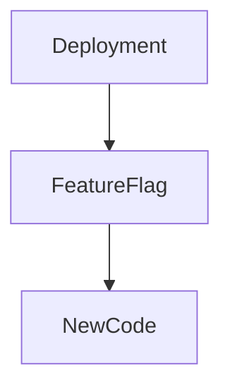
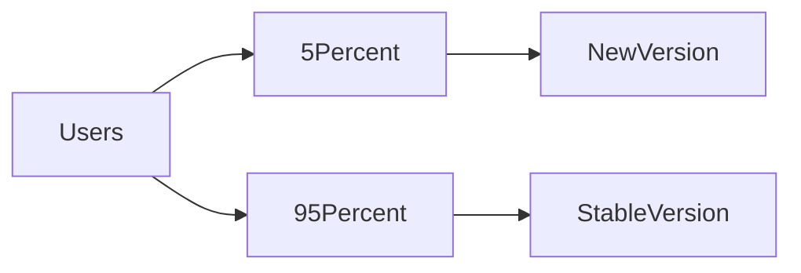
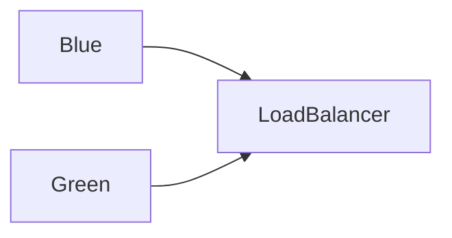
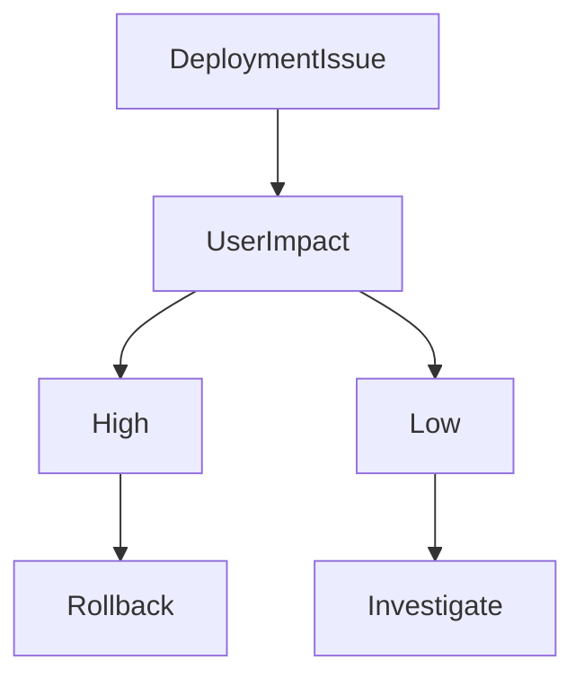
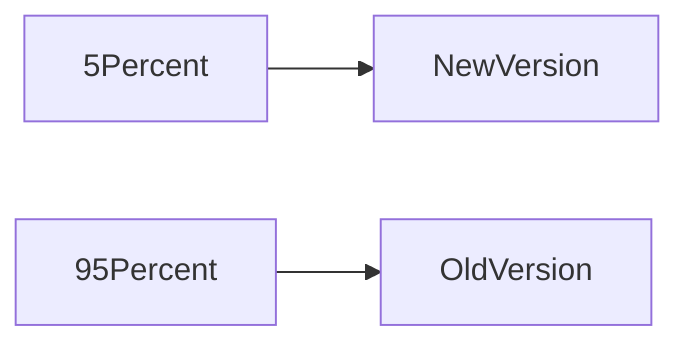
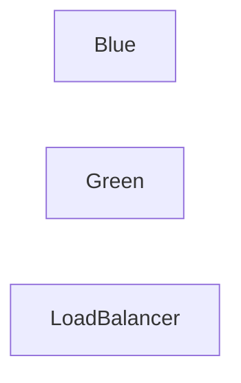
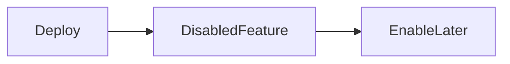

# Deployment Gone Wrong

## Production Incident Case Study

---

# Scenario

Time: **04:00 PM**

The engineering team deploys a new release.

```text id="dpl001"
Version: v2.8.0

Deployment Status:
SUCCESS
```

CI/CD pipeline reports:

```text id="dpl002"
Build: Passed
Tests: Passed
Deployment: Completed
```

Everything looks healthy.

Five minutes later:

```text id="dpl003"
API Error Rate: 2% → 35%
```

Ten minutes later:

```text id="dpl004"
Checkout Failures
Login Issues
500 Errors
```

Fifteen minutes later:

```text id="dpl005"
Revenue Impact Detected
```

Management joins the incident bridge.

Customer support tickets begin increasing.

Production is degrading rapidly.

The deployment succeeded.

The release failed.

---

# Learning Objectives

After completing this case study you should understand:

* Deployment architecture
* Release failures
* Rollback strategies
* Canary deployments
* Blue-green deployments
* Feature flags
* Database migration failures
* Configuration drift
* Production debugging during releases
* Incident response during deployments

---

# The Most Dangerous Production Event

Most major outages happen shortly after:

```text id="dpl006"
A Change
```

Examples:

```text id="dpl007"
Deployment
Configuration Change
Infrastructure Change
Migration
Certificate Update
```

Production systems rarely fail randomly.

They fail after something changes.

---

# Golden Rule

When investigating:

```text id="dpl008"
What Changed?
```

This is often the fastest path to the root cause.

---

# Typical Deployment Flow



Many failures occur after all tests pass.

---

# Why?

Because:

```text id="dpl010"
Production Is Different
```

Production contains:

* Real traffic
* Real data
* Real scale
* Real users

---

# First Investigation

Ask:

```text id="dpl011"
When Did The Problem Start?
```

Compare with:

```text id="dpl012"
Deployment Time
```

---

# Example Timeline

```text id="dpl013"
16:00 Deploy

16:03 Errors Begin

16:05 Latency Increases

16:07 Customers Report Issues
```

Strong correlation.

---

# Investigation Workflow



---

# Step 1: Identify Recent Changes

Check:

```bash id="dpl015"
git log
```

Review:

```text id="dpl016"
Commits

Pull Requests

Deployments
```

Determine:

```text id="dpl017"
Exactly What Changed
```

---

# Step 2: Compare Metrics

Compare:

```text id="dpl018"
Before Deployment
```

vs

```text id="dpl019"
After Deployment
```

Metrics:

```text id="dpl020"
Latency

Errors

CPU

Memory

Database Load
```

---

# Example

```text id="dpl021"
Before:
120ms

After:
4200ms
```

Deployment likely introduced the issue.

---

# Common Cause #1

## Application Bug

Most common deployment failure.

---

# Example

Developer introduces:

```javascript id="dpl022"
const user = null;

console.log(user.name);
```

Production receives traffic.

Application crashes.

---

# Symptoms

```text id="dpl023"
500 Errors

Unhandled Exceptions

Crash Loops
```

---

# Investigation

Check logs.

```bash id="dpl024"
journalctl -u app
```

or

```bash id="dpl025"
kubectl logs POD
```

---

# Common Cause #2

## Database Migration Disaster

Application deployed successfully.

Migration executed successfully.

Users affected immediately.

---

# Example

Migration:

```sql id="dpl026"
ALTER TABLE orders
ADD COLUMN status TEXT;
```

Table contains:

```text id="dpl027"
500 Million Rows
```

Database locks.

Application stalls.

---

# Architecture



---

# Symptoms

```text id="dpl029"
Slow Queries

Timeouts

Connection Pool Exhaustion
```

---

# Investigation

Check:

```sql id="dpl030"
SELECT *
FROM pg_stat_activity;
```

---

# Common Cause #3

## Missing Environment Variable

Application starts.

Configuration missing.

---

# Example

```text id="dpl031"
PAYMENT_API_KEY
```

missing.

---

# Startup Log

```text id="dpl032"
Environment Variable Missing
```

---

# Result

```text id="dpl033"
Application Failure
```

---

# Investigation

Check:

```bash id="dpl034"
env
```

or deployment manifests.

---

# Common Cause #4

## Wrong Configuration

Code correct.

Configuration wrong.

---

# Example

```text id="dpl035"
Production Database
```

changed to:

```text id="dpl036"
Staging Database
```

---

# Symptoms

```text id="dpl037"
Missing Data

Authentication Failures

Unexpected Records
```

---

# Common Cause #5

## Dependency Version Conflict

New deployment upgrades:

```text id="dpl038"
Library
Framework
Runtime
```

Unexpected incompatibility appears.

---

# Example

```text id="dpl039"
Node.js 20

Application Requires 18
```

---

# Symptoms

```text id="dpl040"
Startup Failure

Runtime Errors
```

---

# Common Cause #6

## Feature Flag Failure

Feature flags reduce risk.

But can also create incidents.

---

# Architecture



---

# Example

Flag enabled globally.

Unexpected bug impacts all users.

---

# Investigation

Check:

```text id="dpl042"
Recent Flag Changes
```

---

# Common Cause #7

## Cache Incompatibility

New application version expects:

```text id="dpl043"
New Cache Format
```

Old cache contains:

```text id="dpl044"
Old Data
```

---

# Result

```text id="dpl045"
Serialization Errors

Application Crashes
```

---

# Common Cause #8

## Memory Leak Introduced

Deployment appears healthy.

Memory gradually increases.

---

# Timeline

```text id="dpl046"
16:00 Deploy

16:20 Memory Rising

16:50 OOM Kill

17:00 Service Outage
```

---

# Investigation

Compare:

```text id="dpl047"
Memory Usage

Before Deployment

After Deployment
```

---

# Common Cause #9

## Kubernetes Misconfiguration

Deployment succeeds.

Pods fail.

---

# Example

```yaml id="dpl048"
resources:
  limits:
    memory: 128Mi
```

Application requires:

```text id="dpl049"
512Mi
```

---

# Result

```text id="dpl050"
OOMKilled
```

---

# Investigation

```bash id="dpl051"
kubectl describe pod
```

---

# Common Cause #10

## Canary Failure Ignored

Canary deployment exists.

Alerts ignored.

---

# Architecture



---

# Problem

Canary shows:

```text id="dpl053"
Higher Error Rate
```

Yet rollout continues.

Entire platform affected.

---

# Lesson

Canaries only work if engineers respond to signals.

---

# Common Cause #11

## Blue-Green Switch Failure

Architecture:



Traffic switches.

Green environment broken.

Outage begins instantly.

---

# Investigation

Verify:

```text id="dpl055"
Blue Environment

Green Environment
```

before cutover.

---

# Common Cause #12

## Hidden Production Data Problem

Testing uses:

```text id="dpl056"
100 Records
```

Production contains:

```text id="dpl057"
100 Million Records
```

---

# Example

Query:

```sql id="dpl058"
SELECT *
FROM orders
```

works in testing.

Destroys production performance.

---

# Understanding Rollbacks

The fastest recovery is often:

```text id="dpl059"
Rollback
```

not debugging.

---

# Rollback Decision Tree



---

# When To Roll Back

Roll back if:

```text id="dpl061"
Revenue Impact

Customer Impact

Data Integrity Risk

Security Risk
```

exists.

---

# Kubernetes Rollback

```bash id="dpl062"
kubectl rollout undo deployment
```

---

# Deployment Safety Techniques

---

# Canary Deployment

Small percentage first.



---

# Blue-Green Deployment

Two environments.



Switch traffic safely.

---

# Feature Flags

Deploy code.

Enable gradually.

---

# Architecture



---

# Production Investigation Example

Timeline:

```text id="dpl066"
16:00 Deployment Completed

16:04 Error Rate Increased

16:07 User Complaints Started

16:10 Deployment Correlated

16:12 Logs Reviewed

16:15 Migration Identified

16:18 Rollback Initiated

16:22 Service Restored
```

---

# Recovery Checklist

### Identify Changes

```text id="dpl067"
Code

Config

Infrastructure

Database
```

---

### Review Logs

```bash id="dpl068"
kubectl logs

journalctl
```

---

### Compare Metrics

```text id="dpl069"
Before

After
```

---

### Check Dependencies

```text id="dpl070"
Database

Redis

External APIs
```

---

### Evaluate Rollback

```text id="dpl071"
Impact

Risk

Recovery Time
```

---

### Validate Recovery

```text id="dpl072"
Errors Normal

Latency Normal

Users Healthy
```

---

# Root Cause Analysis Example

```text id="dpl073"
Incident:
Checkout Failures

Impact:
35% Orders Failed

Root Cause:
Database Migration Locked Orders Table

Contributing Factors:
Migration Not Tested At Scale

Detection:
Error Rate Alert

Resolution:
Rollback Deployment

Prevention:
Migration Testing
Canary Deployments
Deployment Reviews
```

---

# Monitoring Recommendations

Monitor:

* Error rates
* Deployment events
* Rollback frequency
* Latency
* Resource usage
* Business metrics
* Database performance
* Application exceptions

---

# Prevention Strategies

## Small Deployments

Avoid massive changes.

---

## Canary Releases

Expose few users first.

---

## Feature Flags

Separate deployment from release.

---

## Automated Rollbacks

Trigger rollback automatically when:

```text id="dpl074"
Error Rate High
Latency High
Availability Low
```

---

## Deployment Reviews

Review:

```text id="dpl075"
Code

Config

Migrations

Dependencies
```

before production.

---

# What Senior Engineers Do Differently

Junior Engineer:

```text id="dpl076"
Deployment Failed

Fix Forward
```

Senior Engineer:

```text id="dpl077"
Protect Users First

Rollback

Restore Service

Investigate Later
```

Availability comes before ego.

---

# Interview Questions

### Why do most outages occur after changes?

### When should you roll back instead of debugging?

### What is a canary deployment?

### What is blue-green deployment?

### Why are database migrations risky?

### What are feature flags?

### How would you investigate a deployment-related outage?

### What metrics should determine rollback decisions?

---

# Key Takeaway

Successful deployments are not measured by:

```text id="dpl078"
Deployment Completed
```

They are measured by:

```text id="dpl079"
Users Unaffected
```

The best production engineers understand that deployment is not the goal.

Reliability is the goal.

Every deployment introduces risk.

The art of engineering is reducing that risk through:

```text id="dpl080"
Canaries

Rollbacks

Feature Flags

Monitoring

Discipline
```

Because the safest deployment is not the one that succeeds.

It is the one that can fail safely.
