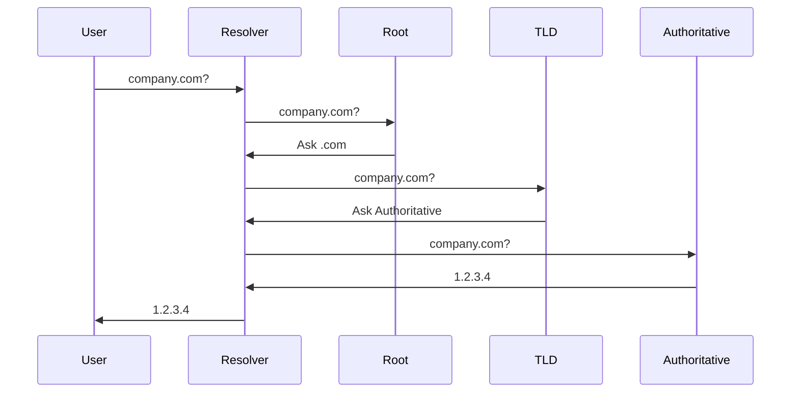
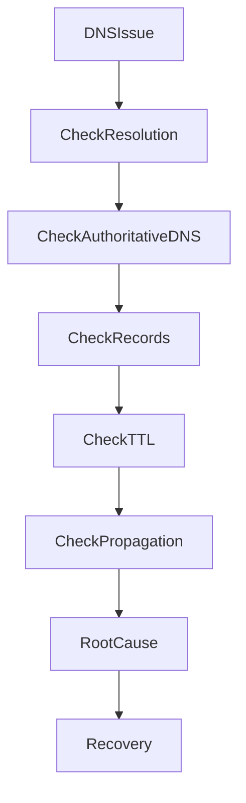
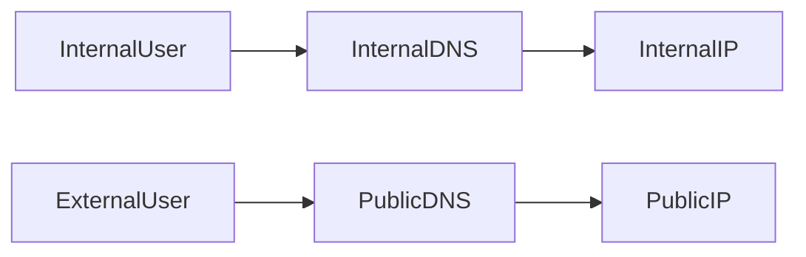

# DNS Outage

## Production Incident Case Study

---

# Scenario

Time: **08:17 AM**

The support team starts receiving complaints.

```text
Users cannot access the website.
```

Monitoring shows:

```text
Website: DOWN
API: DOWN
Mobile App: FAILING
```

However, your infrastructure dashboards show:

```text
Servers: Healthy
CPU: Normal
Memory: Normal
Database: Healthy
Load Balancer: Healthy
```

Everything appears operational.

Yet users cannot reach the application.

After investigation, engineers discover:

```text
DNS Failure
```

A single DNS issue has made an entire platform disappear from the internet.

---

# Learning Objectives

After completing this case study, you should understand:

* How DNS works internally
* DNS request flow
* Common DNS failures
* DNS troubleshooting methodology
* Recursive resolvers
* Authoritative servers
* TTL behavior
* DNS propagation
* Split-horizon DNS
* DNS caching issues
* Production recovery procedures

---

# Why DNS Is Critical

Most users never connect directly to servers.

Instead:

```text
www.company.com
      ↓
DNS Lookup
      ↓
IP Address
      ↓
Server
```

Without DNS:

```text
User → Domain Name → FAIL
```

Even healthy servers become unreachable.

---

# The Internet Dependency Chain

```mermaid
flowchart LR

User

--> Browser

--> DNS Resolver

--> Authoritative DNS

--> IP Address

--> Load Balancer

--> Web Server

--> Application

--> Database
```

DNS sits near the beginning of every request.

Failure here affects everything downstream.

---

# First Rule

Never assume the application is down.

Verify whether:

```text
Application Failure
or
DNS Failure
```

---

# Initial Symptoms

Users report:

```text
Website unavailable
API unavailable
Mobile app cannot connect
```

Browser error:

```text
DNS_PROBE_FINISHED_NXDOMAIN
```

or

```text
Server IP address could not be found
```

These are strong DNS indicators.

---

# Step 1: Verify DNS Resolution

Check:

```bash
nslookup company.com
```

Example:

```text
server can't find company.com
NXDOMAIN
```

Interesting.

Now try:

```bash
dig company.com
```

---

# Understanding NXDOMAIN

```text
NXDOMAIN
=
Non-Existent Domain
```

Meaning:

```text
Resolver Asked DNS
DNS Says Domain Doesn't Exist
```

This is different from a server outage.

---

# Compare With Direct IP Access

Attempt:

```bash
curl http://SERVER_IP
```

Example:

```text
200 OK
```

Important observation:

```text
Server Healthy
DNS Broken
```

Root cause likely exists in the name-resolution layer.

---

# DNS Resolution Process

Understanding this flow is essential.



Failure can happen at any step.

---

# DNS Investigation Workflow



---

# Step 2: Identify Record Type

DNS stores many record types.

---

## A Record

Maps:

```text
domain → IPv4
```

Example:

```text
company.com → 192.168.1.10
```

---

## AAAA Record

Maps:

```text
domain → IPv6
```

---

## CNAME

Alias.

```text
www.company.com
      ↓
company.com
```

---

## MX

Mail routing.

---

## TXT

Verification and metadata.

---

# Common Cause #1

## Deleted DNS Record

Engineer accidentally removes:

```text
A Record
```

Result:

```text
Domain Exists
No IP Address
```

Users cannot connect.

---

# Detecting Missing Records

Check:

```bash
dig company.com
```

Output:

```text
ANSWER SECTION:
(empty)
```

No valid records returned.

---

# Common Cause #2

## Incorrect IP Address

DNS resolves correctly.

But points to:

```text
10.0.0.5
```

instead of:

```text
203.0.113.10
```

Result:

```text
DNS Works
Application Unreachable
```

---

# Example

```mermaid
flowchart LR

User

--> DNS

--> WrongIP

X CorrectServer
```

---

# Verification

Check:

```bash
dig company.com
```

Compare returned IP against:

```bash
ip addr
```

or cloud load balancer configuration.

---

# Common Cause #3

## Expired Domain

Rare but devastating.

Domain registration expires.

Example:

```text
company.com
Expired Yesterday
```

Result:

```text
Domain Suspended
```

Entire business disappears from the internet.

---

# Verification

Check registration status.

Review domain registrar dashboard.

Confirm expiration date.

---

# Common Cause #4

## Authoritative DNS Failure

Architecture:


If authoritative servers fail:

```text
No Answers Returned
```

---

# Verification

Query authoritative server directly.

```bash
dig company.com @ns1.provider.com
```

Example:

```text
connection timed out
```

Root cause identified.

---

# Common Cause #5

## DNS Provider Outage

Many organizations rely on third-party DNS providers.

If provider infrastructure fails:

```text
Millions of domains affected
```

Historical outages have impacted large portions of the internet.

---

# Symptoms

```text
Multiple domains fail simultaneously
```

Infrastructure remains healthy.

Only DNS is unavailable.

---

# Common Cause #6

## TTL and Caching Problems

DNS is heavily cached.

Resolvers store answers.

```text
Answer Cached
       ↓
TTL Countdown
       ↓
Refresh
```

---

# Understanding TTL

```text
TTL = Time To Live
```

Example:

```text
TTL = 86400
```

Means:

```text
24 Hours Cache
```

---

# Incident Example

Engineer changes:

```text
Old IP → New IP
```

DNS updated successfully.

However:

```text
Users Still Reach Old Server
```

Why?

Resolver cache.

---

# TTL Visualization


Until TTL expires:

```text
Old Answer Continues
```

---

# Verification

Check:

```bash
dig company.com
```

Observe:

```text
TTL Remaining
```

---

# Common Cause #7

## Split-Horizon DNS

Internal and external users receive different answers.

---

# Architecture



---

# Problem

Internal DNS accidentally updated.

External DNS remains correct.

Result:

```text
Internal Users Fail
External Users Work
```

or vice versa.

---

# Verification

Query both DNS sources.

```bash
dig company.com @internal-dns
```

```bash
dig company.com @public-dns
```

Compare answers.

---

# Common Cause #8

## Broken CNAME Chain

Example:

```text
www.company.com
   ↓
app.company.com
   ↓
lb.company.net
   ↓
BROKEN
```

One broken link breaks resolution.

---

# Verification

```bash
dig www.company.com
```

Trace chain manually.

---

# Common Cause #9

## Load Balancer DNS Misconfiguration

Cloud load balancer replaced.

DNS still points to old endpoint.

Result:

```text
Traffic Routed Incorrectly
```

---

# Investigation

Verify:

```text
DNS Record
```

matches:

```text
Current Load Balancer
```

---

# Useful DNS Commands

---

## dig

```bash
dig company.com
```

---

## Detailed Query

```bash
dig company.com ANY
```

---

## Query Specific Resolver

```bash
dig company.com @8.8.8.8
```

---

## Trace Entire Resolution Path

```bash
dig +trace company.com
```

One of the most useful DNS troubleshooting tools.

---

## nslookup

```bash
nslookup company.com
```

Simple verification.

---

## host

```bash
host company.com
```

Quick lookup.

---

# Production Investigation Example

Alert:

```text
Website Unavailable
```

Investigation:

```text
08:17 Alert Triggered

08:19 Server Verified Healthy

08:21 Load Balancer Healthy

08:23 DNS Resolution Failed

08:25 Missing A Record Found

08:28 DNS Record Restored

08:35 Resolver Caches Refreshing

08:42 Service Restored
```

---

# Root Cause Analysis Example

```text
Incident:
Public Website Outage

Impact:
100% Users Affected

Root Cause:
Primary A record accidentally deleted

Contributing Factors:
No DNS change review process

Detection:
User reports and monitoring alerts

Resolution:
Record restored

Prevention:
DNS change approval workflow
DNS configuration backups
Automated DNS monitoring
```

---

# Monitoring Recommendations

Monitor:

* DNS resolution success
* Authoritative server health
* Record changes
* Domain expiration
* DNS provider status
* TTL configuration

---

# Preventive Engineering

---

## DNS Backups

Maintain:

```text
Zone Exports
Configuration Backups
Version Control
```

---

## Domain Expiration Monitoring

Alert:

```text
90 Days Before Expiration
60 Days
30 Days
7 Days
```

---

## Change Reviews

Never allow:

```text
Direct Production DNS Changes
```

Without validation.

---

## Multiple Authoritative Servers

Avoid:

```text
Single Point of Failure
```

Use redundant DNS infrastructure.

---

# Senior Engineer Mindset

Junior Engineer:

```text
Website Down
Restart Application
```

Senior Engineer:

```text
Verify DNS
Verify Network
Verify Load Balancer
Verify Application
Find Failing Layer
```

The application may be healthy while DNS is failing.

---

# Interview Questions

### What is the difference between recursive and authoritative DNS servers?

### What does NXDOMAIN mean?

### How does TTL affect DNS changes?

### What is split-horizon DNS?

### Why can a website remain unavailable after a DNS fix?

### How would you troubleshoot intermittent DNS failures?

### What does dig +trace do?

### How can a DNS outage affect healthy infrastructure?

---

# Key Takeaway

A DNS outage is one of the most deceptive production incidents.

Everything behind DNS may be healthy:

* Servers
* Databases
* Applications
* Load Balancers

Yet users cannot reach any of it.

Great engineers understand that troubleshooting starts at the beginning of the request path, not at the application itself.

When users say:

```text
The website is down
```

Always ask:

```text
Can they even find the server?
```

Because sometimes the problem is not the server.

Sometimes the internet has simply forgotten where it is.
