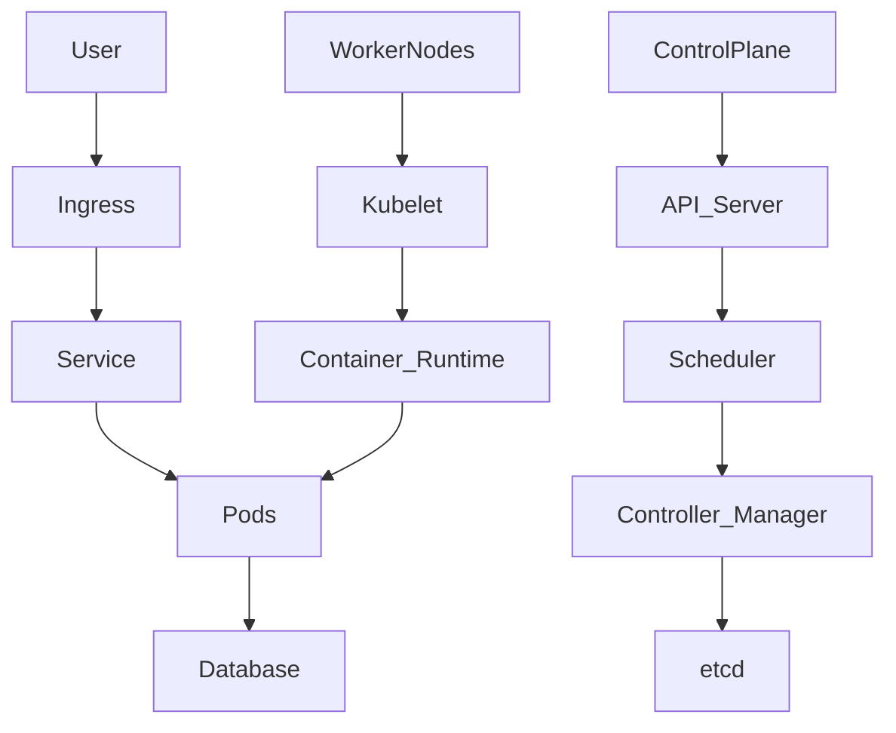
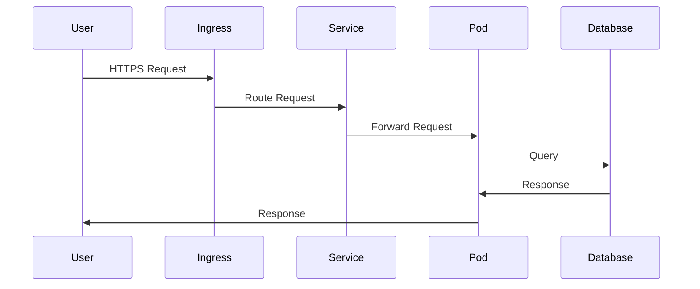
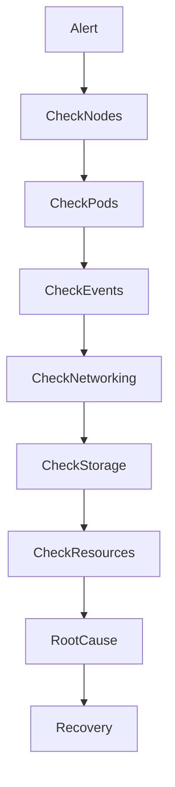
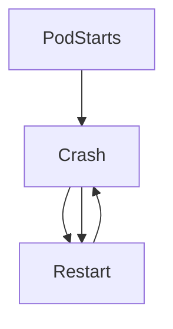
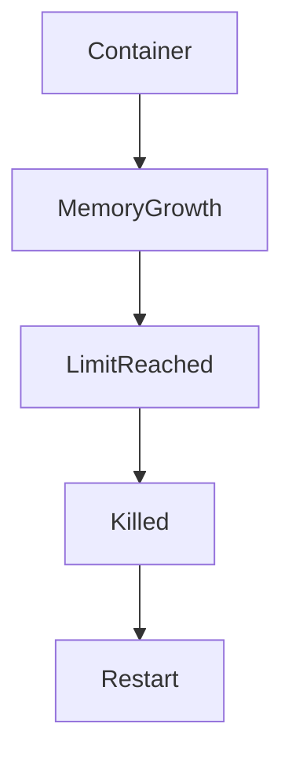
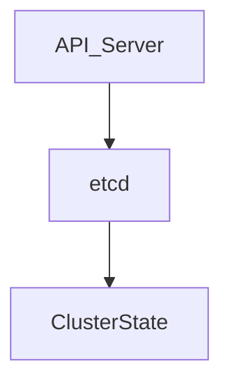

# Kubernetes Cluster Outage

## Production Incident Case Study

---

# Scenario

Time: **03:17 AM**

Pager alerts start firing.

```text
CRITICAL ALERT

Production Cluster: DEGRADED

Healthy Pods: 12/87

API Error Rate: 78%
```

Within minutes:

```text
Customer Reports:

- Login failures
- Checkout failures
- API timeouts
- Mobile app errors
```

The on-call engineer opens the dashboard.

```text
Nodes: Online
Network: Appears Healthy
Database: Healthy
```

Yet services are failing.

Some pods are restarting.

Some are pending.

Some have disappeared entirely.

The incident becomes:

```text
Kubernetes Cluster Outage
```

One of the most complex production incidents because failures can occur at many layers simultaneously.

---

# Learning Objectives

After completing this case study, you should understand:

* Kubernetes architecture
* Control plane failures
* Node failures
* Pod failures
* Scheduling issues
* Network failures
* Storage failures
* Resource exhaustion
* CrashLoopBackOff analysis
* Production troubleshooting methodology

---

# Understanding Kubernetes Architecture

Before troubleshooting, understand the system.



A failure in any component can impact production.

---

# Request Path

A user request follows:



Failures can happen at every stage.

---

# First Rule

Do not immediately restart everything.

Many engineers panic and run:

```bash
kubectl rollout restart deployment
```

This can make incidents worse.

Gather evidence first.

---

# Initial Investigation

Check cluster status.

```bash
kubectl get nodes
```

Example:

```text
NAME      STATUS
node-01   Ready
node-02   Ready
node-03   NotReady
```

One node already shows a problem.

---

# Investigation Workflow



---

# Step 1: Check Nodes

Nodes are the foundation.

```bash
kubectl get nodes
```

Possible output:

```text
node-01 Ready
node-02 Ready
node-03 NotReady
```

Investigate:

```bash
kubectl describe node node-03
```

---

# Node States

| State              | Meaning           |
| ------------------ | ----------------- |
| Ready              | Healthy           |
| NotReady           | Problems detected |
| Unknown            | Node unreachable  |
| SchedulingDisabled | Drained node      |

---

# Common Cause #1

## Node Failure

Worker node crashes.

Possible causes:

```text
Hardware Failure
Kernel Panic
Network Failure
Cloud VM Failure
Disk Failure
```

---

# Architecture

```mermaid
flowchart LR

Node

X Pods

X Services
```

Pods become unavailable.

---

# Investigation

Check:

```bash
kubectl describe node
```

Then inspect:

```bash
journalctl -u kubelet
```

on the node.

---

# Common Cause #2

## Pod CrashLoopBackOff

Very common production incident.

Check:

```bash
kubectl get pods
```

Example:

```text
payment-api

CrashLoopBackOff
```

---

# What It Means



Kubernetes repeatedly restarts the container.

---

# Investigation

```bash
kubectl logs POD_NAME
```

and:

```bash
kubectl describe pod POD_NAME
```

Look for:

```text
Exceptions
OOMKilled
Config Errors
Dependency Failures
```

---

# Common Cause #3

## OOMKilled

Containers have memory limits.

Example:

```yaml
resources:
  limits:
    memory: 512Mi
```

Application consumes:

```text
800Mi
```

Result:

```text
OOMKilled
```

---

# Detection

```bash
kubectl describe pod
```

Example:

```text
Last State:
Terminated

Reason:
OOMKilled
```

---

# OOM Architecture



---

# Common Cause #4

## Image Pull Failure

Deployment occurs.

Pods remain pending.

Check:

```bash
kubectl get pods
```

Example:

```text
ImagePullBackOff
```

---

# Investigation

```bash
kubectl describe pod
```

Example:

```text
Failed to pull image
```

Possible causes:

* Wrong image name
* Wrong tag
* Registry outage
* Authentication failure

---

# Common Cause #5

## Scheduler Failure

Pods remain:

```text
Pending
```

---

# Investigation

```bash
kubectl describe pod
```

Example:

```text
0/5 nodes available
```

Possible reasons:

```text
Insufficient CPU
Insufficient Memory
Node Affinity Rules
Taints
```

---

# Scheduling Architecture


If scheduling fails:

```text
No Pod Placement
```

---

# Common Cause #6

## etcd Failure

etcd is the cluster database.

Architecture:



Without etcd:

```text
Cluster State Unavailable
```

---

# Symptoms

```text
kubectl commands fail
```

Example:

```text
connection refused
```

---

# Investigation

Control plane node:

```bash
systemctl status etcd
```

---

# Common Cause #7

## API Server Failure

Everything depends on:

```text
kube-apiserver
```

---

# Check

```bash
kubectl cluster-info
```

or:

```bash
systemctl status kube-apiserver
```

---

# Symptoms

```text
kubectl timeout
```

Cluster becomes difficult to manage.

---

# Common Cause #8

## DNS Failure

Pods cannot resolve services.

---

# Kubernetes DNS Architecture


---

# Investigation

```bash
kubectl get pods -n kube-system
```

Check:

```text
coredns
```

Status.

---

# Test

```bash
kubectl exec -it POD -- nslookup service-name
```

Failure indicates DNS issue.

---

# Common Cause #9

## Network Plugin Failure

Kubernetes networking depends on:

```text
Calico
Flannel
Cilium
Weave
```

---

# Symptoms

```text
Pods Running

But Cannot Communicate
```

---

# Investigation

```bash
kubectl get pods -n kube-system
```

Check networking components.

---

# Network Flow


Broken CNI:

```text
Network Partition
```

---

# Common Cause #10

## Storage Failure

Persistent volumes unavailable.

---

# Architecture


---

# Symptoms

```text
Container Creating
```

or

```text
Pending
```

forever.

---

# Investigation

```bash
kubectl get pvc
```

Check:

```bash
kubectl describe pvc
```

---

# Common Cause #11

## Ingress Failure

Pods healthy.

Services healthy.

Users still fail.

---

# Request Path


Ingress misconfiguration breaks access.

---

# Investigation

```bash
kubectl get ingress
```

Check controller logs.

---

# Common Cause #12

## Deployment Gone Wrong

New deployment introduces bug.

Pods restart immediately.

---

# Detection

```bash
kubectl rollout history deployment
```

Compare versions.

---

# Recovery

Rollback.

```bash
kubectl rollout undo deployment
```

One of the most important commands during incidents.

---

# Understanding Events

Events are extremely valuable.

```bash
kubectl get events --sort-by=.metadata.creationTimestamp
```

Often reveals:

```text
FailedScheduling
FailedMount
OOMKilled
ImagePullBackOff
```

within seconds.

---

# Production Investigation Example

Timeline:

```text
03:17 Alert Triggered

03:20 Nodes Checked

03:22 Pods Investigated

03:25 CrashLoopBackOff Found

03:27 Logs Reviewed

03:31 OOMKilled Confirmed

03:40 Memory Limit Increased

03:43 Pods Healthy

03:47 Service Restored
```

---

# Recovery Checklist

### Verify Nodes

```bash
kubectl get nodes
```

### Verify Pods

```bash
kubectl get pods -A
```

### Check Events

```bash
kubectl get events
```

### Check Logs

```bash
kubectl logs POD
```

### Describe Resources

```bash
kubectl describe pod POD
```

### Verify Networking

```bash
kubectl exec POD -- ping
```

### Verify DNS

```bash
kubectl exec POD -- nslookup
```

### Verify Storage

```bash
kubectl get pvc
```

---

# Root Cause Analysis Example

```text
Incident:
Production API Outage

Impact:
75% User Requests Failed

Root Cause:
Container Memory Limit Too Low

Contributing Factors:
Traffic Spike
No Load Testing

Detection:
CrashLoopBackOff
OOMKilled Events

Resolution:
Increased Memory Limits
Optimized Application

Prevention:
Capacity Planning
Load Testing
Resource Monitoring
```

---

# Monitoring Recommendations

Monitor:

* Node health
* Pod health
* Restart counts
* OOM events
* API server latency
* etcd health
* DNS health
* Network plugin health
* Storage availability

---

# What Senior Engineers Do Differently

Junior Engineer:

```text
Pods Down
Restart Everything
```

Senior Engineer:

```text
Follow Kubernetes Layers

Node
→ Kubelet
→ Pod
→ Service
→ Ingress
→ User

Find Exact Failure Point
```

---

# Interview Questions

### What causes CrashLoopBackOff?

### How would you investigate a pod stuck in Pending?

### What is etcd and why is it critical?

### What causes ImagePullBackOff?

### How do Kubernetes services discover pods?

### What role does CoreDNS play?

### How would you investigate pod-to-pod communication failures?

### What commands do you use first during a cluster outage?

---

# Key Takeaway

Kubernetes outages are rarely caused by Kubernetes itself.

Most incidents originate in:

```text
Application Bugs
Resource Exhaustion
Networking Issues
Storage Problems
Configuration Errors
```

The best engineers troubleshoot Kubernetes as a layered system.

They do not ask:

```text
Is Kubernetes broken?
```

They ask:

```text
Which layer is failing?

Node?
Pod?
Network?
Storage?
Control Plane?
```

Because successful incident response is the art of narrowing uncertainty until only the root cause remains.
