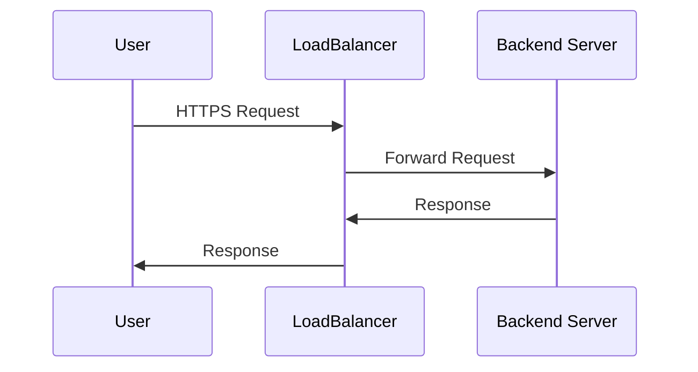
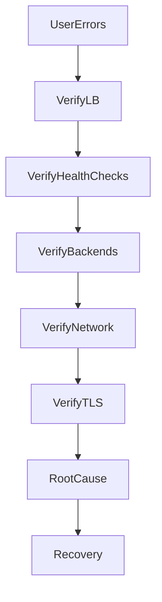

# Load Balancer Outage

## Production Incident Case Study

---

# Scenario

Time: **09:07 AM**

Alerts begin firing across multiple monitoring systems.

```text
CRITICAL ALERT

Website Availability: 18%
API Availability: 22%

Multiple Backend Servers Healthy
```

Customers report:

```text
Random Page Failures
Intermittent API Errors
Checkout Failures
```

The infrastructure team checks backend servers.

```text
Server-01: Healthy
Server-02: Healthy
Server-03: Healthy
Server-04: Healthy
```

Databases are healthy.

Caches are healthy.

Applications are healthy.

Yet users continue experiencing outages.

The problem turns out to be:

```text
Load Balancer Failure
```

---

# Learning Objectives

After completing this case study, you should understand:

* Load balancer architecture
* Request distribution
* Health checks
* Backend pool management
* Reverse proxies
* Session stickiness
* TLS termination
* Load balancer troubleshooting
* Production recovery procedures

---

# Why Load Balancers Matter

Modern systems rarely expose application servers directly.

Architecture:


The load balancer becomes:

```text
The Front Door
```

If it fails:

```text
Entire Platform Appears Down
```

---

# Request Lifecycle

A normal request follows:



Failure at the load balancer affects every request.

---

# Initial Symptoms

Users report:

```text
Intermittent failures
Random 502 errors
Random 503 errors
Slow responses
```

Monitoring shows:

```text
Backend Servers Healthy
Application Metrics Healthy
```

This is an important clue.

---

# First Rule

Do not start by restarting application servers.

Verify:

```text
Can requests reach them?
```

---

# Investigation Workflow



---

# Step 1: Check Load Balancer Health

Check service status.

For HAProxy:

```bash
systemctl status haproxy
```

For Nginx:

```bash
systemctl status nginx
```

Expected:

```text
active (running)
```

---

# Step 2: Verify Listening Ports

Check:

```bash
ss -tulpn
```

Expected:

```text
80/tcp
443/tcp
```

If missing:

```text
Load Balancer Not Accepting Traffic
```

---

# Step 3: Test Locally

From the load balancer:

```bash
curl localhost
```

or

```bash
curl localhost:80
```

Expected:

```text
200 OK
```

---

# Common Cause #1

## Failed Health Checks

Load balancers use health checks to determine backend status.

Example:


If checks fail:

```text
Backend Removed From Pool
```

---

# Symptoms

```text
No Healthy Backends Available
```

Users receive:

```text
503 Service Unavailable
```

---

# Investigation

HAProxy:

```bash
echo "show stat" | socat stdio /run/haproxy/admin.sock
```

Nginx:

Check upstream status.

---

# Common Cause #2

## All Backends Marked Unhealthy

Example:

```text
Backend-01 DOWN
Backend-02 DOWN
Backend-03 DOWN
```

Yet servers are actually healthy.

Why?

Bad health check configuration.

---

# Example

Health check:

```text
GET /health
```

Application changed endpoint:

```text
GET /api/health
```

Result:

```text
Health Checks Fail
```

Traffic stops.

---

# Common Cause #3

## Backend Pool Misconfiguration

Example deployment:

```text
Old Backend Group Removed
New Backend Group Not Added
```

Load balancer has nowhere to send traffic.

---

# Architecture Failure

```mermaid
flowchart LR

Users

--> LoadBalancer

X Backends
```

---

# Common Cause #4

## TLS Certificate Problems

Load balancer terminates HTTPS.


Expired certificate:

```text
SSL Errors
```

Users cannot connect.

---

# Investigation

Check:

```bash
openssl s_client -connect domain.com:443
```

Verify:

```text
Certificate Expiration
```

---

# Common Cause #5

## Network Failure

Load balancer cannot reach backend servers.

Example:

```text
Firewall Rule Updated
```

Traffic blocked.

---

# Verification

From load balancer:

```bash
curl http://backend-ip
```

or

```bash
nc -zv backend-ip 8080
```

Expected:

```text
Connected
```

---

# Common Cause #6

## Load Balancer Resource Exhaustion

CPU reaches:

```text
100%
```

or

```text
Connection Table Full
```

New connections fail.

---

# Investigation

```bash
top
```

```bash
free -h
```

```bash
ss -s
```

---

# Common Cause #7

## Session Stickiness Failure

Architecture:


If sticky sessions break:

```text
Login Failures
Session Loss
Random Logouts
```

---

# Common Cause #8

## DNS Pointing To Wrong Load Balancer

DNS resolves successfully.

But points to:

```text
Old Load Balancer
```

instead of:

```text
Current Production Load Balancer
```

Result:

```text
Users Reach Wrong Infrastructure
```

---

# Common Cause #9

## Reverse Proxy Configuration Error

Example:

```nginx
proxy_pass http://backend;
```

Typo:

```nginx
proxy_pass http://backed;
```

Nginx reloads.

Requests fail.

---

# Verification

```bash
nginx -t
```

Always validate configuration before reload.

---

# Common Cause #10

## Load Balancer Crash

The process itself crashes.

Check:

```bash
journalctl -u nginx
```

or

```bash
journalctl -u haproxy
```

Look for:

```text
Segmentation Fault
OOM Kill
Configuration Error
```

---

# Understanding Error Codes

## 502 Bad Gateway

```text
Load Balancer Reached Backend

Backend Returned Invalid Response
```

---

## 503 Service Unavailable

```text
No Healthy Backend Available
```

---

## 504 Gateway Timeout

```text
Backend Too Slow
```

---

# Production Investigation Example

Timeline:

```text
09:07 Alert Triggered

09:09 Backend Servers Verified Healthy

09:12 Database Verified Healthy

09:15 Load Balancer Checked

09:18 Health Check Failures Found

09:22 Health Endpoint Updated

09:25 Backends Marked Healthy

09:26 Traffic Restored
```

---

# Recovery Checklist

### Verify Service

```bash
systemctl status nginx
```

---

### Verify Ports

```bash
ss -tulpn
```

---

### Verify Health Checks

```bash
curl backend-ip/health
```

---

### Verify Backend Reachability

```bash
curl backend-ip
```

---

### Verify TLS

```bash
openssl s_client
```

---

### Verify Logs

```bash
journalctl -xe
```

---

# Root Cause Analysis Example

```text
Incident:
Customer-Facing Outage

Impact:
80% Request Failure Rate

Root Cause:
Health Check Endpoint Misconfigured

Contributing Factors:
No deployment validation
No health-check testing

Detection:
Availability Alerts

Resolution:
Updated load balancer health check

Prevention:
Automated validation
Canary deployments
Configuration testing
```

---

# Monitoring Recommendations

Monitor:

* Request rate
* Error rate
* Backend health
* Active connections
* TLS expiration
* Response time
* Backend availability
* Load balancer CPU and memory

---

# What Senior Engineers Do Differently

Junior Engineer:

```text
Website Down
Restart Servers
```

Senior Engineer:

```text
Trace Request Path

User
→ DNS
→ Load Balancer
→ Application
→ Database

Find Failing Layer
```

---

# Interview Questions

### What is the difference between a 502 and a 503 error?

### How do load balancer health checks work?

### Why can healthy application servers still result in an outage?

### What causes a 504 Gateway Timeout?

### How would you investigate intermittent request failures?

### What is session stickiness and when is it needed?

### How does TLS termination work at a load balancer?

---

# Key Takeaway

A load balancer outage is dangerous because it sits between users and healthy infrastructure.

Everything behind it may be working perfectly:

* Applications
* Databases
* Caches
* APIs

Yet users experience downtime.

Production engineers must learn to troubleshoot systems as request flows, not individual servers.

The question is never:

```text
Is the server running?
```

The question is:

```text
Can the request successfully travel
through every layer of the system?
```
