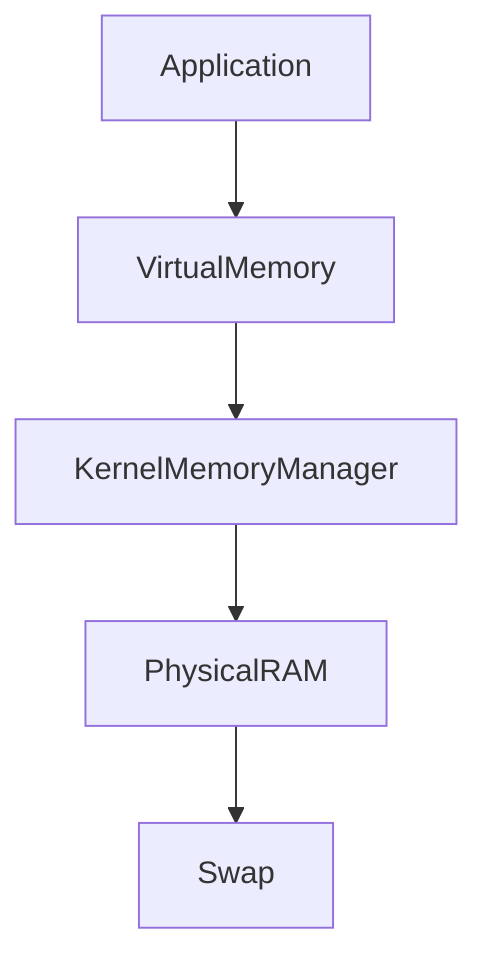
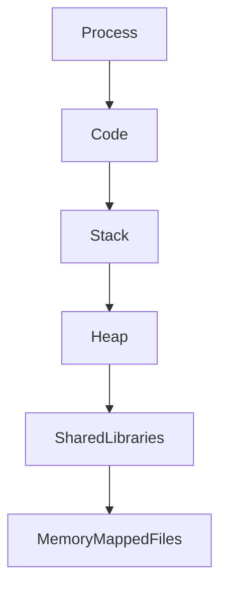
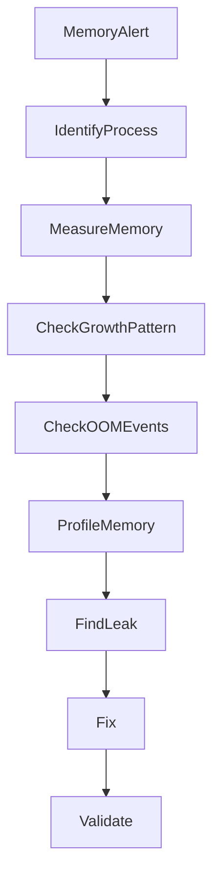
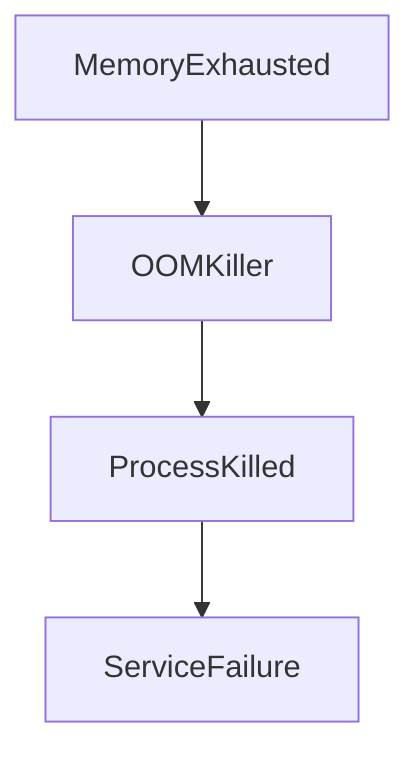

# Memory Leak Investigation

## Production Incident Case Study

---

# Scenario

Time: **01:13 AM**

Monitoring alerts begin firing.

```text
WARNING

Memory Usage: 82%
```

Ten minutes later:

```text
CRITICAL

Memory Usage: 96%
```

Soon after:

```text
Application Restarted Unexpectedly
```

A few minutes later:

```text
Application Restarted Again
```

Users start reporting:

```text
Slow Responses
Timeouts
Random Failures
```

Infrastructure appears healthy.

```text
CPU: Normal
Disk: Normal
Network: Normal
```

But memory usage keeps increasing.

Every hour.

Every day.

Never decreasing.

The incident turns out to be:

```text
Memory Leak
```

One of the most difficult production problems to diagnose.

---

# Learning Objectives

After completing this case study you should understand:

* Linux memory architecture
* Memory leaks
* RSS vs VSZ
* Heap growth
* OOM Killer behavior
* Container memory leaks
* JVM memory leaks
* Node.js memory leaks
* Python memory leaks
* Memory profiling
* Leak investigation methodology
* Prevention strategies

---

# What Is A Memory Leak?

A memory leak occurs when:

```text
Memory Allocated
      ↓
Memory No Longer Needed
      ↓
Memory Not Released
```

The application gradually consumes more memory.

Over time:

```text
Available RAM
      ↓
Less Available RAM
      ↓
No Available RAM
      ↓
OOM Killer
      ↓
Application Crash
```

---

# Why Memory Leaks Are Dangerous

Unlike crashes:

```text
Crash = Immediate Failure
```

Memory leaks are slow.

They can remain hidden for:

* Days
* Weeks
* Months

Until:

```text
Production Failure
```

---

# Understanding Linux Memory

Before troubleshooting, understand the memory stack.



Every process consumes memory through this hierarchy.

---

# Process Memory Components



Most memory leaks occur in:

```text
Heap Memory
```

---

# First Symptoms

Users may report:

```text
Application Gets Slower Over Time
```

Operations teams observe:

```text
Frequent Restarts
Increasing Memory Usage
High Swap Activity
```

Monitoring graphs often look like:

```text
Memory

10%
20%
35%
50%
70%
90%
100%
Crash
10%
20%
35%
...
```

A repeating pattern.

---

# Investigation Workflow



---

# Step 1: Verify Memory Usage

Check system memory.

```bash
free -h
```

Example:

```text
Mem: 16G

Used: 15.4G

Free: 200M
```

Dangerously low free memory.

---

# Step 2: Identify Memory Consumers

Check processes.

```bash
ps aux --sort=-%mem
```

or

```bash
top
```

or

```bash
htop
```

Example:

```text
node

RSS: 8.5GB
```

One process dominates memory usage.

---

# Understanding RSS vs VSZ

This is critical.

---

## RSS

Resident Set Size

```text
Actual Physical RAM
```

Used by process.

---

## VSZ

Virtual Size

```text
Virtual Address Space
```

Reserved memory.

---

# Example

```text
RSS = 4 GB

VSZ = 12 GB
```

Process actually uses:

```text
4 GB RAM
```

Not 12 GB.

---

# Investigation Focus

Most memory leak investigations focus on:

```text
RSS Growth
```

Not VSZ.

---

# Tracking Memory Growth

Observe process over time.

```bash
watch -n 5 \
'ps -p PID -o pid,rss,vsz'
```

Example:

```text
RSS

500MB
800MB
1.2GB
1.8GB
2.4GB
```

Continuous growth indicates a leak.

---

# Root Cause #1

## Application Object Leak

Very common.

Pseudo-code:

```javascript
const users = [];

app.get("/users", () => {
    users.push(newUser);
});
```

Every request:

```text
Allocates Memory
Never Releases Memory
```

Heap grows forever.

---

# Leak Pattern


Garbage collection cannot reclaim it.

---

# Root Cause #2

## Cache Without Limits

Example:

```javascript
cache.set(userId, data);
```

No expiration.

No eviction.

Result:

```text
Cache Size
10MB
100MB
1GB
5GB
10GB
```

Eventually memory exhaustion.

---

# Healthy Cache

Must include:

```text
TTL
Maximum Size
Eviction Policy
```

---

# Root Cause #3

## Unclosed Database Connections

Application creates connections.

```text
Open Connection
```

Never closes them.

Resources accumulate.

---

# Example

```python
conn = connect()
```

Missing:

```python
conn.close()
```

Leak grows over time.

---

# Root Cause #4

## File Descriptor Leak

Process repeatedly opens files.

```bash
open()
open()
open()
open()
```

Never closes them.

---

# Detection

Check:

```bash
lsof -p PID
```

Example:

```text
50000 Open Files
```

Abnormal.

---

# Root Cause #5

## Thread Leak

Application continuously creates threads.

```text
Thread 1
Thread 2
Thread 3
...
```

Never terminates them.

Memory usage increases.

---

# Detection

```bash
ps -eLf
```

Count threads.

---

# Root Cause #6

## Container Memory Leak

Modern production systems run inside containers.

Architecture:


---

# Symptoms

```text
Container Restarting
```

Repeatedly.

---

# Kubernetes Example

```bash
kubectl describe pod POD
```

Output:

```text
OOMKilled
```

Strong indicator.

---

# Root Cause #7

## JVM Heap Leak

Java applications frequently leak memory.

Check:

```bash
jstat -gc PID
```

or

```bash
jcmd PID GC.heap_info
```

---

# Symptom

```text
Heap Usage Continually Growing
```

Even after garbage collection.

---

# Investigation

Create heap dump.

```bash
jmap -dump
```

Analyze using:

```text
Eclipse MAT
VisualVM
YourKit
```

---

# Root Cause #8

## Node.js Memory Leak

Check:

```bash
node --inspect
```

Take heap snapshots.

Compare:

```text
Snapshot A

vs

Snapshot B
```

Growing objects reveal leak source.

---

# Root Cause #9

## Python Memory Leak

Common causes:

* Global lists
* Unbounded caches
* Circular references
* Native extensions

---

# Investigation

Tools:

```text
tracemalloc
objgraph
memory_profiler
```

---

# Root Cause #10

## Native Memory Leak

Application written in:

```text
C
C++
Rust FFI
JNI
```

allocates memory manually.

Example:

```c
malloc()
```

Missing:

```c
free()
```

Leak persists forever.

---

# Detecting OOM Events

Linux eventually intervenes.

---

# OOM Killer

When memory exhausted:

```text
Linux Kernel
      ↓
Select Process
      ↓
Kill Process
```

to protect system stability.

---

# Check OOM Logs

```bash
dmesg | grep -i oom
```

Example:

```text
Killed process 1234 (node)
```

Root cause confirmed.

---

# OOM Killer Flow



---

# Swap Investigation

Check:

```bash
swapon --show
```

and

```bash
free -h
```

Example:

```text
Swap

Used: 7GB
```

Heavy swap usage causes:

```text
Slow Application
```

Even before crashes.

---

# Memory Fragmentation

Not every memory issue is a leak.

Example:

```text
Memory Available
But Not Usable Efficiently
```

Can occur in long-running services.

---

# Monitoring Patterns

Healthy application:

```text
Memory
50%
55%
48%
53%
50%
```

Stable fluctuations.

---

# Leaking application:

```text
Memory
20%
30%
40%
50%
60%
70%
80%
90%
100%
```

Constant upward trend.

---

# Production Investigation Example

Timeline:

```text
01:13 Warning Alert

01:20 Memory 90%

01:27 OOM Event

01:28 Application Restart

01:40 Memory Growing Again

02:10 Heap Dump Created

02:30 Cache Leak Found

02:50 Fix Deployed

03:10 Memory Stable
```

---

# Recovery Checklist

### Check System Memory

```bash
free -h
```

---

### Find Top Consumers

```bash
ps aux --sort=-%mem
```

---

### Check RSS Growth

```bash
top
```

---

### Check OOM Events

```bash
dmesg | grep -i oom
```

---

### Check Open Files

```bash
lsof -p PID
```

---

### Check Threads

```bash
ps -eLf
```

---

### Create Memory Profile

Language-specific tools.

---

### Validate Fix

Monitor for several hours or days.

---

# Root Cause Analysis Example

```text
Incident:
Production API Restarts

Impact:
Intermittent API failures

Root Cause:
Unbounded in-memory cache

Contributing Factors:
No cache limits
No memory monitoring

Detection:
OOM Killer logs

Resolution:
Implemented cache TTL and size limits

Prevention:
Memory dashboards
Heap profiling
Capacity planning
```

---

# Monitoring Recommendations

Monitor:

* RSS
* Heap size
* Memory growth rate
* OOM events
* Swap usage
* Container memory usage
* Garbage collection metrics
* Open file descriptors

---

# Prevention Strategies

## Memory Limits

Containers should have limits.

Example:

```yaml
resources:
  limits:
    memory: 1Gi
```

---

## Cache Policies

Always configure:

```text
TTL
Max Entries
Eviction Rules
```

---

## Memory Profiling

Regular profiling identifies leaks before production incidents.

---

## Alerting

Alert on:

```text
Memory > 80%
Memory > 90%
OOM Events
Swap Growth
```

---

## Load Testing

Long-running load tests often expose leaks that short tests miss.

---

# What Senior Engineers Do Differently

Junior Engineer:

```text
Memory High
Restart Application
```

Senior Engineer:

```text
Find Growth Pattern
Identify Leak
Profile Memory
Fix Root Cause
Validate Stability
```

A restart hides symptoms.

It does not solve the leak.

---

# Interview Questions

### What is a memory leak?

### What is the difference between RSS and VSZ?

### How does the Linux OOM Killer work?

### How would you investigate steadily increasing memory usage?

### Why can garbage-collected languages still have memory leaks?

### How do containers behave when memory limits are exceeded?

### What tools would you use to profile Node.js memory?

### What metrics indicate a memory leak?

---

# Key Takeaway

Memory leaks are among the most deceptive production issues.

They rarely cause immediate failures.

Instead they slowly consume resources until:

```text
Performance Degrades
Services Restart
Users Are Impacted
```

The best engineers do not treat memory leaks as infrastructure problems.

They treat them as:

```text
Evidence of a resource lifecycle problem
```

Because memory should have a life cycle:

```text
Allocate
Use
Release
```

When that cycle breaks, production eventually breaks too.
