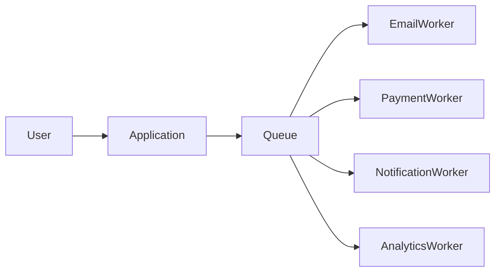
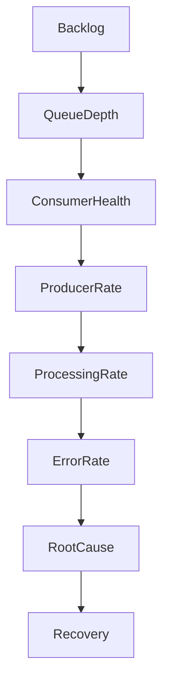
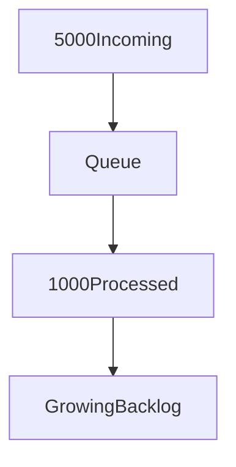
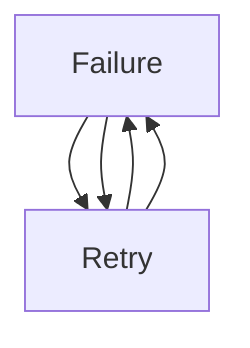
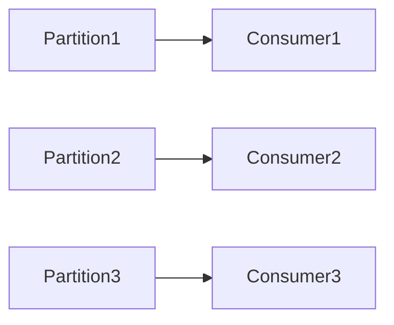
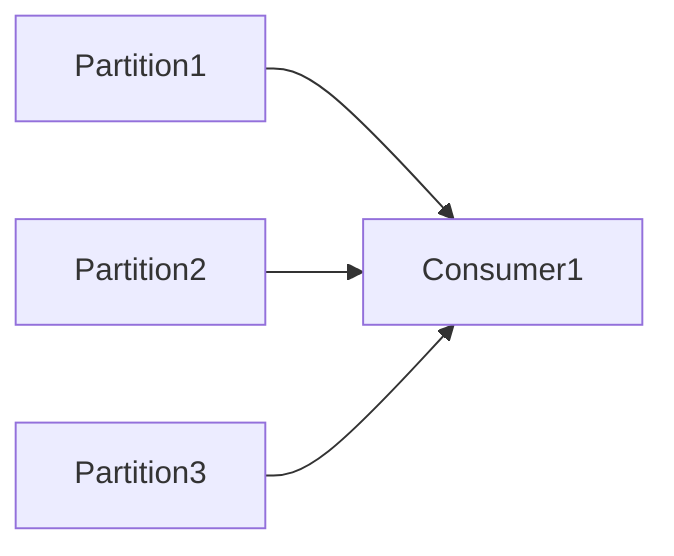
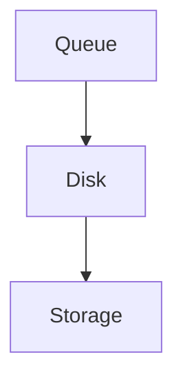

# Message Queue Backlog

## Production Incident Case Study

---

# Scenario

Time: **11:28 AM**

Monitoring begins reporting unusual metrics.

```text
WARNING ALERT

Order Processing Queue

Current Queue Depth: 25,000

Normal Queue Depth: 200
```

Five minutes later:

```text
CRITICAL ALERT

Queue Depth: 180,000

Consumer Lag Increasing
```

Customer support reports:

```text
Orders Not Processing
Emails Not Sending
Notifications Delayed
Payments Pending
```

The website is still working.

Users can still place orders.

Databases are healthy.

Application servers are healthy.

Yet business operations are effectively frozen.

After investigation, engineers discover:

```text
Message Queue Backlog
```

A failure in asynchronous processing has created a large-scale production incident.

---

# Learning Objectives

After completing this case study you should understand:

* Message queue architecture
* Producer-consumer systems
* Queue backlogs
* Consumer lag
* Throughput bottlenecks
* Retry storms
* Poison messages
* Dead Letter Queues (DLQ)
* Kafka troubleshooting
* RabbitMQ troubleshooting
* Distributed systems recovery techniques

---

# Why Message Queues Exist

Without queues:


Every operation happens synchronously.

Users wait for everything.

---

# With Queues



Applications become faster.

Systems become scalable.

---

# The Hidden Danger

Queues can hide problems.

A database failure is obvious.

A queue backlog can grow silently for hours.

By the time users notice:

```text
Millions of Messages May Be Waiting
```

---

# Understanding Queue Architecture


Core components:

```text
Producer
Queue
Consumer
Storage
```

Failures can occur anywhere.

---

# First Rule

Do not immediately purge the queue.

Many engineers panic:

```text
Queue Size Large

Delete Messages
```

This can destroy customer data.

Investigate first.

---

# Initial Symptoms

Monitoring:

```text
Queue Depth Rising
```

Users report:

```text
Delayed Emails
Delayed Orders
Missing Notifications
```

System appears partially functional.

This is an important clue.

---

# Investigation Workflow



---

# Understanding Throughput

Every queue has:

```text
Messages Produced Per Second
```

and

```text
Messages Consumed Per Second
```

Healthy system:

```text
Produced: 100/sec

Consumed: 100/sec
```

---

# Failure Scenario

```text
Produced: 1000/sec

Consumed: 100/sec
```

Backlog grows continuously.

---

# Visualization


900 messages remain every second.

---

# Step 1: Measure Queue Depth

RabbitMQ:

```bash
rabbitmqctl list_queues
```

Kafka:

```bash
kafka-consumer-groups.sh \
--describe
```

Example:

```text
Queue Depth

250,000 Messages
```

Backlog confirmed.

---

# Step 2: Check Consumer Health

Consumers process messages.

If consumers fail:

```text
Queue Growth
```

becomes inevitable.

---

# RabbitMQ

Check consumers:

```bash
rabbitmqctl list_consumers
```

---

# Kafka

Check consumer groups:

```bash
kafka-consumer-groups.sh \
--describe
```

---

# Common Cause #1

## Consumer Crash

Worker process crashes.

Architecture:

```mermaid
flowchart LR

Producer

--> Queue

X Consumer
```

Messages accumulate indefinitely.

---

# Detection

Check:

```bash
systemctl status worker
```

or

```bash
kubectl get pods
```

Example:

```text
CrashLoopBackOff
```

Consumer unavailable.

---

# Common Cause #2

## Consumer Too Slow

Consumers running.

But processing slower than arrival rate.

---

# Example

```text
Incoming:
5000 msg/sec

Processing:
1000 msg/sec
```

Backlog grows.

---

# Visualization



---

# Investigation

Measure:

```text
Consumer Throughput
```

Compare against:

```text
Producer Throughput
```

---

# Common Cause #3

## Traffic Spike

Sudden increase:

```text
Normal:
100 msg/sec

Current:
10,000 msg/sec
```

Consumers overwhelmed.

---

# Detection

Check application traffic.

Correlate timestamps.

---

# Common Cause #4

## Poison Message

A specific message causes failures.

Example:

```json
{
  "orderId": null
}
```

Consumer crashes repeatedly.

---

# Processing Flow


Same message blocks progress.

---

# Detection

Logs repeatedly show:

```text
Processing Message ID 12345
```

over and over.

---

# Recovery

Move message to:

```text
Dead Letter Queue
```

---

# Common Cause #5

## Retry Storm

System retries aggressively.

---

# Example

```text
Message Fails

Retry Immediately

Fails Again

Retry Again

Fails Again
```

Thousands of retries occur.

---

# Architecture



Load increases dramatically.

---

# Prevention

Use:

```text
Exponential Backoff
```

instead of immediate retries.

---

# Common Cause #6

## Database Bottleneck

Consumers depend on database.

---

# Flow


Database slows.

Consumers slow.

Queue grows.

---

# Investigation

Check:

```text
Database Latency
```

and

```text
Query Execution Times
```

---

# Common Cause #7

## External API Failure

Consumers call:

```text
Payment Gateway
Email Service
SMS Provider
```

Provider becomes slow.

---

# Example

Normal:

```text
50ms
```

Current:

```text
10s
```

Consumer throughput collapses.

---

# Common Cause #8

## Kafka Partition Imbalance

Kafka scales through partitions.

---

# Healthy



---

# Failure



Single consumer overloaded.

---

# Symptoms

```text
Consumer Lag
```

in specific partitions.

---

# Investigation

```bash
kafka-consumer-groups.sh \
--describe
```

---

# Common Cause #9

## RabbitMQ Memory Pressure

RabbitMQ stores messages.

Memory fills.

---

# Symptoms

```text
Flow Control Activated
```

Publishers slowed.

---

# Investigation

```bash
rabbitmqctl status
```

Check:

```text
Memory Usage
```

---

# Common Cause #10

## Disk Pressure

Persistent queues write to disk.

Disk fills.

---

# Architecture



No storage.

No queue growth possible.

System degrades.

---

# Investigation

```bash
df -h
```

---

# Common Cause #11

## Consumer Deployment Failure

New deployment introduces bug.

Consumers immediately crash.

---

# Detection

Compare:

```text
Queue Growth Start Time
```

with:

```text
Deployment Time
```

Often identical.

---

# Recovery

Rollback deployment.

---

# Common Cause #12

## Dead Letter Queue Overflow

DLQ exists.

Nobody monitors it.

Messages accumulate.

---

# Symptoms

```text
Primary Queue Healthy

DLQ Massive
```

Hidden production problem.

---

# Investigation

Monitor:

```text
Dead Letter Queue Size
```

always.

---

# Kafka Consumer Lag

One of the most important metrics.

---

# Definition

```text
Messages Produced
-
Messages Consumed
=
Lag
```

---

# Example

```text
Produced Offset:
5,000,000

Consumed Offset:
4,000,000
```

Lag:

```text
1,000,000 Messages
```

Severe issue.

---

# Useful Commands

## RabbitMQ Queues

```bash
rabbitmqctl list_queues
```

---

## RabbitMQ Consumers

```bash
rabbitmqctl list_consumers
```

---

## Kafka Consumer Groups

```bash
kafka-consumer-groups.sh \
--describe
```

---

## Kafka Topics

```bash
kafka-topics.sh \
--describe
```

---

## Kubernetes Consumers

```bash
kubectl get pods
```

---

## Consumer Logs

```bash
kubectl logs POD
```

or

```bash
journalctl -u worker
```

---

# Production Investigation Example

Timeline:

```text
11:28 Warning Alert

11:33 Queue Depth Rising

11:38 Consumer Lag Detected

11:42 Consumer Crash Found

11:47 Deployment Rollback

11:51 Consumers Recover

12:05 Backlog Reducing

12:20 Queue Normal
```

---

# Recovery Checklist

### Verify Queue Depth

```text
Current Messages
```

---

### Verify Consumers

```text
Running
Healthy
Connected
```

---

### Verify Consumer Lag

```text
Kafka Offsets
```

---

### Check Error Logs

```text
Consumer Exceptions
```

---

### Check Dependencies

```text
Database
Redis
External APIs
```

---

### Check DLQ

```text
Dead Letter Queue Size
```

---

### Verify Throughput

```text
Messages In

vs

Messages Out
```

---

# Root Cause Analysis Example

```text
Incident:
Order Processing Delay

Impact:
Orders Delayed 45 Minutes

Root Cause:
Consumer Deployment Bug

Contributing Factors:
Insufficient Deployment Testing

Detection:
Consumer Lag Alert

Resolution:
Rollback Deployment

Prevention:
Canary Releases
Consumer Health Checks
Lag Monitoring
```

---

# Monitoring Recommendations

Monitor:

* Queue depth
* Consumer lag
* Consumer count
* Processing rate
* Error rate
* Retry rate
* DLQ size
* Queue latency

---

# Prevention Strategies

## Autoscaling

Scale consumers automatically.

---

## DLQ Monitoring

Never ignore dead-letter queues.

---

## Backpressure

Prevent producers from overwhelming consumers.

---

## Retry Limits

Avoid retry storms.

---

## Throughput Testing

Understand queue limits before production.

---

# What Senior Engineers Do Differently

Junior Engineer:

```text
Queue Growing

Add More Consumers
```

Senior Engineer:

```text
Why Is Queue Growing?

Consumers Slow?

Consumers Dead?

Database Slow?

Poison Message?

Find Root Cause
```

---

# Interview Questions

### What is consumer lag?

### What is a poison message?

### Why are dead-letter queues important?

### What causes queue backlogs?

### How do retry storms happen?

### How would you investigate a Kafka lag spike?

### How can an external API outage create a queue backlog?

### What metrics indicate queue health?

---

# Key Takeaway

Message queues are shock absorbers for distributed systems.

When healthy:

```text
They Smooth Traffic
```

When unhealthy:

```text
Backlogs Grow
Latency Increases
Business Processes Stall
```

The most dangerous queue failures are not crashes.

They are slow-moving bottlenecks that quietly accumulate millions of messages until the entire system falls behind reality.

The best engineers continuously monitor:

```text
Production Rate
Consumption Rate
Lag
Backlog
```

Because in distributed systems, work that is delayed is often indistinguishable from work that is lost.
