# Microservices Cascading Failure

## Production Incident Case Study

---

# Scenario

Time: **11:07 AM**

A small service begins experiencing latency.

```text id="mcf001"
Recommendation Service

Latency:
80ms → 4s
```

Initially nobody notices.

The service is not business critical.

It only powers product recommendations.

Five minutes later:

```text id="mcf002"
API Latency Increasing

Error Rate Rising

Checkout Slowing
```

Ten minutes later:

```text id="mcf003"
Login Delays

Cart Failures

Payment Errors
```

Fifteen minutes later:

```text id="mcf004"
Entire Platform Degraded
```

Engineers investigate.

```text id="mcf005"
Database Healthy

Network Healthy

Infrastructure Healthy
```

Yet almost every service is failing.

After investigation:

```text id="mcf006"
Cascading Failure
```

A minor issue in one service propagated through the entire platform.

---

# Learning Objectives

After completing this case study you should understand:

* Microservice dependencies
* Cascading failures
* Retry storms
* Connection pool exhaustion
* Thread pool exhaustion
* Circuit breakers
* Bulkheads
* Service mesh concepts
* Failure isolation
* Production recovery strategies

---

# Understanding Modern Architectures

Monolith:

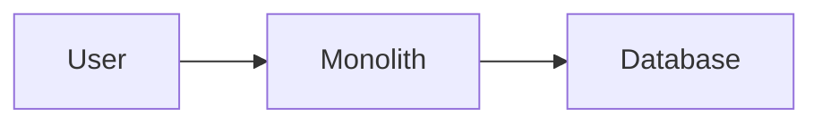

Simple.

Few dependency chains.

---

# Microservices

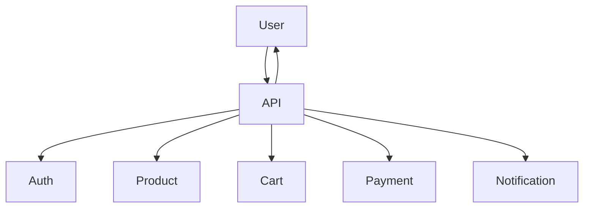

More scalable.

More flexible.

More failure paths.

---

# The Hidden Risk

Every service dependency introduces:

```text id="mcf009"
Additional Failure Risk
```

---

# Example

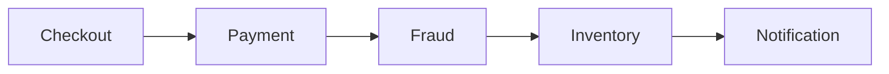

Checkout depends on four services.

Failure in one may impact all.

---

# First Rule

Do not focus only on the failing service.

Investigate:

```text id="mcf011"
Who Depends On It?
```

---

# Initial Symptoms

Monitoring shows:

```text id="mcf012"
Error Rates Rising
```

across multiple services.

Example:

```text id="mcf013"
Recommendation: 80% Errors

API Gateway: 40% Errors

Checkout: 25% Errors
```

This pattern suggests dependency issues.

---

# Investigation Workflow

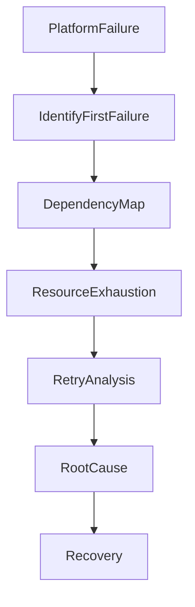

---

# Understanding Dependency Chains

Architecture:

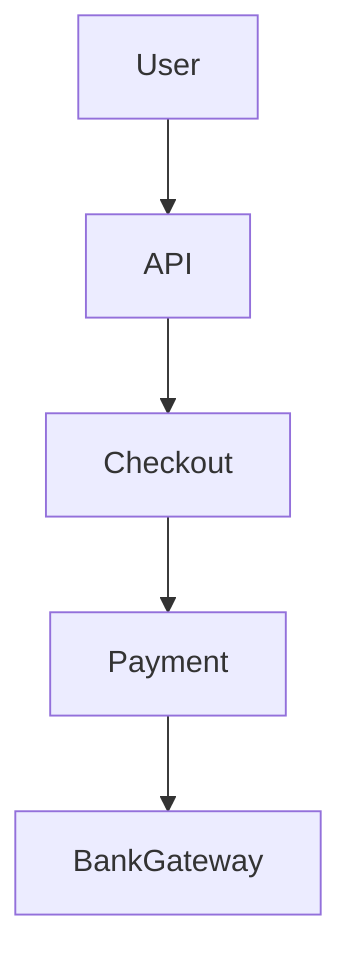

One failure can propagate upward.

---

# Example Failure

```text id="mcf016"
Bank Gateway Slow
```

↓

```text id="mcf017"
Payment Slow
```

↓

```text id="mcf018"
Checkout Slow
```

↓

```text id="mcf019"
API Slow
```

↓

```text id="mcf020"
User Impact
```

---

# Common Cause #1

## Retry Storm

Most common cascading failure.

---

# Original Failure

```text id="mcf021"
Payment Timeout
```

Client retries.

---

# Architecture

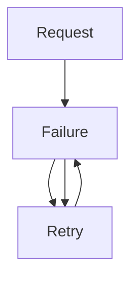

---

# Example

One request becomes:

```text id="mcf023"
5 Requests
```

10,000 requests become:

```text id="mcf024"
50,000 Requests
```

Infrastructure overloads.

---

# Symptoms

```text id="mcf025"
Traffic Increases During Failure
```

Counterintuitive but common.

---

# Investigation

Check:

```text id="mcf026"
Retry Metrics
```

and application logs.

---

# Common Cause #2

## Connection Pool Exhaustion

Every service uses connections.

---

# Architecture

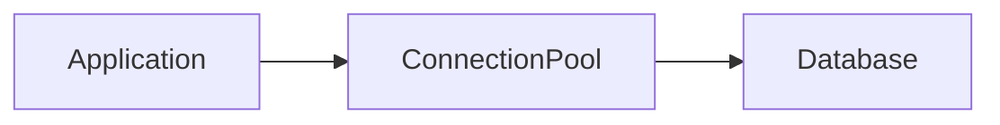

---

# Problem

Slow dependency.

Connections remain occupied.

Pool fills.

---

# Result

```text id="mcf028"
No Connections Available
```

---

# Symptoms

```text id="mcf029"
Timeout Waiting For Connection
```

---

# Investigation

Check:

```text id="mcf030"
Active Connections

Pool Usage
```

---

# Common Cause #3

## Thread Pool Exhaustion

Threads wait on slow dependencies.

---

# Architecture

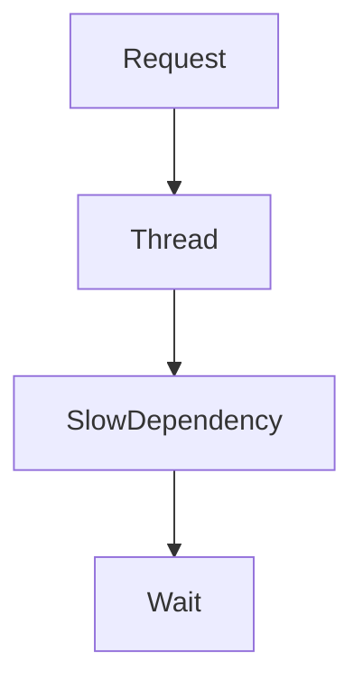

---

# Eventually

```text id="mcf032"
All Threads Busy
```

---

# Result

New requests rejected.

---

# Common Cause #4

## Synchronous Service Chains

Architecture:

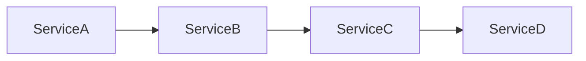

---

# Problem

Latency accumulates.

---

# Example

```text id="mcf034"
A = 100ms

B = 100ms

C = 100ms

D = 100ms
```

Total:

```text id="mcf035"
400ms
```

If D becomes:

```text id="mcf036"
5 seconds
```

Entire chain slows.

---

# Common Cause #5

## Missing Timeouts

Dangerous configuration:

```text id="mcf037"
Wait Forever
```

---

# Result

Requests pile up.

Resources exhausted.

---

# Good Practice

Always configure:

```text id="mcf038"
Connection Timeout

Read Timeout

Request Timeout
```

---

# Common Cause #6

## Circuit Breaker Missing

Circuit breaker protects services.

---

# Without Circuit Breaker

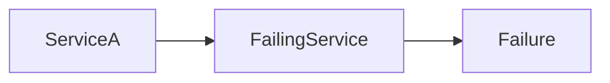

Traffic continues.

Failure spreads.

---

# With Circuit Breaker

```mermaid id="mcf040"
flowchart LR

ServiceA

--> CircuitBreaker

X FailingService
```

Traffic blocked.

System protected.

---

# Circuit Breaker States

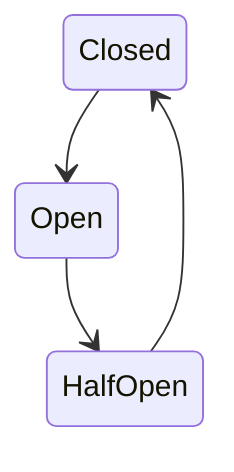

---

# Common Cause #7

## Bulkhead Failure

Ships use bulkheads.

Water flooding one section does not sink entire ship.

---

# Software Bulkheads

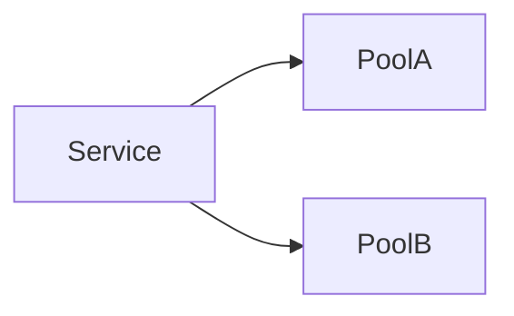

Failures isolated.

---

# Without Bulkheads

```text id="mcf043"
One Dependency Consumes All Resources
```

---

# Common Cause #8

## Queue Backlog Propagation

Architecture:

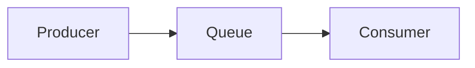

---

# Consumer slows.

Queue grows.

Eventually:

```text id="mcf045"
Entire Pipeline Delayed
```

---

# Common Cause #9

## Database Saturation

One service generates:

```text id="mcf046"
Excessive Queries
```

Database slows.

All services affected.

---

# Symptoms

```text id="mcf047"
Platform-Wide Latency
```

---

# Investigation

Check:

```sql id="mcf048"
pg_stat_activity
```

or:

```sql id="mcf049"
SHOW PROCESSLIST;
```

---

# Common Cause #10

## Cache Failure

Redis unavailable.

---

# Flow

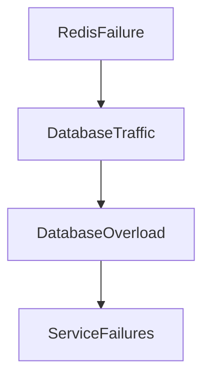

---

# Small failure.

Large impact.

---

# Common Cause #11

## Service Discovery Failure

Services cannot locate each other.

---

# Architecture

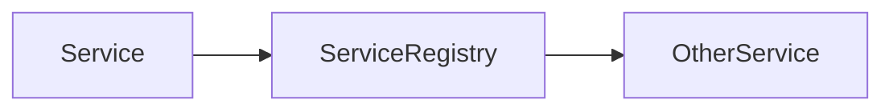

---

# Registry unavailable.

Communication breaks.

---

# Common Cause #12

## Authentication Service Failure

Everything depends on authentication.

---

# Architecture

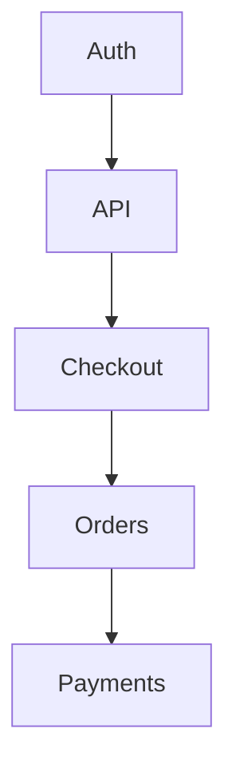

---

# Auth fails.

Entire platform degrades.

---

# Understanding Blast Radius

Important concept.

---

# Definition

```text id="mcf053"
How Much Of The System
Can One Failure Affect?
```

---

# Small Blast Radius

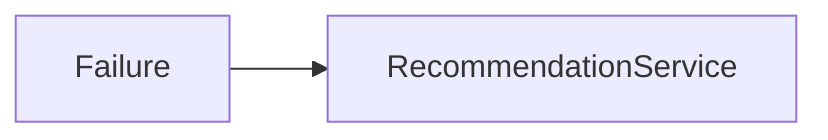

Only recommendations affected.

---

# Large Blast Radius

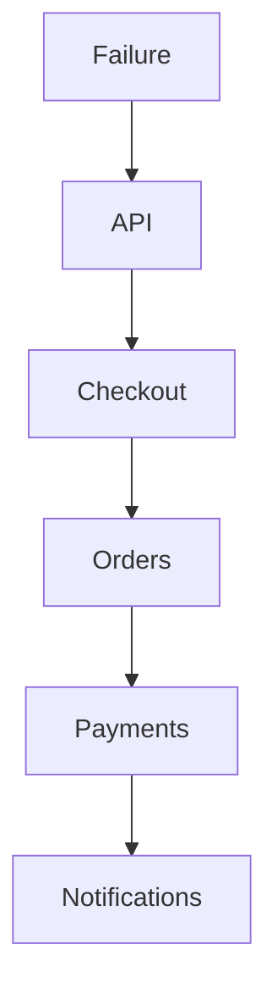

---

# Goal

Reduce blast radius.

---

# Failure Isolation

Design principle:

```text id="mcf056"
Failures Must Remain Local
```

---

# Example

Recommendation service fails.

Expected result:

```text id="mcf057"
No Recommendations
```

Not:

```text id="mcf058"
Entire Website Down
```

---

# Service Mesh Perspective

Modern systems often use:

```text id="mcf059"
Istio

Linkerd

Consul
```

---

# Benefits

```text id="mcf060"
Retries

Timeouts

Circuit Breakers

Observability
```

built into infrastructure.

---

# Useful Investigation Commands

Kubernetes:

```bash id="mcf061"
kubectl get pods
```

---

# Logs

```bash id="mcf062"
kubectl logs POD
```

---

# Connections

```bash id="mcf063"
ss -s
```

---

# CPU

```bash id="mcf064"
top
```

---

# Memory

```bash id="mcf065"
free -h
```

---

# Request Tracing

Use:

```text id="mcf066"
Jaeger

Zipkin

OpenTelemetry
```

to identify dependency chains.

---

# Distributed Tracing

```mermaid id="mcf067"
sequenceDiagram

User->>API

API->>Checkout

Checkout->>Payment

Payment->>Bank

Bank-->>Payment

Payment-->>Checkout

Checkout-->>API
```

Critical for debugging cascades.

---

# Production Investigation Example

Timeline:

```text id="mcf068"
11:07 Recommendation Latency Spike

11:10 Retry Storm Begins

11:13 API Latency Increases

11:16 Database Load Rises

11:20 Checkout Failures Begin

11:24 Platform Degraded

11:31 Root Cause Identified

11:39 Circuit Breaker Enabled

11:47 Recovery Complete
```

---

# Recovery Checklist

### Identify First Failure

```text id="mcf069"
What Failed First?
```

---

### Map Dependencies

```text id="mcf070"
Who Depends On It?
```

---

### Check Retries

```text id="mcf071"
Retry Storm?
```

---

### Check Pools

```text id="mcf072"
Connections

Threads
```

---

### Check Timeouts

```text id="mcf073"
Requests Waiting Forever?
```

---

### Isolate Failure

```text id="mcf074"
Disable Dependency

Open Circuit Breaker
```

---

### Validate Recovery

```text id="mcf075"
Error Rates Falling
```

---

# Root Cause Analysis Example

```text id="mcf076"
Incident:
Platform Degradation

Impact:
45% Checkout Failure Rate

Root Cause:
Payment Service Dependency Timeout

Contributing Factors:
Unlimited Retries
Missing Circuit Breaker

Detection:
Latency Monitoring

Resolution:
Circuit Breaker Enabled
Retries Reduced

Prevention:
Bulkheads
Timeouts
Failure Isolation
```

---

# Monitoring Recommendations

Monitor:

* Service latency
* Dependency latency
* Retry rates
* Connection pool usage
* Thread pool usage
* Queue depth
* Error rates
* Circuit breaker state

---

# Prevention Strategies

## Timeouts Everywhere

Never wait forever.

---

## Circuit Breakers

Protect healthy services.

---

## Bulkheads

Isolate resources.

---

## Backpressure

Reject work before overload.

---

## Distributed Tracing

Understand request flows.

---

## Dependency Mapping

Know:

```text id="mcf077"
What Depends On What
```

---

# What Senior Engineers Do Differently

Junior Engineer:

```text id="mcf078"
Checkout Broken

Fix Checkout
```

Senior Engineer:

```text id="mcf079"
Checkout Broken

What Is Checkout Waiting On?

Payment?

Inventory?

Auth?

Trace Dependencies
```

---

# Interview Questions

### What is a cascading failure?

### What causes retry storms?

### What is connection pool exhaustion?

### What is a circuit breaker?

### What is a bulkhead pattern?

### Why are timeouts critical in distributed systems?

### How does distributed tracing help troubleshooting?

### How do you reduce blast radius?

---

# Key Takeaway

Microservices improve:

```text id="mcf080"
Scalability

Flexibility

Team Independence
```

But they also increase:

```text id="mcf081"
Complexity

Dependency Chains

Failure Paths
```

The most dangerous failures are not the ones that start large.

They are the ones that start small.

A slow service.

A timeout.

A retry.

A queue backlog.

A connection leak.

And then:

```text id="mcf082"
One Failure

Becomes

Many Failures
```

The best production engineers design systems where failures are expected, isolated, and contained.

Because in distributed systems, preventing failure is impossible.

Containing failure is engineering.
