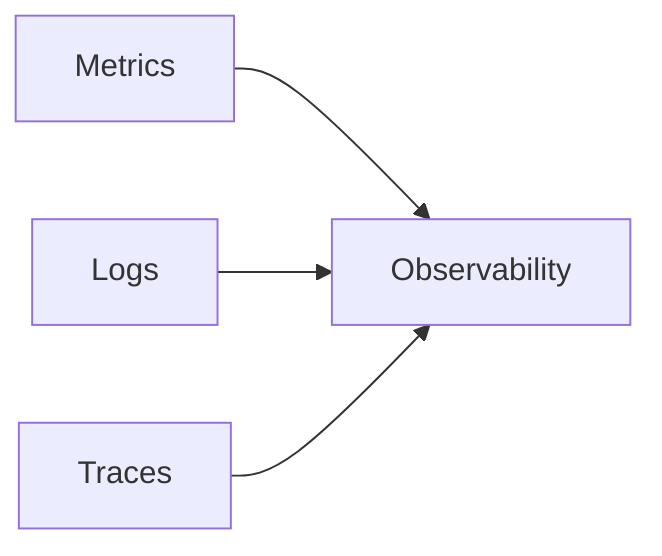
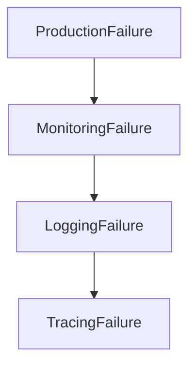
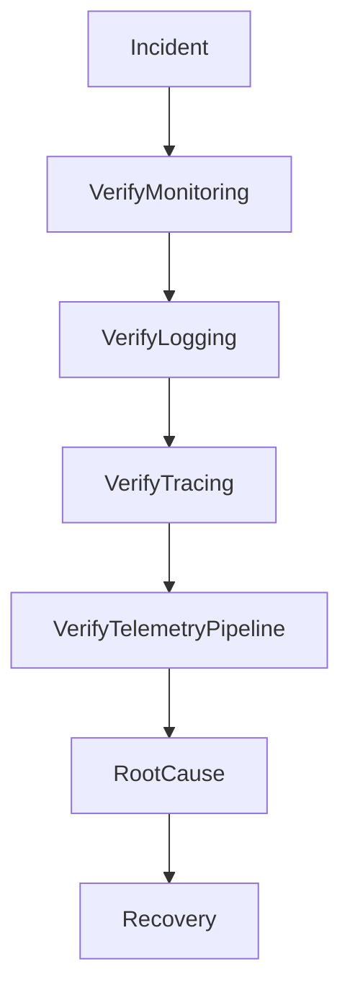
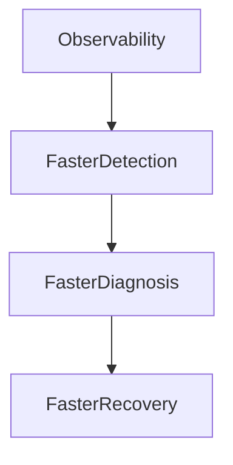

# Observability Blindness Incident

## Production Incident Case Study

---

# Scenario

Time: **02:17 AM**

PagerDuty wakes up the on-call engineer.

```text
CRITICAL ALERT

Customer Complaints Increasing

API Latency: Unknown

Error Rate: Unknown

Database Status: Unknown
```

The engineer opens dashboards.

Nothing loads.

Monitoring system unavailable.

Logs unavailable.

Tracing unavailable.

Metrics unavailable.

Production is failing.

But nobody knows why.

Within minutes:

```text
Website Slow

Checkout Failing

Login Errors

Mobile App Timeouts
```

The platform is experiencing an outage.

The observability platform is also experiencing an outage.

Engineers are effectively blind.

---

# Learning Objectives

After completing this case study you should understand:

* Observability fundamentals
* Monitoring vs Logging vs Tracing
* Telemetry pipelines
* Alerting failures
* Metrics outages
* Log ingestion failures
* Distributed tracing
* Mean Time To Detect (MTTD)
* Mean Time To Resolve (MTTR)
* Observability architecture

---

# What Is Observability?

Observability answers:

```text
What Is Happening?

Why Is It Happening?

Where Is It Happening?
```

---

# Three Pillars



---

# Metrics

Tell you:

```text
Something Is Wrong
```

Examples:

```text
CPU

Memory

Latency

Error Rate
```

---

# Logs

Tell you:

```text
What Happened
```

Examples:

```text
Exceptions

Errors

Warnings

Events
```

---

# Traces

Tell you:

```text
Where It Happened
```

Across services.

---

# The Nightmare Scenario



Everything breaks simultaneously.

---

# First Rule

Never assume:

```text
No Alerts

=
No Problems
```

Sometimes alerts fail too.

---

# Investigation Workflow



---

# Common Cause #1

## Monitoring System Outage

Example:

```text
Prometheus Down

Datadog Agent Failure

Grafana Unavailable
```

---

# Symptoms

```text
Empty Dashboards

Missing Metrics

No Alerts
```

---

# Investigation

Check:

```bash
systemctl status prometheus
```

or:

```bash
kubectl get pods -n monitoring
```

---

# Common Cause #2

## Log Pipeline Failure

Architecture:


---

# Problem

Log collector fails.

Applications continue running.

Logs disappear.

---

# Symptoms

```text
No New Logs
```

despite active traffic.

---

# Common Cause #3

## Disk Full On Logging Cluster

Log storage grows rapidly.

Eventually:

```text
100% Disk Usage
```

---

# Result

```text
Log Ingestion Stops
```

---

# Investigation

```bash
df -h
```

---

# Common Cause #4

## Sampling Misconfiguration

Tracing system configured incorrectly.

Example:

```text
Trace Sampling

100%

↓

0%
```

---

# Result

No traces available.

---

# Common Cause #5

## Alert Fatigue

Engineers receive:

```text
10,000 Alerts Per Day
```

---

# Consequence

Critical alerts ignored.

Real outage missed.

---

# Common Cause #6

## Missing Business Metrics

Infrastructure healthy.

Business broken.

---

# Example

Monitoring:

```text
CPU Healthy

Memory Healthy

Network Healthy
```

But:

```text
Checkout Success Rate

0%
```

---

# Lesson

Monitor business outcomes.

Not just servers.

---

# Common Cause #7

## Dashboard Dependency Failure

Dashboard depends on:

```text
Database

Metrics Store

Authentication
```

One component fails.

Entire dashboard disappears.

---

# Common Cause #8

## Time Synchronization Problems

Metrics depend on timestamps.

Servers disagree.

---

# Example

```text
Server A:
10:00

Server B:
10:08
```

---

# Result

```text
Broken Graphs

Incorrect Alerts
```

---

# Investigation

```bash
timedatectl
```

---

# Common Cause #9

## Distributed Tracing Failure

Architecture:


---

# Collector unavailable.

No visibility into request paths.

---

# Common Cause #10

## Cardinality Explosion

Metrics labels grow uncontrollably.

Example:

```text
user_id=1
user_id=2
user_id=3
```

Millions of combinations.

---

# Result

```text
Monitoring System Overloaded
```

---

# Common Cause #11

## Logging Storm

Bug generates:

```text
1 Error

↓

1 Million Log Lines
```

---

# Result

```text
Storage Exhaustion

High Costs

Slow Queries
```

---

# Common Cause #12

## No Observability For Critical Service

Most dangerous situation.

Service exists.

No metrics.

No logs.

No tracing.

---

# Result

```text
Unknown Unknowns
```

---

# Understanding MTTD

Mean Time To Detect.

```text
How Long Until We Notice?
```

---

# Example

```text
Failure:
02:00

Detection:
03:00
```

MTTD:

```text
60 Minutes
```

---

# Understanding MTTR

Mean Time To Resolve.

```text
How Long Until Recovery?
```

---

# Example

```text
Detection:
03:00

Recovery:
04:00
```

MTTR:

```text
60 Minutes
```

---

# Why Observability Matters



---

# Golden Signals

Monitor:

```text
Latency

Traffic

Errors

Saturation
```

---

# Four Questions During Every Incident

```text
What Broke?

When Did It Break?

Where Did It Break?

Why Did It Break?
```

Observability should answer all four.

---

# Production Investigation Example

Timeline:

```text
02:17 Customer Complaints

02:21 Dashboards Unavailable

02:26 Monitoring Cluster Failure Found

02:31 Direct Server Access Used

02:38 Database Saturation Identified

02:47 Query Fixed

02:55 Service Healthy

03:02 Monitoring Restored
```

---

# Recovery Checklist

### Verify Monitoring

```bash
systemctl status prometheus
```

### Verify Logging

```bash
journalctl -xe
```

### Verify Tracing

```text
Recent Traces Available?
```

### Verify Storage

```bash
df -h
```

### Verify Time Sync

```bash
timedatectl
```

### Verify Alerts

```text
Are Alerts Firing Correctly?
```

---

# Root Cause Analysis Example

```text
Incident:
Checkout Outage

Impact:
Orders Failed

Root Cause:
Database Query Regression

Contributing Factors:
Monitoring Cluster Failure

Detection:
Customer Reports

Resolution:
Query Optimization
Monitoring Recovery

Prevention:
Monitoring Redundancy
Business Metric Alerts
```

---

# Monitoring Recommendations

Monitor:

* Application latency
* Error rates
* Traffic volume
* Queue depth
* Database performance
* Cache health
* Disk usage
* Monitoring platform health
* Logging platform health
* Business KPIs

---

# Prevention Strategies

## Monitor The Monitors

Always monitor:

```text
Prometheus

Grafana

ELK

Jaeger
```

---

## Build Redundancy

Avoid single points of failure.

---

## Alert On Business Metrics

Track:

```text
Orders

Payments

Logins

Revenue
```

---

## Centralize Logs

Avoid local-only logging.

---

## Use Distributed Tracing

Especially in microservices.

---

# What Senior Engineers Do Differently

Junior Engineer:

```text
No Alerts

System Must Be Fine
```

Senior Engineer:

```text
No Alerts

Is Monitoring Working?
```

---

# Interview Questions

### What is observability?

### What is the difference between monitoring and observability?

### What are the three pillars of observability?

### What are the Golden Signals?

### What is MTTD?

### What is MTTR?

### Why should you monitor business metrics?

### How would you investigate an outage when dashboards are unavailable?

---

# Key Takeaway

Systems fail.

That is expected.

What separates mature engineering organizations from immature ones is not whether failures occur.

It is whether they can quickly answer:

```text
What Happened?
Why?
Where?
How Bad?
```

Without observability:

```text
Every Incident

Becomes Guesswork
```

And in production engineering, guessing is the most expensive troubleshooting strategy.
