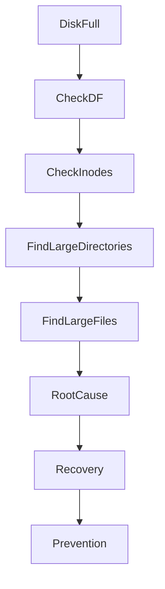
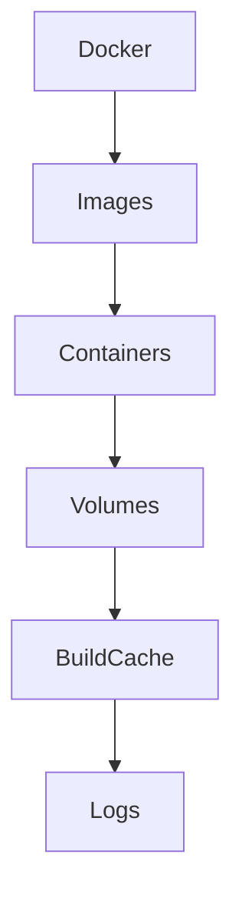

# Production Disk Full

## Real Production Incident Case Study

---

# Scenario

Time: **03:42 AM**

Your monitoring system starts sending alerts.

```text
CRITICAL ALERT

Server: prod-api-01
Disk Usage: 100%
Filesystem: /
Status: CRITICAL
```

A few minutes later:

```text
Application errors increasing
Database writes failing
Container restarts occurring
Users reporting issues
```

Soon after:

```text
Website unavailable
API requests failing
```

At first glance, it looks like a simple storage issue.

In reality, a full disk can break almost every component in a Linux system.

---

# Learning Objectives

After this case study, you should understand:

* Why disks become full
* How Linux handles storage exhaustion
* How applications behave when storage runs out
* How to investigate storage incidents
* Difference between space exhaustion and inode exhaustion
* Docker storage failures
* Database storage failures
* Log explosion incidents
* Recovery strategies
* Long-term prevention

---

# Why Disk Full Is Dangerous

Many engineers think:

```text
Disk Full = Can't Store Files
```

Reality:

```text
Disk Full
   ↓
Logs cannot be written
   ↓
Applications fail
   ↓
Databases fail
   ↓
Services crash
   ↓
Containers restart
   ↓
Website outage
```

A full filesystem affects the entire operating system.

---

# Understanding Linux Storage

Before troubleshooting, understand the storage stack.

```mermaid
flowchart TD

Application

--> Filesystem

--> VFS

--> Block Layer

--> Storage Driver

--> Physical Disk
```

Every write operation travels through this path.

If storage becomes unavailable:

```text
Write Failure
```

Applications begin failing.

---

# First Symptoms

Users may report:

```text
Cannot upload files
Cannot login
Cannot save records
Website loading slowly
Random application crashes
```

Engineers often misdiagnose these symptoms.

The actual issue may be disk exhaustion.

---

# Step 1: Verify Disk Usage

Check filesystems.

```bash
df -h
```

Example:

```text
Filesystem      Size Used Avail Use%
/dev/sda1       100G 100G    0 100%
```

Root partition completely full.

---

# Step 2: Check Inode Usage

A filesystem can have free space but still fail.

Why?

Because inodes are exhausted.

Check:

```bash
df -i
```

Example:

```text
Filesystem      Inodes IUsed IFree IUse%
/dev/sda1       6.5M   6.5M     0 100%
```

This means:

```text
No new files can be created
```

Even if free space exists.

---

# Understanding Inodes

Every file needs:

```text
Data Blocks
+
Inode
```

The inode stores:

* Ownership
* Permissions
* Size
* Timestamps
* Block pointers

Without available inodes:

```text
touch test.txt
```

Fails.

---

# Space Exhaustion vs Inode Exhaustion


### Space Exhaustion

```text
No storage blocks available
```

### Inode Exhaustion

```text
No file metadata entries available
```

Symptoms are similar.

Investigation differs.

---

# Step 3: Identify Large Directories

Start from root.

```bash
du -sh /*
```

Then investigate.

```bash
du -sh /var/*
```

Example:

```text
/var/log = 67G
```

Interesting.

Continue.

```bash
du -sh /var/log/*
```

Example:

```text
application.log = 62G
```

Potential root cause identified.

---

# Investigation Workflow



---

# Common Root Cause #1

## Log Explosion

A developer enables debug logging.

```text
Every Request Logged
Every Query Logged
Every Error Logged
```

Traffic increases.

Log file grows.

```text
10 MB
100 MB
1 GB
10 GB
50 GB
```

Eventually:

```text
Filesystem Full
```

---

# Detecting Log Explosion

Find largest files.

```bash
find / -type f -size +500M
```

or

```bash
find /var/log -type f | xargs ls -lh
```

Example:

```text
app.log 65G
```

---

# Emergency Recovery

Truncate file.

```bash
truncate -s 0 app.log
```

Or:

```bash
> app.log
```

Space immediately returns.

---

# Common Root Cause #2

## Docker Storage Growth

Many production incidents involve Docker.

Check usage:

```bash
docker system df
```

Example:

```text
Images: 40GB
Containers: 15GB
Volumes: 20GB
Build Cache: 25GB
```

Total:

```text
100GB+
```

---

# Docker Storage Architecture



Each consumes disk space.

---

# Investigating Docker Growth

Check:

```bash
docker images
```

Check:

```bash
docker volume ls
```

Check:

```bash
docker system df -v
```

---

# Recovery

Remove unused objects.

```bash
docker system prune
```

Aggressive cleanup:

```bash
docker system prune -a
```

Be careful in production.

---

# Common Root Cause #3

## Container Log Growth

Docker logs often become huge.

Location:

```bash
/var/lib/docker/containers/
```

Check:

```bash
du -sh /var/lib/docker/*
```

Example:

```text
container-log.json = 40G
```

---

# Prevention

Configure log rotation.

```json
{
  "log-driver": "json-file",
  "log-opts": {
    "max-size": "100m",
    "max-file": "5"
  }
}
```

---

# Common Root Cause #4

## Database Growth

Databases continuously write data.

Examples:

* PostgreSQL
* MySQL
* MongoDB

---

# PostgreSQL WAL Explosion

Write Ahead Logs accumulate.

Location:

```text
pg_wal
```

Architecture:


If WAL cleanup fails:

```text
WAL Files Grow Forever
```

Disk fills.

---

# Investigation

Check:

```bash
du -sh $PGDATA/pg_wal
```

Example:

```text
pg_wal = 80GB
```

---

# Root Cause

Possibilities:

* Replication broken
* Archiving failing
* Backup failure
* Long-running transaction

---

# Common Root Cause #5

## Backup Accumulation

A backup script runs daily.

```text
backup-01.tar.gz
backup-02.tar.gz
backup-03.tar.gz
```

No cleanup policy.

After months:

```text
Disk Full
```

---

# Detecting Backup Bloat

```bash
find /backup -type f
```

Check size:

```bash
du -sh /backup
```

---

# Common Root Cause #6

## Deleted File Still Consuming Space

Very common production issue.

File deleted:

```bash
rm giant.log
```

Disk usage unchanged.

Why?

Process still has file open.

---

# Linux File Descriptor Behavior


As long as process holds descriptor:

```text
Space remains allocated
```

---

# Detecting Deleted Open Files

```bash
lsof | grep deleted
```

Example:

```text
java 1234 deleted giant.log
```

---

# Fix

Restart process.

```bash
systemctl restart application
```

Space released.

---

# Incident Example

Timeline:

```text
03:42 Alert Triggered

03:45 SSH Login

03:47 df -h shows 100%

03:50 Large file found

03:53 app.log = 62GB

03:55 File truncated

03:56 Free space restored

04:00 Services healthy
```

---

# Recovery Checklist

### Verify Usage

```bash
df -h
```

### Verify Inodes

```bash
df -i
```

### Find Large Directories

```bash
du -sh /*
```

### Find Large Files

```bash
find / -type f -size +500M
```

### Check Deleted Files

```bash
lsof | grep deleted
```

### Verify Recovery

```bash
df -h
```

---

# Prevention Strategies

## Monitoring

Alert Levels:

```text
70% Warning
80% High
90% Critical
95% Emergency
```

---

## Log Rotation

Use:

```bash
logrotate
```

Example policy:

```text
Daily
Compress
Keep 30 Days
```

---

## Container Cleanup

Automate:

```bash
docker image prune
docker volume prune
```

---

## Backup Retention

Example:

```text
Daily Backups: 7 Days
Weekly Backups: 4 Weeks
Monthly Backups: 12 Months
```

---

## Filesystem Planning

Separate partitions:

```text
/
├── /var
├── /home
├── /tmp
├── /data
```

Prevents one workload from consuming entire disk.

---

# Root Cause Analysis Example

```text
Incident:
Production API outage

Impact:
API unavailable for 12 minutes

Root Cause:
Debug logging enabled after deployment

Contributing Factors:
No log rotation
No disk alerts

Detection:
Filesystem reached 100%

Resolution:
Truncated log file
Restarted services

Prevention:
Enable logrotate
Disk monitoring
Deployment review checks
```

---

# What Senior Engineers Learn

A full disk is rarely the actual problem.

The real problem is:

```text
Why did the disk become full?
```

Finding that answer prevents the next outage.

---

# Interview Questions

### What is the difference between df and du?

### How can a filesystem be full when space exists?

### What is inode exhaustion?

### Why does deleting a file sometimes not free space?

### How would you investigate a 100GB disk suddenly filling overnight?

### How do Docker containers consume disk space?

### What is PostgreSQL WAL and how can it fill a disk?

### How would you prevent log explosion incidents?

---

# Key Takeaway

Disk-full incidents are among the most common production outages.

The best engineers do not simply free space.

They understand:

* What consumed it
* Why it consumed it
* Why monitoring failed
* How to ensure it never happens again

That is the difference between fixing an outage and engineering reliability.
