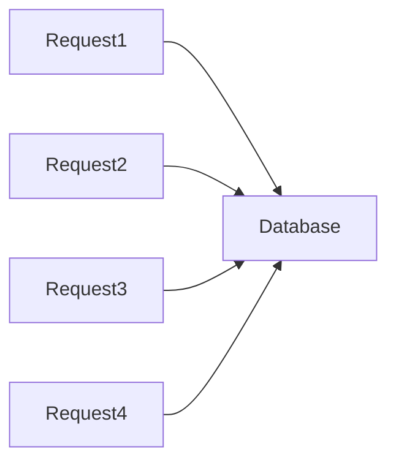
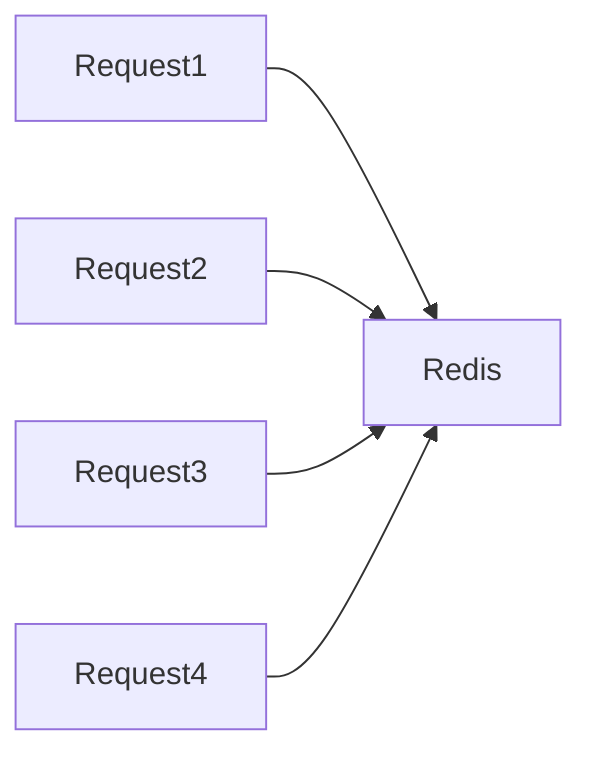
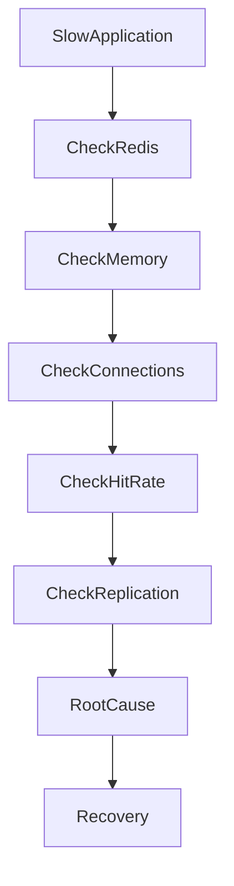
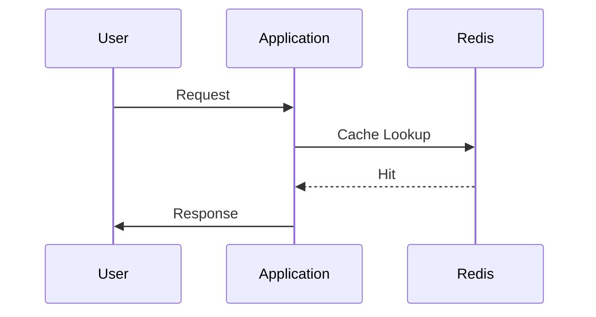
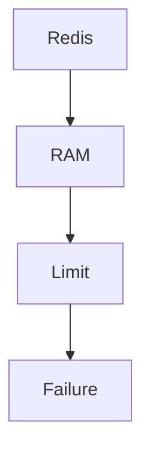
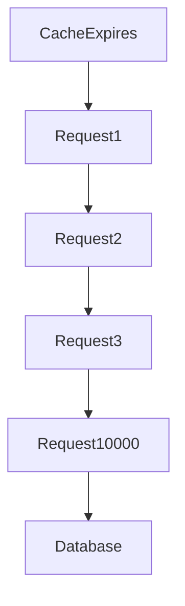
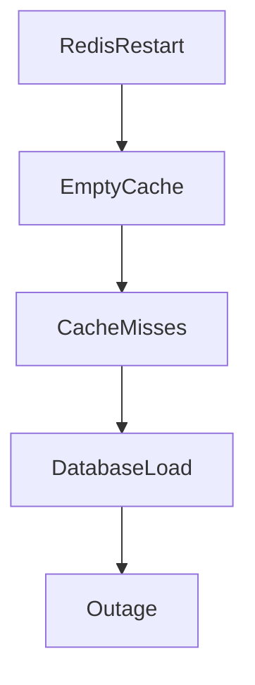

# Redis Cache Failure

## Production Incident Case Study

---

# Scenario

Time: **06:41 PM**

Monitoring begins showing unusual behavior.

```text
Database CPU: 35% → 95%
API Latency: 120ms → 4.8s
Error Rate: Increasing
```

Customer reports start arriving:

```text
Slow Login
Slow Search
Slow Product Pages
Random Timeouts
```

Application servers appear healthy.

```text
CPU: Normal
Memory: Normal
Disk: Normal
```

Database is struggling.

But the database itself was healthy an hour ago.

After investigation, engineers discover:

```text
Redis Cache Failure
```

A small cache outage has triggered a large-scale production incident.

---

# Learning Objectives

After completing this case study you should understand:

* Redis architecture
* Cache fundamentals
* Cache failures
* Cache stampedes
* Hot keys
* Memory exhaustion
* Eviction policies
* Persistence failures
* Replication issues
* Redis troubleshooting methodology
* Cascading failures

---

# Why Redis Is Critical

Many modern systems use Redis as:

* Cache
* Session store
* Rate limiter
* Queue
* Pub/Sub system
* Distributed lock manager

Architecture:


Redis reduces database load.

Without Redis:

```text
Everything Hits Database
```

---

# The Real Purpose Of A Cache

Without cache:



With cache:



Database traffic drops dramatically.

---

# First Rule

When Redis fails:

```text
Do Not Assume Redis Is The Problem
```

Often the real problem is:

* Application misuse
* Memory pressure
* Bad TTL strategy
* Cache stampede
* Network issue

Investigate systematically.

---

# Initial Investigation

Check application metrics.

Observe:

```text
Database Queries Increased 20x
```

This is a major clue.

---

# Investigation Workflow



---

# Step 1: Verify Redis Availability

Check service status.

```bash
systemctl status redis
```

or

```bash
systemctl status redis-server
```

Expected:

```text
active (running)
```

---

# Verify Connectivity

```bash
redis-cli ping
```

Expected:

```text
PONG
```

If:

```text
Connection Refused
```

Redis may be down.

---

# Understanding Redis Request Flow



Fast path.

---

# Cache Miss Flow

```mermaid
sequenceDiagram

User->>Application

Application->>Redis: Lookup

Redis-->>Application: MISS

Application->>Database: Query

Database-->>Application: Data

Application->>Redis: Store

Application-->>User: Response
```

More expensive.

---

# Common Cause #1

## Redis Service Down

Simple but common.

Check:

```bash
systemctl status redis
```

Example:

```text
Active: failed
```

---

# Investigation

Logs:

```bash
journalctl -u redis
```

Look for:

```text
OOM
Port Conflict
Config Error
Disk Error
```

---

# Common Cause #2

## Memory Exhaustion

Redis stores data in RAM.

Eventually memory fills.

---

# Architecture



---

# Detection

```bash
redis-cli INFO memory
```

Example:

```text
used_memory_human:15.9G
maxmemory:16G
```

Danger zone.

---

# Consequences

Redis begins:

```text
Rejecting Writes
Evicting Data
```

depending on configuration.

---

# Common Cause #3

## Wrong Eviction Policy

Redis memory fills.

Policy determines behavior.

Check:

```bash
redis-cli CONFIG GET maxmemory-policy
```

---

# Common Policies

```text
noeviction
allkeys-lru
allkeys-lfu
volatile-lru
volatile-ttl
```

---

# Example Failure

Policy:

```text
noeviction
```

Memory full.

New writes fail.

Application breaks.

---

# Common Cause #4

## Cache Stampede

One of the most dangerous cache failures.

---

# What Happens?

Popular key expires.

Example:

```text
product:123
```

Millions of users request it.

---

# Flow



Suddenly:

```text
10,000 Database Queries
```

for one item.

---

# Result

```text
Database Overload
Application Slowdown
Potential Outage
```

---

# Detection

Look for:

```text
Huge Cache Miss Spike
Database Query Spike
```

at the same timestamp.

---

# Prevention

Techniques:

```text
Cache Warming
Jittered TTLs
Request Coalescing
Background Refresh
```

---

# Common Cause #5

## Hot Key Problem

One key receives enormous traffic.

Example:

```text
homepage
```

or

```text
trending-products
```

---

# Architecture


---

# Symptoms

```text
High CPU
High Latency
Single Shard Overloaded
```

---

# Detection

```bash
redis-cli MONITOR
```

or

```bash
redis-cli --hotkeys
```

---

# Common Cause #6

## Connection Exhaustion

Redis supports limited connections.

---

# Detection

```bash
redis-cli INFO clients
```

Example:

```text
connected_clients:10000
```

Near limit.

---

# Symptoms

```text
Connection Timeout
```

Application cannot reach Redis.

---

# Common Cause #7

## Network Partition

Redis healthy.

Application healthy.

Network broken.

---

# Architecture

```mermaid
flowchart LR

Application

X Network

--> Redis
```

---

# Investigation

From application server:

```bash
nc -zv redis-host 6379
```

Expected:

```text
Connected
```

---

# Common Cause #8

## Persistence Failure

Redis may use:

```text
RDB
AOF
```

for persistence.

---

# Problem

Disk fills.

Persistence fails.

Logs show:

```text
Background save failed
```

---

# Investigation

```bash
redis-cli INFO persistence
```

---

# Common Cause #9

## Replication Failure

Architecture:


Replication stops.

---

# Symptoms

```text
Stale Data
Failover Problems
```

---

# Investigation

```bash
redis-cli INFO replication
```

Example:

```text
master_link_status:down
```

---

# Common Cause #10

## Misconfigured TTL

Developer sets:

```text
TTL = 10 Seconds
```

for critical data.

---

# Result

Constant cache misses.

Database receives:

```text
Huge Query Load
```

---

# Detection

Inspect:

```bash
redis-cli TTL key
```

---

# Common Cause #11

## Redis Restart

Redis restarts unexpectedly.

All cache data disappears.

---

# Architecture



---

# This Is Called

```text
Cold Cache
```

A very common production event.

---

# Detection

Check uptime:

```bash
redis-cli INFO server
```

Example:

```text
uptime_in_seconds:120
```

Redis recently restarted.

---

# Common Cause #12

## Slow Commands

Some Redis commands are expensive.

Examples:

```text
KEYS *
SMEMBERS HugeSet
LRANGE MassiveList
```

---

# Symptoms

```text
Redis CPU 100%
Latency Increased
```

---

# Detection

```bash
redis-cli SLOWLOG GET
```

Extremely useful.

---

# Monitoring Redis

Important metrics:

```text
Memory Usage
Hit Ratio
Miss Ratio
Latency
CPU
Connected Clients
Replication Status
Persistence Status
```

---

# Useful Commands

---

## Server Info

```bash
redis-cli INFO
```

---

## Memory

```bash
redis-cli INFO memory
```

---

## Clients

```bash
redis-cli INFO clients
```

---

## Replication

```bash
redis-cli INFO replication
```

---

## Slow Queries

```bash
redis-cli SLOWLOG GET
```

---

## Latency

```bash
redis-cli --latency
```

---

# Production Investigation Example

Timeline:

```text
18:41 Alert Triggered

18:44 Database CPU Increased

18:47 Redis Memory Full

18:49 Eviction Started

18:52 Cache Hit Rate Dropped

18:55 Database Saturated

19:03 Root Cause Found

19:08 Memory Increased

19:11 Hit Rate Restored

19:14 Platform Healthy
```

---

# Recovery Checklist

### Verify Redis

```bash
redis-cli ping
```

---

### Check Memory

```bash
redis-cli INFO memory
```

---

### Check Clients

```bash
redis-cli INFO clients
```

---

### Check Replication

```bash
redis-cli INFO replication
```

---

### Check Persistence

```bash
redis-cli INFO persistence
```

---

### Check Slow Commands

```bash
redis-cli SLOWLOG GET
```

---

### Verify Hit Rate

```bash
redis-cli INFO stats
```

---

# Root Cause Analysis Example

```text
Incident:
Platform Slowdown

Impact:
Users Experienced 5-10 Second Delays

Root Cause:
Redis Memory Exhaustion

Contributing Factors:
No Memory Alerts
Wrong Eviction Policy

Detection:
Cache Miss Spike
Database CPU Spike

Resolution:
Increased Memory
Changed Eviction Policy

Prevention:
Capacity Planning
Memory Monitoring
Load Testing
```

---

# Prevention Strategies

## Monitor Hit Rate

A cache with poor hit rate provides little value.

---

## Configure Eviction

Avoid:

```text
noeviction
```

unless intentional.

---

## Capacity Planning

Track:

```text
Dataset Growth
Traffic Growth
Memory Growth
```

---

## Protect Against Stampedes

Use:

```text
Staggered TTLs
Cache Warming
Background Refresh
```

---

## Monitor Hot Keys

Identify before they become bottlenecks.

---

# What Senior Engineers Do Differently

Junior Engineer:

```text
Database Slow

Scale Database
```

Senior Engineer:

```text
Why Did Database Load Increase?

Check Cache

Check Hit Rate

Check Redis

Find Root Cause
```

Often the database is merely the victim.

---

# Interview Questions

### What is a cache stampede?

### What is a hot key?

### How do Redis eviction policies work?

### What happens when Redis memory becomes full?

### How would you investigate increasing database load?

### What causes a cold cache event?

### Why can a Redis outage bring down healthy applications?

### What metrics indicate cache health?

---

# Key Takeaway

Redis failures are rarely isolated failures.

A cache sits between applications and databases.

When it breaks:

```text
Database Load Explodes
Latency Increases
Users Suffer
```

The best engineers understand that caches are not performance optimizations.

They are critical infrastructure components.

And when a cache fails, the real challenge is not restoring Redis.

The real challenge is preventing the failure from cascading through the rest of the system.
