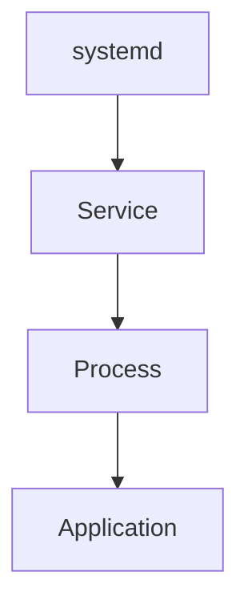
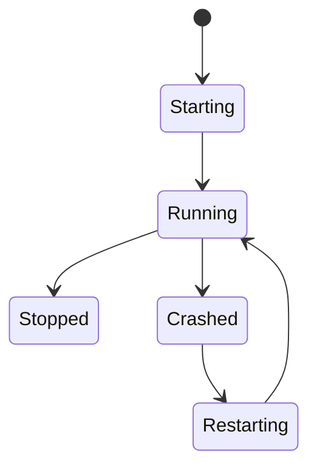
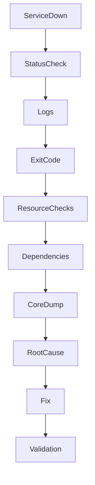
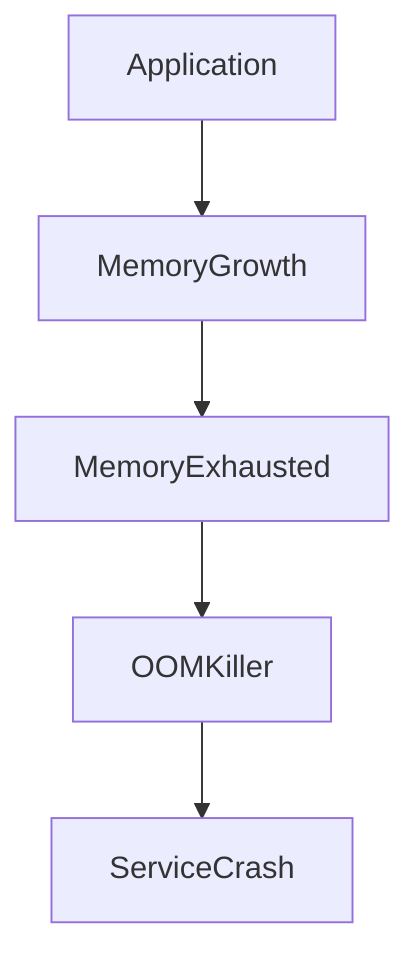
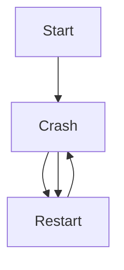

# Service Crash Analysis

## Production Incident Case Study

---

# Scenario

Time: **04:12 PM**

Your monitoring system sends a critical alert.

```text
CRITICAL ALERT

Service: payment-api
Status: DOWN

HTTP Checks: Failing
Availability: 0%
```

A few minutes later:

```text
Users Unable To:

- Login
- Place Orders
- Process Payments
```

Operations engineers connect to the server.

The machine is running.

Network is healthy.

Disk is healthy.

But the service is not running.

When they start it:

```bash
systemctl start payment-api
```

It starts.

Then dies again.

And again.

And again.

The service is trapped in:

```text
START
 ↓
CRASH
 ↓
RESTART
 ↓
CRASH
```

This is one of the most common production incidents.

---

# Learning Objectives

After completing this case study you should understand:

* Service lifecycle
* Process crashes
* systemd troubleshooting
* Crash loops
* Exit codes
* Linux signals
* OOM kills
* Segmentation faults
* Core dumps
* Dependency failures
* Root cause analysis
* Production recovery methodology

---

# Understanding Service Architecture

Most Linux applications run as processes.



If the process dies:

```text
Service Failure
```

---

# Service Lifecycle



A crash means the process unexpectedly exited.

---

# First Rule

Do not immediately restart the service repeatedly.

Many engineers do:

```bash
systemctl restart app
```

Again.

Again.

Again.

This destroys evidence.

Investigate first.

---

# Initial Investigation

Check status.

```bash
systemctl status payment-api
```

Example:

```text
Active: failed
```

Important clues:

```text
Exit Code
Signal
Restart Count
```

---

# Investigation Workflow



---

# Step 1: Check Service Status

```bash
systemctl status payment-api
```

Example:

```text
Main PID: 1234

Result: exit-code

Status: Failed
```

This tells us:

```text
Process Exited
```

Now determine why.

---

# Step 2: Check Logs

Most important step.

```bash
journalctl -u payment-api
```

Recent logs:

```bash
journalctl -u payment-api -n 100
```

Follow logs live:

```bash
journalctl -u payment-api -f
```

Logs often reveal the root cause immediately.

---

# Example

```text
Database connection failed
```

or

```text
Configuration file missing
```

or

```text
Segmentation fault
```

---

# Step 3: Understand Exit Codes

Processes return exit codes.

---

## Exit Code 0

```text
Successful Exit
```

---

## Non-Zero Exit

```text
Failure
```

Example:

```text
Exit Code: 1
```

Generic failure.

---

## Exit Code 127

```text
Command Not Found
```

Example:

```text
Executable missing
```

---

## Exit Code 137

Very important.

```text
128 + 9

SIGKILL
```

Often indicates:

```text
OOM Killer
```

---

## Exit Code 143

```text
128 + 15

SIGTERM
```

Graceful termination.

---

# Linux Signals

Signals frequently terminate services.


Common signals:

| Signal  | Meaning            |
| ------- | ------------------ |
| SIGTERM | Graceful stop      |
| SIGKILL | Force kill         |
| SIGSEGV | Segmentation fault |
| SIGABRT | Program abort      |
| SIGHUP  | Reload             |
| SIGINT  | Interrupt          |

---

# Common Cause #1

## Out Of Memory (OOM)

One of the most frequent causes.

Memory exhausted.

Kernel intervenes.

```text
Memory Full
      ↓
OOM Killer
      ↓
Process Killed
```

---

# Check OOM Logs

```bash
dmesg | grep -i oom
```

Example:

```text
Killed process 1234 (payment-api)
```

Root cause found.

---

# OOM Architecture



---

# Recovery

Immediate:

```bash
systemctl restart service
```

Permanent:

```text
Fix Memory Leak
Increase Limits
Optimize Usage
```

---

# Common Cause #2

## Segmentation Fault

Very common in:

* C
* C++
* Native libraries
* Database engines

---

# What Is A Segfault?

Application accesses memory incorrectly.

```text
Invalid Memory Access
      ↓
SIGSEGV
      ↓
Crash
```

---

# Symptoms

Logs:

```text
Segmentation fault
```

or

```text
core dumped
```

---

# Verify

```bash
journalctl -xe
```

Example:

```text
Process terminated with SIGSEGV
```

---

# Common Cause #3

## Configuration Error

Application starts.

Reads config.

Fails.

Crashes.

---

# Example

```yaml
database:
```

Expected:

```yaml
database:
  host: localhost
```

Missing value causes startup failure.

---

# Symptoms

```text
Configuration Parsing Failed
```

---

# Investigation

Validate config.

```bash
app --config-test
```

or

```bash
nginx -t
```

depending on service.

---

# Common Cause #4

## Missing Dependency

Application requires:

```text
Database
Redis
Filesystem
API
```

Dependency unavailable.

Application exits.

---

# Architecture


---

# Example

Database unavailable.

Logs:

```text
Unable to connect to PostgreSQL
```

Service crashes during startup.

---

# Investigation

Check dependencies.

```bash
systemctl status postgresql
```

```bash
systemctl status redis
```

Verify network connectivity.

---

# Common Cause #5

## Disk Full

Applications often need:

```text
Logs
Temp Files
Cache Files
```

No space available.

Startup fails.

---

# Detection

```bash
df -h
```

Example:

```text
Filesystem 100% Full
```

---

# Common Cause #6

## Permission Issues

Application cannot access required files.

Example:

```text
Permission denied
```

---

# Investigation

Check ownership.

```bash
ls -la
```

Verify service user.

```bash
systemctl cat service-name
```

Example:

```text
User=appuser
```

Confirm permissions.

---

# Common Cause #7

## Port Conflict

Application attempts:

```text
Bind Port 8080
```

Port already in use.

Startup fails.

---

# Detection

```bash
ss -tulpn
```

Example:

```text
8080 already occupied
```

---

# Visualization

```mermaid
flowchart LR

ServiceA

--> Port8080

ServiceB

--> Port8080

X Conflict
```

---

# Common Cause #8

## Crash Loop

systemd configured:

```ini
Restart=always
```

Process crashes instantly.

systemd restarts immediately.

---

# Cycle



---

# Detection

```bash
systemctl status service
```

Example:

```text
Restart Counter: 183
```

Strong indicator.

---

# Common Cause #9

## Software Bug

Application reaches specific code path.

Unexpected exception occurs.

Crash follows.

---

# Example

Node.js:

```javascript
throw new Error();
```

Unhandled exception.

---

# Symptoms

```text
Unhandled Exception
```

in logs.

---

# Common Cause #10

## Resource Limits

Linux enforces limits.

Examples:

```text
Open Files
Processes
Memory
Threads
```

Application exceeds limits.

Fails.

---

# Investigation

Check:

```bash
ulimit -a
```

---

# Example

```text
Too many open files
```

Very common production issue.

---

# Understanding Core Dumps

When applications crash:

```text
Memory Snapshot
```

may be saved.

Called:

```text
Core Dump
```

---

# Why Core Dumps Matter

They preserve:

```text
Process Memory
Stack Trace
Variables
Threads
```

at crash time.

---

# Checking Core Dumps

```bash
coredumpctl list
```

Example:

```text
payment-api
SIGSEGV
```

---

# View Details

```bash
coredumpctl info
```

---

# Debug Core Dump

```bash
coredumpctl gdb
```

Extremely useful for deep analysis.

---

# Production Incident Example

Timeline:

```text
16:12 Alert Triggered

16:14 Service Found Down

16:16 Restart Attempted

16:17 Immediate Crash

16:20 Logs Reviewed

16:23 OOM Event Found

16:30 Memory Leak Identified

16:42 Patch Applied

16:50 Service Stable
```

---

# Recovery Checklist

### Check Status

```bash
systemctl status service
```

### Review Logs

```bash
journalctl -u service
```

### Check Memory

```bash
free -h
```

### Check OOM

```bash
dmesg | grep -i oom
```

### Check Disk

```bash
df -h
```

### Check Ports

```bash
ss -tulpn
```

### Check Dependencies

```bash
systemctl status dependency
```

### Check Core Dumps

```bash
coredumpctl list
```

---

# Root Cause Analysis Example

```text
Incident:
Payment API Crash Loop

Impact:
Payment processing unavailable

Root Cause:
Memory leak caused OOM kill

Contributing Factors:
No memory alerts
No load testing

Detection:
Service crash monitoring

Resolution:
Fixed memory leak
Adjusted memory limits

Prevention:
Memory dashboards
OOM alerts
Capacity planning
```

---

# Monitoring Recommendations

Monitor:

* Service uptime
* Restart count
* Exit codes
* OOM events
* Core dumps
* Memory usage
* Dependency health
* Port availability

---

# Preventive Engineering

## Health Checks

Implement:

```text
Liveness Probe
Readiness Probe
Health Endpoint
```

---

## Structured Logging

Logs should clearly show:

```text
Startup
Shutdown
Errors
Dependency Failures
```

---

## Resource Alerts

Alert before:

```text
Memory Exhaustion
Disk Exhaustion
Connection Exhaustion
```

---

## Dependency Monitoring

Monitor:

```text
Database
Redis
Message Queue
External APIs
```

---

## Load Testing

Many crashes appear only under production load.

Test beforehand.

---

# What Senior Engineers Do Differently

Junior Engineer:

```text
Service Crashed
Restart It
```

Senior Engineer:

```text
Why Did It Crash?

What Evidence Exists?

What Triggered It?

Can It Happen Again?

How Do We Prevent It?
```

The restart restores service.

The investigation restores reliability.

---

# Interview Questions

### What is the difference between SIGTERM and SIGKILL?

### What causes Exit Code 137?

### How would you investigate a crash loop?

### What is a segmentation fault?

### How do core dumps help debugging?

### How can dependency failures crash applications?

### What is the role of systemd in service management?

### Why is repeatedly restarting a crashed service a bad troubleshooting strategy?

---

# Key Takeaway

A service crash is never the root cause.

It is only the symptom.

Behind every crash is a chain of events:

```text
Bug
Configuration
Resource Exhaustion
Dependency Failure
Infrastructure Issue
```

The goal of a production engineer is not merely to restart services.

The goal is to uncover the chain, identify the true cause, eliminate it, and make the system more reliable than it was before the incident.

That is the difference between operating systems and engineering systems.
