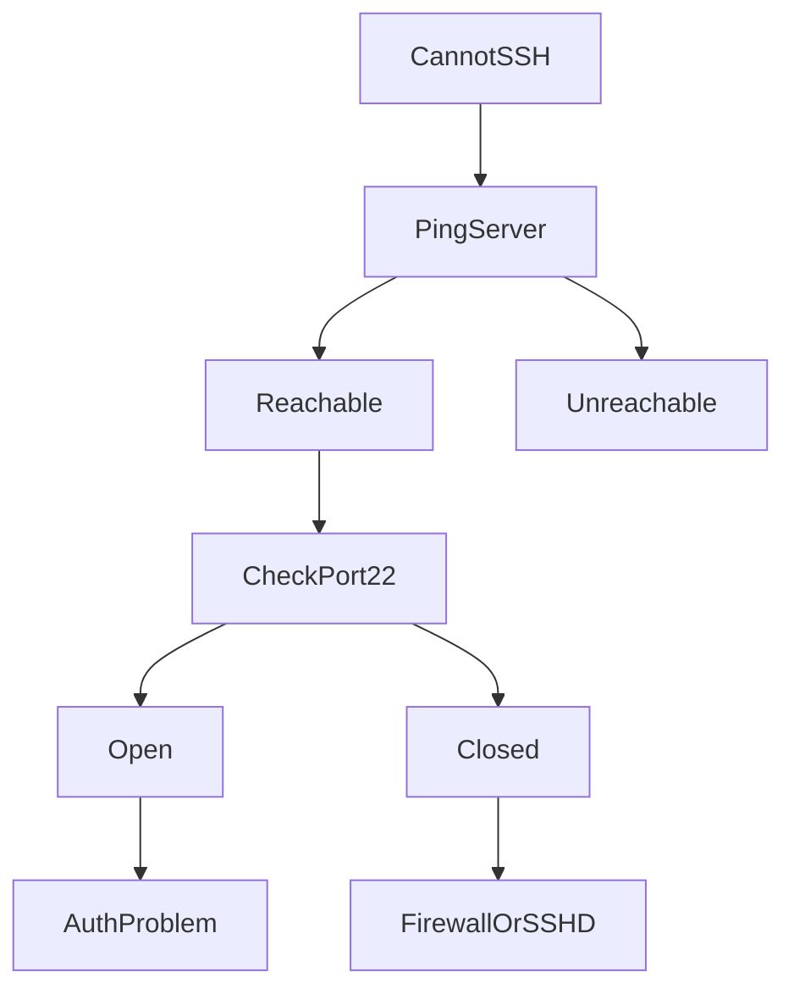

# SSH Lockout

## Production Incident Case Study

---

# Scenario

Time: **11:20 PM**

A routine security hardening change has just been deployed.

An engineer updates:

```text
/etc/ssh/sshd_config
```

and applies the changes:

```bash
systemctl restart sshd
```

Everything appears normal.

The engineer closes the SSH session.

A few minutes later:

```text
ssh admin@production-server

Connection refused
```

Another engineer tries:

```text
Permission denied
```

A third engineer receives:

```text
Connection timed out
```

Suddenly nobody can access the production server.

The application is still running.

The server is still online.

But the operations team has lost access.

This is one of the most dangerous Linux incidents because recovery may require:

* Cloud console access
* Out-of-band management
* Rescue mode
* Physical access

---

# Learning Objectives

After completing this case study you should understand:

* SSH architecture
* Authentication flow
* Common lockout causes
* Firewall-related failures
* SSH configuration mistakes
* Permission issues
* PAM failures
* Cloud security group problems
* Recovery procedures
* Prevention strategies

---

# Why SSH Matters

SSH is usually the primary management channel for Linux servers.

```mermaid
flowchart LR

Engineer

--> SSH Client

--> Network

--> SSH Server

--> Linux System
```

When SSH fails:

```text
Management Access Lost
```

Applications may continue working normally while engineers are locked out.

---

# First Rule

Never assume the server is down.

The problem may only affect SSH.

Verify separately:

```bash
ping server-ip
```

Check website:

```bash
curl https://application.com
```

Possible result:

```text
Website Works
SSH Broken
```

This narrows the investigation.

---

# Understanding SSH Connection Flow

```mermaid
flowchart TD

SSH Client

--> Network

--> Firewall

--> Port 22

--> SSH Daemon

--> Authentication

--> Shell Access
```

Failure can occur at any layer.

---

# Step 1: Identify the Error Type

SSH errors provide valuable clues.

---

## Error Type 1

```text
Connection timed out
```

Usually indicates:

* Firewall issue
* Security group issue
* Network issue
* Server unreachable

---

## Error Type 2

```text
Connection refused
```

Usually indicates:

* SSH daemon stopped
* SSH daemon failed to start
* Wrong listening port

---

## Error Type 3

```text
Permission denied
```

Usually indicates:

* Authentication failure
* Key issue
* User issue
* Permission issue

---

## Error Type 4

```text
No route to host
```

Usually indicates:

* Routing issue
* Network failure
* Security policy

---

# Step 2: Verify Reachability

Check network connectivity.

```bash
ping server-ip
```

If reachable:

```text
Server Alive
```

Good.

Now check SSH port.

```bash
nc -zv server-ip 22
```

or

```bash
telnet server-ip 22
```

---

# Expected Output

```text
Connected
```

If not:

```text
Connection timed out
```

Likely network or firewall problem.

---

# Investigation Decision Tree



---

# Common Cause #1

## SSH Service Stopped

The daemon may not be running.

Access through cloud console or rescue console.

Check:

```bash
systemctl status sshd
```

Example:

```text
Active: failed
```

SSH service is down.

---

# Check Logs

```bash
journalctl -u sshd
```

Example:

```text
Failed to start OpenSSH server
```

Investigate further.

---

# Common Cause #2

## Invalid SSH Configuration

A very common production mistake.

Engineer edits:

```text
/etc/ssh/sshd_config
```

Adds:

```text
AllowUsers admin
```

But actual login user:

```text
ubuntu
```

Result:

```text
Permission denied
```

---

# Another Example

Broken configuration:

```text
Port
```

Missing value.

Restart:

```bash
systemctl restart sshd
```

Result:

```text
Service fails
```

---

# Proper Validation

Always run:

```bash
sshd -t
```

Before restarting.

Example:

```text
Syntax OK
```

Only then reload SSH.

---

# Common Cause #3

## Wrong SSH Port

Engineer changes:

```text
Port 22
```

to:

```text
Port 2222
```

Restarts service.

Users still connect to:

```bash
ssh user@server
```

Result:

```text
Connection refused
```

---

# Verify Listening Ports

Through console access:

```bash
ss -tulpn | grep ssh
```

Example:

```text
0.0.0.0:2222
```

Actual port differs.

Connect using:

```bash
ssh -p 2222 user@server
```

---

# Common Cause #4

## Firewall Misconfiguration

Engineer updates:

```bash
iptables
```

or

```bash
ufw
```

Accidentally blocks SSH.

Example:

```bash
ufw deny 22
```

Result:

```text
SSH inaccessible
```

---

# Verify UFW

```bash
ufw status
```

Example:

```text
22/tcp DENY
```

Root cause identified.

---

# Verify IPTables

```bash
iptables -L -n
```

Look for rules dropping:

```text
tcp/22
```

---

# Firewall Failure Architecture

```mermaid
flowchart LR

Engineer

--> Internet

--> Firewall

X SSH

--> Server
```

---

# Common Cause #5

## Cloud Security Group Error

Very common in cloud environments.

Examples:

* AWS Security Groups
* Azure NSGs
* GCP Firewall Rules

Engineer removes:

```text
TCP 22
```

from allowed inbound traffic.

Result:

```text
Server healthy
SSH inaccessible
```

---

# Investigation

Verify cloud firewall rules.

Check:

```text
Inbound Rules
```

Ensure:

```text
TCP 22 Allowed
```

from trusted IP ranges.

---

# Common Cause #6

## Authorized Keys Problem

SSH key deleted.

Example:

```text
~/.ssh/authorized_keys
```

accidentally removed.

Result:

```text
Permission denied (publickey)
```

---

# Verify

Check:

```bash
ls -la ~/.ssh
```

Inspect:

```bash
cat ~/.ssh/authorized_keys
```

---

# Common Cause #7

## Incorrect File Permissions

SSH is extremely strict.

Wrong permissions:

```text
~/.ssh = 777
```

or

```text
authorized_keys = 777
```

SSH rejects them.

---

# Correct Permissions

```bash
chmod 700 ~/.ssh
chmod 600 ~/.ssh/authorized_keys
```

Verify ownership:

```bash
chown user:user ~/.ssh -R
```

---

# Common Cause #8

## PAM Failure

Authentication may depend on PAM.

Architecture:


Broken PAM configuration:

```text
/etc/pam.d/
```

can lock out all users.

---

# Verify Logs

```bash
journalctl -xe
```

Look for:

```text
PAM authentication failure
```

---

# Common Cause #9

## Disk Full

Surprisingly common.

SSH needs temporary files and logging.

Check:

```bash
df -h
```

Example:

```text
Filesystem 100% Full
```

SSH may fail to function correctly.

---

# Common Cause #10

## User Account Locked

Check:

```bash
passwd -S username
```

Example:

```text
Locked
```

Unlock:

```bash
passwd -u username
```

---

# Common Cause #11

## Expired Account

Verify:

```bash
chage -l username
```

Example:

```text
Account expired
```

Users cannot log in.

---

# Production Recovery Methods

When SSH is inaccessible:

---

## Method 1

### Existing SSH Session

Best-case scenario.

Never close the active session.

Use it to investigate.

---

## Method 2

### Cloud Console Access

Most cloud providers provide serial console access.

Examples:

* AWS EC2 Serial Console
* Azure Serial Console
* GCP Serial Console

Use console access to repair SSH.

---

## Method 3

### Rescue Mode

Boot into rescue environment.

Mount filesystem.

Repair configuration.

---

## Method 4

### Snapshot and Recovery

Create snapshot.

Attach disk to another instance.

Repair configuration.

Reattach disk.

---

# Example Incident Timeline

```text
23:20 SSH Hardening Applied

23:21 sshd Restarted

23:25 Engineer Logs Out

23:26 Login Failure Reported

23:30 Cloud Console Accessed

23:34 sshd -t Shows Config Error

23:37 Configuration Fixed

23:38 sshd Restarted

23:39 SSH Access Restored
```

---

# Root Cause Analysis Example

```text
Incident:
Production SSH Lockout

Impact:
Operations team unable to access server

Root Cause:
Invalid sshd_config deployed

Contributing Factors:
Configuration not validated

Detection:
Login attempts failed

Resolution:
Fixed configuration through cloud console

Prevention:
Mandatory sshd -t validation
Change review process
Emergency access procedures
```

---

# Prevention Strategy

## Always Keep Existing Session Open

Never do this:

```bash
systemctl restart sshd
exit
```

Instead:

Open a second SSH session.

Verify login.

Then close the original session.

---

# Validate Configuration

Always:

```bash
sshd -t
```

before:

```bash
systemctl restart sshd
```

---

# Use Reload Instead of Restart

Prefer:

```bash
systemctl reload sshd
```

when possible.

---

# Maintain Emergency Access

Document:

* Cloud console procedures
* Recovery accounts
* Break-glass access methods

---

# Restrict Firewall Changes

Use change reviews.

Test before deployment.

---

# Monitoring Recommendations

Monitor:

* SSH service health
* Port 22 availability
* Failed login spikes
* Firewall changes
* Security group modifications

---

# What Senior Engineers Do Differently

Junior Engineer:

```text
Edit config
Restart SSH
Hope for the best
```

Senior Engineer:

```text
Validate config
Open second session
Test login
Apply change
Verify access
Document rollback
```

---

# Interview Questions

### What is the difference between "Connection refused" and "Connection timed out"?

### How would you recover from an SSH lockout on a cloud server?

### Why should you run sshd -t before restarting SSH?

### How can incorrect file permissions prevent SSH login?

### What role does PAM play in SSH authentication?

### How can a firewall block SSH while the server remains healthy?

### Why is keeping an existing SSH session open considered a best practice?

---

# Key Takeaway

SSH lockouts are rarely caused by a single bug.

Most occur because engineers modify a critical access path without validating the change.

The safest production engineers always assume:

```text
If I make this change,
how will I get back in
if it fails?
```

That mindset prevents outages before they happen.
