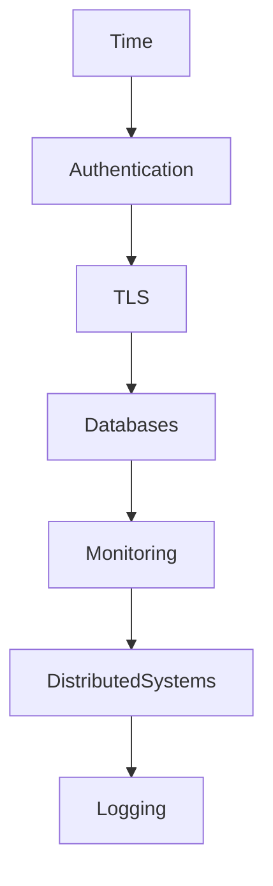
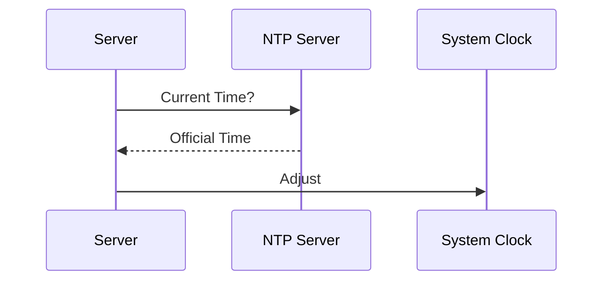
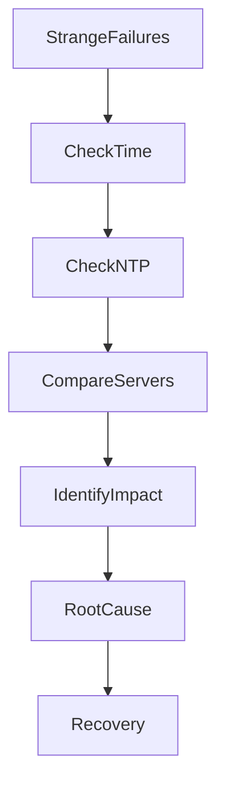
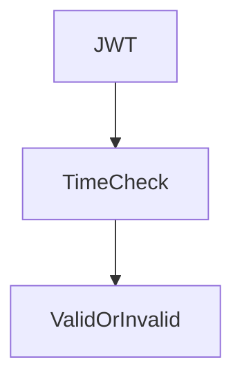
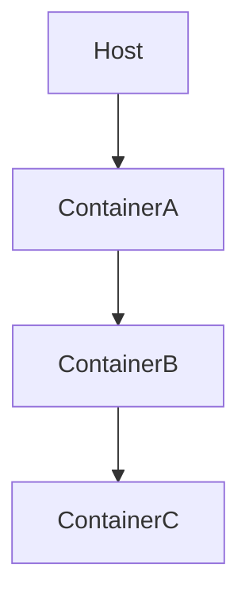
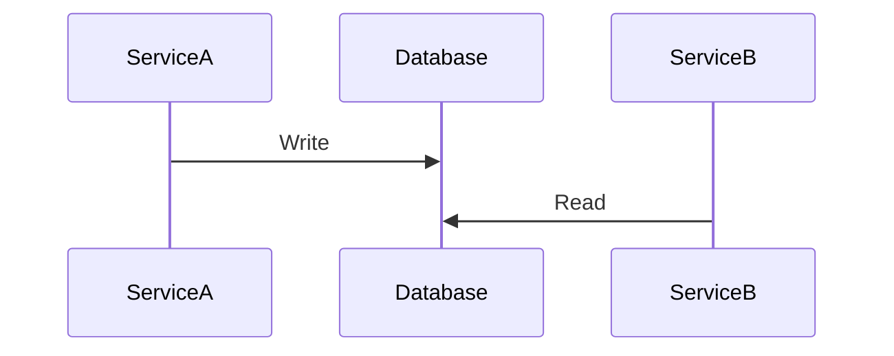

# Time Sync Disaster

## Production Incident Case Study

---

# Scenario

Time: **09:14 AM**

Customer support reports strange issues.

```text
Users Randomly Logged Out

Authentication Failures

API Tokens Rejected

Database Replication Errors
```

Monitoring shows:

```text
CPU: Healthy

Memory: Healthy

Network: Healthy

Disk: Healthy
```

Application logs show:

```text
Token Expired

Certificate Not Yet Valid

Timestamp Mismatch
```

Different services disagree about reality.

One service believes:

```text
09:14 AM
```

Another believes:

```text
09:21 AM
```

A third believes:

```text
09:07 AM
```

After investigation:

```text
Time Synchronization Failure
```

A seemingly small clock issue has caused widespread production failures.

---

# Learning Objectives

After completing this case study you should understand:

* Time synchronization fundamentals
* NTP architecture
* Clock drift
* Distributed systems time problems
* Authentication failures caused by time
* TLS failures caused by time
* Replication problems
* Event ordering issues
* Monitoring time-related incidents
* Production recovery procedures

---

# Why Time Matters

Most engineers think:

```text
Time Only Affects Logs
```

Wrong.

Time affects:

* Authentication
* TLS certificates
* Databases
* Distributed systems
* Monitoring
* Alerting
* Backups
* Replication

---

# Modern Infrastructure Depends On Time



If time breaks:

```text
Everything Behaves Strangely
```

---

# First Rule

Never assume clocks are correct.

Verify them.

---

# Understanding System Time

Linux stores:

```text
System Clock
```

And synchronizes it using:

```text
NTP
```

(Network Time Protocol)

---

# Architecture


---

# Typical Synchronization Flow



---

# What Is Clock Drift?

Every computer clock slowly becomes inaccurate.

---

# Example

```text
Server A

09:00:00
```

After weeks:

```text
09:00:08
```

---

# Another Server

```text
08:59:52
```

Now systems disagree.

---

# Investigation Workflow



---

# Step 1: Check Time

```bash
date
```

Compare across servers.

---

# Example

Server A:

```text
09:14:05
```

Server B:

```text
09:20:12
```

Problem confirmed.

---

# Step 2: Verify Synchronization

```bash
timedatectl
```

Look for:

```text
System clock synchronized: yes
```

---

# Step 3: Verify NTP Status

```bash
chronyc tracking
```

or

```bash
ntpq -p
```

---

# Common Cause #1

## NTP Service Failure

Service stopped.

---

# Example

```bash
systemctl status chronyd
```

Output:

```text
inactive (dead)
```

---

# Result

Clock begins drifting.

---

# Symptoms

```text
Slowly Increasing Time Differences
```

---

# Common Cause #2

## Firewall Blocking NTP

NTP uses:

```text
UDP 123
```

---

# Architecture

```mermaid
flowchart LR

Server

X Firewall

--> NTP
```

---

# Result

No synchronization.

---

# Investigation

```bash
nc -vu ntp-server 123
```

---

# Common Cause #3

## Authentication Token Failures

JWT tokens contain:

```text
Issued At

Expiration
```

---

# Example

Server Time:

```text
09:00
```

Token Time:

```text
08:45
```

---

# Validation Fails.

---

# Architecture



---

# Symptoms

```text
Random Login Failures
```

---

# Common Cause #4

## TLS Certificate Problems

Certificates contain:

```text
Valid From

Valid Until
```

---

# Example

Certificate:

```text
Valid From

09:00
```

Server:

```text
08:45
```

---

# Result

```text
Certificate Not Yet Valid
```

---

# Symptoms

```text
TLS Handshake Failure
```

---

# Common Cause #5

## Kerberos Authentication Failure

Kerberos depends heavily on time.

---

# Requirement

Typically:

```text
Less Than 5 Minutes Difference
```

---

# Example

Server:

```text
09:00
```

Client:

```text
09:12
```

---

# Result

```text
Authentication Rejected
```

---

# Common Cause #6

## Database Replication Issues

Replication systems rely on timestamps.

---

# Architecture


---

# Problem

Replica time differs significantly.

---

# Result

```text
Replication Errors

Ordering Problems
```

---

# Common Cause #7

## Distributed Lock Failures

Systems use time-based locks.

---

# Example

Redis Lock:

```text
Expires In 30 Seconds
```

---

# Clock incorrect.

Lock expires unexpectedly.

---

# Result

```text
Data Corruption Risk
```

---

# Common Cause #8

## Monitoring Failure

Monitoring systems rely on timestamps.

---

# Example

Metrics:

```text
10:00

09:58

10:01
```

Out of order.

---

# Result

```text
Broken Dashboards

Missing Alerts
```

---

# Common Cause #9

## Event Ordering Problems

Distributed systems generate events.

---

# Example

```text
Order Created

Order Paid

Order Delivered
```

Expected order.

---

# Clock skew causes:

```text
Order Delivered

Order Created

Order Paid
```

Impossible timeline.

---

# Investigation

Compare timestamps carefully.

---

# Common Cause #10

## Container Time Issues

Containers inherit host time.

---

# Architecture



---

# Host wrong.

All containers wrong.

---

# Common Cause #11

## VM Snapshot Problems

VM restored from old snapshot.

---

# Result

```text
Clock Jumps Backward
```

---

# Symptoms

```text
Authentication Errors

Replication Problems
```

---

# Common Cause #12

## Leap Second Bugs

Rare but famous.

---

# Example

Additional second inserted.

Some software mishandles:

```text
23:59:60
```

---

# Result

```text
Unexpected Crashes

High CPU

Scheduling Problems
```

---

# Understanding Clock Skew

Definition:

```text
Difference Between Clocks
```

---

# Example

```text
Server A

10:00
```

Server B:

```text
10:00:07
```

Skew:

```text
7 Seconds
```

---

# Why Distributed Systems Care

Distributed systems assume:

```text
Events Occur In Order
```

Clock skew breaks that assumption.

---

# Event Timeline Example



Incorrect clocks make debugging extremely difficult.

---

# Useful Commands

Current Time:

```bash
date
```

---

# Time Status

```bash
timedatectl
```

---

# Chrony Status

```bash
chronyc tracking
```

---

# NTP Sources

```bash
chronyc sources
```

---

# NTP Peers

```bash
ntpq -p
```

---

# Verify Time Across Servers

```bash
date
```

Run on multiple systems.

---

# Production Investigation Example

Timeline:

```text
09:14 Authentication Failures

09:18 TLS Errors

09:21 Replication Alerts

09:27 NTP Investigation

09:32 Chronyd Failure Found

09:36 Synchronization Restored

09:41 Services Recovering

09:48 Incident Closed
```

---

# Recovery Checklist

### Check System Time

```bash
date
```

---

### Check Synchronization

```bash
timedatectl
```

---

### Check Chrony

```bash
systemctl status chronyd
```

---

### Check NTP Sources

```bash
chronyc sources
```

---

### Compare Servers

```text
Are Clocks Consistent?
```

---

### Verify Authentication

```text
JWT

Kerberos

TLS
```

---

### Validate Recovery

```text
Errors Decreasing
```

---

# Root Cause Analysis Example

```text
Incident:
Authentication Failures

Impact:
40% Login Failure Rate

Root Cause:
Chrony Service Stopped

Contributing Factors:
No Time Drift Alerts

Detection:
Customer Reports

Resolution:
Restarted NTP Service
Resynchronized Clocks

Prevention:
NTP Monitoring
Time Drift Alerts
Redundant Time Sources
```

---

# Monitoring Recommendations

Monitor:

* NTP status
* Clock drift
* Time offset
* Synchronization status
* Authentication failures
* TLS validation errors
* Replication health
* Monitoring timestamps

---

# Prevention Strategies

## Multiple NTP Sources

Never depend on one server.

---

## Monitor Time Drift

Alert when:

```text
Offset > 100ms
```

or

```text
Offset > 1s
```

depending on requirements.

---

## Use Chrony

Modern Linux recommendation.

---

## Regular Audits

Verify synchronization across infrastructure.

---

## Time-Aware Design

Assume clocks may drift.

---

# What Senior Engineers Do Differently

Junior Engineer:

```text
Authentication Broken

Must Be Application Bug
```

Senior Engineer:

```text
Authentication

TLS

Replication

All Failing?

Check Time
```

---

# Interview Questions

### What is NTP?

### What is clock drift?

### Why does JWT authentication depend on time?

### How can incorrect time break TLS?

### What is clock skew?

### Why are distributed systems sensitive to time?

### What is Chrony?

### How would you investigate strange authentication failures?

---

# Key Takeaway

Time is one of the most critical dependencies in modern infrastructure.

Most engineers only notice it when:

```text
Everything Starts Breaking
```

Authentication.

Certificates.

Replication.

Monitoring.

Distributed coordination.

All depend on a shared understanding of time.

The most dangerous thing about time failures is that they rarely look like time failures.

They look like:

```text
Random Bugs

Intermittent Errors

Impossible Behavior
```

The best production engineers remember a simple rule:

```text
When Systems Disagree About Reality,

Check The Clock First.
```
