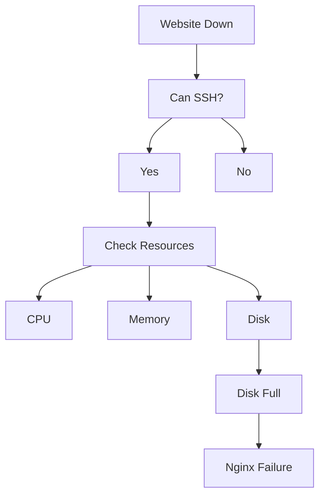

# Web Server Down

## Production Incident Case Study

---

# Scenario

It is 2:15 AM.

Your monitoring system suddenly starts sending alerts.

```text
CRITICAL ALERT

Website: www.company.com
Status: DOWN
HTTP Response: No Response
Affected Users: 100%
Impact: Revenue Loss
```

Customers cannot access the website.

Management is asking for updates.

The pressure is high.

What do you do?

---

# Learning Objectives

After completing this case study, you should be able to:

* Handle real production outages
* Follow a structured troubleshooting process
* Identify whether the issue is:

  * Network
  * DNS
  * Linux OS
  * Web Server
  * Application
  * Database
* Perform root cause analysis
* Create preventive actions

---

# The First Rule of Incident Response

Never assume.

Always verify.

Most engineers fail because they jump directly to conclusions.

Bad:

```text
Website is down.
Must be Nginx.
Restart Nginx.
```

Good:

```text
Website is down.
Let's identify exactly where the failure exists.
```

---

# Understanding Request Flow

Before troubleshooting, understand the complete path.


Failure can occur anywhere.

---

# Step 1: Confirm the Incident

First verify that the website is actually down.

From your machine:

```bash
curl -I https://www.company.com
```

Possible result:

```text
curl: Connection timed out
```

Try:

```bash
ping www.company.com
```

Try:

```bash
nslookup www.company.com
```

Try:

```bash
dig www.company.com
```

Goal:

Determine whether:

```text
DNS issue
or
Network issue
or
Server issue
```

---

# Step 2: Can We Reach the Server?

Try SSH.

```bash
ssh admin@server-ip
```

Possible outcomes:

### Case A

```text
Connection refused
```

Meaning:

```text
Server reachable
SSH service not running
```

---

### Case B

```text
Connection timed out
```

Meaning:

```text
Network problem
Firewall issue
Server unreachable
```

---

### Case C

```text
Connected successfully
```

Good.

Now investigate the server.

---

# Step 3: Check System Health

Immediately collect basic information.

```bash
uptime
```

Example:

```text
02:20:11 up 45 days,
load average: 78.23, 65.11, 54.01
```

Huge load.

Possible CPU bottleneck.

---

Check memory.

```bash
free -h
```

Example:

```text
Mem: 8G
Used: 7.9G
Free: 100M
```

Possible memory exhaustion.

---

Check disk.

```bash
df -h
```

Example:

```text
Filesystem Size Used Avail Use%
/dev/sda1 100G 100G 0 100%
```

Disk full.

Potential root cause.

---

# Step 4: Check Network Ports

Verify listening services.

```bash
ss -tulpn
```

or

```bash
netstat -tulpn
```

Expected:

```text
80/tcp
443/tcp
```

If missing:

```text
Web server is not running
```

---

# Step 5: Check Nginx Status

```bash
systemctl status nginx
```

Possible output:

```text
Active: failed
```

Now inspect logs.

```bash
journalctl -u nginx
```

Example:

```text
No space left on device
```

Interesting.

---

# Step 6: Examine Logs

Check:

```bash
tail -100 /var/log/nginx/error.log
```

Possible output:

```text
write() failed
No space left on device
```

Now we have evidence.

---

# Root Cause Candidate #1

## Disk Full

The web server cannot write logs.

Nginx fails.

Website becomes unavailable.

---

# Investigation Tree



---

# Fix

Identify large files.

```bash
du -sh /*
```

or

```bash
du -sh /var/*
```

Find offenders.

Example:

```text
/var/log/app.log = 65GB
```

Compress:

```bash
gzip app.log
```

or remove:

```bash
truncate -s 0 app.log
```

---

# Restart Service

```bash
systemctl restart nginx
```

Verify:

```bash
systemctl status nginx
```

Expected:

```text
active (running)
```

---

# Validate Recovery

```bash
curl localhost
```

Expected:

```html
200 OK
```

Test externally:

```bash
curl https://www.company.com
```

Website should respond.

---

# Timeline Example

```text
02:15 Alert Triggered

02:17 Incident Acknowledged

02:20 Server Accessed

02:24 Disk Full Identified

02:28 Logs Cleaned

02:30 Nginx Restarted

02:31 Website Restored

02:35 Monitoring Green
```

---

# Alternative Root Causes

The same symptom can have many causes.

---

## Cause #2: Nginx Process Crashed

Check:

```bash
systemctl status nginx
```

Logs:

```bash
journalctl -xe
```

Possible reasons:

* Segmentation fault
* Bad module
* Invalid configuration

---

## Cause #3: Configuration Error

Someone deployed:

```nginx
server {
    listen 80
```

Missing bracket.

Test:

```bash
nginx -t
```

Output:

```text
configuration test failed
```

Fix configuration.

---

## Cause #4: SSL Certificate Expired

Symptoms:

```text
Browser security warning
```

Check:

```bash
openssl s_client \
-connect domain.com:443
```

Verify expiration.

---

## Cause #5: Database Failure

Architecture:


Website appears down.

But Nginx is healthy.

Problem is database.

Check:

```bash
systemctl status mysql
```

or

```bash
systemctl status postgresql
```

---

## Cause #6: Memory Exhaustion

Check:

```bash
dmesg | grep -i oom
```

Possible output:

```text
Killed process nginx
```

OOM Killer terminated services.

---

## Cause #7: CPU Saturation

Check:

```bash
top
```

or

```bash
htop
```

Example:

```text
CPU: 100%
```

Investigate:

```bash
ps aux --sort=-%cpu
```

---

## Cause #8: DNS Failure

Website healthy.

DNS broken.

Users cannot resolve domain.

Check:

```bash
dig domain.com
```

---

# Root Cause Analysis (RCA)

Good RCA:

```text
Incident:
Website unavailable.

Impact:
100% users affected.

Root Cause:
Application logs filled root partition.

Trigger:
Unexpected debug logging enabled.

Why Detection Failed:
Disk monitoring threshold not configured.

Resolution:
Removed logs and restarted Nginx.

Prevention:
Disk alerts at 80%, 90%, 95%.
Enable log rotation.
```

---

# Preventive Engineering

Production engineers don't stop after fixing.

They prevent recurrence.

---

## Enable Log Rotation

```bash
logrotate
```

Example:

```text
Daily rotation
Compress logs
Retain 30 days
```

---

## Disk Monitoring

Alert Levels:

```text
70% Warning
80% High
90% Critical
95% Emergency
```

---

## Health Checks

```bash
curl localhost/health
```

Every minute.

---

## Monitoring Stack


---

# What Senior Engineers Do Differently

Junior Engineer:

```text
Restart Nginx
```

Senior Engineer:

```text
Find root cause
Verify recovery
Document incident
Prevent recurrence
Improve monitoring
```

---

# Production Lessons

1. Never assume the cause.
2. Follow the request path.
3. Verify every layer.
4. Use evidence from logs.
5. Build a timeline.
6. Perform RCA.
7. Implement prevention.
8. Every outage is a learning opportunity.

---

# Interview Questions

### Why can a disk-full condition bring down a web server?

### How would you distinguish between DNS and web-server failures?

### What logs would you inspect first?

### What does HTTP 502 usually indicate?

### How do you verify whether Nginx or the application is failing?

### What metrics would you monitor to prevent similar incidents?

### What information should be included in an RCA document?

---

# Key Takeaway

When a website goes down, the goal is not to restart services as quickly as possible.

The goal is to systematically identify the failing layer, restore service safely, understand the root cause, and ensure the incident never happens again.

That mindset is what separates a Linux user from a Production Engineer.
