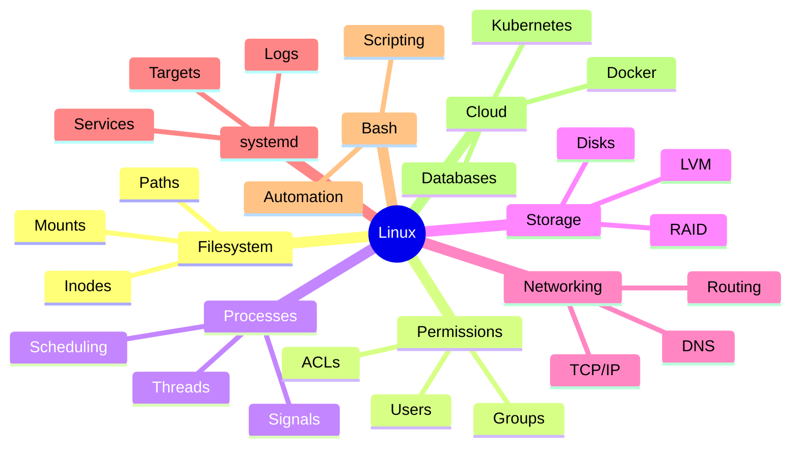
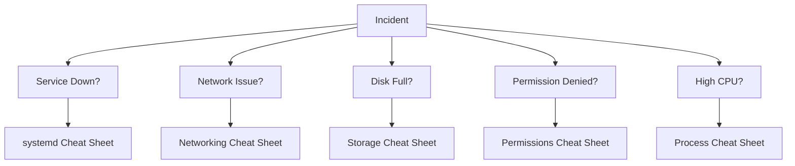

# Linux Engineering Handbook - Cheatsheets

## Why This Directory Exists

Most cheat sheets are designed for memorization.

This repository is not.

The purpose of this directory is to provide:

* Rapid recall during daily work
* Production incident references
* Interview revision material
* Troubleshooting shortcuts
* Command lookup guides
* Architecture refreshers

These cheat sheets are intended to complement the deep-learning modules throughout the Linux Engineering Handbook.

They are not replacements for understanding.

---

# Philosophy

A junior engineer asks:

```text
What command should I run?
```

A senior engineer asks:

```text
What subsystem is failing?
```

These cheat sheets are organized around Linux subsystems rather than command categories.

The goal is to help engineers think in systems.

---

# Learning Path

Follow this order if you are new to Linux:


---

# Cheatsheet Overview

## Commands Cheat Sheet

File:

```text
commands-cheatsheet.md
```

Focus:

```text
Core Linux Commands
Navigation
Searching
Process Operations
Networking Commands
Storage Commands
Service Commands
```

Use When:

```text
You need quick command recall.
```

---

## Filesystem Cheat Sheet

File:

```text
filesystem-cheatsheet.md
```

Focus:

```text
Filesystem Hierarchy
Paths
Inodes
Links
Mounts
Filesystems
Docker Storage Paths
```

Use When:

```text
You are troubleshooting files, storage, mounts, or directories.
```

---

## Permissions Cheat Sheet

File:

```text
permissions-cheatsheet.md
```

Focus:

```text
Ownership
Permissions
ACLs
Capabilities
SUID
SGID
Sticky Bit
```

Use When:

```text
You see "Permission Denied".
```

---

## Process Cheat Sheet

File:

```text
process-cheatsheet.md
```

Focus:

```text
Process Lifecycle
Signals
Scheduling
Threads
OOM Killer
cgroups
```

Use When:

```text
Applications are slow, hung, or consuming resources.
```

---

## Storage Cheat Sheet

File:

```text
storage-cheatsheet.md
```

Focus:

```text
Disks
Partitions
Filesystems
RAID
LVM
IOPS
Latency
```

Use When:

```text
Disk usage or storage performance becomes an issue.
```

---

## Networking Cheat Sheet

File:

```text
networking-cheatsheet.md
```

Focus:

```text
TCP/IP
DNS
Routing
Sockets
Packet Capture
Firewalls
Cloud Networking
```

Use When:

```text
Connectivity problems occur.
```

---

## systemd Cheat Sheet

File:

```text
systemd-cheatsheet.md
```

Focus:

```text
Services
Boot Process
Targets
journald
Timers
Dependencies
```

Use When:

```text
Services fail to start or boot issues occur.
```

---

## Bash Cheat Sheet

File:

```text
bash-cheatsheet.md
```

Focus:

```text
Shell Scripting
Variables
Pipes
Redirection
Automation
Debugging
```

Use When:

```text
Building scripts or automating operations.
```

---

# Linux Engineering Map



---

# Production Incident Workflow

Most production outages can be diagnosed using these cheat sheets.



---

# Recommended Usage

### During Learning

Read the corresponding handbook module first.

Then use the cheat sheet as a review tool.

---

### During Interviews

Use cheat sheets for:

```text
Rapid Revision
Command Recall
Troubleshooting Scenarios
Architecture Refresh
```

---

### During Production Incidents

Use cheat sheets to:

```text
Find Commands Quickly
Verify Assumptions
Follow Troubleshooting Flow
Understand Subsystems
```

---

# Engineering Principle

Never memorize commands without understanding the subsystem.

Remember:

```text
Filesystem Problems
Need Filesystem Knowledge

Network Problems
Need Network Knowledge

Storage Problems
Need Storage Knowledge

Process Problems
Need Process Knowledge
```

Commands are tools.

Systems understanding is the skill.

---

# Final Takeaway

The Linux Engineering Handbook teaches deep understanding.

These cheat sheets provide rapid access to that understanding.

Use them to accelerate:

```text
Learning
Operations
Troubleshooting
Interviews
Production Engineering
System Design
```

Master the subsystem.

The commands will follow naturally.
