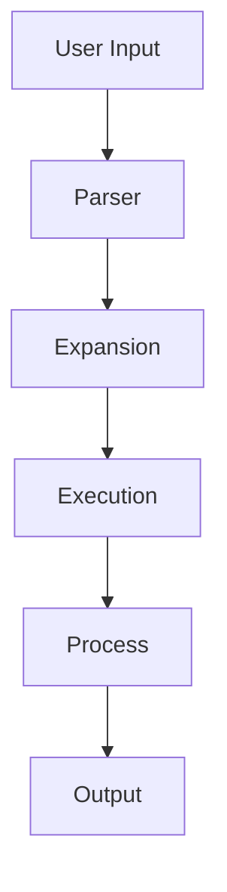
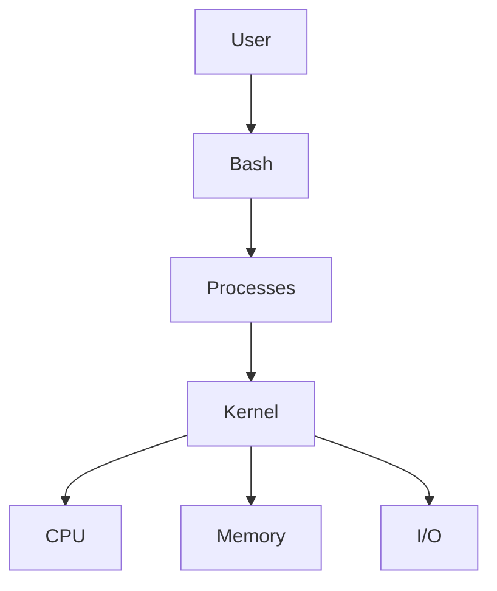
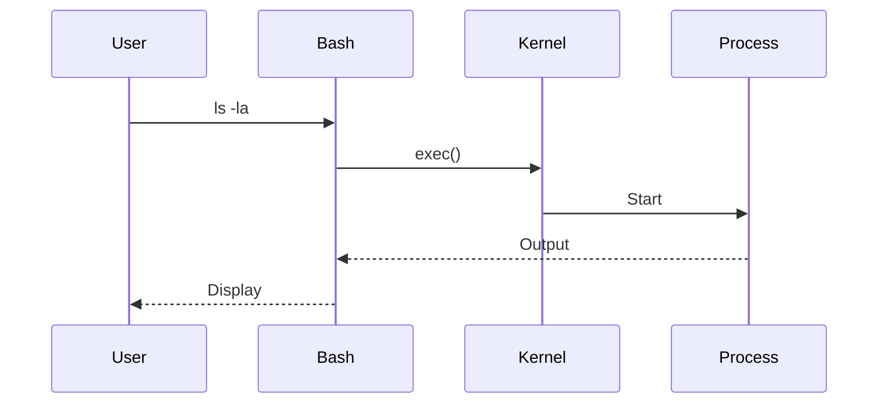
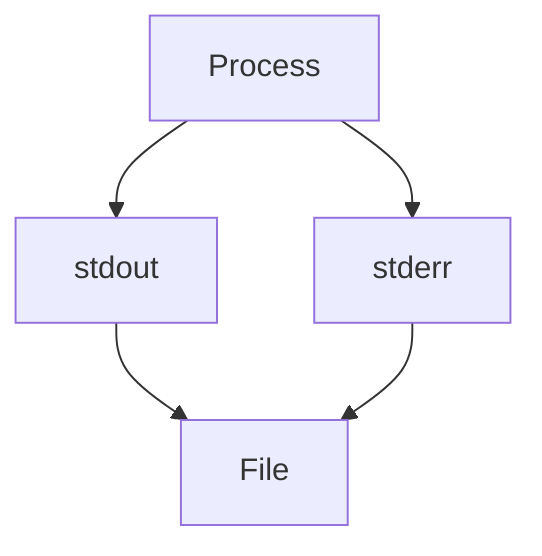
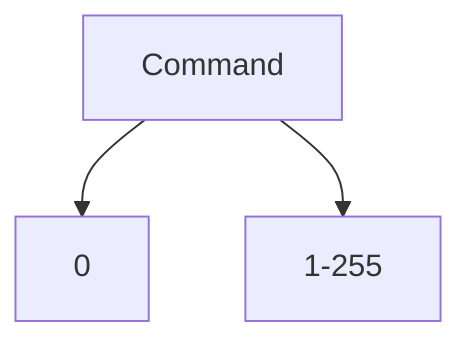
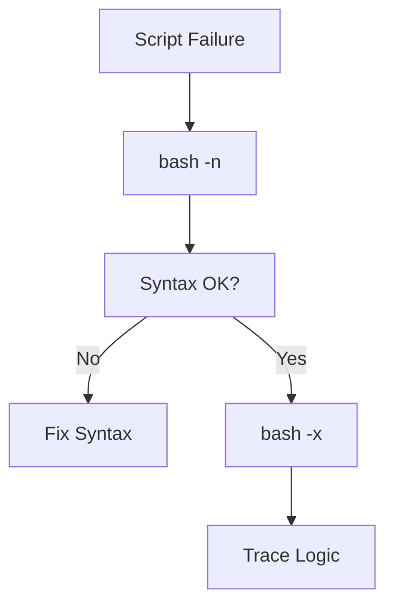

# Bash Cheat Sheet

## The Complete Shell Engineering, Automation, and Scripting Reference

---

# Why This Exists

Most engineers use Linux.

Few engineers understand the shell.

Bash is not merely a command interpreter.

It is:

* An automation engine
* A process orchestration tool
* A text processing platform
* A system administration language
* The glue that connects Linux subsystems

Every day:

```text
DevOps Engineers
SREs
Backend Engineers
Cloud Engineers
Platform Engineers
```

use Bash to:

```text
Deploy Applications
Manage Infrastructure
Analyze Logs
Automate Backups
Debug Production Issues
Operate Kubernetes
Manage Databases
```

Understanding Bash deeply transforms Linux from:

```text
A collection of commands
```

into:

```text
A programmable operating system
```

---

# Mental Model

Think of Bash as a command execution engine.



When you type:

```bash
ls -la
```

Bash does far more than execute a command.

It:

1. Parses input
2. Expands variables
3. Resolves paths
4. Locates executable
5. Creates process
6. Captures output

---

# First Principles

Bash is a shell.

A shell exists to provide an interface between:

```text
Human
    |
    V
 Shell
    |
    V
 Linux Kernel
```

Without a shell:

```text
No command execution
No scripting
No automation
```

---

# Bash Architecture



---

# Verify Current Shell

```bash
echo $SHELL
```

Example:

```text
/bin/bash
```

---

# Useful Shell Information

Current shell PID:

```bash
echo $$
```

Current user:

```bash
whoami
```

Hostname:

```bash
hostname
```

Current directory:

```bash
pwd
```

---

# Command Execution Flow



---

# Variables

Variables store data.

---

## Create Variable

```bash
name="linux"
```

---

## Access Variable

```bash
echo $name
```

Output:

```text
linux
```

---

## Recommended Style

```bash
echo "${name}"
```

Safer.

---

# Variable Types

```text
User Variables
Environment Variables
Special Variables
```

---

# Environment Variables

View:

```bash
env
```

or

```bash
printenv
```

---

Common variables:

```bash
echo $PATH
echo $HOME
echo $USER
echo $HOSTNAME
```

---

# PATH Variable

Most important environment variable.

```bash
echo $PATH
```

Example:

```text
/usr/local/bin:/usr/bin:/bin
```

---

# PATH Resolution


---

# Command Lookup

Find executable:

```bash
which nginx
```

or

```bash
type nginx
```

---

# Quotes

Understanding quoting prevents bugs.

---

## Single Quotes

```bash
echo '$HOME'
```

Output:

```text
$HOME
```

No expansion.

---

## Double Quotes

```bash
echo "$HOME"
```

Output:

```text
/home/user
```

Expansion occurs.

---

## Backticks

Legacy:

```bash
`date`
```

Avoid.

Use:

```bash
$(date)
```

---

# Command Substitution

```bash
today=$(date)
```

---

Example:

```bash
echo "Today is $(date)"
```

---

# Arithmetic

```bash
echo $((5 + 10))
```

Output:

```text
15
```

---

Variables:

```bash
a=10
b=20

echo $((a+b))
```

---

# Redirection

One of the most important shell concepts.

---

# Output Flow



---

# Standard Streams

| Stream | Number |
| ------ | ------ |
| stdin  | 0      |
| stdout | 1      |
| stderr | 2      |

---

## Redirect Output

```bash
ls > files.txt
```

---

## Append Output

```bash
ls >> files.txt
```

---

## Redirect Errors

```bash
command 2> error.log
```

---

## Redirect Both

```bash
command > output.log 2>&1
```

---

## Discard Output

```bash
command > /dev/null
```

---

# Pipes

Connect processes together.

---

# Pipe Architecture


---

Example:

```bash
ps aux | grep nginx
```

---

Another example:

```bash
cat access.log | grep 500
```

---

Modern style:

```bash
grep 500 access.log
```

Preferred.

---

# Text Processing Pipeline

```bash
cat access.log \
| grep 500 \
| awk '{print $1}' \
| sort \
| uniq
```

---

# Wildcards

---

## All Files

```bash
*
```

---

## Single Character

```bash
?
```

---

## Character Range

```bash
[a-z]
```

---

Example:

```bash
ls *.log
```

---

# Brace Expansion

```bash
touch file{1..5}.txt
```

Creates:

```text
file1.txt
file2.txt
file3.txt
file4.txt
file5.txt
```

---

# Loops

---

## For Loop

```bash
for i in 1 2 3
do
  echo $i
done
```

---

## Range Loop

```bash
for i in {1..10}
do
  echo $i
done
```

---

# While Loop

```bash
while read line
do
  echo "$line"
done < file.txt
```

---

# Conditionals

---

## if Statement

```bash
if [ -f file.txt ]
then
  echo "Exists"
fi
```

---

# Comparison Operators

| Operator | Meaning       |
| -------- | ------------- |
| -eq      | Equal         |
| -ne      | Not Equal     |
| -gt      | Greater       |
| -lt      | Less          |
| -ge      | Greater Equal |
| -le      | Less Equal    |

---

# String Checks

```bash
if [ "$name" = "linux" ]
then
  echo yes
fi
```

---

# File Tests

```bash
-f File Exists

-d Directory Exists

-r Readable

-w Writable

-x Executable
```

---

Example:

```bash
[ -f config.yaml ]
```

---

# Functions

---

## Define Function

```bash
backup() {
  echo "Running backup"
}
```

---

## Execute

```bash
backup
```

---

# Function Parameters

```bash
hello() {
  echo "Hello $1"
}
```

Call:

```bash
hello Linux
```

---

# Special Variables

| Variable | Meaning         |
| -------- | --------------- |
| $0       | Script Name     |
| $1       | First Argument  |
| $2       | Second Argument |
| $#       | Argument Count  |
| $@       | All Arguments   |
| $$       | Current PID     |
| $?       | Exit Status     |

---

# Exit Status

Every command returns status.

```text
0 = Success

Non-zero = Failure
```

---

Check:

```bash
echo $?
```

---

# Exit Flow



---

# Error Handling

---

## Exit on Failure

```bash
set -e
```

---

## Undefined Variables

```bash
set -u
```

---

## Pipeline Failures

```bash
set -o pipefail
```

---

## Production Standard

```bash
set -euo pipefail
```

---

# Arrays

---

Create:

```bash
servers=("web1" "web2" "web3")
```

---

Access:

```bash
echo "${servers[0]}"
```

---

All values:

```bash
echo "${servers[@]}"
```

---

# Reading Files

---

Line by line:

```bash
while read line
do
  echo "$line"
done < file.txt
```

---

# Process Control

---

Run in background:

```bash
python app.py &
```

---

View jobs:

```bash
jobs
```

---

Foreground:

```bash
fg
```

---

Background:

```bash
bg
```

---

# Process Substitution

Advanced feature.

```bash
diff <(ls dir1) <(ls dir2)
```

Creates temporary streams.

---

# Here Documents

Useful for automation.

```bash
cat <<EOF
Hello
World
EOF
```

---

# Here Strings

```bash
grep root <<< "root:x:0:0"
```

---

# Debugging Scripts

---

## Syntax Check

```bash
bash -n script.sh
```

---

## Trace Execution

```bash
bash -x script.sh
```

---

## Verbose

```bash
bash -v script.sh
```

---

# Debugging Flow



---

# Finding Commands

Locate executable:

```bash
which command
```

Detailed:

```bash
type command
```

---

# Useful Text Processing

---

## grep

```bash
grep error app.log
```

---

## awk

```bash
awk '{print $1}'
```

---

## sed

```bash
sed 's/foo/bar/'
```

---

## sort

```bash
sort file.txt
```

---

## uniq

```bash
uniq
```

---

## cut

```bash
cut -d: -f1
```

---

# Production Log Analysis

Example:

```bash
grep ERROR app.log \
| awk '{print $5}' \
| sort \
| uniq -c \
| sort -nr
```

---

# Shell Startup Files

---

## Login Shell

```bash
~/.bash_profile
```

---

## Interactive Shell

```bash
~/.bashrc
```

---

## System-Wide

```bash
/etc/profile
```

---

# Aliases

Create:

```bash
alias ll='ls -lah'
```

View:

```bash
alias
```

Remove:

```bash
unalias ll
```

---

# Bash and Linux Automation

Used heavily for:

```text
Backups
Deployments
Monitoring
Provisioning
CI/CD
Kubernetes Automation
Cloud Automation
```

---

# Docker Example

```bash
docker ps
docker logs
docker exec
```

Often wrapped inside Bash scripts.

---

# Kubernetes Example

```bash
kubectl get pods

kubectl logs

kubectl describe pod
```

Frequently automated using Bash.

---

# Performance Considerations

Avoid:

```bash
cat file | grep pattern
```

Prefer:

```bash
grep pattern file
```

---

Avoid:

```bash
for line in $(cat file)
```

Use:

```bash
while read line
```

---

Prefer:

```bash
$(command)
```

over:

```bash
`command`
```

---

# Security Considerations

Always quote variables.

Bad:

```bash
rm -rf $dir
```

Good:

```bash
rm -rf "$dir"
```

---

Validate user input.

Never trust:

```text
Arguments
Environment Variables
External Files
```

---

Avoid:

```bash
eval
```

unless absolutely necessary.

---

# Common Mistakes

### Unquoted variables

### Ignoring exit codes

### Using set +e unintentionally

### Using eval unnecessarily

### Infinite loops

### Not handling errors

### Hardcoding paths

### Ignoring shellcheck warnings

### Running scripts as root unnecessarily

---

# Engineering Mindset

Beginners write scripts.

Engineers build automation systems.

Ask:

```text
What happens on failure?

What happens at scale?

What happens with bad input?

What happens if disk is full?

What happens if network fails?

What happens if process hangs?
```

Production Bash is about resilience, not merely syntax.

---

# Interview Questions

### What is Bash?

### Difference between shell and terminal?

### What is PATH?

### Explain stdout and stderr.

### Explain pipes.

### Difference between single and double quotes?

### What does set -euo pipefail do?

### Explain command substitution.

### Difference between $@ and $*?

### What is process substitution?

### How do you debug a Bash script?

### Why should variables be quoted?

### What is an exit code?

---

# One-Page Emergency Reference

```bash
# Variables
name=value
echo "$name"

# Environment
env
printenv

# Pipes
cmd1 | cmd2

# Redirection
>
>>
2>
2>&1

# Conditions
[ -f file ]

# Loops
for
while

# Functions
func() {}

# Arrays
arr=("a" "b")

# Exit Status
echo $?

# Strict Mode
set -euo pipefail

# Debugging
bash -n script.sh
bash -x script.sh

# Jobs
jobs
fg
bg

# Search
grep
awk
sed
sort
uniq
```

---

# Final Takeaway

Bash is not merely a scripting language.

It is the automation layer of Linux.

It connects:

```text
Processes
Filesystems
Networking
Storage
Services
Containers
Cloud Infrastructure
```

into powerful workflows.

Master Bash and Linux becomes programmable, automatable, and infinitely more powerful.
