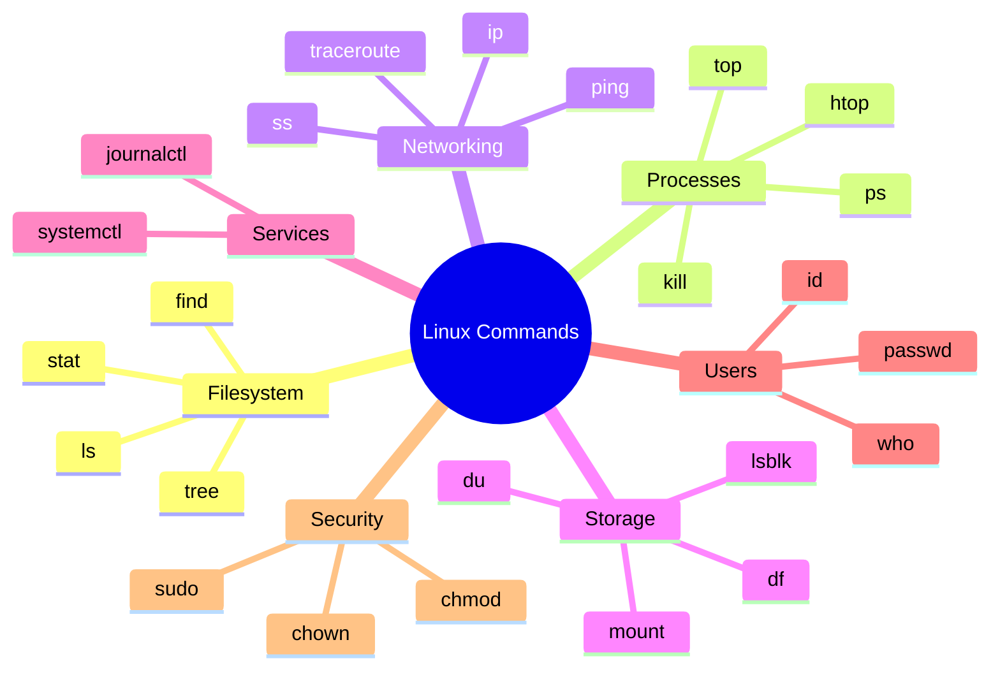

# Linux Commands Cheat Sheet

## The Ultimate Linux Engineering Quick Reference

---

# Why This Exists

Linux is not just an operating system.

It is the foundation of:

* The Internet
* Cloud Computing
* Kubernetes
* Docker
* Databases
* AI Infrastructure
* Large-scale Distributed Systems

Every Linux engineer eventually realizes:

> Success is not about memorizing commands.
>
> Success is about understanding what subsystem a command interacts with.

This cheat sheet is designed differently.

Instead of becoming a giant list of commands, it becomes an engineering map of Linux.

You should know:

* What problem each command solves
* What Linux component it interacts with
* When to use it in production
* What can go wrong
* What engineers actually use during incidents

---

# Mental Model

Think of Linux as several major subsystems:

```text
+------------------------+
|       User Space       |
+------------------------+

        Commands

+------------------------+
| Process Management     |
| Memory Management      |
| Filesystem             |
| Networking             |
| Storage                |
| Security               |
| Services (systemd)     |
+------------------------+

          Kernel

+------------------------+
| Hardware               |
+------------------------+
```

Every command ultimately talks to one of these layers.

Examples:

```text
ls      -> Filesystem
ps      -> Processes
ip      -> Networking
df      -> Storage
systemctl -> Services
top     -> Resources
```

---

# Linux Command Categories



---

# Navigation Commands

## Print Current Directory

```bash
pwd
```

Output:

```text
/home/user/projects
```

Production Use:

* Verify current working location
* Prevent accidental file deletion

---

## List Files

```bash
ls
```

Detailed:

```bash
ls -l
```

Human readable:

```bash
ls -lh
```

Show hidden files:

```bash
ls -la
```

Production:

```bash
ls -lah /etc/nginx
```

---

## Change Directory

```bash
cd /var/log
```

Home:

```bash
cd
```

Previous directory:

```bash
cd -
```

Parent:

```bash
cd ..
```

---

# Files and Directories

## Create Directory

```bash
mkdir logs
```

Nested:

```bash
mkdir -p app/logs/archive
```

---

## Create File

```bash
touch file.txt
```

Create multiple:

```bash
touch a.txt b.txt c.txt
```

---

## Copy Files

```bash
cp file1 file2
```

Recursive:

```bash
cp -r source target
```

Preserve permissions:

```bash
cp -a source target
```

---

## Move Files

```bash
mv old.txt new.txt
```

Move directory:

```bash
mv project/ backup/
```

---

## Delete Files

```bash
rm file.txt
```

Recursive:

```bash
rm -r folder
```

Force:

```bash
rm -rf folder
```

⚠ Dangerous command.

Never run:

```bash
rm -rf /
```

---

# Viewing File Contents

## Display Entire File

```bash
cat file.txt
```

---

## Read Large Files

```bash
less logfile.log
```

Navigate:

```text
Space = next page
b     = previous page
q     = quit
```

---

## First Lines

```bash
head file.log
```

Custom:

```bash
head -20 file.log
```

---

## Last Lines

```bash
tail file.log
```

Follow live logs:

```bash
tail -f app.log
```

Production:

```bash
tail -f /var/log/nginx/access.log
```

---

# Searching

## Find Files

```bash
find /var/log -name "*.log"
```

Large systems:

```bash
find / -type f -size +1G
```

---

## Search Text

```bash
grep error app.log
```

Case insensitive:

```bash
grep -i error app.log
```

Recursive:

```bash
grep -r "database" .
```

Count matches:

```bash
grep -c error app.log
```

---

## Fast Search

```bash
locate nginx.conf
```

Update database:

```bash
updatedb
```

---

# Process Commands

## List Processes

```bash
ps aux
```

Find process:

```bash
ps aux | grep nginx
```

---

## Real-Time Monitoring

```bash
top
```

Better version:

```bash
htop
```

Install:

```bash
sudo apt install htop
```

---

## Kill Process

Graceful:

```bash
kill PID
```

Force:

```bash
kill -9 PID
```

Production:

```bash
kill -15 PID
```

Preferred over SIGKILL.

---

## Process Tree

```bash
pstree
```

Useful for:

* Containers
* Services
* Parent-child relationships

---

# Resource Monitoring

## CPU Usage

```bash
top
```

---

## Memory Usage

```bash
free -h
```

Example:

```text
Total
Used
Free
Available
```

---

## System Load

```bash
uptime
```

Output:

```text
load average: 0.45 0.60 0.55
```

---

# User Management

## Current User

```bash
whoami
```

---

## User Information

```bash
id username
```

---

## Logged In Users

```bash
who
```

Detailed:

```bash
w
```

---

## Switch User

```bash
su -
```

---

## Execute As Root

```bash
sudo command
```

Example:

```bash
sudo systemctl restart nginx
```

---

# Networking Commands

## Show Interfaces

```bash
ip addr
```

Short:

```bash
ip a
```

---

## Routing Table

```bash
ip route
```

---

## Ping

```bash
ping google.com
```

Check latency:

```bash
ping 8.8.8.8
```

---

## Open Ports

```bash
ss -tulpn
```

Modern replacement:

```text
netstat
```

---

## DNS Lookup

```bash
dig google.com
```

Alternative:

```bash
nslookup google.com
```

---

## Download Files

```bash
curl https://example.com
```

Save:

```bash
curl -O file.zip
```

---

## HTTP Headers

```bash
curl -I https://example.com
```

Production API debugging:

```bash
curl -v
```

---

# Storage Commands

## Disk Usage

```bash
df -h
```

Production:

```bash
df -hT
```

---

## Directory Usage

```bash
du -sh *
```

Largest folders:

```bash
du -ah | sort -rh | head
```

---

## Block Devices

```bash
lsblk
```

---

## Mounts

```bash
mount
```

---

## Filesystem Info

```bash
blkid
```

---

# Permissions Commands

## View Permissions

```bash
ls -l
```

---

## Change Permissions

```bash
chmod 755 script.sh
```

---

## Ownership

```bash
chown user:user file
```

Recursive:

```bash
chown -R app:app data/
```

---

# Archive Commands

## Create Archive

```bash
tar -cvf backup.tar files/
```

---

## Extract

```bash
tar -xvf backup.tar
```

---

## Compress

```bash
tar -czvf backup.tar.gz files/
```

---

# Systemd Commands

## Service Status

```bash
systemctl status nginx
```

---

## Start Service

```bash
systemctl start nginx
```

---

## Stop Service

```bash
systemctl stop nginx
```

---

## Restart

```bash
systemctl restart nginx
```

---

## Enable Boot Startup

```bash
systemctl enable nginx
```

---

## Logs

```bash
journalctl -u nginx
```

Live:

```bash
journalctl -fu nginx
```

---

# Production Incident Commands

## High CPU

```bash
top
ps aux --sort=-%cpu
```

---

## High Memory

```bash
free -h
ps aux --sort=-%mem
```

---

## Disk Full

```bash
df -h
du -sh /*
```

---

## Port Already Used

```bash
ss -tulpn | grep 8080
```

---

## Service Down

```bash
systemctl status service
journalctl -xe
```

---

# Modern Cloud Engineering Commands

Docker:

```bash
docker ps
docker logs
docker stats
docker exec
```

Kubernetes:

```bash
kubectl get pods
kubectl describe pod
kubectl logs
kubectl exec
```

Cloud Servers:

```bash
ssh
scp
rsync
```

---

# Engineering Mindset

Bad Engineers Memorize Commands

```text
What command shows memory?
```

Good Engineers Understand Systems

```text
Why is memory consumed?
Which process owns it?
Is it cache?
Is it leak?
Is it swap?
```

The command is only the tool.

The system understanding is the skill.

---

# Interview Questions

### Difference between `top` and `htop`?

### Difference between `kill` and `kill -9`?

### Difference between `df` and `du`?

### Difference between `curl` and `wget`?

### Difference between `ps` and `pstree`?

### Why is `ss` preferred over `netstat`?

### What happens internally when `ls` runs?

### How does `grep` search large files efficiently?

### How does `tail -f` work?

### Why can a filesystem show full in `df` but not in `du`?

---

# One-Page Emergency Cheat Sheet

```bash
# Navigation
pwd
ls -lah
cd -

# Files
cp -r
mv
rm -rf

# Search
find
grep
locate

# Processes
ps aux
top
htop
kill

# Memory
free -h

# Storage
df -h
du -sh *

# Networking
ip a
ip route
ping
ss -tulpn

# Services
systemctl status
systemctl restart
journalctl -fu

# Permissions
chmod
chown

# Archives
tar -czvf
tar -xvf

# Downloads
curl
wget
```

---

# Final Takeaway

A Linux engineer does not succeed because they know 500 commands.

A Linux engineer succeeds because they understand:

```text
Filesystem
Processes
Memory
Networking
Storage
Security
Services
Observability
```

Commands are merely the interface to those systems.

Master the systems, and the commands become obvious.
