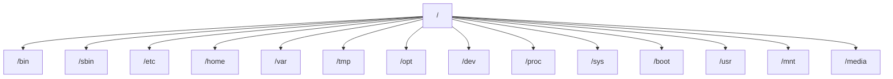
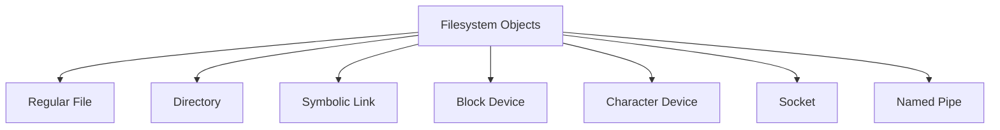
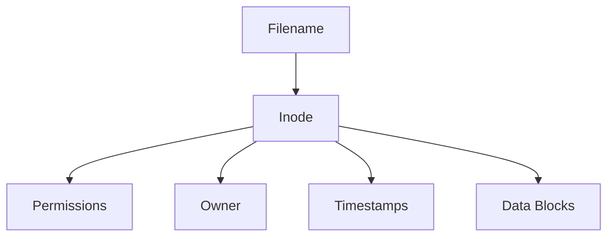
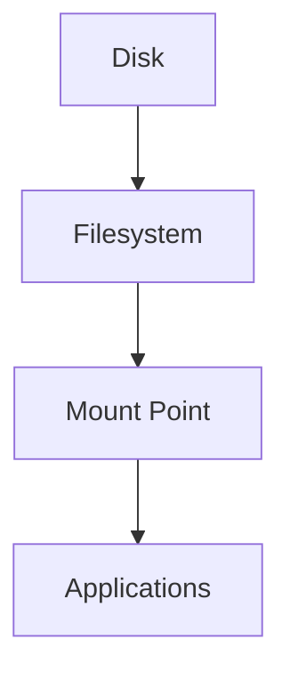

# Linux Filesystem Cheat Sheet

## The Complete Filesystem Engineering Reference

---

# Why This Exists

Everything in Linux starts with the filesystem.

Before networking.

Before Docker.

Before Kubernetes.

Before databases.

Before cloud infrastructure.

Linux was designed around a powerful idea:

> Everything is a file.

Understanding the filesystem is one of the most important skills for:

* Linux Engineers
* Backend Engineers
* DevOps Engineers
* SREs
* Cloud Engineers
* Platform Engineers
* Infrastructure Architects

Most production outages eventually involve:

* Disk space issues
* Missing files
* Permission problems
* Broken mounts
* Log growth
* Corrupted data
* Storage bottlenecks

This cheat sheet is designed as a rapid-reference engineering guide rather than a command list.

---

# Mental Model

Think of Linux as a giant tree.

```text
            /
            |
    -------------------
    |    |    |    |
   bin  etc  var  home
                |
              user
                |
             project
```

Unlike Windows:

```text
C:\
D:\
E:\
```

Linux has:

```text
/
```

One root.

Everything grows from it.

---

# Filesystem Hierarchy Overview



---

# Filesystem Hierarchy Standard (FHS)

## Quick Reference

| Directory | Purpose              |
| --------- | -------------------- |
| /         | Root                 |
| /bin      | Essential binaries   |
| /sbin     | System binaries      |
| /etc      | Configuration        |
| /home     | User data            |
| /root     | Root user's home     |
| /var      | Variable data        |
| /tmp      | Temporary files      |
| /boot     | Boot files           |
| /usr      | User applications    |
| /opt      | Third-party software |
| /dev      | Devices              |
| /proc     | Process information  |
| /sys      | Kernel information   |
| /mnt      | Temporary mounts     |
| /media    | Removable devices    |

---

# Important Directories

---

## /

Root of entire Linux filesystem.

```bash
ls /
```

Everything starts here.

---

## /home

User data.

```text
/home
├── alice
├── bob
└── john
```

Example:

```bash
/home/john/projects
```

Contains:

* Documents
* Downloads
* Source code
* SSH keys

---

## /root

Root user's home directory.

```bash
/root
```

Not:

```bash
/
```

Common beginner mistake.

---

## /etc

System configuration.

Examples:

```bash
/etc/passwd
/etc/group
/etc/hosts
/etc/fstab
/etc/ssh/
```

Production engineers spend huge amounts of time here.

---

## /var

Variable runtime data.

Contains:

```text
/var
├── log
├── cache
├── spool
├── tmp
└── lib
```

Examples:

```bash
/var/log/nginx/
/var/log/mysql/
/var/lib/docker/
/var/lib/postgresql/
```

---

## /tmp

Temporary storage.

```bash
/tmp
```

Often cleared during reboot.

Never store important files here.

---

## /boot

Contains bootloader files.

```text
/boot
├── vmlinuz
├── initramfs
└── grub
```

Used during startup.

---

## /dev

Device files.

Examples:

```bash
/dev/sda
/dev/sdb
/dev/null
/dev/random
```

Linux treats devices as files.

---

## /proc

Virtual filesystem.

Generated by kernel.

Example:

```bash
cat /proc/cpuinfo
cat /proc/meminfo
```

No actual files exist on disk.

---

## /sys

Kernel information.

Used by:

* udev
* systemd
* kernel tuning

---

# Path Types

---

## Absolute Path

Starts from root.

```bash
/home/user/project
```

Always begins with:

```bash
/
```

---

## Relative Path

Starts from current directory.

```bash
project/file.txt
```

Depends on current location.

---

# Special Path Symbols

| Symbol | Meaning            |
| ------ | ------------------ |
| .      | Current directory  |
| ..     | Parent directory   |
| ~      | Home directory     |
| /      | Root               |
| -      | Previous directory |

Examples:

```bash
cd ..
cd ~
cd -
```

---

# File Types

Linux supports multiple file types.



---

## Regular File

Examples:

```bash
file.txt
script.sh
image.png
```

---

## Directory

Container for files.

```bash
/home
/etc
```

---

## Symbolic Link

Shortcut.

Create:

```bash
ln -s source target
```

Example:

```bash
ln -s /opt/app app
```

---

## Block Device

Storage devices.

```bash
/dev/sda
/dev/nvme0n1
```

---

## Character Device

Streams data.

```bash
/dev/random
/dev/tty
```

---

# Inodes

Most important filesystem concept.

---

## Mental Model

File name is NOT the file.

The inode is the file.

```text
filename
   |
   V
 inode
   |
   V
data blocks
```

---

## View Inode

```bash
ls -i
```

Example:

```text
12345 notes.txt
```

12345 = inode number.

---

## Filesystem Internals



---

# Hard Links vs Soft Links

---

## Hard Link

```bash
ln file.txt copy.txt
```

Both names point to same inode.

```text
file.txt ----\
              --> inode
copy.txt ----/
```

---

## Soft Link

```bash
ln -s file.txt shortcut.txt
```

```text
shortcut
   |
   V
file.txt
```

---

# Common Filesystem Commands

---

## Show Current Directory

```bash
pwd
```

---

## List Files

```bash
ls
ls -l
ls -la
ls -lh
```

---

## Create File

```bash
touch file.txt
```

---

## Create Directory

```bash
mkdir project
mkdir -p project/src/api
```

---

## Copy

```bash
cp file1 file2
cp -r dir1 dir2
```

---

## Move

```bash
mv old new
```

---

## Delete

```bash
rm file
rm -r folder
```

---

## Display Content

```bash
cat file
less file
head file
tail file
```

---

# File Discovery Commands

---

## Find Files

```bash
find / -name nginx.conf
```

---

## Find Large Files

```bash
find / -size +1G
```

---

## Find By Owner

```bash
find / -user nginx
```

---

## Locate

```bash
locate nginx.conf
```

---

# Filesystem Usage

---

## Disk Usage

```bash
df -h
```

Output:

```text
Filesystem
Size
Used
Available
Use%
```

---

## Directory Size

```bash
du -sh *
```

---

## Largest Directories

```bash
du -ah / | sort -rh | head -20
```

---

# Mounts

---

## Mental Model

A mount attaches storage into filesystem tree.

```text
Disk
 |
 V
Filesystem
 |
 V
Mounted At
 |
 V
/mnt/data
```

---

# Mount Architecture



---

## View Mounts

```bash
mount
```

or

```bash
findmnt
```

---

## Mount Device

```bash
mount /dev/sdb1 /mnt/data
```

---

## Unmount

```bash
umount /mnt/data
```

---

# Filesystem Types

---

## ext4

Most common Linux filesystem.

Features:

* Journaling
* Reliable
* Stable

---

## XFS

Common in enterprise systems.

Used heavily by:

* RHEL
* Cloud providers

Excellent scalability.

---

## Btrfs

Modern filesystem.

Features:

* Snapshots
* Compression
* Checksums

---

## ZFS

Enterprise-grade.

Features:

* Self-healing
* Snapshots
* RAID integration

---

# Production Filesystem Layout

Example backend server:

```text
/
├── boot
├── etc
├── home
├── var
│   ├── log
│   ├── lib
│   └── cache
├── opt
│   └── applications
└── data
```

---

# Docker Filesystem Locations

Important directories:

```bash
/var/lib/docker
```

Contains:

```text
containers
images
volumes
overlay2
networks
```

Check usage:

```bash
du -sh /var/lib/docker
```

---

# Kubernetes Storage Locations

Kubelet:

```bash
/var/lib/kubelet
```

Container runtime:

```bash
/var/lib/containerd
```

Logs:

```bash
/var/log/pods
```

---

# Database Storage Locations

MySQL

```bash
/var/lib/mysql
```

PostgreSQL

```bash
/var/lib/postgresql
```

MongoDB

```bash
/var/lib/mongodb
```

Understanding filesystem layout is critical for backups.

---

# Performance Considerations

---

## Millions of Small Files

Bad:

```text
1 million tiny files
```

Problems:

* Metadata overhead
* Inode pressure
* Slow backups

---

## Deep Directory Structures

Bad:

```text
a/b/c/d/e/f/g/h/i/j
```

Increases lookup cost.

---

## Large Log Files

Common production issue.

Example:

```bash
50GB nginx.log
```

Can fill disk rapidly.

---

# Security Considerations

Never allow:

```bash
777 permissions
```

unless absolutely necessary.

Check:

```bash
find / -perm 777
```

---

Sensitive files:

```bash
/etc/shadow
~/.ssh/id_rsa
```

Protect carefully.

---

# Troubleshooting Cheat Sheet

## Disk Full

```bash
df -h
du -sh /*
```

---

## Missing Space

Deleted file still open:

```bash
lsof | grep deleted
```

Classic production issue.

---

## Inode Exhaustion

Check:

```bash
df -i
```

Symptoms:

```text
Disk appears empty
Cannot create files
```

---

## Mount Problems

Check:

```bash
mount
findmnt
lsblk
```

---

## Permission Issues

Check:

```bash
ls -l
id
namei -l path
```

---

# Common Mistakes

### Confusing /root with /

### Using relative paths in scripts

### Storing critical data in /tmp

### Forgetting inode limits

### Running rm -rf carelessly

### Filling /var/log

### Not monitoring disk usage

---

# Engineering Mindset

Beginners see files.

Engineers see:

```text
Storage
Metadata
Inodes
Data Blocks
Mounts
Permissions
Caching
Performance
Recovery
```

When troubleshooting, ask:

```text
Where is the file?
Which filesystem?
Which mount?
Which inode?
Who owns it?
What process uses it?
```

---

# Interview Questions

### What is an inode?

### Difference between hard link and symbolic link?

### What happens internally when opening a file?

### Why can df and du show different results?

### What is a mount point?

### What is journaling?

### Why does Linux treat devices as files?

### Difference between ext4, XFS, and ZFS?

### What is inode exhaustion?

### How does Docker use OverlayFS?

---

# One-Page Filesystem Emergency Reference

```bash
pwd
ls -lah
find
locate

df -h
df -i

du -sh *

mount
findmnt
lsblk

ln
ln -s

stat file
ls -i

cat
less
head
tail

lsof | grep deleted

chmod
chown
```

---

# Final Takeaway

The Linux filesystem is not merely a way to store files.

It is the foundation upon which:

* Applications run
* Databases store data
* Containers operate
* Kubernetes mounts volumes
* Cloud systems persist information

Master the filesystem, and you gain visibility into almost every layer of the Linux ecosystem.
