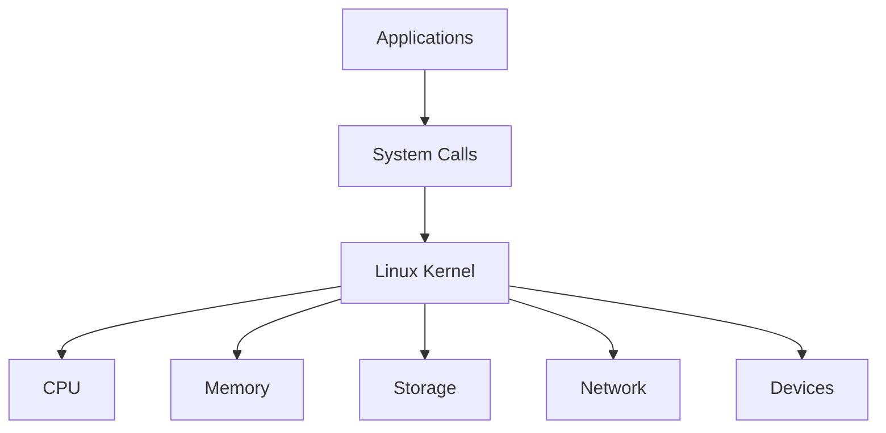
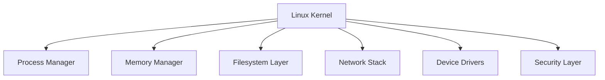
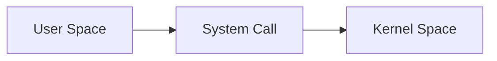
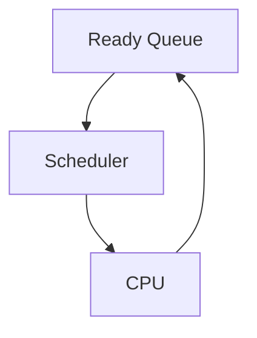
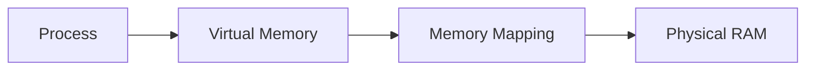
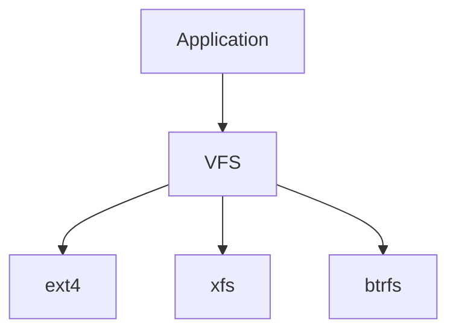
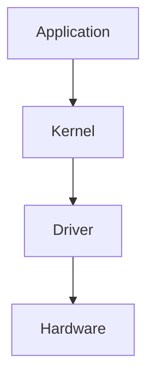
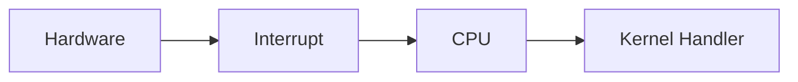
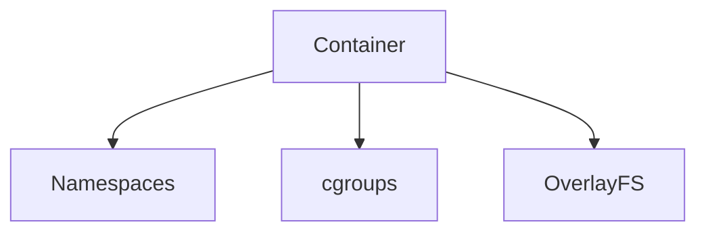

# Linux Kernel Cheat Sheet

## The Complete Kernel Engineering and Production Operations Reference

---

# Why This Exists

The Linux kernel is the most important component of the operating system.

Without the kernel:

```text
No processes
No memory
No networking
No filesystems
No containers
No Linux
```

Every application ultimately depends on the kernel.

When engineers troubleshoot:

```text
High CPU
Memory Issues
Disk Problems
Network Problems
Container Issues
```

they are often debugging kernel behavior.

---

# Mental Model

Think of the kernel as the operating system's control center.



---

# Core Responsibilities

The kernel manages:

```text
Process Scheduling
Memory Management
Storage
Filesystems
Networking
Security
Hardware Devices
Containers
```

---

# Kernel Architecture



---

# Verify Running Kernel

```bash
uname -r
```

Example:

```text
6.8.0-41-generic
```

---

# Full Kernel Information

```bash
uname -a
```

---

# Kernel Version Components

```text
6.8.0

| | |
| | Patch
| Minor
Major
```

---

# Kernel Space vs User Space



---

# System Calls

Applications communicate with the kernel using system calls.

Examples:

```text
open()
read()
write()
fork()
exec()
socket()
connect()
```

---

# Observe System Calls

```bash
strace ls
```

Trace a process:

```bash
strace -p PID
```

---

# Process Scheduling

The scheduler decides:

```text
Which process runs?

When?

For how long?
```

---

# Scheduling Flow



---

# Scheduler Information

View CPU activity:

```bash
top
```

```bash
htop
```

```bash
pidstat
```

---

# Context Switching

CPU switches between processes.

```text
Process A
Save State
Load Process B
Continue
```

---

# Memory Management

Kernel controls:

```text
RAM
Virtual Memory
Page Cache
Swap
Memory Mapping
```

---

# Virtual Memory



---

# Memory Commands

```bash
free -h
```

```bash
vmstat
```

```bash
cat /proc/meminfo
```

---

# Page Cache

Linux caches frequently used disk data.

```text
Disk
 ↓
Page Cache
 ↓
Application
```

Check memory:

```bash
free -h
```

---

# Swap

View swap:

```bash
swapon --show
```

```bash
free -h
```

---

# OOM Killer

When memory runs out:

```text
Kernel selects victim process
Kills process
Protects system
```

Check:

```bash
dmesg | grep -i oom
```

---

# Filesystem Layer

Kernel provides:

```text
VFS
Virtual Filesystem
```

---

# VFS Architecture



---

# Mounted Filesystems

```bash
mount
```

```bash
findmnt
```

---

# Block Device Layer

Examples:

```text
/dev/sda
/dev/sdb
/dev/nvme0n1
```

View:

```bash
lsblk
```

---

# Device Drivers

Drivers allow hardware communication.



---

# Kernel Modules

Loadable kernel functionality.

View loaded modules:

```bash
lsmod
```

Load:

```bash
modprobe module_name
```

Unload:

```bash
modprobe -r module_name
```

---

# Module Information

```bash
modinfo module_name
```

---

# Networking Stack

Kernel manages:

```text
TCP
UDP
IP
Routing
Sockets
Firewall
```

---

# Network Flow


---

# Network Inspection

```bash
ss -tulpn
```

```bash
ip addr
```

```bash
ip route
```

---

# Interrupts

Hardware signals the CPU.

Examples:

```text
Disk Read Complete

Network Packet Received

Keyboard Input
```

---

# Interrupt Architecture



---

# View Interrupts

```bash
cat /proc/interrupts
```

---

# Kernel Logs

Most important troubleshooting source.

View:

```bash
dmesg
```

Kernel journal:

```bash
journalctl -k
```

Live:

```bash
journalctl -kf
```

---

# Kernel Parameters

View:

```bash
sysctl -a
```

Specific:

```bash
sysctl net.ipv4.ip_forward
```

---

# Change Parameter

Temporary:

```bash
sysctl -w net.ipv4.ip_forward=1
```

Persistent:

```text
/etc/sysctl.conf
```

---

# Common sysctl Examples

Enable forwarding:

```bash
net.ipv4.ip_forward=1
```

Increase connections:

```bash
net.core.somaxconn=65535
```

Tune memory:

```bash
vm.swappiness=10
```

---

# Namespaces

Foundation of containers.

Types:

```text
PID
Mount
Network
IPC
UTS
User
```

---

# cgroups

Resource control.

Limit:

```text
CPU
Memory
I/O
```

Used by:

```text
Docker
Kubernetes
systemd
```

---

# Container Internals



---

# Security Layers

```text
Permissions
ACLs
Capabilities
SELinux
AppArmor
Seccomp
```

---

# Production Troubleshooting

## High CPU

```bash
top
```

```bash
pidstat
```

---

## High Memory

```bash
free -h
```

```bash
vmstat
```

---

## OOM Events

```bash
dmesg | grep -i oom
```

---

## Disk Issues

```bash
iostat -x
```

```bash
lsblk
```

---

## Network Issues

```bash
ss -tulpn
```

```bash
tcpdump
```

---

## Driver Issues

```bash
dmesg
```

```bash
lsmod
```

---

# Performance Investigation Toolkit

```bash
top
htop

vmstat

iostat

pidstat

sar

ss

strace

lsof

perf
```

---

# Common Mistakes

### Treating cache as used memory

### Killing processes before collecting evidence

### Ignoring kernel logs

### Changing sysctl values blindly

### Running outdated kernels

### Ignoring OOM events

### Confusing containers with VMs

---

# Interview Questions

### What is the Linux kernel?

### Difference between user space and kernel space?

### What is a system call?

### What is virtual memory?

### What is the OOM killer?

### What are kernel modules?

### What is VFS?

### What are namespaces?

### What are cgroups?

### How do containers use kernel features?

### What is an interrupt?

### What is context switching?

---

# One-Page Emergency Reference

```bash
# Kernel Version
uname -a

# Kernel Logs
dmesg
journalctl -k

# Modules
lsmod
modinfo

# Memory
free -h
cat /proc/meminfo

# CPU
top
pidstat

# Storage
lsblk
iostat

# Networking
ss -tulpn
ip route

# Kernel Parameters
sysctl -a

# Interrupts
cat /proc/interrupts

# OOM
dmesg | grep -i oom
```

---

# Final Takeaway

The Linux kernel is the foundation beneath:

```text
Processes
Memory
Storage
Networking
Security
Containers
Cloud Infrastructure
Kubernetes
```

Everything in Linux eventually becomes a kernel operation.

Master the kernel, and you begin to understand how modern computing systems truly work.
