# Linux Internals Cheat Sheet

## The Complete Kernel, System Architecture, and Operating System Engineering Reference

---

# Why This Exists

Most people use Linux.

Few understand Linux.

Most engineers know:

```bash
ls
ps
top
systemctl
```

But very few understand:

```text
What happens when a process starts?

How does memory work?

How does the scheduler work?

How does a file get read from disk?

How does networking reach an application?

How do containers actually work?

How does the kernel control everything?
```

Understanding Linux Internals is the difference between:

```text
Linux User
    ↓
Linux Administrator
    ↓
Linux Engineer
    ↓
Systems Engineer
    ↓
Infrastructure Architect
```

This cheat sheet provides a high-speed map of the entire Linux operating system.

---

# The Ultimate Linux Mental Model

Linux is a resource manager.

Everything Linux does revolves around managing:

```text
CPU
Memory
Storage
Network
Devices
Processes
```

---

# Linux Architecture

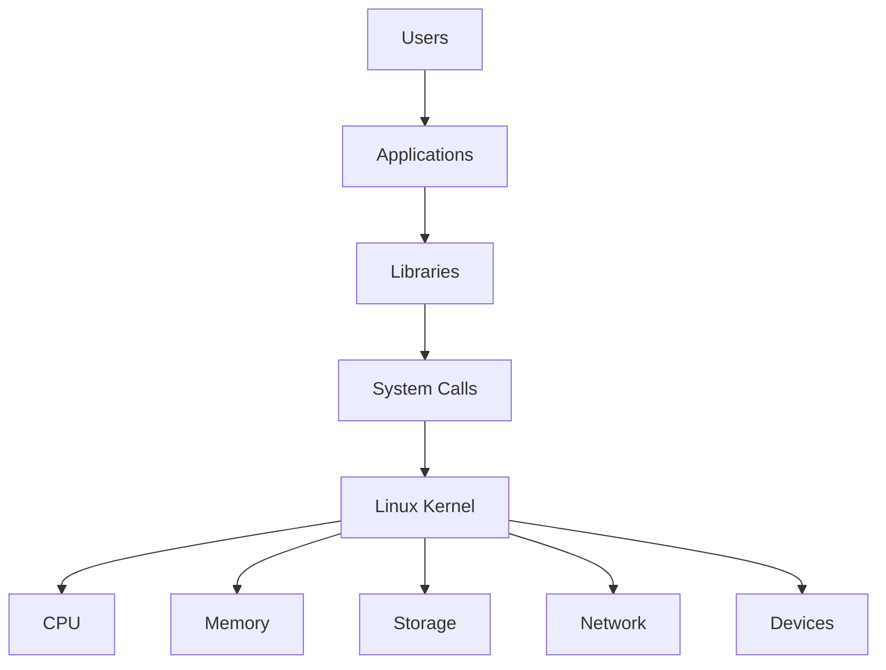

---

# Linux In One Picture

```text
+----------------------------------+
|          Applications            |
+----------------------------------+

| Nginx | PostgreSQL | Docker |

+----------------------------------+
|      System Libraries (glibc)    |
+----------------------------------+

+----------------------------------+
|        System Calls API          |
+----------------------------------+

+----------------------------------+
|          Linux Kernel            |
+----------------------------------+

| CPU | Memory | Disk | Network |

+----------------------------------+
|             Hardware             |
+----------------------------------+
```

---

# The Linux Boot Journey

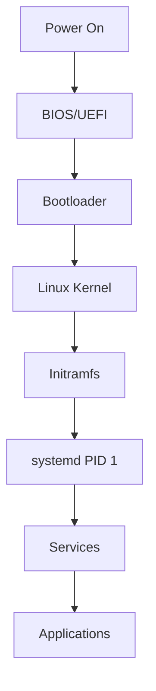

---

# Linux Kernel

The kernel is the core of Linux.

Responsibilities:

```text
Process Management

Memory Management

Device Management

Filesystem Management

Networking

Security
```

---

# Kernel Space vs User Space

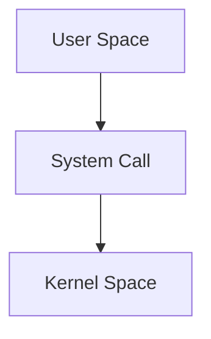

---

# User Space

Examples:

```text
Bash
Nginx
PostgreSQL
Python
Docker
Java
```

Cannot directly access hardware.

---

# Kernel Space

Has unrestricted access.

Controls:

```text
CPU
RAM
Disks
NICs
Devices
```

---

# System Calls

Applications communicate with Linux through system calls.

---

# System Call Flow

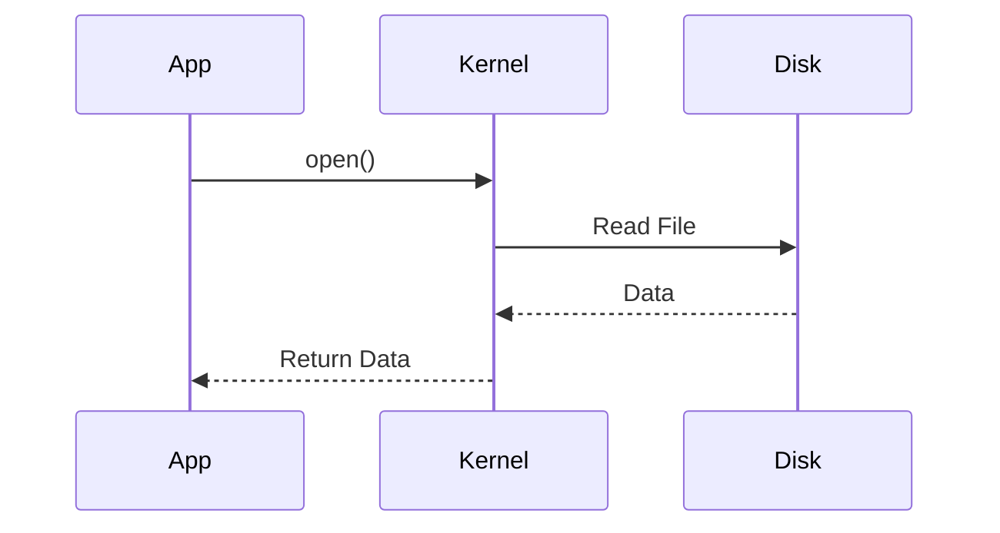

---

# Common System Calls

| System Call | Purpose            |
| ----------- | ------------------ |
| open()      | Open file          |
| read()      | Read file          |
| write()     | Write file         |
| fork()      | Create process     |
| exec()      | Run program        |
| socket()    | Create socket      |
| connect()   | Network connection |
| mmap()      | Map memory         |

---

# Observe System Calls

```bash
strace ls
```

---

# Process Architecture

A process contains:

```text
Code
Stack
Heap
Threads
File Descriptors
Memory Mappings
```

---

# Process Layout

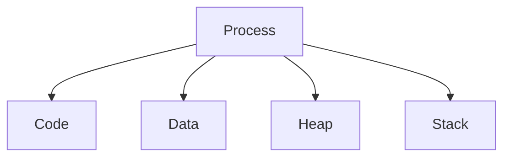

---

# Process Creation

Linux uses:

```text
fork()
```

and

```text
exec()
```

---

# Process Creation Flow

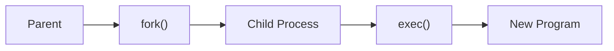

---

# Process States

```text
R = Running

S = Sleeping

D = Uninterruptible

T = Stopped

Z = Zombie
```

---

# View Process States

```bash
ps aux
```

---

# Linux Scheduler

Controls CPU access.

---

# Scheduler Goal

Answer:

```text
Who gets CPU next?
```

---

# Scheduling Architecture

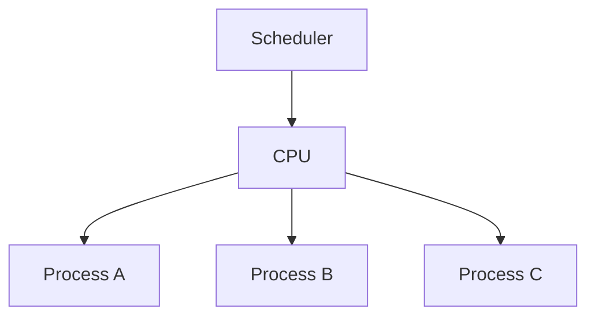

---

# Modern Scheduler

Linux uses:

```text
CFS
Completely Fair Scheduler
```

---

# Memory Architecture

Memory is divided into:

```text
Kernel Memory

User Memory
```

---

# Virtual Memory

Every process believes:

```text
I own all memory.
```

Reality:

```text
Kernel maps virtual memory to physical memory.
```

---

# Virtual Memory Flow

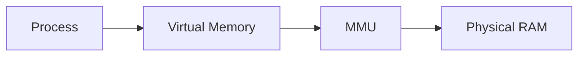

---

# Memory Layout

```text
+----------------+
| Stack          |
+----------------+
| Heap           |
+----------------+
| Data Segment   |
+----------------+
| Code Segment   |
+----------------+
```

---

# Memory Commands

```bash
free -h

vmstat

top

htop
```

---

# Page Cache

Linux aggressively caches disk data.

---

# Why?

RAM is faster than disks.

---

# Cache Flow

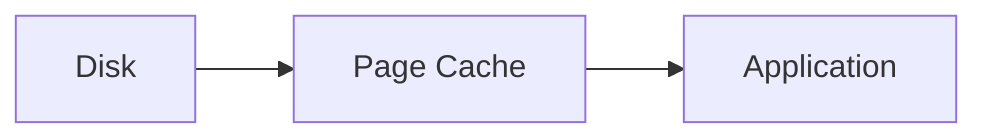

---

# Memory Investigation

```bash
cat /proc/meminfo
```

---

# Filesystem Internals

Linux stores files using:

```text
Inodes
Data Blocks
```

---

# File Architecture

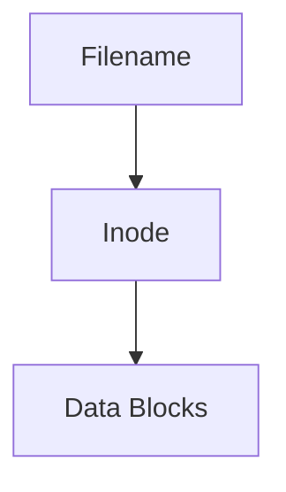

---

# Inode Stores

```text
Owner

Permissions

Timestamps

Pointers
```

Not:

```text
Filename
```

---

# File Read Flow

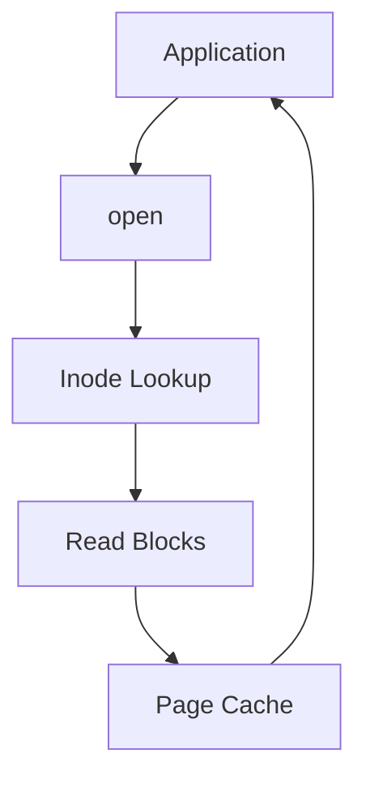

---

# Linux VFS

Virtual Filesystem Layer.

Provides:

```text
Unified Interface
```

for:

```text
ext4
xfs
btrfs
zfs
```

---

# VFS Architecture

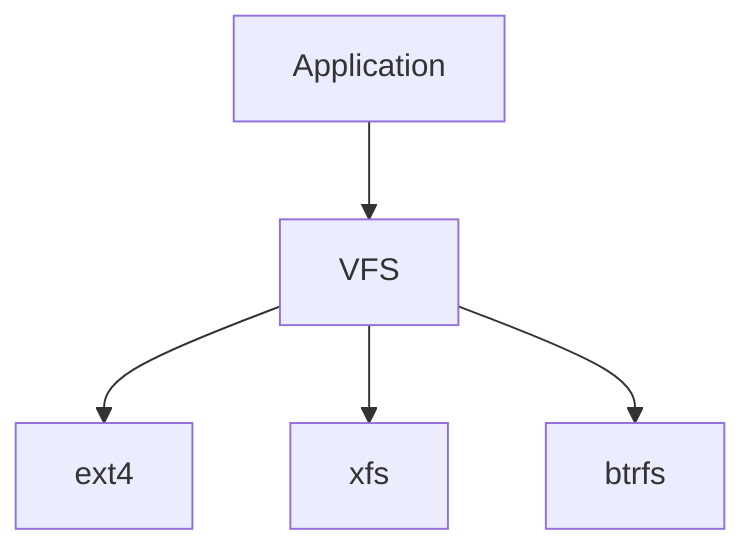

---

# Storage Stack

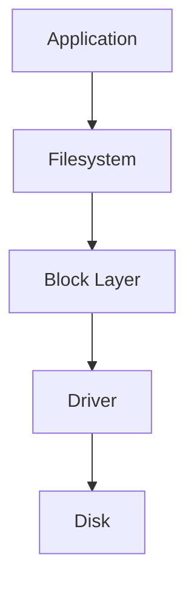

---

# Networking Internals

Applications use sockets.

---

# Networking Flow


---

# Socket Creation

```bash
socket()
bind()
listen()
accept()
```

Server flow.

---

# TCP Connection Flow

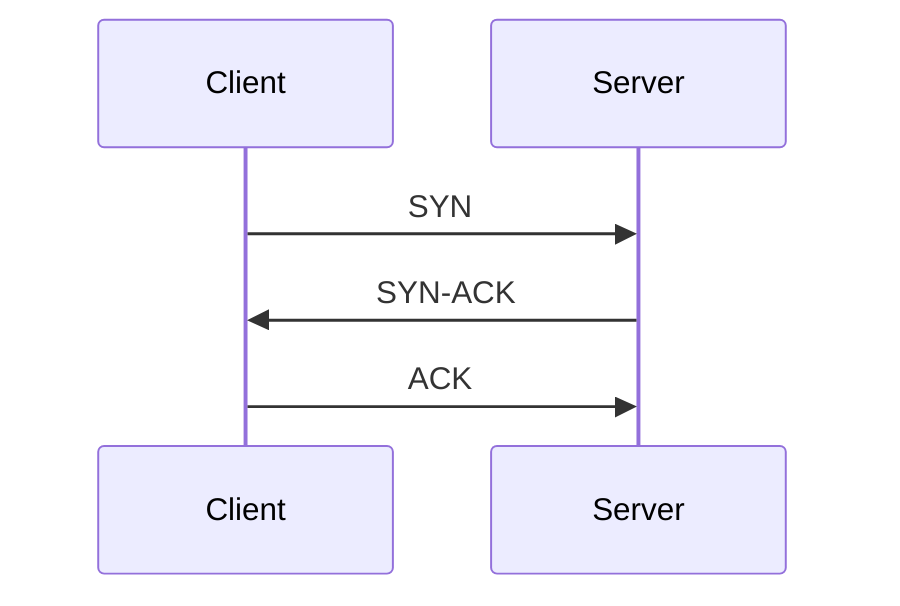

---

# Three-Way Handshake

Creates:

```text
Reliable Connection
```

---

# Network Commands

```bash
ss -tulpn

ip a

ip route

tcpdump
```

---

# Device Management

Linux treats devices as files.

Examples:

```text
/dev/sda

/dev/null

/dev/random

/dev/tty
```

---

# Device Architecture

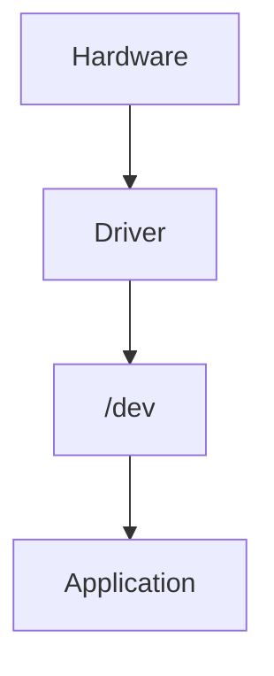

---

# Kernel Modules

Linux supports dynamic loading.

View:

```bash
lsmod
```

Load:

```bash
modprobe module
```

---

# Module Flow

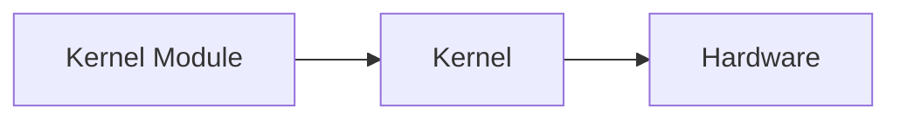

---

# Interrupts

Hardware signals CPU.

Examples:

```text
Network Packet

Disk Completion

Keyboard Input
```

---

# Interrupt Flow

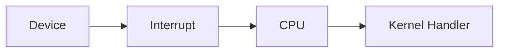

---

# Context Switching

CPU switches between processes.

---

# Context Switch Flow

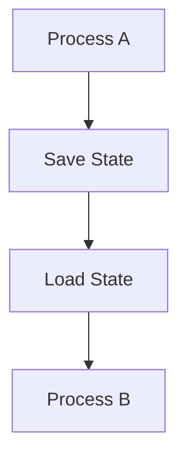

---

# Namespaces

Foundation of containers.

Provide isolation.

Types:

```text
PID

Network

Mount

UTS

IPC

User
```

---

# Namespace Architecture

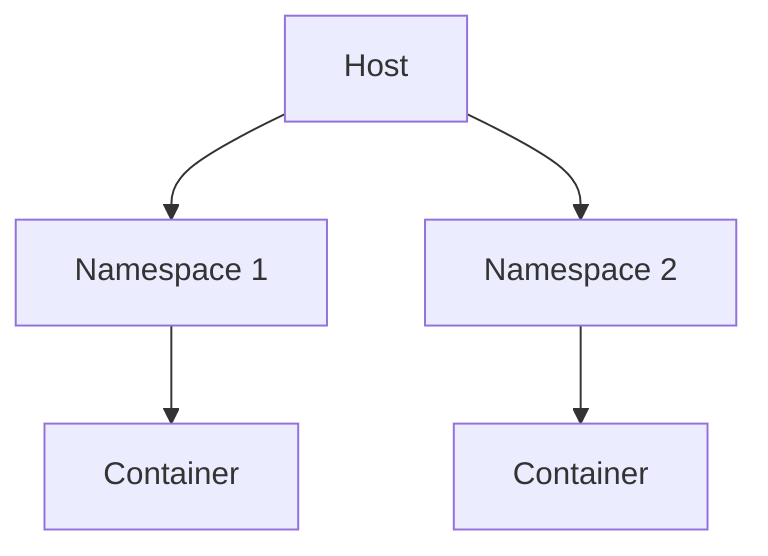

---

# cgroups

Control resources.

Limit:

```text
CPU

Memory

Disk

Network
```

---

# cgroup Architecture

```mermaid
graph TD

CGROUP["cgroup"]

CGROUP --> CPU["CPU Limit"]

CGROUP --> MEM["Memory Limit"]

CGROUP --> IO["IO Limit"]
```

---

# Containers Internals

A container is:

```text
Namespaces
+
cgroups
+
Filesystem Layers
```

Not:

```text
A VM
```

---

# Container Stack

```mermaid
graph TD

CONTAINER["Container"]

CONTAINER --> NS["Namespaces"]

CONTAINER --> CG["cgroups"]

CONTAINER --> FS["OverlayFS"]
```

---

# OverlayFS

Docker storage technology.

---

# OverlayFS Layers

```mermaid
graph TD

BASE["Base Layer"]

BASE --> LAYER1["Layer"]

LAYER1 --> LAYER2["Layer"]

LAYER2 --> RW["Writable Layer"]
```

---

# /proc Filesystem

Kernel exposes process information.

Examples:

```bash
/proc/cpuinfo

/proc/meminfo

/proc/PID/status
```

---

# /sys Filesystem

Kernel device information.

Examples:

```bash
/sys/class

/sys/block

/sys/devices
```

---

# Linux Security Layers

```mermaid
graph TD

USER["User"]

USER --> PERM["Permissions"]

PERM --> ACL["ACL"]

ACL --> CAP["Capabilities"]

CAP --> SELINUX["SELinux/AppArmor"]
```

---

# Observability Layer

Linux provides visibility through:

```text
Logs

Metrics

Tracing

Events
```

---

# Key Investigation Commands

```bash
top

htop

ps

ss

strace

lsof

vmstat

iostat

dmesg

journalctl
```

---

# Universal Linux Internals Map

```mermaid
mindmap
  root((Linux))

    Kernel
      Scheduler
      Memory
      Drivers
      Network

    Processes
      PID
      Threads
      Signals

    Memory
      RAM
      Cache
      Virtual Memory

    Storage
      VFS
      Inodes
      Filesystems

    Networking
      TCP
      UDP
      Sockets

    Containers
      Namespaces
      cgroups
      OverlayFS

    Security
      Permissions
      ACLs
      Capabilities

    Observability
      Logs
      Metrics
      Tracing
```

---

# Production Debugging Cheat Sheet

CPU:

```bash
top
htop
pidstat
```

Memory:

```bash
free -h
vmstat
```

Storage:

```bash
iostat
df -h
```

Processes:

```bash
ps aux
pstree
```

Networking:

```bash
ss -tulpn
tcpdump
```

System Calls:

```bash
strace
```

Open Files:

```bash
lsof
```

Kernel:

```bash
dmesg
journalctl -k
```

---

# The Linux Engineer's Mental Model

When a user opens:

```text
https://example.com
```

Linux performs:

```text
DNS Resolution
        ↓
Socket Creation
        ↓
TCP Handshake
        ↓
Process Scheduling
        ↓
Memory Allocation
        ↓
Filesystem Access
        ↓
Network Transmission
        ↓
Response Delivery
```

Every Linux subsystem participates.

---

# Final Takeaway

Linux is not a collection of commands.

Linux is a living system made of:

```text
Processes
Memory
Storage
Networking
Security
Kernel
Containers
Observability
```

Commands merely expose the state of these subsystems.

Master Linux Internals and you gain the ability to:

```text
Debug Faster

Design Better Systems

Understand Containers

Operate Kubernetes

Scale Infrastructure

Think Like a Systems Engineer
```

The kernel is the heart of Linux.

Everything else is built around it.
