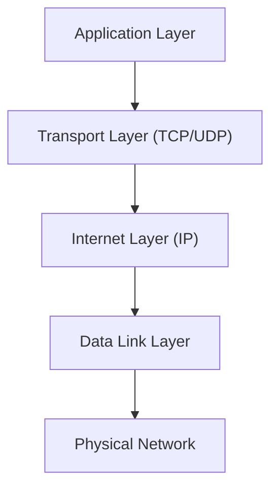
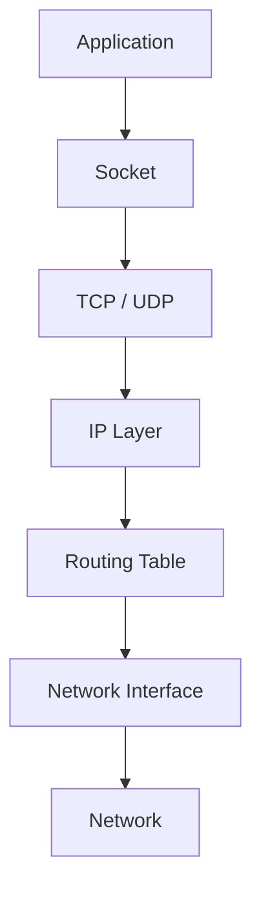
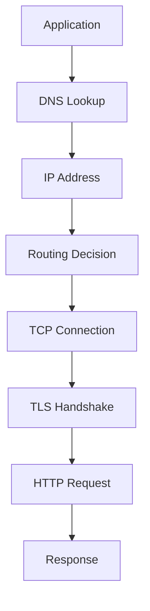
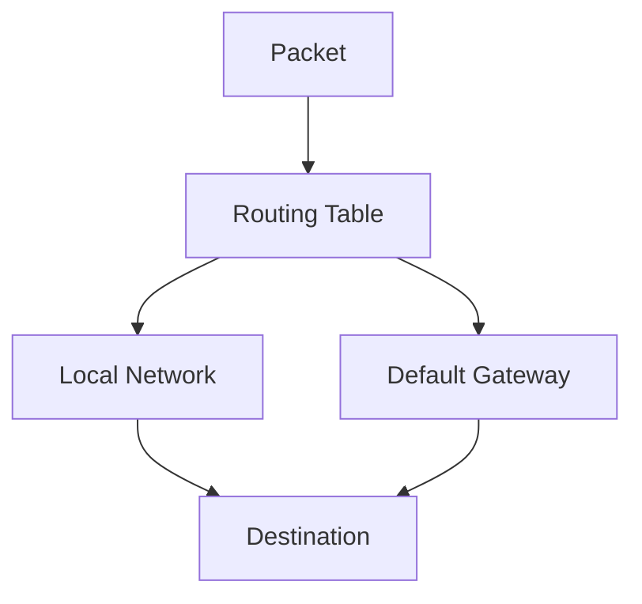
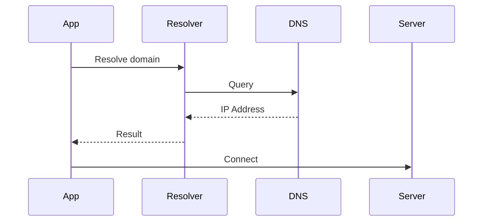
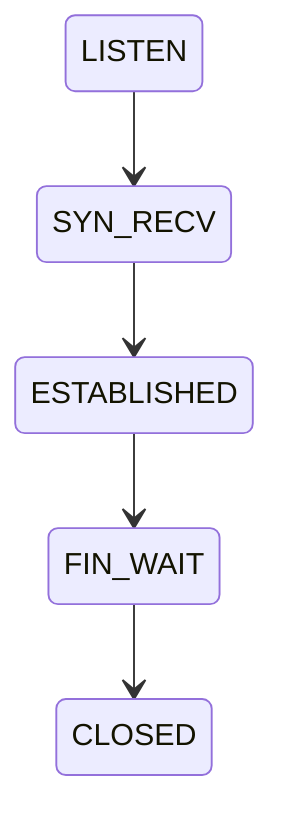
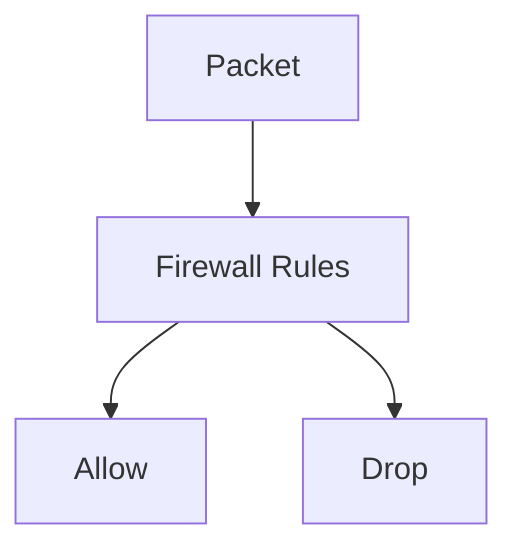
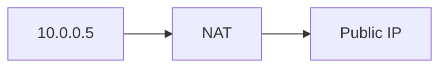
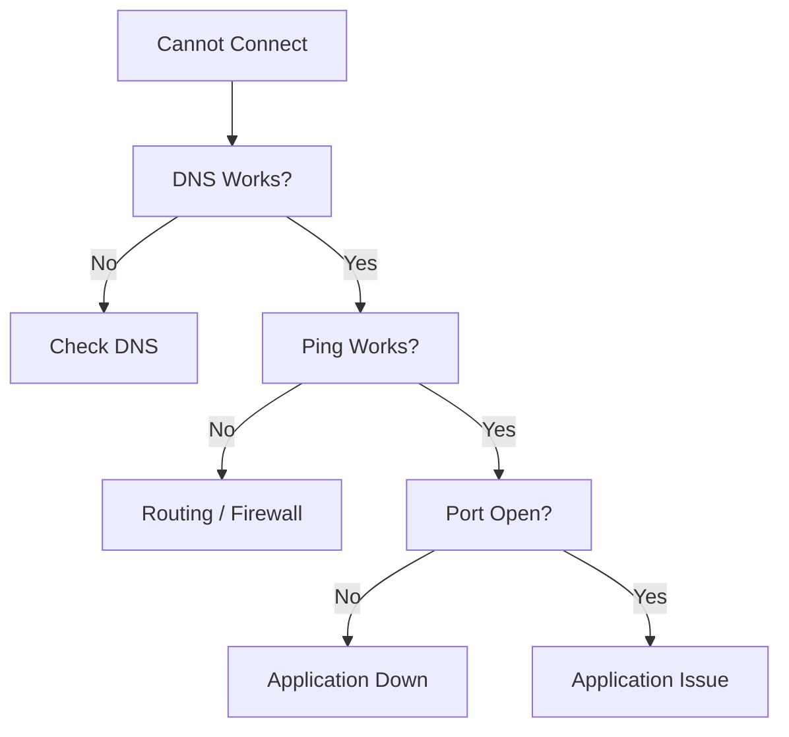

# Linux Networking Cheat Sheet

## The Complete Network Engineering & Production Troubleshooting Reference

---

# Why This Exists

Modern systems are distributed systems.

Applications no longer run on a single machine.

Today's applications communicate through:

* APIs
* Databases
* Load Balancers
* Reverse Proxies
* Service Meshes
* Containers
* Kubernetes
* Cloud Networks

Every request travels through networks.

When networking breaks:

```text
Users see:
- Website Down
- API Timeout
- Database Connection Failure
- Service Unreachable
```

But engineers see:

```text
DNS
Routing
ARP
TCP
UDP
Sockets
Firewalls
NAT
Load Balancers
Network Policies
```

This cheat sheet helps bridge that gap.

---

# Mental Model

Networking is simply:

> Moving data from one process to another process.

Not computer-to-computer.

Not server-to-server.

Ultimately:

```text
Process A
    |
    V
Kernel
    |
Network
    |
Kernel
    |
    V
Process B
```

Every packet exists to deliver data between processes.

---

# First Principles

Every network communication requires:

```text
Source
Destination
Addressing
Routing
Transport
Application Protocol
```

Example:

```text
Browser
   |
TCP
   |
IP
   |
Ethernet
   |
Internet
   |
Server
```

---

# The Networking Stack



---

# Linux Network Architecture



---

# Packet Journey

When you open:

```text
https://example.com
```

Linux performs:



---

# Network Layers and Linux Tools

| Layer       | Tool        |
| ----------- | ----------- |
| Application | curl, wget  |
| Transport   | ss, netstat |
| Internet    | ip          |
| Link        | ip link     |
| Physical    | ethtool     |

---

# IP Address Commands

---

## Show Addresses

```bash
ip addr
```

Shortcut:

```bash
ip a
```

Example:

```text
eth0
192.168.1.100/24
```

---

## Show Only IPv4

```bash
ip -4 addr
```

---

## Show Only IPv6

```bash
ip -6 addr
```

---

# Network Interfaces

View interfaces:

```bash
ip link
```

Example:

```text
lo
eth0
ens5
docker0
cni0
```

---

# Interface States

```text
UP
DOWN
UNKNOWN
```

---

## Bring Interface Up

```bash
ip link set eth0 up
```

---

## Bring Interface Down

```bash
ip link set eth0 down
```

---

# Routing

---

# Mental Model

Routers answer one question:

```text
Where should this packet go?
```

---

# View Routing Table

```bash
ip route
```

Example:

```text
default via 192.168.1.1
192.168.1.0/24 dev eth0
```

---

# Routing Visualization



---

# Default Gateway

View:

```bash
ip route
```

Typical output:

```text
default via 192.168.1.1
```

Meaning:

```text
Unknown destinations
go to router
```

---

# DNS Commands

---

# DNS Resolution Flow



---

## Query DNS

```bash
dig google.com
```

---

## Short Output

```bash
dig +short google.com
```

---

## DNS Records

```bash
dig google.com A
dig google.com AAAA
dig google.com MX
dig google.com TXT
```

---

## Alternative Tool

```bash
nslookup google.com
```

---

# Connectivity Testing

---

## Ping

```bash
ping google.com
```

Purpose:

```text
Latency
Packet Loss
Reachability
```

---

## Limit Packets

```bash
ping -c 5 google.com
```

---

# Traceroute

Shows path through network.

```bash
traceroute google.com
```

Alternative:

```bash
tracepath google.com
```

---

# Socket Inspection

---

# Mental Model

Applications do not directly use networks.

Applications use sockets.

```text
Application
    |
 Socket
    |
TCP/UDP
    |
Network
```

---

## View Listening Ports

```bash
ss -tulpn
```

Modern replacement for:

```text
netstat
```

---

## TCP Connections

```bash
ss -t
```

---

## UDP Connections

```bash
ss -u
```

---

## Listening Services

```bash
ss -l
```

---

## Process Using Port

```bash
ss -tulpn
```

Example:

```text
nginx -> 80
postgres -> 5432
```

---

# Port Investigation

Check port 8080:

```bash
ss -tulpn | grep 8080
```

Alternative:

```bash
lsof -i :8080
```

---

# HTTP Testing

---

## Request Page

```bash
curl https://example.com
```

---

## Headers Only

```bash
curl -I https://example.com
```

---

## Verbose Debugging

```bash
curl -v https://example.com
```

---

## POST Request

```bash
curl -X POST https://api.example.com
```

---

# Download Files

```bash
wget https://example.com/file.zip
```

or

```bash
curl -O file.zip
```

---

# Packet Capture

---

# Why Packet Capture Exists

Sometimes:

```text
Application says:
"It should work"
```

Packets reveal truth.

---

# Capture Packets

```bash
tcpdump
```

---

## Capture Interface

```bash
tcpdump -i eth0
```

---

## Capture Specific Host

```bash
tcpdump host 10.0.0.10
```

---

## Capture Port

```bash
tcpdump port 443
```

---

## Save Capture

```bash
tcpdump -w capture.pcap
```

Analyze later using:

```text
Wireshark
```

---

# TCP States

View:

```bash
ss -tan
```

---

# State Diagram



---

# Common TCP States

| State       | Meaning |
| ----------- | ------- |
| LISTEN      | Waiting |
| SYN_SENT    | Opening |
| ESTABLISHED | Active  |
| FIN_WAIT    | Closing |
| TIME_WAIT   | Cleanup |
| CLOSED      | Closed  |

---

# ARP

Maps:

```text
IP -> MAC Address
```

View:

```bash
ip neigh
```

---

# Firewall Commands

---

# Packet Filtering Architecture



---

## nftables (Modern)

View rules:

```bash
nft list ruleset
```

---

## iptables (Legacy)

View:

```bash
iptables -L -n -v
```

---

# NAT

Network Address Translation.

Used in:

* Home routers
* AWS NAT Gateway
* Kubernetes
* Docker

---

# NAT Flow



---

# Docker Networking

Interfaces:

```text
docker0
veth*
bridge
```

View:

```bash
docker network ls
```

Inspect:

```bash
docker network inspect bridge
```

---

# Kubernetes Networking

Important concepts:

```text
Pod IP
Service IP
Cluster IP
Ingress
CNI
```

---

## Debug Networking

```bash
kubectl get pods -o wide
```

```bash
kubectl exec -it pod -- sh
```

```bash
kubectl logs pod
```

---

# Cloud Networking

Common Components

```text
VPC
Subnet
Route Table
Security Group
NAT Gateway
Internet Gateway
Load Balancer
```

---

# AWS Traffic Flow


---

# Performance Considerations

---

## High Latency

Possible causes:

```text
Distance
Congestion
DNS Delays
Slow Handshake
Packet Loss
```

---

## Packet Loss

Check:

```bash
ping
mtr
traceroute
```

Symptoms:

```text
Timeouts
Retries
Slow APIs
```

---

## Too Many Connections

Check:

```bash
ss -s
```

Symptoms:

```text
TIME_WAIT explosion
Port exhaustion
```

---

# Security Considerations

Never expose:

```text
Database Ports
SSH to Internet
Internal APIs
```

Examples:

```text
3306 MySQL
5432 PostgreSQL
6379 Redis
9200 Elasticsearch
```

---

# Production Troubleshooting

---

# Website Not Reachable

Check:

```bash
ping host
```

Then:

```bash
dig host
```

Then:

```bash
curl -v
```

Then:

```bash
ss -tulpn
```

---

# DNS Failure

Check:

```bash
dig domain
```

Check resolver:

```bash
cat /etc/resolv.conf
```

---

# Port Not Listening

Check:

```bash
ss -tulpn
```

Verify service:

```bash
systemctl status service
```

---

# Connection Refused

Usually:

```text
Application not running
Wrong port
Firewall block
```

---

# Timeout

Usually:

```text
Routing
Firewall
Network ACL
Packet Loss
```

---

# Troubleshooting Decision Tree



---

# Common Mistakes

### Assuming DNS and networking are the same thing

### Ignoring routing tables

### Using ping as the only test

### Forgetting firewall rules

### Exposing databases publicly

### Ignoring packet captures

### Forgetting IPv6

### Not checking listening sockets

---

# Engineering Mindset

Beginners ask:

```text
Why can't I connect?
```

Engineers ask:

```text
Can I resolve DNS?

Can I reach the host?

Can I reach the port?

Can TCP establish?

Can the application respond?

Which layer failed?
```

Networking becomes easy when you isolate the layer.

---

# Interview Questions

### Difference between TCP and UDP?

### What happens when you type google.com in a browser?

### Explain the TCP three-way handshake.

### What is a socket?

### What is NAT?

### What is a routing table?

### Difference between ping and traceroute?

### Why is ss preferred over netstat?

### How does DNS resolution work?

### What causes TIME_WAIT accumulation?

### What is packet loss?

### How does Kubernetes networking work?

---

# One-Page Emergency Reference

```bash
# Interfaces
ip a
ip link

# Routing
ip route

# DNS
dig google.com
dig +short google.com

# Connectivity
ping host
traceroute host

# Sockets
ss -tulpn
ss -s

# HTTP
curl -I URL
curl -v URL

# Packets
tcpdump -i eth0

# ARP
ip neigh

# Firewall
nft list ruleset
iptables -L -n -v

# Processes using ports
lsof -i :80
```

---

# Final Takeaway

Networking is not about commands.

Networking is about understanding how packets move through:

```text
Applications
Sockets
TCP/UDP
IP
Routing
DNS
Firewalls
Load Balancers
Cloud Networks
Containers
Kubernetes
```

Commands merely expose the state of those systems.

Master the packet journey, and networking problems become predictable instead of mysterious.
