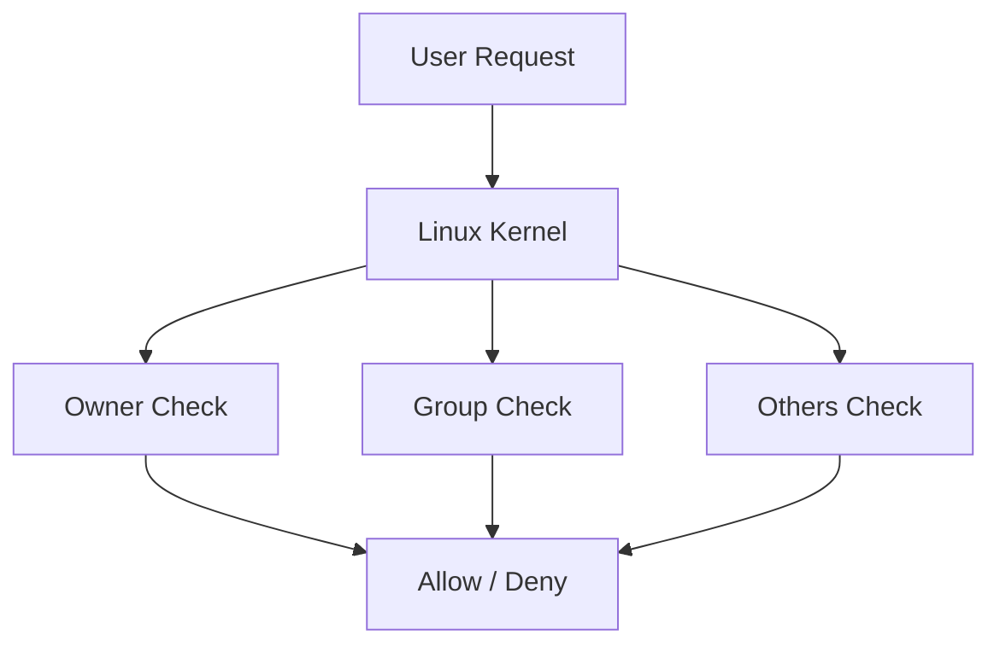
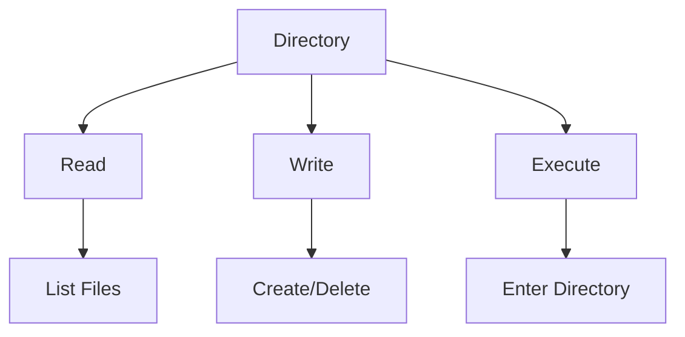
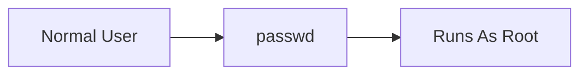
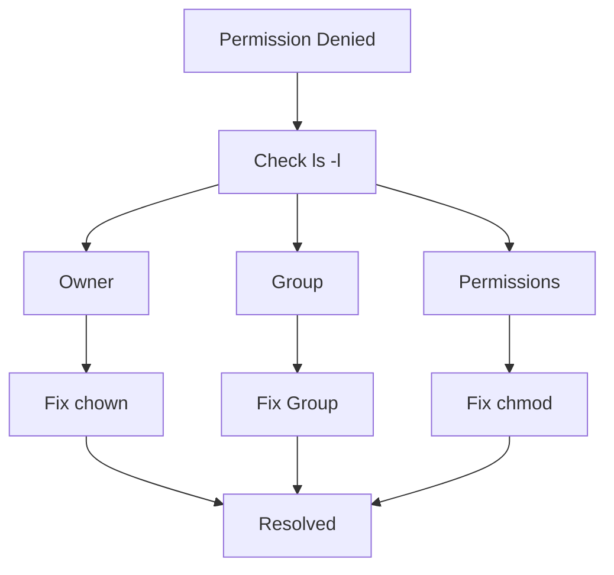

# Linux Permissions Cheat Sheet

## The Complete Access Control & Security Engineering Reference

---

# Why This Exists

Linux is a multi-user operating system.

Multiple users.

Multiple applications.

Multiple services.

Multiple containers.

Multiple databases.

Multiple teams.

All sharing the same system.

Without permissions:

```text
Anyone could:
- Read sensitive files
- Modify configurations
- Delete databases
- Access secrets
- Escalate privileges
```

Permissions are Linux's first security boundary.

Understanding them is essential for:

* Linux Engineers
* Backend Engineers
* DevOps Engineers
* SREs
* Platform Engineers
* Security Engineers
* Cloud Architects

Most production issues involve:

* Permission denied errors
* Incorrect ownership
* Broken deployments
* Failed service startups
* Container volume access problems
* Security misconfigurations

---

# Mental Model

Think of Linux permissions as a security gate.

```text
                Request
                    |
                    V
           +----------------+
           | Permission Check|
           +----------------+
                    |
         ---------------------
         |                   |
       Allow              Deny
```

Before any file is opened:

```text
User
  |
  V
Kernel
  |
  V
Permission Verification
  |
  V
File Access
```

The kernel performs these checks.

Not the application.

Not the shell.

The kernel.

---

# First Principles

Every filesystem object has:

```text
Owner
Group
Permissions
```

Example:

```bash
-rwxr-x---
```

This line determines:

```text
Who can read
Who can write
Who can execute
```

---

# Permission Architecture



---

# Core Permission Model

Every file contains three permission sets.

```text
Owner
Group
Others
```

Each set contains:

```text
Read
Write
Execute
```

---

# Permission Structure

Example:

```bash
-rwxr-xr--
```

Breakdown:

```text
- rwx r-x r--

|   |   |
|   |   +---- Others
|   +-------- Group
+------------ Owner
```

---

# Understanding rwx

## Read (r)

Value:

```text
4
```

Allows:

```text
View file contents
Read metadata
```

Examples:

```bash
cat file.txt
less file.txt
```

---

## Write (w)

Value:

```text
2
```

Allows:

```text
Modify file
Overwrite file
Append file
```

Examples:

```bash
echo "data" > file.txt
```

---

## Execute (x)

Value:

```text
1
```

Allows:

```text
Run binary
Run script
Enter directory
```

Example:

```bash
./deploy.sh
```

---

# Numeric Permission Values

```text
Read      = 4
Write     = 2
Execute   = 1
```

---

# Permission Calculation

## 777

```text
4+2+1 = 7

Owner  = 7
Group  = 7
Others = 7
```

```bash
chmod 777 file
```

Everyone can do everything.

Dangerous.

---

## 755

```text
Owner  = 7
Group  = 5
Others = 5
```

Equivalent:

```text
rwxr-xr-x
```

Used for:

```text
Scripts
Applications
Web content
```

---

## 644

```text
rw-r--r--
```

Most common file permission.

---

## 600

```text
rw-------
```

Sensitive files.

Examples:

```text
SSH Keys
Secrets
Certificates
```

---

# Permission Table

| Numeric | Symbolic  |
| ------- | --------- |
| 777     | rwxrwxrwx |
| 755     | rwxr-xr-x |
| 750     | rwxr-x--- |
| 700     | rwx------ |
| 644     | rw-r--r-- |
| 640     | rw-r----- |
| 600     | rw------- |
| 400     | r-------- |

---

# Viewing Permissions

---

## Long Listing

```bash
ls -l
```

Example:

```text
-rwxr-x--- 1 app backend 5320 deploy.sh
```

---

# Breaking Down ls -l

```text
-rwxr-x---
```

```text
-
|
File Type
```

```text
rwx
```

Owner permissions.

```text
r-x
```

Group permissions.

```text
---
```

Others permissions.

---

# File Types

| Symbol | Meaning          |
| ------ | ---------------- |
| -      | File             |
| d      | Directory        |
| l      | Symlink          |
| b      | Block Device     |
| c      | Character Device |
| s      | Socket           |
| p      | Named Pipe       |

---

# Ownership

Every file has:

```text
Owner UID
Group GID
```

View:

```bash
ls -l
```

Example:

```text
john developers app.py
```

---

# Show User IDs

```bash
id
```

Output:

```text
uid=1000
gid=1000
```

---

# Change Ownership

```bash
chown user file
```

Example:

```bash
chown nginx nginx.conf
```

---

# Change User and Group

```bash
chown app:backend file
```

---

# Recursive Ownership

```bash
chown -R app:backend /opt/app
```

Production deployment staple.

---

# Change Group

```bash
chgrp developers file
```

---

# Directory Permissions

Directories behave differently.

---

## Read Permission

Allows:

```text
List filenames
```

---

## Write Permission

Allows:

```text
Create files
Delete files
Rename files
```

---

## Execute Permission

Allows:

```text
Enter directory
Traverse directory
```

Example:

```bash
cd folder
```

Requires execute permission.

---

# Directory Permission Matrix



---

# Changing Permissions

---

## Symbolic Mode

Add execute:

```bash
chmod +x script.sh
```

Remove write:

```bash
chmod -w file.txt
```

Grant owner execute:

```bash
chmod u+x script.sh
```

---

## Numeric Mode

```bash
chmod 755 script.sh
```

```bash
chmod 644 config.yaml
```

---

# Common Permission Commands

```bash
chmod 755 app.sh
chmod 644 config.ini
chmod 600 private.key

chown user file
chown user:group file

chgrp group file
```

---

# Special Permissions

Advanced Linux security.

---

# SUID

Set User ID.

```bash
chmod u+s binary
```

Display:

```text
-rwsr-xr-x
```

---

## What It Does

Runs as file owner.

Usually root.

Example:

```text
passwd
```

Normal user changes password because:

```text
passwd runs with root privileges
```

---

# SUID Architecture



---

# SGID

Set Group ID.

```bash
chmod g+s folder
```

Purpose:

```text
New files inherit directory group
```

Useful for:

```text
Shared team directories
```

---

# Sticky Bit

Commonly used on:

```bash
/tmp
```

Display:

```text
drwxrwxrwt
```

Meaning:

```text
Only file owner may delete file
```

Even if directory is writable.

---

# ACLs (Access Control Lists)

Traditional permissions:

```text
Owner
Group
Others
```

Sometimes insufficient.

ACLs provide:

```text
User-specific permissions
```

---

## View ACLs

```bash
getfacl file
```

---

## Set ACL

```bash
setfacl -m u:john:rwx file
```

Grant user access directly.

---

# Linux Capabilities

Traditional root model:

```text
All or Nothing
```

Capabilities split root powers.

Examples:

```text
CAP_NET_ADMIN
CAP_SYS_ADMIN
CAP_SYS_TIME
```

View:

```bash
getcap binary
```

---

# Capability Example

Allow port 80 binding:

```bash
setcap cap_net_bind_service=+ep app
```

Run without root.

Huge security improvement.

---

# Umask

Controls default permissions.

View:

```bash
umask
```

Example:

```text
022
```

Produces:

```text
Files = 644
Directories = 755
```

---

# Authentication Files

Important files:

```bash
/etc/passwd
/etc/shadow
/etc/group
```

---

# Password Security

Check:

```bash
ls -l /etc/shadow
```

Expected:

```text
---------- or root-only access
```

Never world-readable.

---

# SSH Permissions

Private key:

```bash
chmod 600 id_rsa
```

Directory:

```bash
chmod 700 ~/.ssh
```

Otherwise SSH may refuse login.

---

# Docker Permission Issues

Common issue:

```text
Container cannot write volume
```

Cause:

```text
UID mismatch
```

Check:

```bash
docker exec container id
```

Compare with host ownership.

---

# Kubernetes Security Context

Example:

```yaml
securityContext:
  runAsUser: 1000
  runAsGroup: 1000
```

Controls container permissions.

---

# Production Examples

---

## Nginx Cannot Read Config

Error:

```text
Permission denied
```

Check:

```bash
ls -l /etc/nginx
```

Fix:

```bash
chown root:root config
chmod 644 config
```

---

## Application Cannot Write Logs

Check:

```bash
ls -ld /var/log/app
```

Fix:

```bash
chown app:app /var/log/app
```

---

## Docker Volume Write Failure

Check:

```bash
ls -ln data
```

Compare UID/GID.

---

# Security Best Practices

---

## Principle of Least Privilege

Never give:

```bash
chmod 777
```

unless absolutely necessary.

---

## Use Dedicated Service Accounts

Bad:

```text
Everything runs as root
```

Good:

```text
nginx user
mysql user
postgres user
app user
```

---

## Prefer Capabilities

Instead of:

```text
Root access
```

Use:

```text
Specific capability
```

---

# Troubleshooting Flow



---

# Common Mistakes

### Using chmod 777 everywhere

### Running applications as root

### Forgetting execute bit on scripts

### Incorrect ownership after deployment

### Ignoring ACLs

### Forgetting SGID for shared directories

### Wrong permissions on SSH keys

### Breaking sudo configuration permissions

---

# Engineering Mindset

Beginners see:

```text
Permission denied
```

Engineers ask:

```text
Who owns the file?

Which UID is running?

Which GID is active?

What ACL applies?

Is SELinux involved?

Is AppArmor involved?

Is the filesystem mounted read-only?
```

The permission denied message is only a symptom.

---

# Interview Questions

### Difference between chmod 755 and 644?

### What is an inode?

### Explain SUID.

### Explain SGID.

### Explain Sticky Bit.

### Difference between ACLs and traditional permissions?

### What is umask?

### Why does SSH require 600 permissions?

### What are Linux capabilities?

### How does Kubernetes control container permissions?

### Why is chmod 777 dangerous?

---

# One-Page Emergency Reference

```bash
# View permissions
ls -l

# View ownership
id

# Change permissions
chmod 755 file
chmod 644 file
chmod +x script.sh

# Change ownership
chown user file
chown user:group file
chown -R user:group dir

# Change group
chgrp group file

# ACLs
getfacl file
setfacl -m u:user:rwx file

# Capabilities
getcap binary
setcap cap_net_bind_service=+ep app

# Default permissions
umask

# SSH permissions
chmod 700 ~/.ssh
chmod 600 ~/.ssh/id_rsa
```

---

# Final Takeaway

Linux permissions are not merely file attributes.

They are the first line of defense protecting:

* Applications
* Databases
* Containers
* Secrets
* Cloud Infrastructure
* Production Systems

Master permissions, ownership, ACLs, capabilities, and privilege boundaries, and you will understand one of the most important security foundations of Linux engineering.
