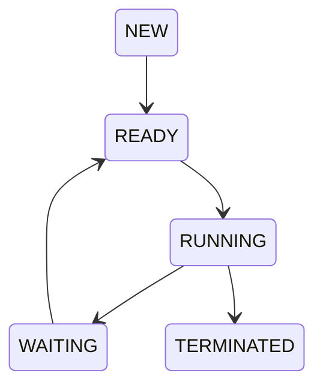
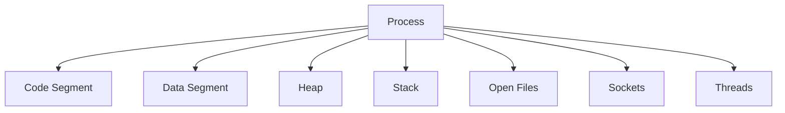
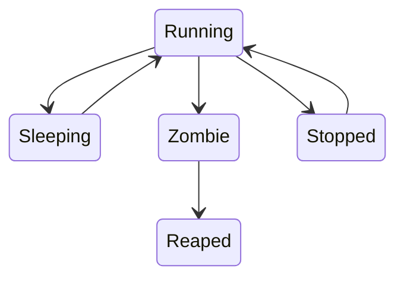
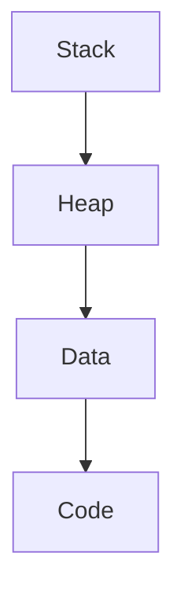
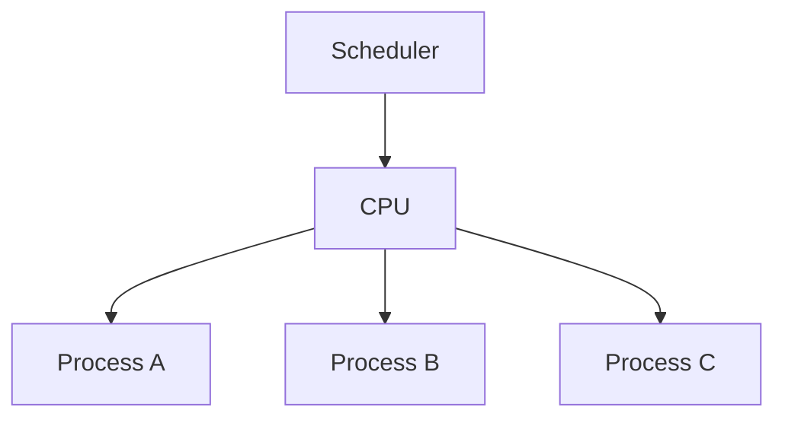
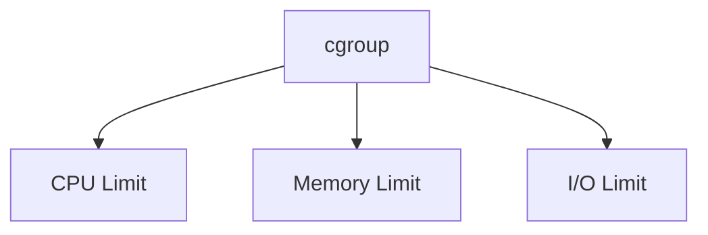
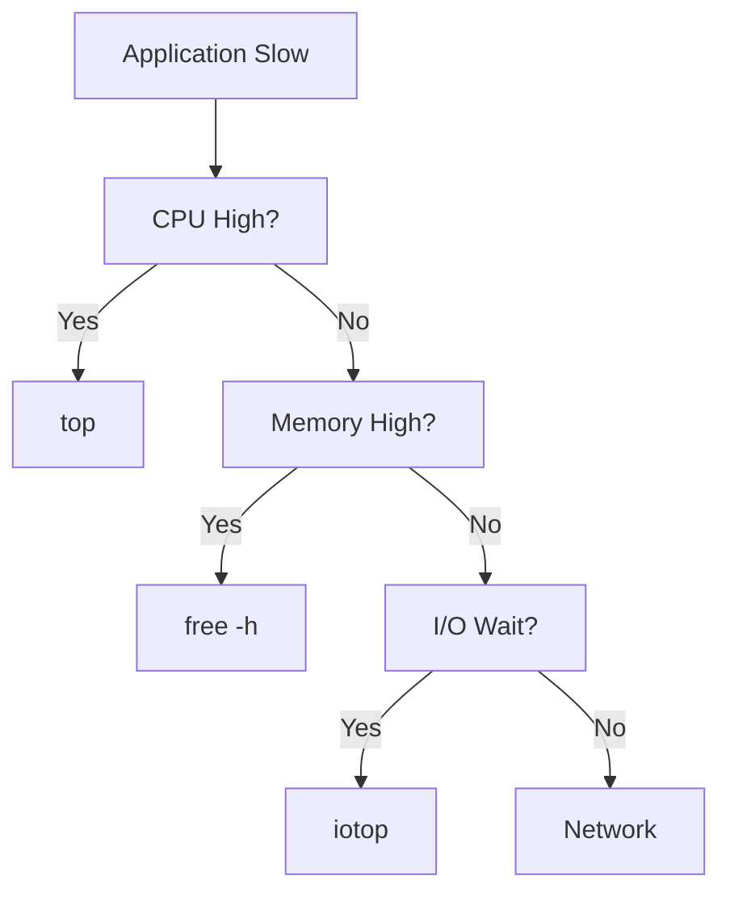

# Linux Process Cheat Sheet

## The Complete Process Management, Scheduling, and Runtime Engineering Reference

---

# Why This Exists

Every application running on Linux is a process.

Your browser?

Process.

Nginx?

Process.

PostgreSQL?

Process.

Docker containers?

Processes.

Kubernetes Pods?

Groups of processes.

Modern infrastructure is fundamentally:

> Process management at massive scale.

Most production incidents eventually involve:

* High CPU usage
* Memory leaks
* Stuck processes
* Zombie processes
* OOM kills
* Runaway applications
* Service crashes
* Container failures

Understanding processes is one of the most valuable Linux engineering skills.

---

# Mental Model

Think of Linux as a giant process factory.

```text
Applications
     |
     V
  Processes
     |
     V
 Linux Kernel
     |
     V
 CPU + Memory + I/O
```

The kernel's primary responsibility is deciding:

```text
Who runs?
When?
For how long?
How much memory?
What resources?
```

---

# First Principles

A process is:

> A running instance of a program.

Program:

```text
/usr/bin/nginx
```

Process:

```text
PID 1256
Running nginx
Using CPU and Memory
```

---

# Program vs Process


Example:

```bash
/usr/bin/python
```

Becomes:

```text
PID 4567
```

after execution.

---

# Process Lifecycle



---

# Lifecycle States Explained

## New

Process created.

Not yet running.

---

## Ready

Waiting for CPU.

```text
Ready
But not executing
```

---

## Running

Currently executing instructions.

Using CPU.

---

## Waiting

Waiting for:

```text
Disk
Network
User Input
Locks
Database
```

---

## Terminated

Finished execution.

Resources released.

---

# Process Architecture



---

# Process Internals

Each process has:

```text
PID
PPID
UID
GID
Memory
Open Files
Environment Variables
Scheduling Info
CPU Usage
```

---

# Process Tree

Linux processes form a hierarchy.

```text
systemd (PID 1)
|
+-- nginx
|
+-- postgres
|
+-- sshd
     |
     +-- bash
           |
           +-- python
```

---

# Visualizing Process Trees

```bash
pstree
```

Example:

```bash
pstree -p
```

---

# Process IDs

Every process receives:

```text
PID
```

Example:

```text
1
25
1056
7800
```

View current shell PID:

```bash
echo $$
```

---

# Parent Process ID

View:

```bash
ps -ef
```

Output:

```text
PID  PPID
```

Example:

```text
1200  1
```

Means:

```text
Parent = PID 1
```

---

# PID 1

Most important process.

Usually:

```text
systemd
```

Responsible for:

```text
Starting services
Reaping zombies
System initialization
```

---

# Viewing Processes

---

## Show Processes

```bash
ps
```

---

## Full Process List

```bash
ps aux
```

---

## Detailed Format

```bash
ps -ef
```

---

## Process Tree

```bash
pstree
```

---

## Search Process

```bash
ps aux | grep nginx
```

---

# Real-Time Monitoring

---

## top

```bash
top
```

Shows:

```text
CPU
Memory
Load
Processes
```

---

## htop

```bash
htop
```

More interactive.

Install:

```bash
sudo apt install htop
```

---

# Process State Codes

View:

```bash
ps aux
```

State column:

```text
R
S
D
Z
T
```

---

## R

Running.

---

## S

Sleeping.

Most processes are here.

---

## D

Uninterruptible Sleep.

Usually:

```text
Disk I/O
Storage Problem
NFS Issue
```

Dangerous in production.

---

## Z

Zombie.

Process exited.

Parent hasn't cleaned it up.

---

## T

Stopped.

Typically:

```bash
Ctrl+Z
```

---

# Process State Diagram



---

# CPU Monitoring

---

## Top CPU Processes

```bash
ps aux --sort=-%cpu
```

---

## Top 10

```bash
ps aux --sort=-%cpu | head
```

---

## Per-Core View

```bash
mpstat -P ALL
```

---

# Memory Monitoring

---

## Overall Memory

```bash
free -h
```

---

## Top Memory Consumers

```bash
ps aux --sort=-%mem
```

---

## Process Memory

```bash
pmap PID
```

---

## Detailed Memory

```bash
cat /proc/PID/status
```

---

# Process Memory Layout



---

# Threads

A process can have multiple threads.

```text
Process
   |
   +-- Thread 1
   +-- Thread 2
   +-- Thread 3
```

---

# View Threads

```bash
ps -T -p PID
```

Or:

```bash
top -H
```

---

# Signals

Signals are process notifications.

```text
Kernel
   |
 Signal
   |
 Process
```

---

# Common Signals

| Signal  | Number | Purpose       |
| ------- | ------ | ------------- |
| SIGTERM | 15     | Graceful stop |
| SIGKILL | 9      | Force kill    |
| SIGHUP  | 1      | Reload        |
| SIGINT  | 2      | Ctrl+C        |
| SIGSTOP | 19     | Pause         |
| SIGCONT | 18     | Resume        |

---

# Send Signals

Graceful:

```bash
kill PID
```

or

```bash
kill -15 PID
```

---

Force:

```bash
kill -9 PID
```

---

Reload:

```bash
kill -HUP PID
```

Common with:

```text
nginx
haproxy
```

---

# Signal Architecture


---

# Process Priority

Linux scheduler uses priorities.

---

## Nice Value

Range:

```text
-20 to 19
```

```text
-20 = Highest Priority
19  = Lowest Priority
```

---

View:

```bash
ps -el
```

---

Run with priority:

```bash
nice -n 10 app
```

---

Modify:

```bash
renice 5 PID
```

---

# Scheduling

Linux uses:

```text
Completely Fair Scheduler (CFS)
```

Goal:

```text
Fair CPU distribution
```

---

# Scheduler Visualization



---

# Open Files

Everything is a file.

Processes maintain file descriptors.

---

View:

```bash
lsof -p PID
```

---

Count:

```bash
ls /proc/PID/fd | wc -l
```

---

# Open Network Connections

```bash
lsof -i
```

---

# /proc Filesystem

Kernel exposes process info.

```bash
/proc/PID
```

---

Examples:

```bash
/proc/1234/status
/proc/1234/maps
/proc/1234/fd
/proc/1234/environ
```

---

# Process Environment Variables

View:

```bash
cat /proc/PID/environ
```

---

Current shell:

```bash
env
```

---

# Background Processes

Run:

```bash
python app.py &
```

---

View jobs:

```bash
jobs
```

---

Foreground:

```bash
fg
```

---

Background:

```bash
bg
```

---

# Zombie Processes

---

# Mental Model

Zombie:

```text
Dead Process
Still Listed
```

Parent failed to collect exit status.

---

View:

```bash
ps aux | grep Z
```

---

Fix:

```text
Restart Parent Process
```

or

```text
Kill Parent
```

---

# Orphan Processes

Parent dies.

Process survives.

Linux reassigns:

```text
systemd (PID 1)
```

becomes parent.

---

# Containers and Processes

Important truth:

```text
Containers are processes
```

Not VMs.

---

Docker Example

```text
Container
   |
 Main Process
```

View:

```bash
docker top container
```

---

# Kubernetes and Processes

Pod:

```text
Namespace
Cgroups
Processes
```

Inside pod:

```bash
ps aux
```

---

# cgroups

Control resource limits.

Used by:

```text
Docker
Kubernetes
systemd
```

Controls:

```text
CPU
Memory
I/O
Network
```

---

# cgroup Architecture



---

# OOM Killer

When memory exhausted:

```text
Kernel chooses victim
```

and kills it.

---

Check logs:

```bash
dmesg | grep -i oom
```

---

System logs:

```bash
journalctl -k
```

---

# Production Troubleshooting

---

# High CPU

Check:

```bash
top
```

Then:

```bash
ps aux --sort=-%cpu
```

---

# High Memory

Check:

```bash
free -h
```

Then:

```bash
ps aux --sort=-%mem
```

---

# Service Not Running

```bash
systemctl status service
```

Then:

```bash
journalctl -u service
```

---

# Port Already In Use

```bash
ss -tulpn
```

or

```bash
lsof -i :8080
```

---

# Process Stuck

Check:

```bash
strace -p PID
```

---

# Disk Wait

Check:

```bash
iotop
```

---

# Troubleshooting Flow



---

# Performance Considerations

---

## Too Many Processes

Causes:

```text
Context Switching
CPU Overhead
Scheduler Pressure
```

---

## Too Many Threads

Problems:

```text
Memory Usage
Lock Contention
Scheduling Cost
```

---

## Excessive Forking

Symptoms:

```text
CPU Spikes
PID Exhaustion
```

---

# Security Considerations

Run services as:

```text
Dedicated Users
```

Not:

```text
root
```

Check:

```bash
ps aux
```

Look for:

```text
root-owned applications
```

---

# Common Mistakes

### Using kill -9 first

### Ignoring zombie processes

### Running everything as root

### Confusing threads with processes

### Ignoring OOM events

### Not checking open file limits

### Assuming containers are VMs

### Forgetting process hierarchies

---

# Engineering Mindset

Beginners see:

```text
Application crashed
```

Engineers see:

```text
Process
Scheduler
Memory
CPU
Signals
Threads
cgroups
Namespaces
Kernel
```

Applications are simply processes managed by Linux.

Understand the process model and most production incidents become explainable.

---

# Interview Questions

### What is a process?

### Difference between process and thread?

### What is PID?

### What is PPID?

### What is a zombie process?

### What is an orphan process?

### Explain SIGTERM vs SIGKILL.

### What is a context switch?

### What is the Linux scheduler?

### What is the OOM killer?

### How do containers use processes?

### What are cgroups?

### What is the /proc filesystem?

---

# One-Page Emergency Reference

```bash
# Process Listing
ps
ps aux
ps -ef
pstree

# Monitoring
top
htop

# CPU
ps aux --sort=-%cpu

# Memory
free -h
ps aux --sort=-%mem

# Signals
kill PID
kill -9 PID
kill -HUP PID

# Threads
top -H
ps -T -p PID

# Files
lsof -p PID

# Ports
lsof -i
ss -tulpn

# Process Info
cat /proc/PID/status

# OOM
dmesg | grep oom

# Debugging
strace -p PID
```

---

# Final Takeaway

Linux is fundamentally a process management system.

Everything you run becomes a process.

The kernel's job is to:

```text
Create
Schedule
Monitor
Restrict
Terminate
```

those processes efficiently.

Master process management and you gain deep visibility into:

* Applications
* Containers
* Databases
* Kubernetes
* Cloud Infrastructure
* Production Systems

Processes are the heartbeat of Linux.
