# Production Incident Cheat Sheet

## The Ultimate Linux Production Outage Survival Guide

> If everything is on fire, start here.

---

# Why This Exists

Production incidents are different from labs.

In a lab:

```text
You have time.
```

In production:

```text
Customers are impacted.
Revenue is affected.
Engineers are stressed.
Leadership is asking questions.
The clock is ticking.
```

During an incident:

People forget commands.

People panic.

People make mistakes.

This guide exists to provide a systematic approach to diagnosing and mitigating Linux production incidents.

---

# Golden Rule of Incident Response

Never start with assumptions.

Start with evidence.

Bad:

```text
"It must be DNS."
```

Good:

```text
Let's verify DNS.
```

Bad:

```text
"The server is down."
```

Good:

```text
Let's determine which subsystem is failing.
```

---

# Incident Response Mental Model

Every outage is usually one of these categories:

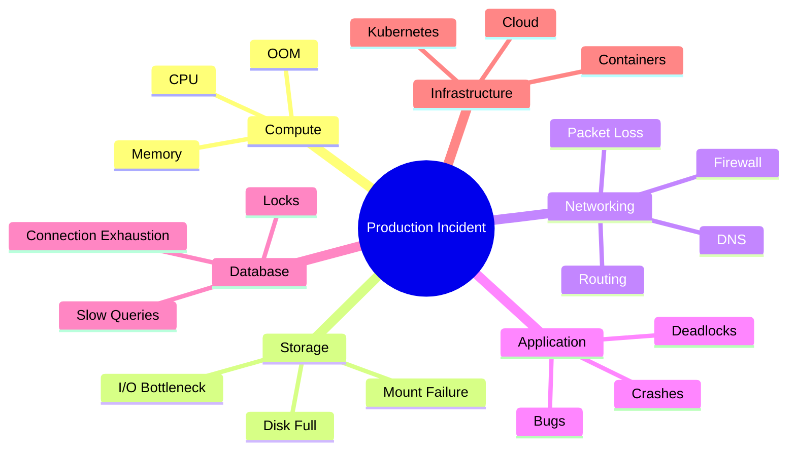

---

# Universal Incident Workflow

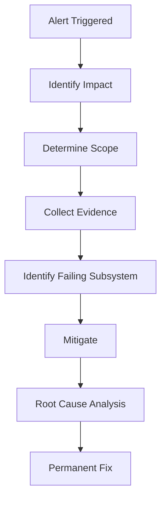

---

# First 60 Seconds Checklist

```bash
uptime
date
hostname
who
```

Check:

```text
Is system reachable?
Is system overloaded?
Is time correct?
Who is logged in?
```

---

# First 5 Minutes Checklist

```bash
top
free -h
df -h
df -i
ip a
ip route
ss -tulpn
systemctl --failed
journalctl -p err -b
```

This immediately covers:

```text
CPU
Memory
Disk
Inodes
Networking
Services
Errors
```

---

# Emergency System Snapshot

Run:

```bash
uptime

free -h

df -h

df -i

top -b -n1 | head -20

ss -tulpn

systemctl --failed

journalctl -p err -b | tail -50
```

Capture output before making changes.

---

# Incident Decision Tree

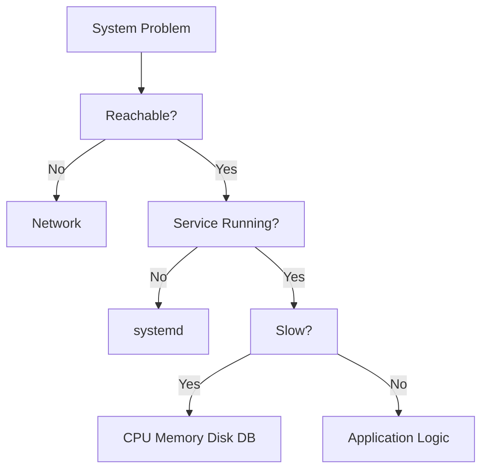

---

# High CPU Incident

---

## Symptoms

```text
Slow response times
Timeouts
High load average
Application lag
```

---

## Investigation

Check CPU:

```bash
top
```

or

```bash
htop
```

Top consumers:

```bash
ps aux --sort=-%cpu | head
```

---

## Per-Core Usage

```bash
mpstat -P ALL
```

---

## Check Load

```bash
uptime
```

Example:

```text
load average: 35.5
```

Potential issue.

---

# CPU Troubleshooting Flow

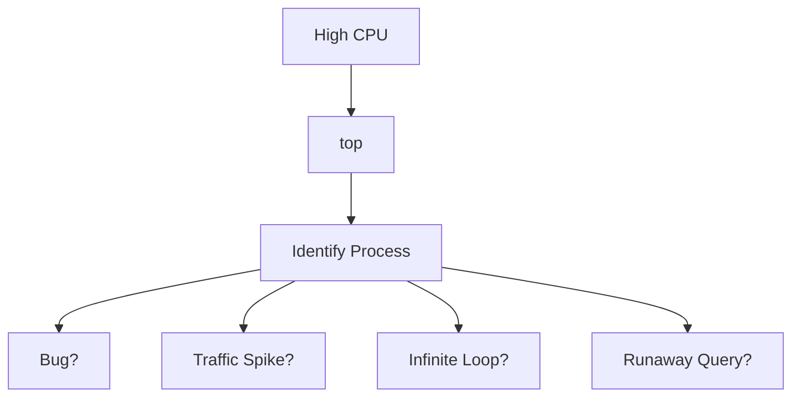

---

# High Memory Incident

---

## Symptoms

```text
Slow system
OOM kills
Swapping
Application crashes
```

---

## Check Memory

```bash
free -h
```

---

## Top Consumers

```bash
ps aux --sort=-%mem | head
```

---

## Process Memory

```bash
pmap PID
```

---

## OOM Events

```bash
dmesg | grep -i oom
```

or

```bash
journalctl -k | grep -i oom
```

---

# Memory Investigation Flow

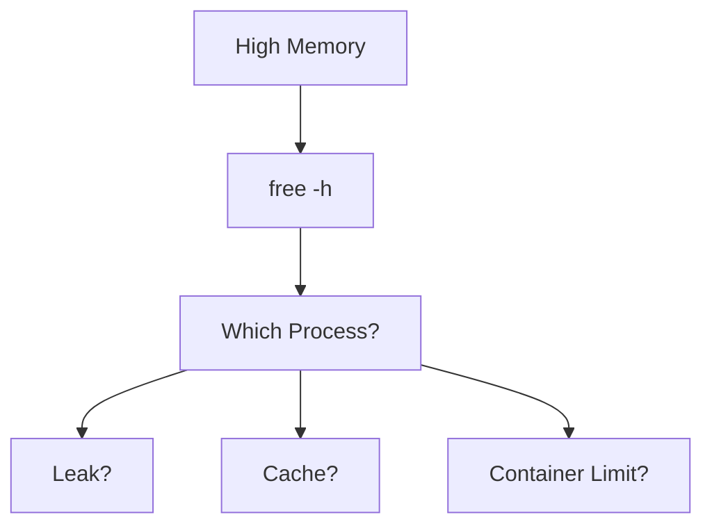

---

# OOM Killer Incident

Symptoms:

```text
Application suddenly dies
Pods restart
Service disappears
```

Check:

```bash
dmesg | grep -i killed
```

Look for:

```text
Out Of Memory
```

---

# Disk Full Incident

One of the most common outages.

---

## Check Usage

```bash
df -h
```

---

## Largest Directories

```bash
du -sh /*
```

---

## Largest Files

```bash
find / -type f -size +1G
```

---

## Deleted Open Files

Classic production issue.

```bash
lsof | grep deleted
```

---

# Disk Full Flow

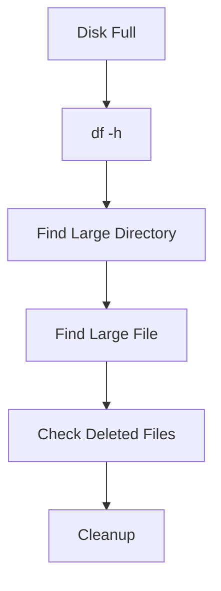

---

# Inode Exhaustion

Symptoms:

```text
Disk shows free space
Cannot create files
```

Check:

```bash
df -i
```

---

# Storage I/O Bottleneck

Symptoms:

```text
Slow database
Slow filesystem
Slow application
```

Check:

```bash
iostat -x 1
```

---

Live view:

```bash
iotop
```

---

# Service Down Incident

---

## Check Service

```bash
systemctl status service
```

Example:

```bash
systemctl status nginx
```

---

## View Logs

```bash
journalctl -u nginx
```

Live:

```bash
journalctl -fu nginx
```

---

## Failed Services

```bash
systemctl --failed
```

---

# Service Failure Flow

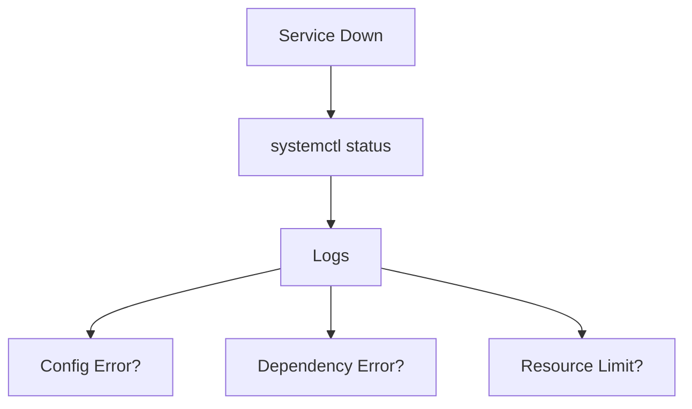

---

# Network Connectivity Incident

---

## Verify Interface

```bash
ip a
```

---

## Verify Route

```bash
ip route
```

---

## Ping Gateway

```bash
ping gateway-ip
```

---

## Ping Public IP

```bash
ping 8.8.8.8
```

---

## Ping Domain

```bash
ping google.com
```

---

Interpretation:

```text
8.8.8.8 works
google.com fails

=> DNS Issue
```

---

# DNS Incident

---

## Check Resolution

```bash
dig google.com
```

---

## Check Resolver

```bash
cat /etc/resolv.conf
```

---

## Check DNS Server

```bash
dig @8.8.8.8 google.com
```

---

# DNS Troubleshooting Flow

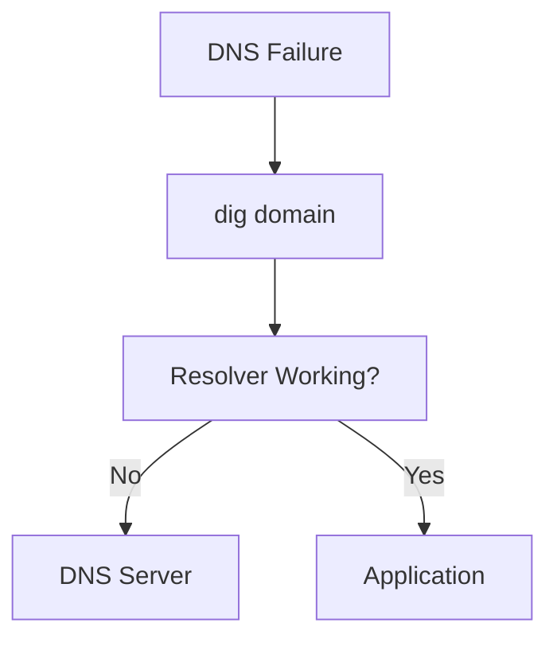

---

# Port Not Listening

Check:

```bash
ss -tulpn
```

---

Check specific port:

```bash
ss -tulpn | grep 8080
```

---

Alternative:

```bash
lsof -i :8080
```

---

# Firewall Incident

Check:

```bash
nft list ruleset
```

or

```bash
iptables -L -n -v
```

---

# TLS / SSL Incident

---

## Verify Certificate

```bash
openssl s_client -connect example.com:443
```

---

## Check Expiration

```bash
openssl x509 -in cert.pem -noout -dates
```

---

## Test Endpoint

```bash
curl -Iv https://example.com
```

---

# Nginx Incident

---

## Verify Config

```bash
nginx -t
```

---

## Reload

```bash
systemctl reload nginx
```

---

## Logs

```bash
tail -f /var/log/nginx/error.log
```

---

# Apache Incident

Config test:

```bash
apachectl configtest
```

Logs:

```bash
tail -f /var/log/apache2/error.log
```

---

# Database Incident

---

# PostgreSQL

Status:

```bash
systemctl status postgresql
```

Connections:

```sql
SELECT * FROM pg_stat_activity;
```

---

# MySQL

Status:

```bash
systemctl status mysql
```

Processes:

```sql
SHOW PROCESSLIST;
```

---

# Database Troubleshooting Flow

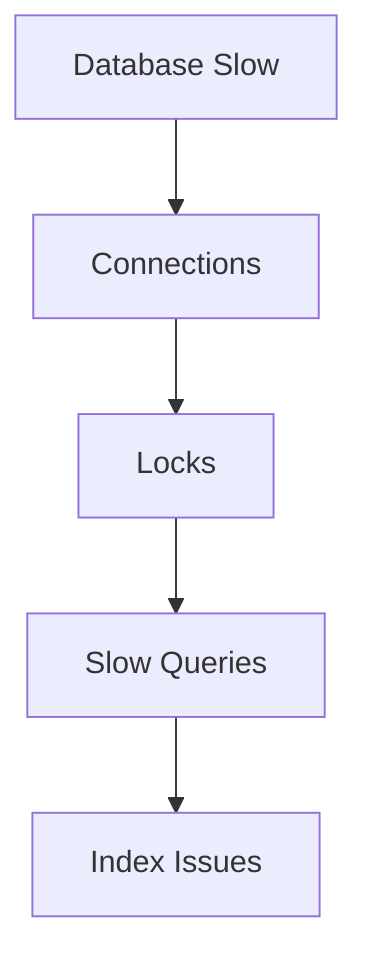

---

# Connection Exhaustion

Symptoms:

```text
Too many connections
```

Check:

```sql
SHOW PROCESSLIST;
```

or

```sql
SELECT * FROM pg_stat_activity;
```

---

# Docker Incident

---

## Containers

```bash
docker ps
```

---

## Logs

```bash
docker logs container
```

---

## Interactive Shell

```bash
docker exec -it container sh
```

---

## Resource Usage

```bash
docker stats
```

---

## Inspect

```bash
docker inspect container
```

---

# Docker Troubleshooting Flow

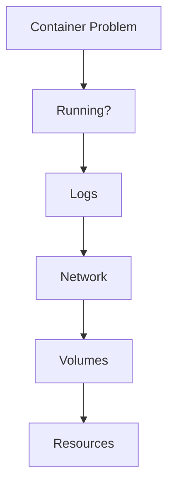

---

# Kubernetes Incident

---

## Pod Status

```bash
kubectl get pods
```

---

## Describe

```bash
kubectl describe pod pod-name
```

---

## Logs

```bash
kubectl logs pod-name
```

---

## Exec

```bash
kubectl exec -it pod-name -- sh
```

---

## Node Health

```bash
kubectl get nodes
```

---

# CrashLoopBackOff

Check:

```bash
kubectl logs pod
```

Then:

```bash
kubectl describe pod
```

---

# Kubernetes Troubleshooting Flow

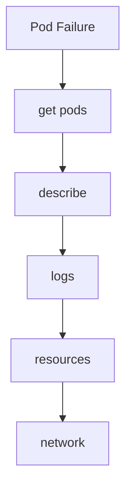

---

# Time Synchronization Incident

Symptoms:

```text
Authentication failures
TLS failures
Distributed system issues
```

Check:

```bash
timedatectl
```

---

NTP status:

```bash
chronyc tracking
```

---

# Load Balancer Incident

Check backend health.

```bash
curl backend
```

Verify:

```text
Health checks
Routing
Firewall
```

---

# Linux Performance Emergency Commands

```bash
top

htop

free -h

vmstat 1

iostat -x 1

iotop

sar

ss -s

ss -tulpn

lsof

dmesg

journalctl
```

---

# Universal Log Locations

```text
/var/log/messages
/var/log/syslog

/var/log/nginx
/var/log/apache2

/var/log/mysql
/var/log/postgresql

/var/log/auth.log

journalctl
```

---

# Root Cause Analysis Framework

After mitigation:

---

## What Happened?

```text
Timeline
```

---

## Why Did It Happen?

```text
Root Cause
```

---

## Why Wasn't It Prevented?

```text
Monitoring?
Automation?
Testing?
```

---

## How Do We Prevent Recurrence?

```text
Monitoring
Alerts
Runbooks
Automation
Architecture Changes
```

---

# Incident Severity Matrix

| Severity | Meaning           |
| -------- | ----------------- |
| SEV-1    | Complete outage   |
| SEV-2    | Major degradation |
| SEV-3    | Partial impact    |
| SEV-4    | Minor issue       |
| SEV-5    | Informational     |

---

# Golden Production Rules

Never:

```text
Restart first.
```

Always:

```text
Collect evidence first.
```

---

Never:

```text
Assume root cause.
```

Always:

```text
Verify with data.
```

---

Never:

```text
Delete logs during incident.
```

Always:

```text
Preserve evidence.
```

---

Never:

```text
Make multiple changes simultaneously.
```

Always:

```text
Change one thing at a time.
```

---

# 30-Second Emergency Reference

```bash
# System
uptime
top
free -h

# Storage
df -h
df -i
du -sh /*

# Network
ip a
ip route
ping 8.8.8.8
dig google.com

# Services
systemctl --failed
systemctl status service

# Logs
journalctl -xe
journalctl -u service

# Processes
ps aux
pstree

# Ports
ss -tulpn

# Docker
docker ps
docker logs container

# Kubernetes
kubectl get pods
kubectl logs pod
```

---

# Final Takeaway

Production incidents are rarely mysterious.

They usually originate from one of a few subsystems:

```text
CPU
Memory
Storage
Filesystem
Networking
DNS
Services
Databases
Containers
Kubernetes
```

The best engineers do not panic.

They follow a process.

```text
Observe
Measure
Verify
Mitigate
Analyze
Prevent
```

When systems fail, discipline beats intuition.

When incidents occur, evidence beats assumptions.

When pressure rises, runbooks beat memory.
