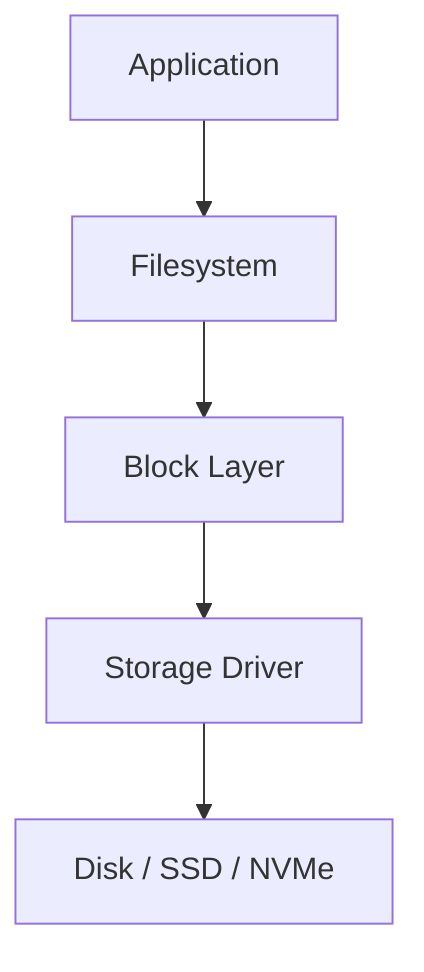
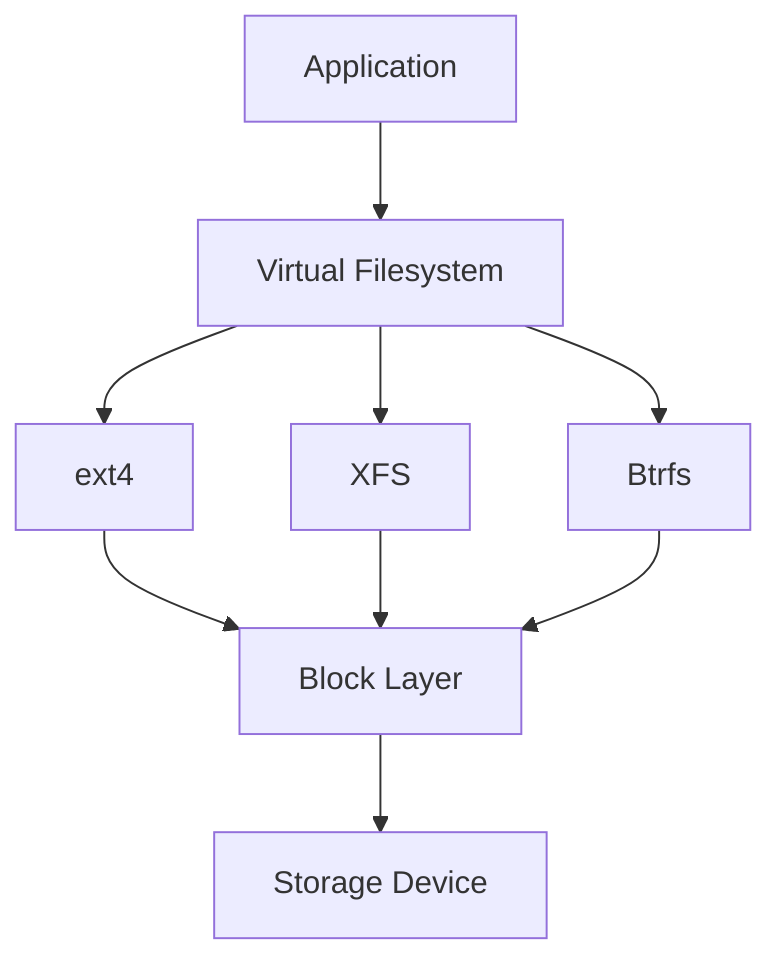
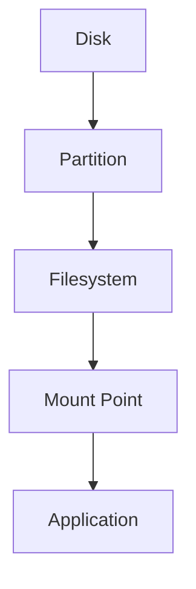
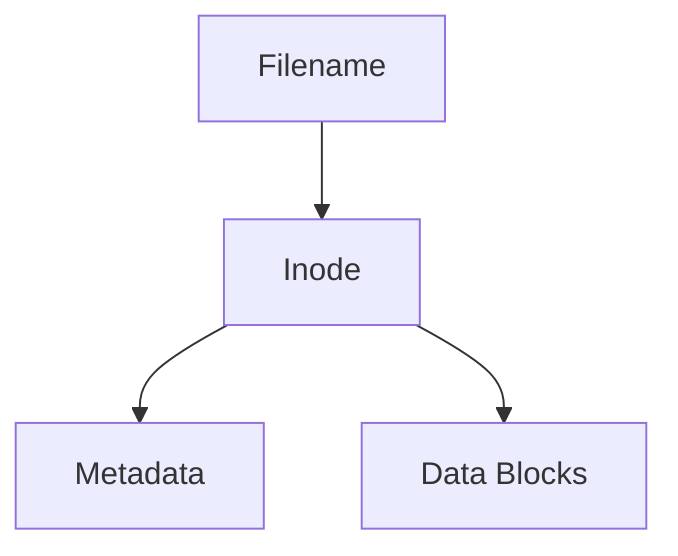
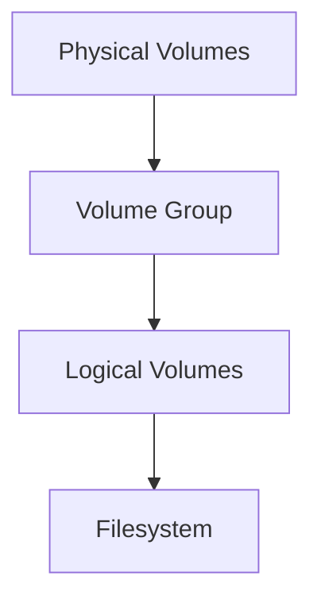
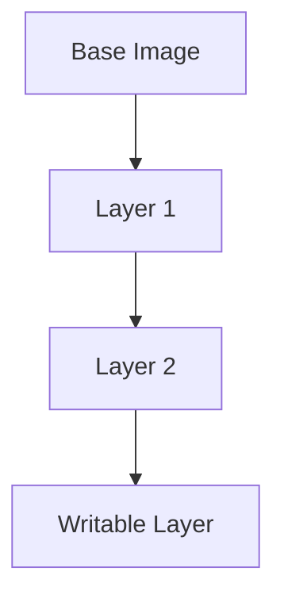
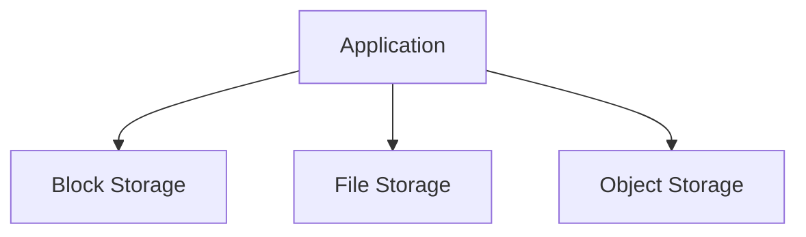
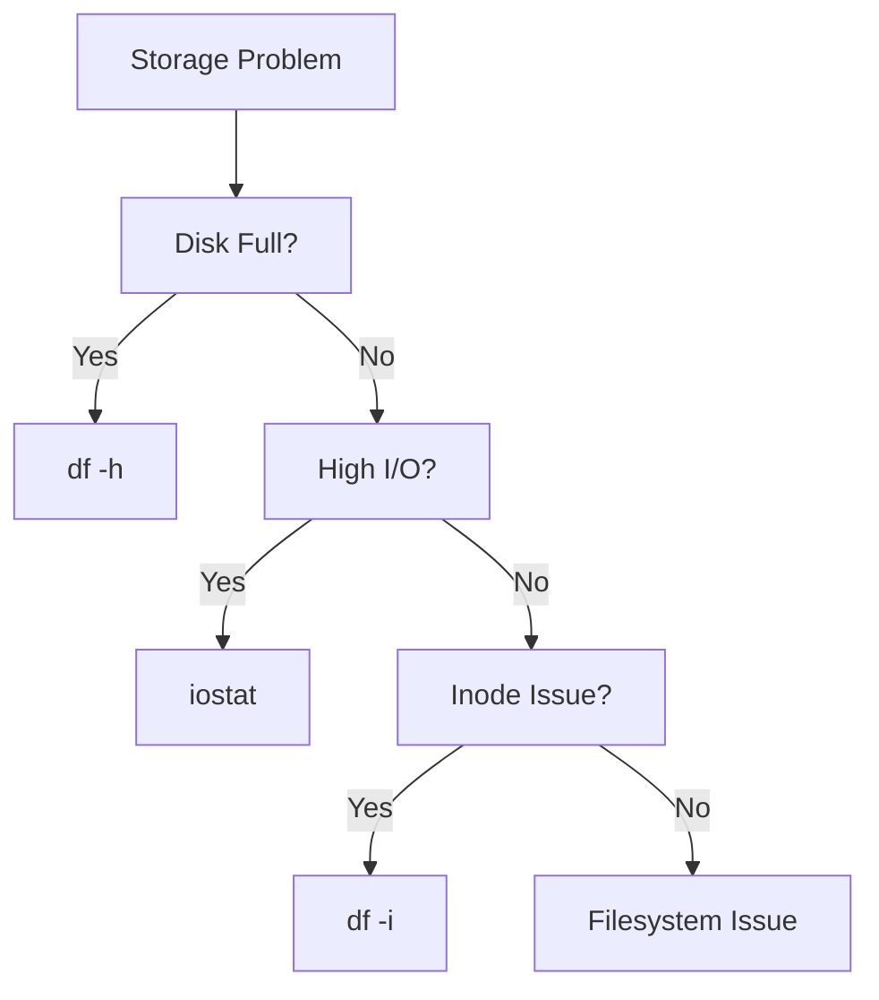

# Linux Storage Cheat Sheet

## The Complete Storage Engineering, Performance, and Production Operations Reference

---

# Why This Exists

Every application eventually becomes a storage problem.

At small scale:

```text
Store a file.
```

At large scale:

```text
Store petabytes.
Handle millions of IOPS.
Prevent data loss.
Recover from failures.
Scale databases.
Backup critical systems.
```

Storage is one of the most misunderstood parts of Linux.

Most production incidents involve:

* Disk full
* Slow databases
* I/O bottlenecks
* Failed disks
* Corrupted filesystems
* Mount failures
* RAID degradation
* LVM issues
* Kubernetes volume problems

Understanding storage is mandatory for:

* Linux Engineers
* DevOps Engineers
* SREs
* Database Engineers
* Cloud Engineers
* Platform Engineers
* Infrastructure Architects

---

# Mental Model

Think of storage as a hierarchy.

```text
Application
     |
Filesystem
     |
Block Device
     |
Storage Controller
     |
Physical Disk
```

Applications never talk directly to disks.

Linux provides multiple abstraction layers.

---

# First Principles

Storage exists to answer one question:

> Where should data live after power is lost?

Memory:

```text
Fast
Volatile
Temporary
```

Storage:

```text
Slower
Persistent
Durable
```

---

# Storage Stack



---

# Linux Storage Architecture



---

# Storage Device Types

---

## HDD

Hard Disk Drive.

Mechanical.

```text
Spinning Platters
Moving Heads
```

Advantages:

```text
Cheap
Large Capacity
```

Disadvantages:

```text
Slow
Mechanical Failure
```

---

## SSD

Solid State Drive.

```text
Flash Memory
No Moving Parts
```

Advantages:

```text
Fast
Low Latency
Reliable
```

---

## NVMe SSD

Modern high-performance storage.

Connected via:

```text
PCIe
```

Instead of:

```text
SATA
```

---

# Performance Comparison

| Storage  | Typical Latency |
| -------- | --------------- |
| HDD      | 5–15 ms         |
| SATA SSD | 100–500 µs      |
| NVMe SSD | 10–100 µs       |
| RAM      | ~100 ns         |

---

# Block Devices

Linux exposes storage as block devices.

Examples:

```bash
/dev/sda
/dev/sdb
/dev/nvme0n1
```

---

# View Devices

```bash
lsblk
```

Example:

```text
sda
├── sda1
├── sda2

nvme0n1
├── nvme0n1p1
```

---

# Storage Hierarchy



---

# Discovering Storage

---

## Block Devices

```bash
lsblk
```

---

## Filesystem Information

```bash
blkid
```

---

## Hardware Information

```bash
fdisk -l
```

---

## Detailed Information

```bash
lshw -class disk
```

---

# Partitions

Partitions divide disks.

Example:

```text
Disk
 |
 +-- Partition 1
 |
 +-- Partition 2
 |
 +-- Partition 3
```

---

# View Partitions

```bash
fdisk -l
```

---

# Create Partition

```bash
fdisk /dev/sdb
```

Or:

```bash
parted /dev/sdb
```

---

# Filesystems

A filesystem organizes data.

Without a filesystem:

```text
Raw Blocks
```

With a filesystem:

```text
Files
Directories
Permissions
Metadata
```

---

# Common Filesystems

| Filesystem | Use Case              |
| ---------- | --------------------- |
| ext4       | General Purpose       |
| XFS        | Enterprise Linux      |
| Btrfs      | Snapshots             |
| ZFS        | Advanced Storage      |
| FAT32      | Removable Media       |
| NTFS       | Windows Compatibility |

---

# ext4

Most common Linux filesystem.

Features:

```text
Journaling
Reliable
Mature
Fast
```

Create:

```bash
mkfs.ext4 /dev/sdb1
```

---

# XFS

Enterprise filesystem.

Used heavily by:

```text
RHEL
Cloud Providers
Large Storage Systems
```

Create:

```bash
mkfs.xfs /dev/sdb1
```

---

# Btrfs

Modern filesystem.

Features:

```text
Snapshots
Compression
Checksums
```

---

# ZFS

Storage platform.

Features:

```text
Snapshots
Self-Healing
RAID Integration
Compression
```

---

# Mounting

Mounting attaches storage into filesystem tree.

---

# Mount Flow


---

# View Mounts

```bash
mount
```

Or:

```bash
findmnt
```

---

# Mount Device

```bash
mount /dev/sdb1 /mnt/data
```

---

# Unmount

```bash
umount /mnt/data
```

---

# Persistent Mounts

Configuration:

```bash
/etc/fstab
```

Example:

```text
UUID=xxx /data ext4 defaults 0 2
```

---

# Check UUID

```bash
blkid
```

---

# Disk Usage

---

## Filesystem Usage

```bash
df -h
```

---

## Inodes

```bash
df -i
```

---

## Directory Usage

```bash
du -sh *
```

---

## Largest Files

```bash
du -ah | sort -rh | head
```

---

# Inodes

Filesystem metadata entries.

Every file consumes:

```text
Inode
```

---

# Inode Architecture



---

# Inode Exhaustion

Symptoms:

```text
Disk appears empty
Cannot create files
```

Check:

```bash
df -i
```

---

# LVM (Logical Volume Manager)

One of Linux's most powerful storage technologies.

---

# Traditional Storage

```text
Disk
 |
Filesystem
```

---

# LVM Storage

```text
Disk
 |
Physical Volume
 |
Volume Group
 |
Logical Volume
 |
Filesystem
```

---

# LVM Architecture



---

# LVM Commands

View physical volumes:

```bash
pvs
```

Volume groups:

```bash
vgs
```

Logical volumes:

```bash
lvs
```

---

# RAID

Combines multiple disks.

Goals:

```text
Performance
Redundancy
Availability
```

---

# RAID Levels

| RAID   | Purpose         |
| ------ | --------------- |
| RAID0  | Performance     |
| RAID1  | Mirroring       |
| RAID5  | Parity          |
| RAID6  | Double Parity   |
| RAID10 | Mirror + Stripe |

---

# RAID Visualization

## RAID 0

```text
Disk1: A B
Disk2: C D
```

Fast.

No redundancy.

---

## RAID 1

```text
Disk1: A B C
Disk2: A B C
```

Mirrored.

---

## RAID 10

```text
Mirror + Striping
```

Common in databases.

---

# Software RAID

Linux tool:

```bash
mdadm
```

Check arrays:

```bash
cat /proc/mdstat
```

---

# I/O Performance

Storage performance has three key metrics.

---

## Latency

Time for one operation.

Example:

```text
1 ms
```

---

## IOPS

Input/Output Operations Per Second.

Example:

```text
100,000 IOPS
```

---

## Throughput

Amount of data transferred.

Example:

```text
1 GB/s
```

---

# Performance Analogy

```text
Latency   = Delivery Time

IOPS      = Deliveries Per Second

Bandwidth = Truck Size
```

---

# Measuring Performance

---

## iostat

```bash
iostat -x 1
```

---

## Disk Statistics

```bash
sar -d
```

---

## Live I/O

```bash
iotop
```

---

## Benchmark

```bash
fio
```

---

# Reading Disk Metrics

Important fields:

```text
await
svctm
util
```

High values indicate storage bottlenecks.

---

# SSD Health

---

## SMART Data

```bash
smartctl -a /dev/sda
```

---

## NVMe Health

```bash
nvme smart-log /dev/nvme0
```

---

# Storage in Docker

Important path:

```bash
/var/lib/docker
```

Contains:

```text
Images
Containers
Volumes
OverlayFS
```

Check size:

```bash
du -sh /var/lib/docker
```

---

# OverlayFS

Docker uses layered storage.



---

# Kubernetes Storage

Storage primitives:

```text
Volume
Persistent Volume
Persistent Volume Claim
Storage Class
```

---

# Kubernetes Storage Flow


---

# Cloud Storage Types

---

## Block Storage

Examples:

```text
AWS EBS
Azure Managed Disk
GCP Persistent Disk
```

Appears as disk.

---

## File Storage

Examples:

```text
NFS
EFS
Azure Files
```

Shared filesystem.

---

## Object Storage

Examples:

```text
S3
GCS
Azure Blob
```

Not a filesystem.

---

# Cloud Storage Architecture



---

# Database Storage Considerations

Databases require:

```text
Low Latency
Consistent IOPS
Durability
```

Preferred:

```text
SSD
NVMe
RAID10
```

Avoid:

```text
Slow HDD
Overloaded Shared Storage
```

---

# Performance Troubleshooting

---

## Disk Full

Check:

```bash
df -h
```

---

## Largest Directories

```bash
du -sh /*
```

---

## Largest Files

```bash
find / -type f -size +1G
```

---

## Inode Problem

```bash
df -i
```

---

## High Disk Usage

```bash
iotop
```

---

## Deleted Open Files

Common production issue.

```bash
lsof | grep deleted
```

---

# Troubleshooting Flow



---

# Security Considerations

Protect:

```text
Backups
Databases
Private Keys
Certificates
```

Encrypt:

```text
Disks
Volumes
Backups
```

Use:

```text
LUKS
Cloud Encryption
```

---

# Common Mistakes

### Filling /var/log

### Forgetting inode monitoring

### Using RAID as backup

### Ignoring SMART warnings

### Running databases on slow disks

### Forgetting fstab validation

### Mounting wrong filesystem type

### Ignoring deleted-open-file issues

### Storing everything in root partition

---

# Engineering Mindset

Beginners see:

```text
Disk
```

Engineers see:

```text
Filesystem
Block Layer
Cache
LVM
RAID
IOPS
Latency
Throughput
Durability
Recovery
```

Storage is a stack of abstractions.

Understanding the layers makes troubleshooting predictable.

---

# Interview Questions

### What is a block device?

### What is the difference between HDD, SSD, and NVMe?

### What is a filesystem?

### Explain ext4.

### Explain XFS.

### What is an inode?

### What is LVM?

### What is RAID?

### Difference between RAID and backup?

### What causes inode exhaustion?

### Explain OverlayFS.

### Explain Kubernetes Persistent Volumes.

### What is IOPS?

### Difference between latency and throughput?

---

# One-Page Emergency Reference

```bash
# Devices
lsblk
blkid
fdisk -l

# Usage
df -h
df -i
du -sh *

# Mounts
mount
findmnt

# LVM
pvs
vgs
lvs

# RAID
cat /proc/mdstat

# Performance
iostat -x 1
iotop

# SMART
smartctl -a /dev/sda

# Open deleted files
lsof | grep deleted

# Largest files
find / -size +1G
```

---

# Final Takeaway

Storage is not merely disks.

It is an ecosystem of:

```text
Devices
Partitions
Filesystems
Mounts
LVM
RAID
Caching
Performance
Durability
Recovery
```

Every application, database, container, and cloud service ultimately depends on storage.

Master storage engineering and you gain control over one of the most critical layers of modern infrastructure.
