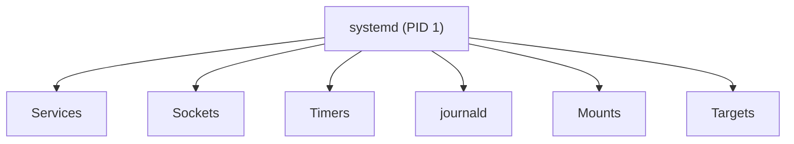
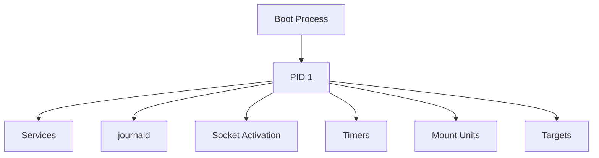
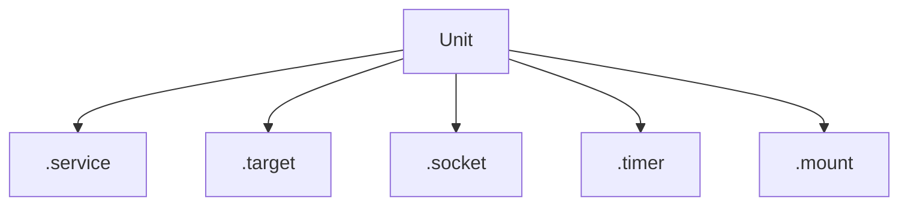
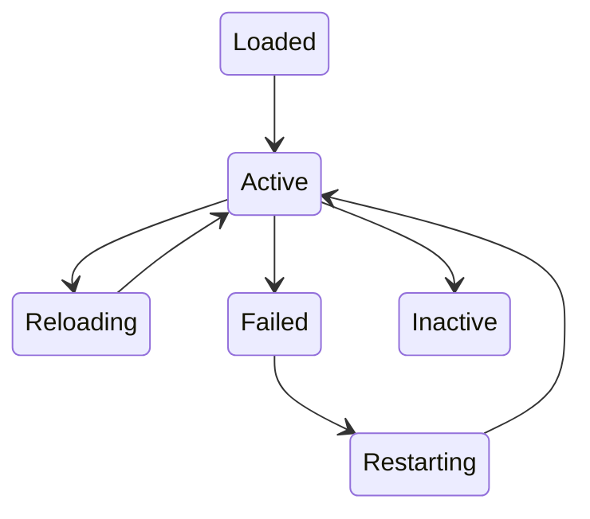
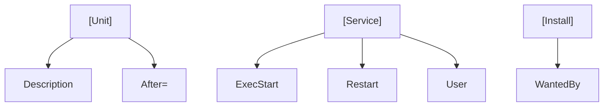
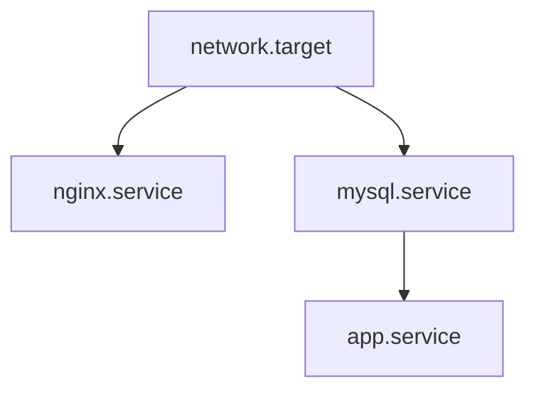
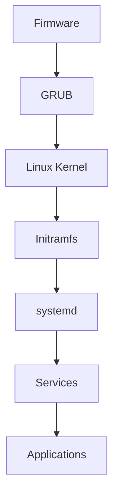
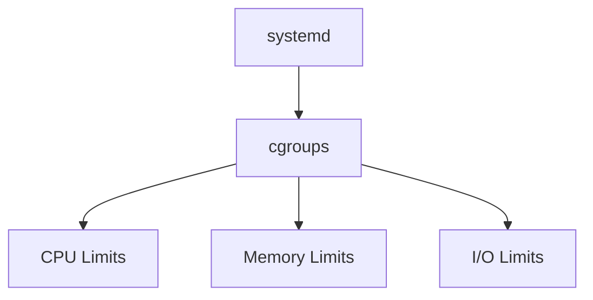
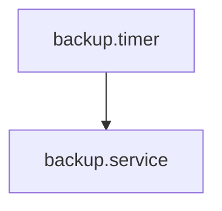
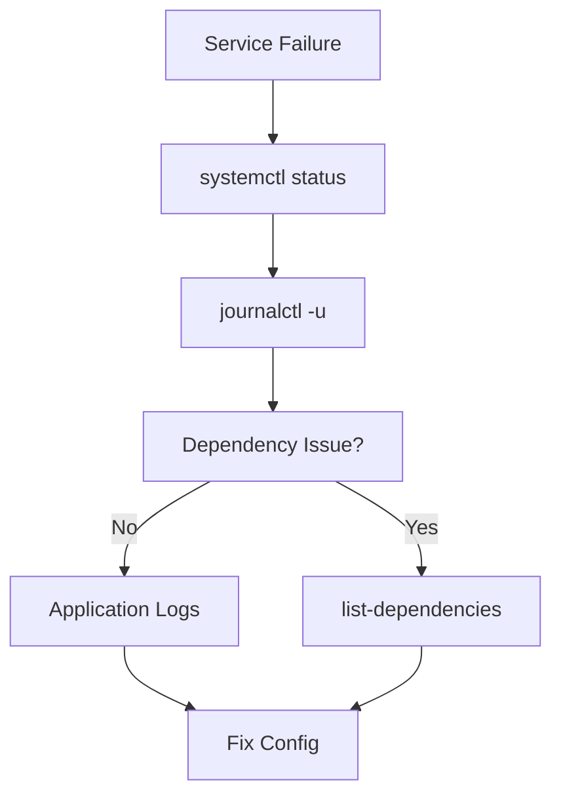

# Linux systemd Cheat Sheet

## The Complete Service Management, Boot Process, and Production Operations Reference

---

# Why This Exists

Modern Linux systems do not magically start.

When a server boots:

```text
Power On
   |
Firmware
   |
Bootloader
   |
Kernel
   |
systemd
   |
Services
   |
Applications
```

Something must:

* Start services
* Stop services
* Restart failed services
* Manage dependencies
* Collect logs
* Handle system state
* Coordinate startup

That "something" is usually:

```text
systemd
```

For most Linux distributions:

* Ubuntu
* Debian
* RHEL
* Rocky Linux
* AlmaLinux
* Fedora
* SUSE

systemd is PID 1.

Understanding systemd is critical for:

* Linux Engineers
* DevOps Engineers
* SREs
* Cloud Engineers
* Platform Engineers
* Infrastructure Architects

Most production incidents involve:

```text
Service won't start
Service keeps crashing
Boot failures
Dependency failures
Missing logs
Resource limits
Startup ordering issues
```

---

# Mental Model

Think of systemd as the operating system manager.



The kernel manages hardware.

systemd manages the operating system.

---

# First Principles

Before systemd existed:

```text
SysV Init
```

Problems:

```text
Slow startup
Complex scripts
Weak dependency handling
Poor observability
```

systemd introduced:

```text
Parallel startup
Dependency graphs
Unified logging
Resource management
Modern service control
```

---

# systemd Architecture



---

# Verify systemd

Check PID 1:

```bash
ps -p 1
```

Output:

```text
PID CMD
1   systemd
```

---

# What systemd Manages

```text
Services
Mounts
Devices
Timers
Targets
Sockets
Swap
Users
Logs
```

---

# Unit Files

Everything in systemd is a unit.

Examples:

```text
nginx.service
home.mount
backup.timer
network.target
```

---

# Unit Types

| Type       | Purpose           |
| ---------- | ----------------- |
| .service   | Services          |
| .target    | System states     |
| .socket    | Socket activation |
| .timer     | Scheduled tasks   |
| .mount     | Mount points      |
| .automount | Automatic mounts  |
| .path      | File monitoring   |
| .device    | Hardware devices  |
| .swap      | Swap devices      |

---

# Unit Hierarchy



---

# Service Management

---

## Check Service Status

```bash
systemctl status nginx
```

Example:

```text
Active: active (running)
```

---

## Start Service

```bash
systemctl start nginx
```

---

## Stop Service

```bash
systemctl stop nginx
```

---

## Restart Service

```bash
systemctl restart nginx
```

---

## Reload Configuration

```bash
systemctl reload nginx
```

---

## Reload systemd

```bash
systemctl daemon-reload
```

Required after changing unit files.

---

# Enable and Disable Services

---

## Enable at Boot

```bash
systemctl enable nginx
```

---

## Disable at Boot

```bash
systemctl disable nginx
```

---

## Check Enable State

```bash
systemctl is-enabled nginx
```

---

# Service States



---

# Viewing Services

---

## All Services

```bash
systemctl list-units --type=service
```

---

## Failed Services

```bash
systemctl --failed
```

---

## Running Services

```bash
systemctl list-units --state=running
```

---

# Unit File Locations

---

System Units

```bash
/usr/lib/systemd/system
```

or

```bash
/lib/systemd/system
```

---

Custom Units

```bash
/etc/systemd/system
```

Preferred location.

---

# Example Service File

```ini
[Unit]
Description=My Application

[Service]
ExecStart=/opt/app/app
Restart=always

[Install]
WantedBy=multi-user.target
```

---

# Service File Structure



---

# Important Service Directives

---

## ExecStart

Main process.

```ini
ExecStart=/opt/app/server
```

---

## Restart

```ini
Restart=always
```

Options:

```text
always
on-failure
no
```

---

## User

Run as:

```ini
User=app
```

Avoid root.

---

## Working Directory

```ini
WorkingDirectory=/opt/app
```

---

## Environment Variables

```ini
Environment=PORT=8080
```

---

# Targets

Targets replace runlevels.

---

# Traditional Runlevels

```text
0 Shutdown
1 Single User
3 Multi User
5 Graphical
6 Reboot
```

---

# systemd Targets

| Target            | Purpose  |
| ----------------- | -------- |
| rescue.target     | Recovery |
| multi-user.target | Server   |
| graphical.target  | Desktop  |
| reboot.target     | Reboot   |
| poweroff.target   | Shutdown |

---

# View Default Target

```bash
systemctl get-default
```

---

# Set Default Target

```bash
systemctl set-default multi-user.target
```

---

# Dependency Management

One of systemd's biggest advantages.

---

# Dependency Graph



---

# Dependency Directives

---

## After

```ini
After=network.target
```

Start after network.

---

## Requires

```ini
Requires=mysql.service
```

Must exist.

---

## Wants

```ini
Wants=mysql.service
```

Optional dependency.

---

# Journald

systemd's logging subsystem.

---

# Log Flow


---

# View Logs

```bash
journalctl
```

---

# Recent Logs

```bash
journalctl -n 100
```

---

# Follow Logs

```bash
journalctl -f
```

---

# Service Logs

```bash
journalctl -u nginx
```

---

# Live Service Logs

```bash
journalctl -fu nginx
```

---

# Logs Since Boot

```bash
journalctl -b
```

---

# Previous Boot

```bash
journalctl -b -1
```

---

# Search Errors

```bash
journalctl -p err
```

---

# Boot Analysis

---

## Startup Time

```bash
systemd-analyze
```

Example:

```text
Startup finished in 5.2s
```

---

## Slowest Services

```bash
systemd-analyze blame
```

---

## Dependency Graph

```bash
systemd-analyze critical-chain
```

---

# Boot Sequence



---

# Resource Control

systemd integrates with cgroups.

---

# Resource Architecture



---

# CPU Limit

```ini
CPUQuota=50%
```

---

# Memory Limit

```ini
MemoryMax=1G
```

---

# View Resource Usage

```bash
systemd-cgtop
```

Like top for cgroups.

---

# Timers

Modern replacement for cron.

---

# Timer Architecture



---

# View Timers

```bash
systemctl list-timers
```

---

# Socket Activation

systemd can start services on demand.

---

# Flow


---

Used by:

```text
SSH
DBus
System Services
```

---

# Recovery Commands

---

Emergency Mode

```bash
systemctl rescue
```

---

Reboot

```bash
systemctl reboot
```

---

Shutdown

```bash
systemctl poweroff
```

---

# Production Troubleshooting

---

# Service Won't Start

Check:

```bash
systemctl status service
```

Then:

```bash
journalctl -u service
```

---

# Service Keeps Restarting

Check:

```bash
systemctl status service
```

Look for:

```text
Restart Count
Exit Codes
```

---

# Failed Dependencies

Check:

```bash
systemctl list-dependencies service
```

---

# Boot Slow

Check:

```bash
systemd-analyze blame
```

---

# Resource Limits

Check:

```bash
systemctl show service
```

---

# Troubleshooting Flow



---

# Containers and systemd

Important distinction:

---

Traditional Linux

```text
systemd
 |
 services
```

---

Container

```text
PID 1
 |
 application
```

Often:

```text
No systemd
```

inside containers.

---

Docker Example

```text
Container
 |
 nginx
```

instead of:

```text
Container
 |
 systemd
 |
 nginx
```

---

# Kubernetes Relationship

Kubernetes nodes use:

```text
systemd
```

to manage:

```text
kubelet
containerd
CRI-O
```

Example:

```bash
systemctl status kubelet
```

---

# Security Considerations

Run services as:

```ini
User=app
```

Not:

```ini
User=root
```

---

Use:

```ini
ProtectSystem=strict
```

```ini
ProtectHome=true
```

```ini
NoNewPrivileges=true
```

for hardening.

---

# Common Mistakes

### Forgetting daemon-reload

### Running services as root

### Ignoring journald logs

### Editing vendor unit files directly

### Not using Restart policies

### Missing dependencies

### Using cron instead of timers when systemd timers fit better

### Ignoring startup ordering

---

# Engineering Mindset

Beginners see:

```text
Service won't start
```

Engineers see:

```text
Unit
Dependencies
Logs
cgroups
Targets
Startup Sequence
Resources
Kernel
```

The service is only the symptom.

systemd usually reveals the root cause.

---

# Interview Questions

### What is systemd?

### Why is PID 1 special?

### Difference between service and process?

### What are unit files?

### What are targets?

### Difference between Requires and Wants?

### Difference between After and Requires?

### What is journald?

### What is socket activation?

### What are systemd timers?

### How does systemd use cgroups?

### Why is daemon-reload required?

### How do you troubleshoot a failed service?

---

# One-Page Emergency Reference

```bash
# Service Status
systemctl status service

# Start/Stop
systemctl start service
systemctl stop service

# Restart
systemctl restart service

# Reload
systemctl reload service

# Enable/Disable
systemctl enable service
systemctl disable service

# Failed Units
systemctl --failed

# Logs
journalctl -u service
journalctl -fu service

# Boot Logs
journalctl -b

# Startup Analysis
systemd-analyze
systemd-analyze blame

# Dependencies
systemctl list-dependencies service

# Timers
systemctl list-timers

# Resource Usage
systemd-cgtop
```

---

# Final Takeaway

systemd is far more than a service manager.

It is the orchestration layer of Linux.

It controls:

```text
Boot
Services
Logging
Dependencies
Scheduling
Resources
Recovery
```

Understanding systemd gives you deep visibility into how Linux systems actually start, operate, recover, and scale in production environments.
