# Linux Troubleshooting Decision Trees

## The Engineering Playbook for Diagnosing Production Problems

---

# Why This Exists

Most engineers learn Linux commands.

Few learn troubleshooting.

The difference is enormous.

A junior engineer often thinks:

```text
I need the right command.
```

An experienced engineer thinks:

```text
I need the right diagnosis process.
```

Production incidents are rarely solved because someone remembered a command.

They are solved because someone followed a systematic investigation.

This file provides decision trees for the most common Linux, cloud, Docker, Kubernetes, database, and networking failures.

---

# The Universal Troubleshooting Framework

Before investigating anything:

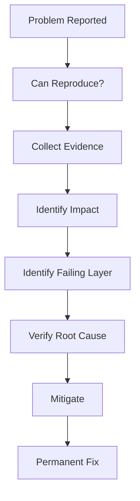
```mermaid
flowchart TD

A[Problem Reported]

A --> B[Can Reproduce?]

B --> C[Collect Evidence]

C --> D[Identify Impact]

D --> E[Identify Failing Layer]

E --> F[Verify Root Cause]

F --> G[Mitigate]

G --> H[Permanent Fix]
```

---

# Layer-Based Thinking

Always identify which layer is failing.

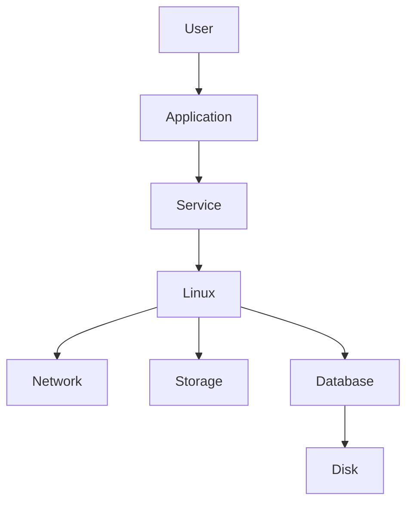
```mermaid
graph TD

USER[User]

USER --> APP[Application]

APP --> SERVICE[Service]

SERVICE --> OS[Linux]

OS --> NETWORK[Network]

OS --> STORAGE[Storage]

OS --> DATABASE[Database]

DATABASE --> DISK[Disk]
```

Never start debugging at random.

---

# Website Is Down

Symptoms:

```text
Users cannot access website
```

Decision Tree:

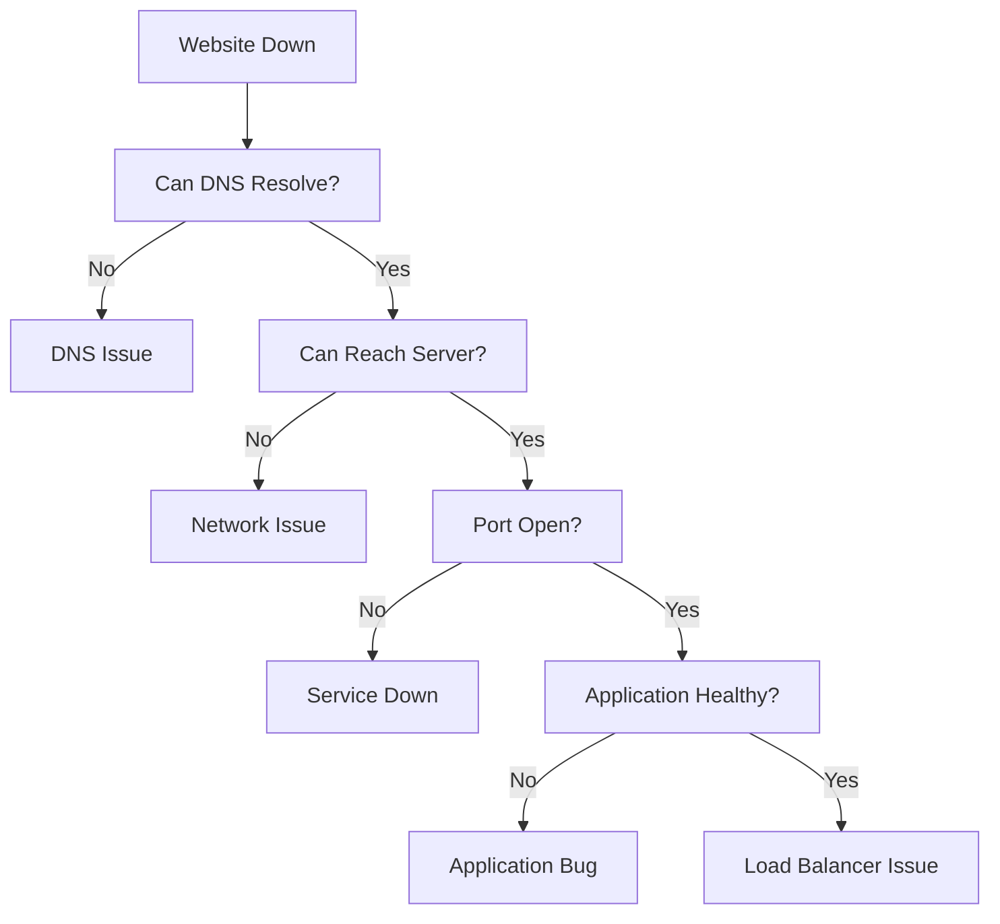
```mermaid
flowchart TD

A[Website Down]

A --> B[Can DNS Resolve?]

B -->|No| DNS[DNS Issue]

B -->|Yes| C[Can Reach Server?]

C -->|No| NET[Network Issue]

C -->|Yes| D[Port Open?]

D -->|No| SERVICE[Service Down]

D -->|Yes| E[Application Healthy?]

E -->|No| APP[Application Bug]

E -->|Yes| LB[Load Balancer Issue]
```

Commands:

```bash
dig domain.com

ping server

curl -v https://site

ss -tulpn

systemctl status nginx
```

---

# Server Is Slow

Decision Tree:

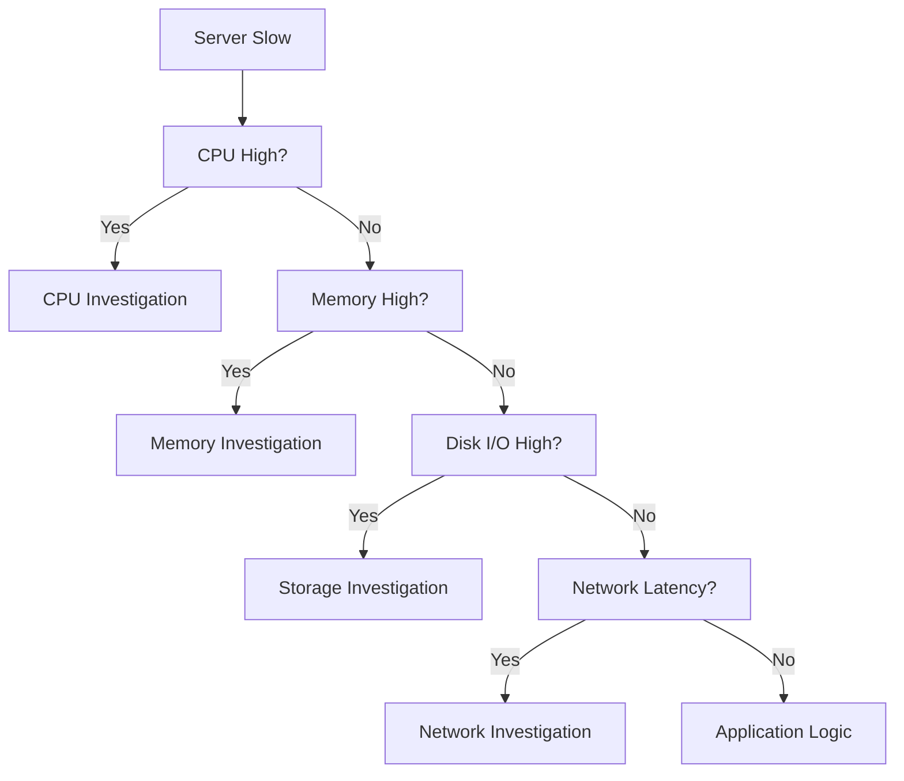
```mermaid
flowchart TD

A[Server Slow]

A --> B[CPU High?]

B -->|Yes| CPU[CPU Investigation]

B -->|No| C[Memory High?]

C -->|Yes| MEM[Memory Investigation]

C -->|No| D[Disk I/O High?]

D -->|Yes| IO[Storage Investigation]

D -->|No| E[Network Latency?]

E -->|Yes| NET[Network Investigation]

E -->|No| APP[Application Logic]
```

Commands:

```bash
top

free -h

iostat -x 1

vmstat 1

ss -s
```

---

# High CPU Usage

Decision Tree:

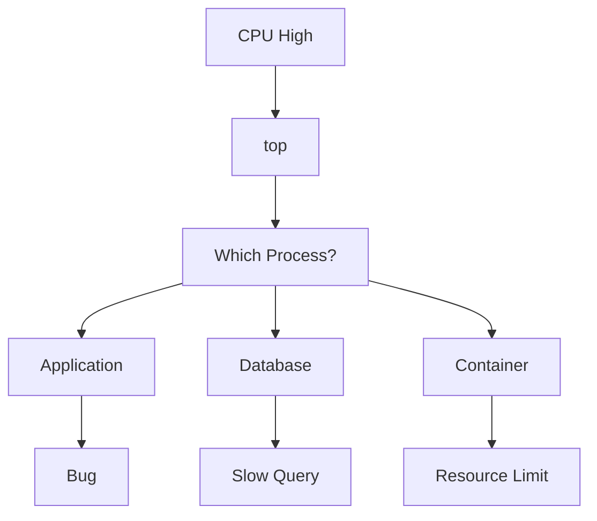
```mermaid
flowchart TD

A[CPU High]

A --> B[top]

B --> C[Which Process?]

C --> D[Application]

C --> E[Database]

C --> F[Container]

D --> G[Bug]

E --> H[Slow Query]

F --> I[Resource Limit]
```

Commands:

```bash
top

htop

ps aux --sort=-%cpu

pidstat 1
```

---

# High Memory Usage

Decision Tree:

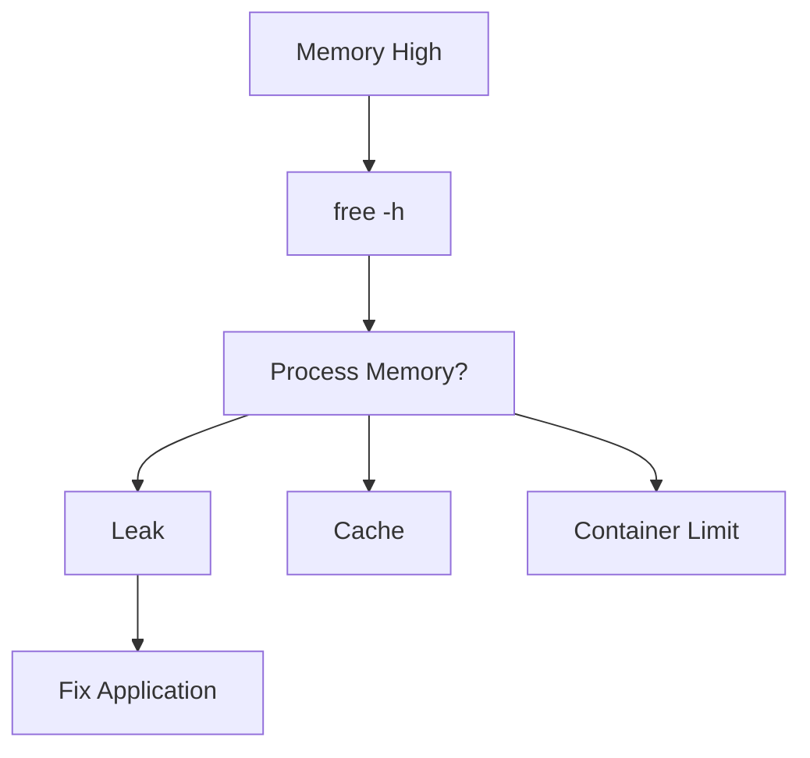
```mermaid
flowchart TD

A[Memory High]

A --> B[free -h]

B --> C[Process Memory?]

C --> D[Leak]

C --> E[Cache]

C --> F[Container Limit]

D --> G[Fix Application]
```

Commands:

```bash
free -h

ps aux --sort=-%mem

pmap PID

cat /proc/meminfo
```

---

# OOM Killer Investigation

Symptoms:

```text
Application disappears
Pods restart
Services crash
```

Decision Tree:

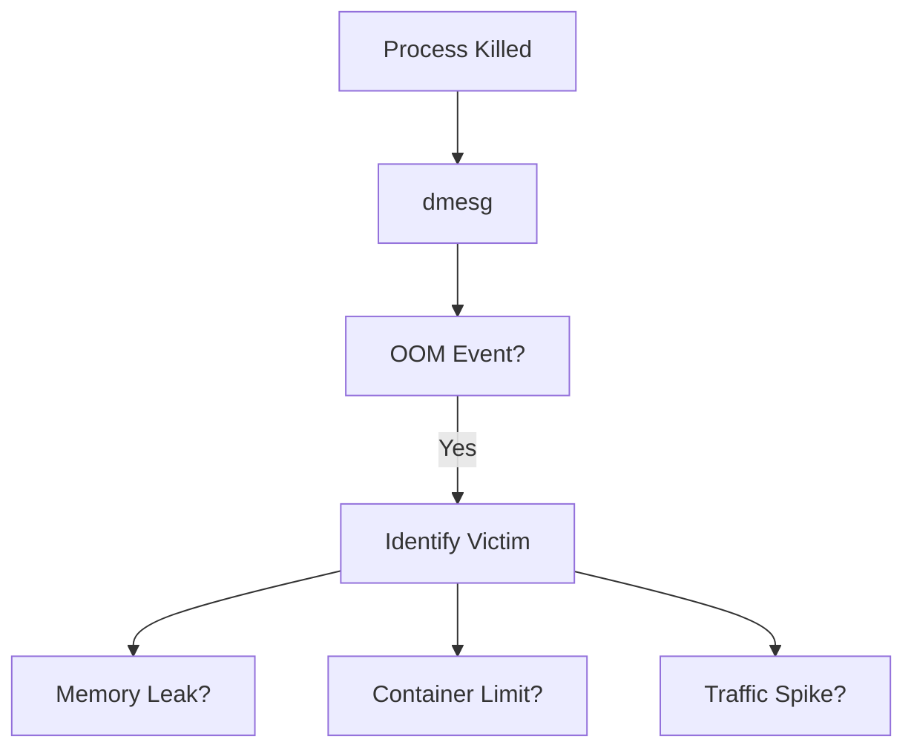
```mermaid
flowchart TD

A[Process Killed]

A --> B[dmesg]

B --> C[OOM Event?]

C -->|Yes| D[Identify Victim]

D --> E[Memory Leak?]

D --> F[Container Limit?]

D --> G[Traffic Spike?]
```

Commands:

```bash
dmesg | grep -i oom

journalctl -k

free -h
```

---

# Disk Full

Decision Tree:

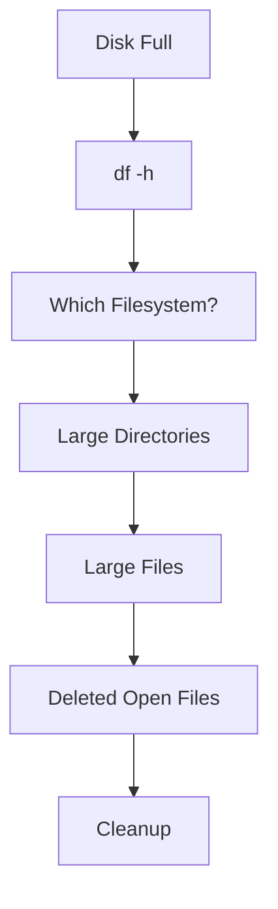
```mermaid
flowchart TD

A[Disk Full]

A --> B[df -h]

B --> C[Which Filesystem?]

C --> D[Large Directories]

D --> E[Large Files]

E --> F[Deleted Open Files]

F --> G[Cleanup]
```

Commands:

```bash
df -h

du -sh /*

find / -size +1G

lsof | grep deleted
```

---

# Inode Exhaustion

Symptoms:

```text
No space left on device

But disk has free space
```

Decision Tree:

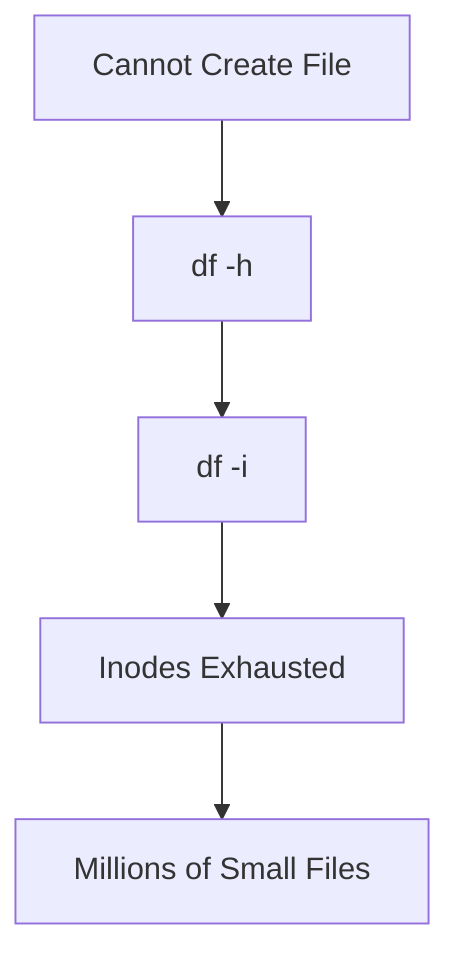
```mermaid
flowchart TD

A[Cannot Create File]

A --> B[df -h]

B --> C[df -i]

C --> D[Inodes Exhausted]

D --> E[Millions of Small Files]
```

Commands:

```bash
df -i

find / -xdev -type f | wc -l
```

---

# Service Won't Start

Decision Tree:

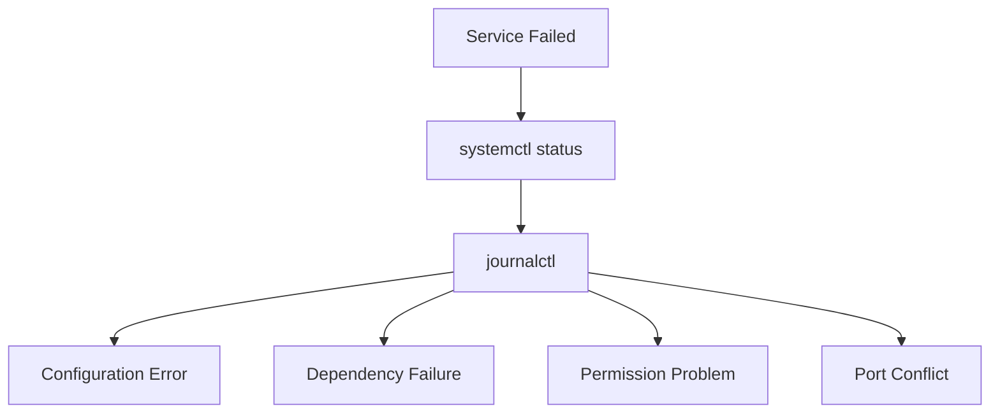
```mermaid
flowchart TD

A[Service Failed]

A --> B[systemctl status]

B --> C[journalctl]

C --> D[Configuration Error]

C --> E[Dependency Failure]

C --> F[Permission Problem]

C --> G[Port Conflict]
```

Commands:

```bash
systemctl status service

journalctl -u service

ss -tulpn
```

---

# Port Already In Use

Decision Tree:

```mermaid
flowchart TD

A[Bind Failed]

A --> B[Which Port?]

B --> C[Find Process]

C --> D[Expected?]

D -->|Yes| Reconfigure

D -->|No| Kill Process
```

Commands:

```bash
ss -tulpn

lsof -i :8080
```

---

# DNS Failure

Decision Tree:

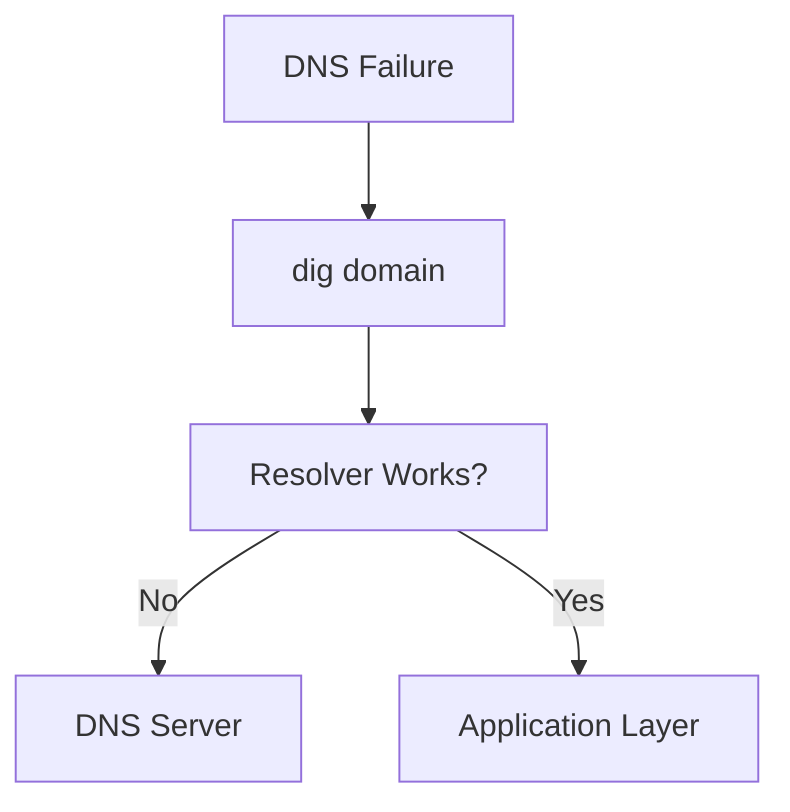
```mermaid
flowchart TD

A[DNS Failure]

A --> B[dig domain]

B --> C[Resolver Works?]

C -->|No| D[DNS Server]

C -->|Yes| E[Application Layer]
```

Commands:

```bash
dig google.com

cat /etc/resolv.conf

dig @8.8.8.8 google.com
```

---

# Cannot Reach Server

Decision Tree:

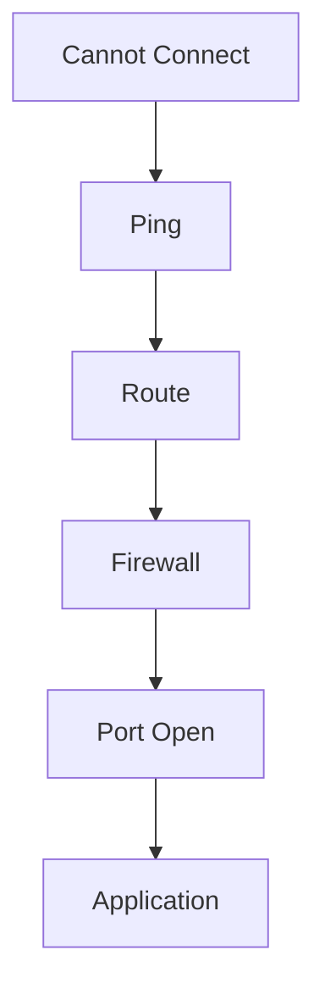
```mermaid
flowchart TD

A[Cannot Connect]

A --> B[Ping]

B --> C[Route]

C --> D[Firewall]

D --> E[Port Open]

E --> F[Application]
```

Commands:

```bash
ping

ip route

ss -tulpn

nft list ruleset
```

---

# SSL Certificate Failure

Decision Tree:

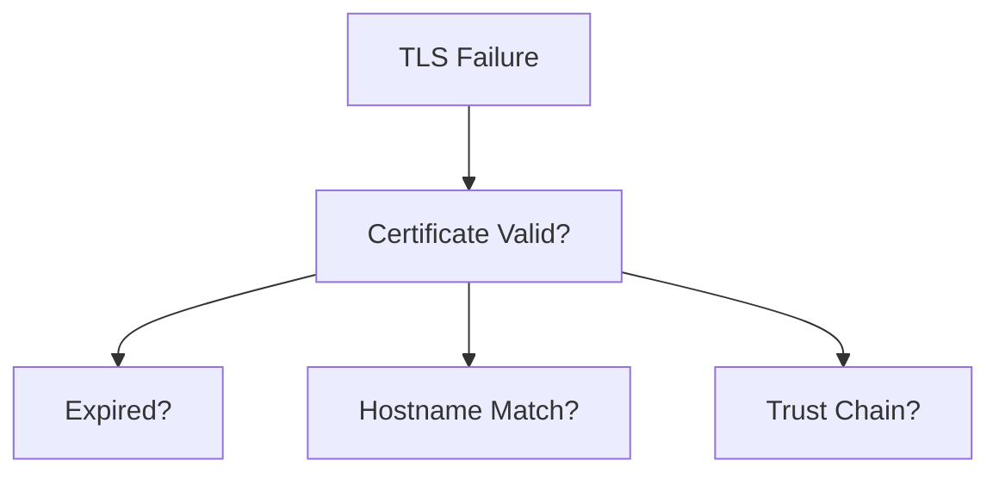
```mermaid
flowchart TD

A[TLS Failure]

A --> B[Certificate Valid?]

B --> C[Expired?]

B --> D[Hostname Match?]

B --> E[Trust Chain?]
```

Commands:

```bash
openssl s_client -connect host:443

curl -Iv https://host
```

---

# Database Is Slow

Decision Tree:

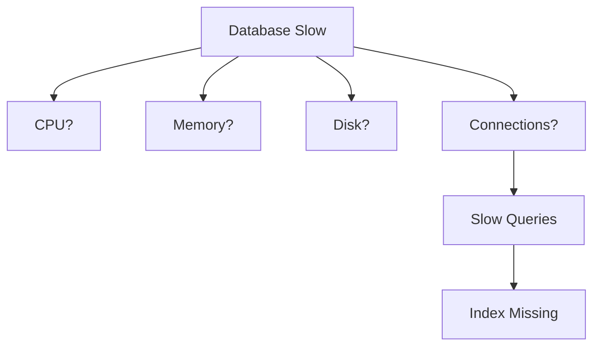
```mermaid
flowchart TD

A[Database Slow]

A --> B[CPU?]

A --> C[Memory?]

A --> D[Disk?]

A --> E[Connections?]

E --> F[Slow Queries]

F --> G[Index Missing]
```

---

# PostgreSQL Investigation

```sql
SELECT * FROM pg_stat_activity;
```

```sql
SELECT * FROM pg_locks;
```

---

# MySQL Investigation

```sql
SHOW PROCESSLIST;
```

```sql
SHOW ENGINE INNODB STATUS;
```

---

# Docker Container Not Working

Decision Tree:

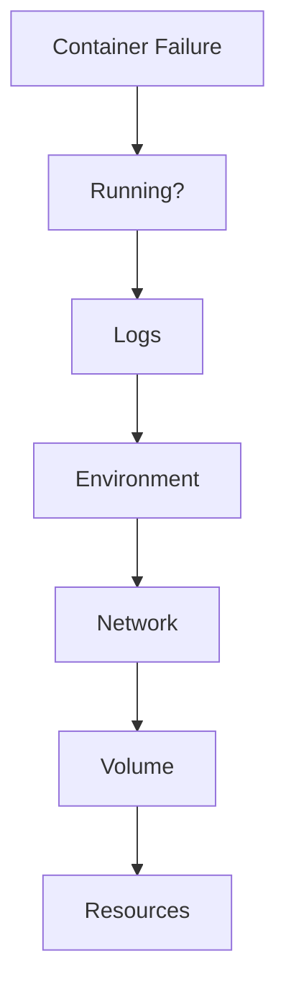
```mermaid
flowchart TD

A[Container Failure]

A --> B[Running?]

B --> C[Logs]

C --> D[Environment]

D --> E[Network]

E --> F[Volume]

F --> G[Resources]
```

Commands:

```bash
docker ps

docker logs

docker inspect

docker exec -it
```

---

# Kubernetes Pod CrashLoopBackOff

Decision Tree:

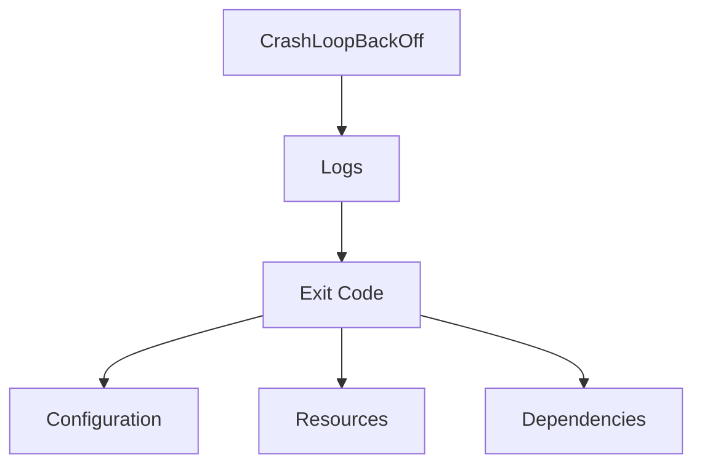
```mermaid
flowchart TD

A[CrashLoopBackOff]

A --> B[Logs]

B --> C[Exit Code]

C --> D[Configuration]

C --> E[Resources]

C --> F[Dependencies]
```

Commands:

```bash
kubectl get pods

kubectl describe pod

kubectl logs pod
```

---

# Kubernetes Pod Pending

Decision Tree:

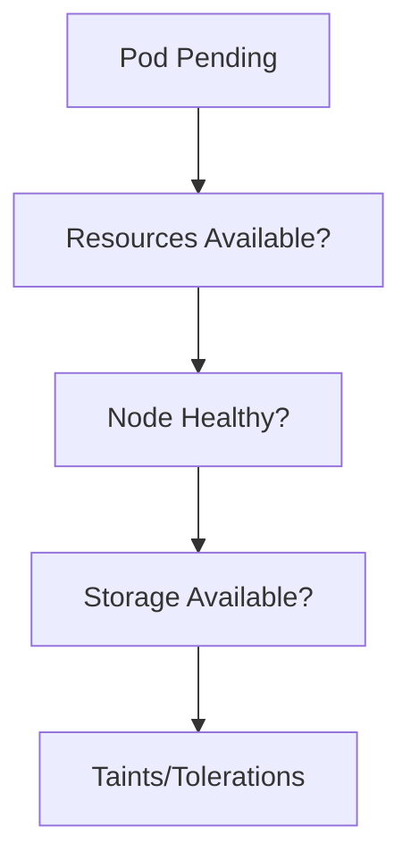
```mermaid
flowchart TD

A[Pod Pending]

A --> B[Resources Available?]

B --> C[Node Healthy?]

C --> D[Storage Available?]

D --> E[Taints/Tolerations]
```

Commands:

```bash
kubectl describe pod

kubectl get nodes
```

---

# Authentication Failure

Decision Tree:

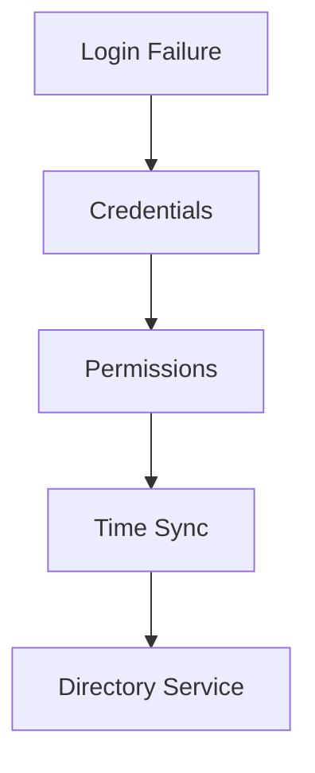
```mermaid
flowchart TD

A[Login Failure]

A --> B[Credentials]

B --> C[Permissions]

C --> D[Time Sync]

D --> E[Directory Service]
```

Commands:

```bash
id

groups

timedatectl

journalctl -u sshd
```

---

# Linux Kernel Panic

Decision Tree:

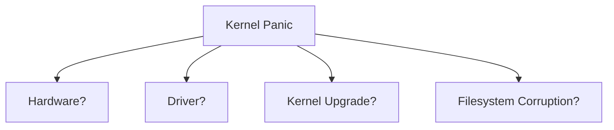
```mermaid
flowchart TD

A[Kernel Panic]

A --> B[Hardware?]

A --> C[Driver?]

A --> D[Kernel Upgrade?]

A --> E[Filesystem Corruption?]
```

Evidence:

```bash
journalctl -k

dmesg
```

---

# Incident Severity Assessment

```mermaid
graph TD

SEV1[SEV-1]
SEV2[SEV-2]
SEV3[SEV-3]
SEV4[SEV-4]

SEV1 --> OUTAGE[Full Outage]

SEV2 --> DEGRADED[Major Impact]

SEV3 --> PARTIAL[Partial Impact]

SEV4 --> MINOR[Minor Issue]
```

---

# The 10 Questions Every Engineer Should Ask

```text
1. What changed?

2. When did it start?

3. What is impacted?

4. What is NOT impacted?

5. Can it be reproduced?

6. Which subsystem is failing?

7. What evidence supports that?

8. What logs exist?

9. What metrics changed?

10. What is the safest mitigation?
```

---

# Universal Emergency Command Pack

```bash
# CPU
top
htop

# Memory
free -h

# Storage
df -h
df -i
du -sh /*

# Processes
ps aux
pstree

# Services
systemctl --failed
systemctl status

# Logs
journalctl -xe

# Network
ip a
ip route
ss -tulpn

# DNS
dig

# Docker
docker ps
docker logs

# Kubernetes
kubectl get pods
kubectl describe pod
```

---

# Final Takeaway

Great troubleshooters do not memorize solutions.

They follow investigation paths.

Always think:

```text
Symptom
    ↓
Subsystem
    ↓
Evidence
    ↓
Root Cause
    ↓
Mitigation
    ↓
Prevention
```

The fastest engineer is rarely the one who knows the most commands.

The fastest engineer is the one who asks the right questions in the right order.
