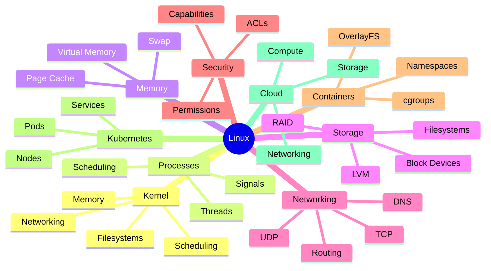
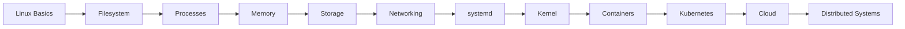
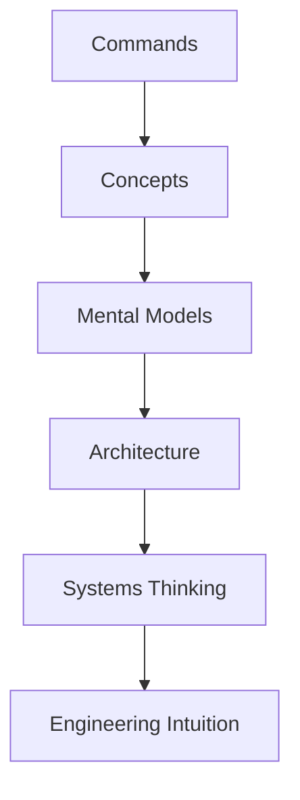
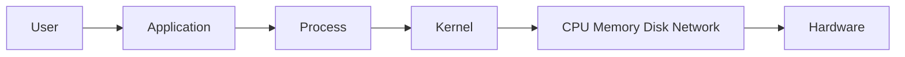
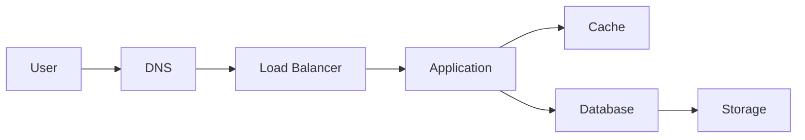
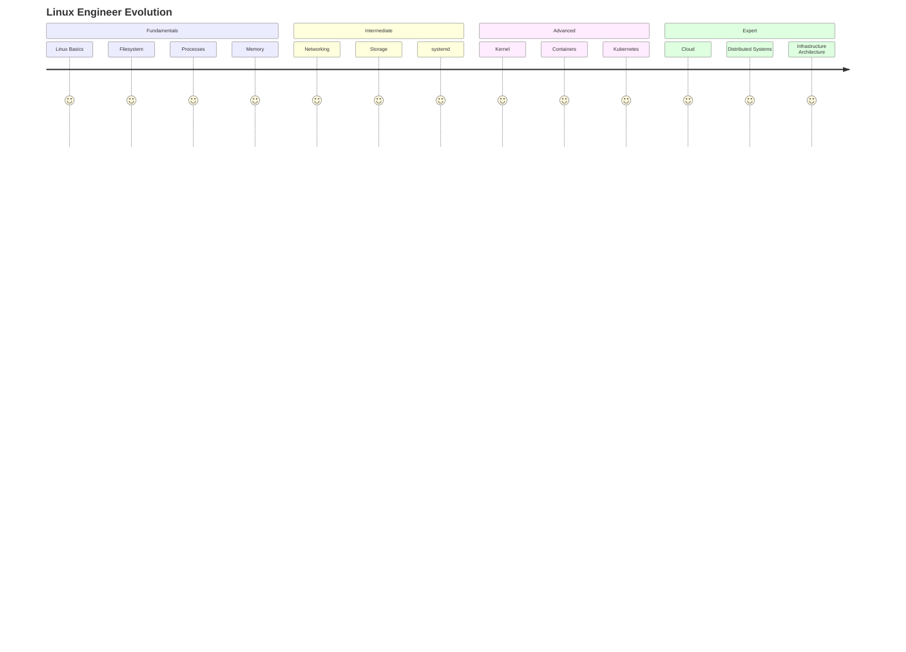

# Linux Engineering Handbook

# Visual Architecture & Diagrams Library

---

# Why This Directory Exists

Linux is a systems subject.

Systems are difficult to understand through text alone.

Many engineers memorize:

```text
Commands
Definitions
Interview Answers
```

But struggle to visualize:

```text
How Linux boots

How processes work

How memory works

How filesystems operate

How networking flows

How containers work

How Kubernetes runs
```

This directory exists to solve that problem.

Its purpose is to provide:

* Visual learning
* Architecture understanding
* Mental models
* Production system visualization
* Infrastructure thinking
* Systems engineering intuition

---

# Philosophy

This repository follows a core belief:

> Engineers who understand system diagrams solve problems faster than engineers who memorize commands.

Commands change.

Technology changes.

Tools change.

Architecture principles remain.

---

# The Linux Engineering Map



---

# How To Use This Directory

There are three ways to use these diagrams.

---

## Method 1 — Before Learning

Open the diagram first.

Study the architecture.

Understand the big picture.

Then read the chapter.

This creates a mental framework.

---

## Method 2 — During Learning

Keep diagrams open beside the chapter.

Whenever a new concept appears:

```text
Process

Memory

Filesystem

Socket

Container
```

Locate it inside the architecture.

This builds connections between concepts.

---

## Method 3 — During Production Work

Use diagrams as debugging maps.

Example:

```text
Website Down
```

Instead of guessing:

```text
Nginx?
DNS?
Database?
Network?
```

Follow the architecture diagram.

Identify the failing layer.

---

# Learning Progression



---

# Diagram Categories

---

## Linux Fundamentals

Focus:

```text
Architecture
Boot Process
Filesystem
Processes
Memory
Networking
Storage
```

Goal:

```text
Understand how Linux works internally.
```

---

## Linux Internals

Focus:

```text
Kernel
Scheduler
System Calls
Interrupts
Drivers
VFS
```

Goal:

```text
Understand Linux from the kernel outward.
```

---

## Infrastructure Engineering

Focus:

```text
Containers
Docker
Kubernetes
Cloud
Load Balancers
Databases
```

Goal:

```text
Understand modern production systems.
```

---

## Troubleshooting

Focus:

```text
Incident Flows
Failure Trees
Root Cause Paths
Recovery Workflows
```

Goal:

```text
Debug systems systematically.
```

---

# Visual Learning Pyramid



---

# The Universal Systems Model

Almost every Linux topic can be reduced to:



Everything in this repository eventually connects back to this model.

---

# Production Engineering View

A production request typically travels through:



Understanding this flow is the foundation of:

```text
Backend Engineering

DevOps

SRE

Platform Engineering

Cloud Engineering
```

---

# Diagram Standards

Every diagram in this repository should:

* Teach first principles
* Show relationships
* Explain data flow
* Explain control flow
* Highlight bottlenecks
* Highlight failure points
* Connect to production systems
* Use Mermaid whenever possible
* Remain beginner friendly
* Scale to advanced engineering concepts

---

# Visual Roadmap



---

# Final Takeaway

Linux is not a collection of commands.

Linux is a collection of interacting systems.

The purpose of this directory is to make those systems visible.

When you can visualize:

```text
Processes

Memory

Storage

Networking

Containers

Kubernetes

Cloud Infrastructure
```

you begin to think like a systems engineer rather than a command operator.

That transformation is the ultimate goal of this repository.
