# Cloud Infrastructure Map

## From Physical Servers to Global Cloud Platforms

---

# Why This Exists

Most engineers use cloud services every day:

```text
EC2
EKS
GKE
AKS
S3
RDS
Cloud SQL
Load Balancers
VPCs
```

But very few understand:

```text
What actually happens underneath?

How does a cloud provider work?

Where do virtual machines come from?

Where does storage live?

How does networking work?

How do hyperscalers build infrastructure?
```

Cloud is often treated as magic.

Reality:

```text
Cloud = Linux + Virtualization + Networking + Storage + Automation
```

Everything eventually runs on:

```text
Physical Servers
Linux
Distributed Systems
```

This file connects:

```text
Linux
Containers
Kubernetes
Networking
Storage
Databases
Distributed Systems
Cloud Platforms
```

into a single mental model.

---

# The Core Mental Model

Most beginners think:

```text
Cloud
   ↓
Virtual Machine
```

Reality:

```text
Datacenter
   ↓
Physical Servers
   ↓
Linux
   ↓
Hypervisor
   ↓
Virtual Machines
   ↓
Containers
   ↓
Kubernetes
   ↓
Applications
```

Cloud is simply:

```text
Infrastructure as a Service
```

delivered through APIs.

---

# The Complete Cloud Hierarchy

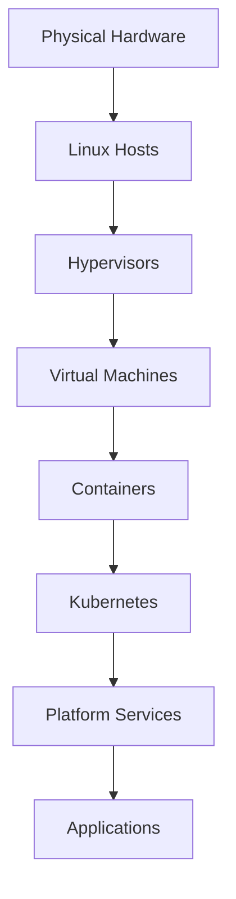

---

# The Big Picture

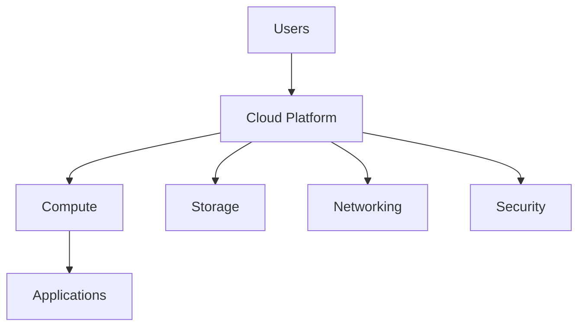

---

# Cloud Infrastructure Layers

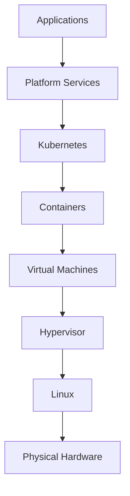

---

# Layer 1: Physical Infrastructure

Every cloud begins with hardware.

---

# Datacenter Architecture

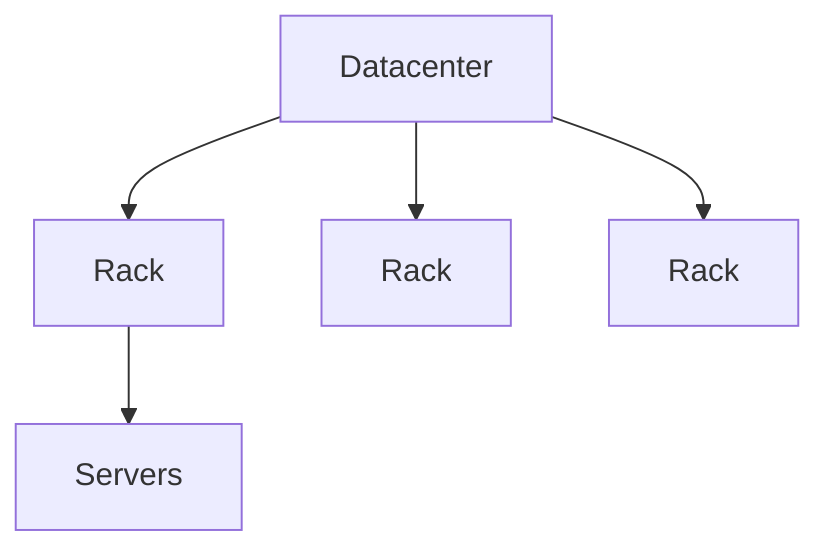

---

# Physical Components

```text
Servers

Switches

Routers

Storage Arrays

Power Systems

Cooling Systems

Fiber Networks
```

---

# Datacenter Visualization

```text
+--------------------------------+
|          DATACENTER            |
+--------------------------------+

   Rack A      Rack B      Rack C

 [Server]    [Server]    [Server]
 [Server]    [Server]    [Server]
 [Server]    [Server]    [Server]
```

---

# Layer 2: Linux Hosts

Most cloud infrastructure runs Linux.

---

# Linux Host Architecture

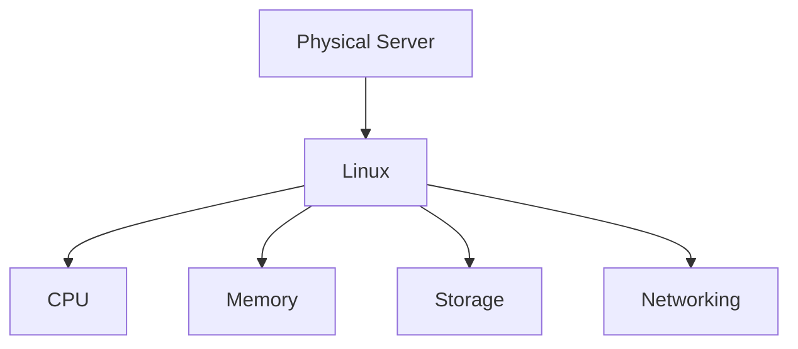

---

# Why Linux?

```text
Performance

Stability

Open Source

Scalability

Container Support

Virtualization Support
```

---

# Layer 3: Virtualization

Cloud providers sell virtual machines.

Virtualization makes this possible.

---

# Hypervisor Architecture

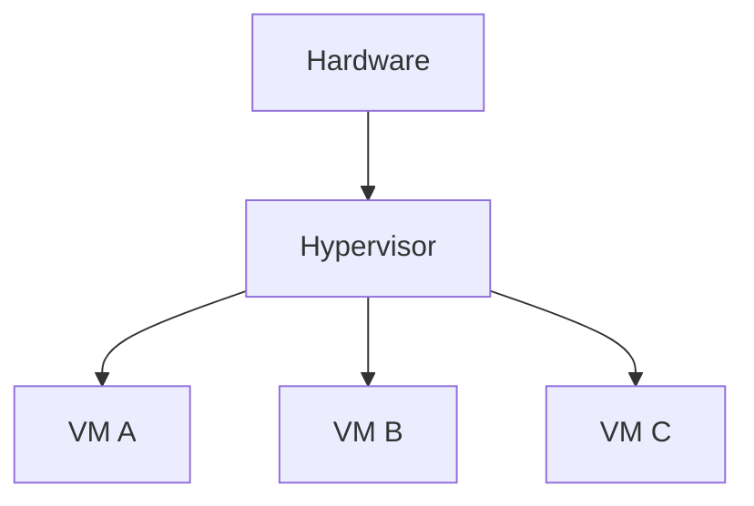

---

# Popular Hypervisors

```text
KVM

Xen

Hyper-V

VMware ESXi
```

---

# Virtual Machine Architecture

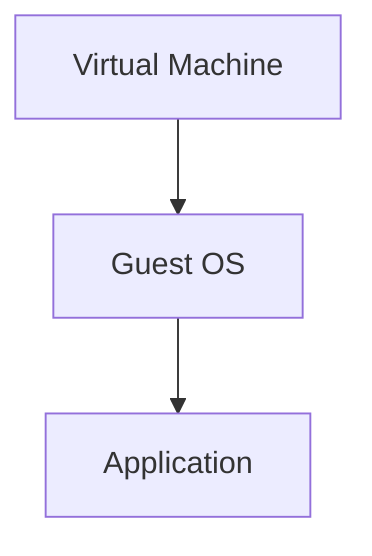

---

# Cloud Compute

VMs become cloud compute services.

Examples:

```text
AWS EC2

Google Compute Engine

Azure Virtual Machines
```

---

# Compute Service Architecture

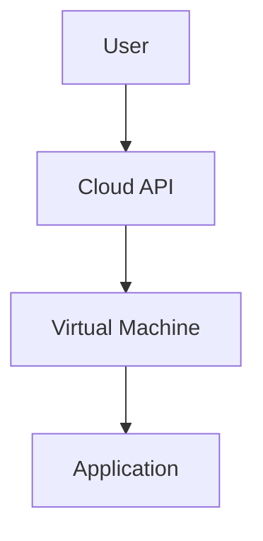

---

# Layer 4: Containers

Containers improve density.

---

# Container Architecture

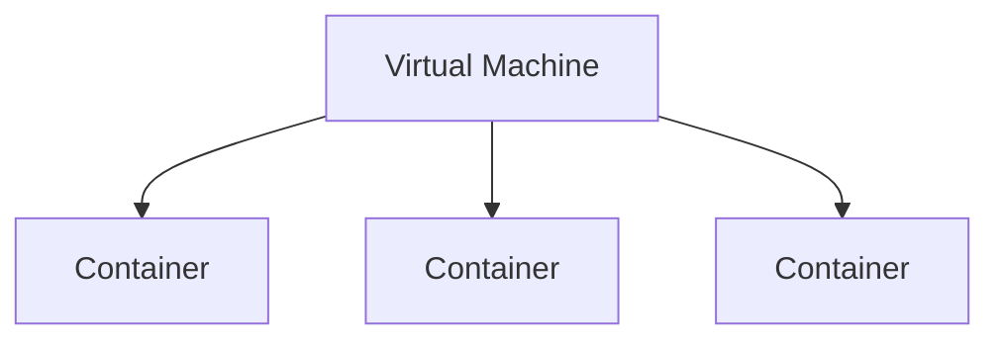

---

# Container Foundation

Built using:

```text
Namespaces

cgroups

OverlayFS

Linux Networking
```

---

# Layer 5: Kubernetes

Containers need orchestration.

---

# Kubernetes Architecture

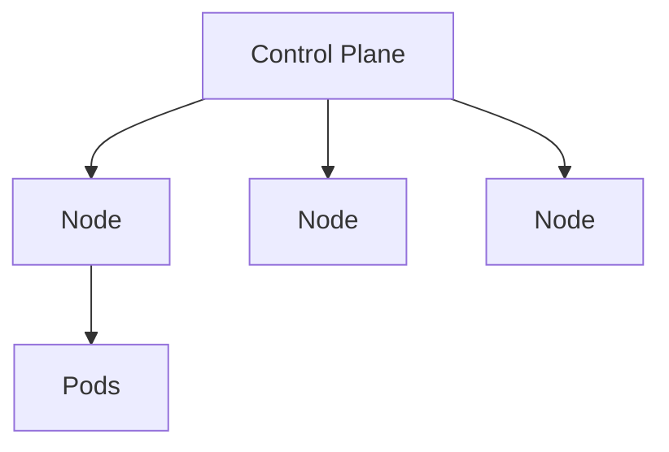

---

# Cloud Kubernetes Services

Examples:

```text
Amazon EKS

Google GKE

Azure AKS
```

---

# Layer 6: Networking

Networking is the circulatory system of cloud.

---

# Networking Hierarchy

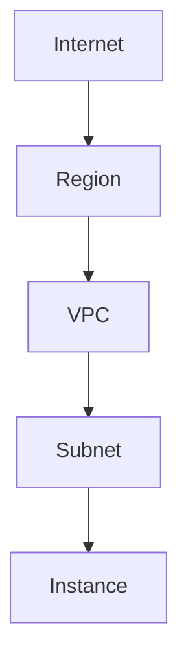

---

# Virtual Private Cloud (VPC)

Think of a VPC as:

```text
Private Datacenter
inside the Cloud
```

---

# VPC Architecture

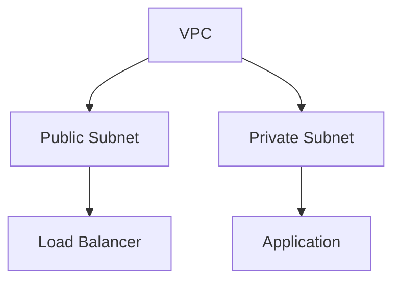

---

# Production Network Layout

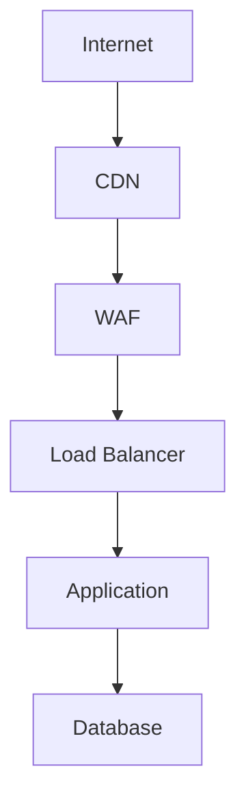

---

# Security Groups

Cloud firewalls.

---

# Security Flow

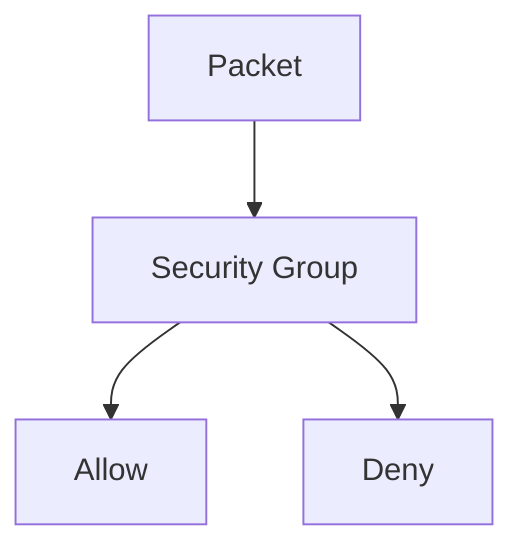

---

# Layer 7: Storage

Applications need persistent data.

---

# Storage Categories

```text
Block Storage

Object Storage

File Storage
```

---

# Storage Architecture

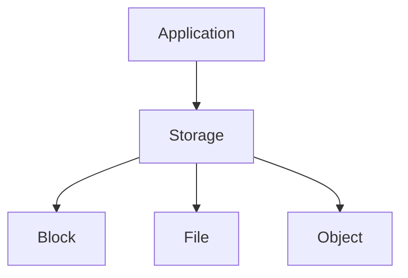

---

# Block Storage

Acts like a disk.

Examples:

```text
EBS

Persistent Disk

Managed Disks
```

---

# Block Storage Architecture

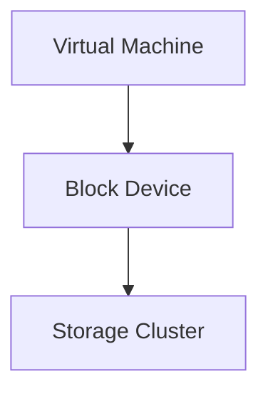

---

# Object Storage

Examples:

```text
S3

Google Cloud Storage

Azure Blob Storage
```

---

# Object Storage Architecture

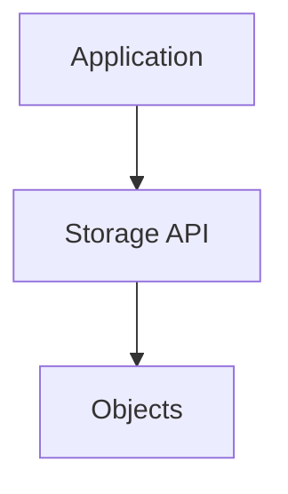

---

# File Storage

Shared filesystem.

Examples:

```text
EFS

Filestore

Azure Files
```

---

# Layer 8: Databases

Managed databases remove operational burden.

---

# Database Architecture

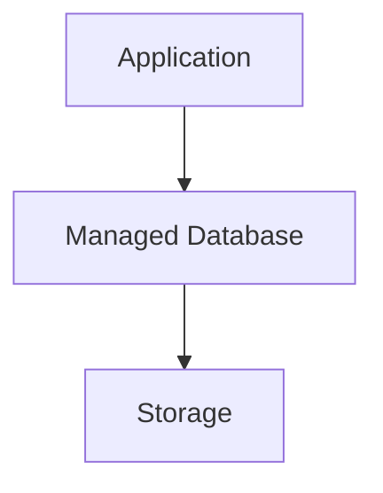

---

# Examples

```text
RDS

Cloud SQL

Aurora

Spanner

Cosmos DB
```

---

# Distributed Database Model

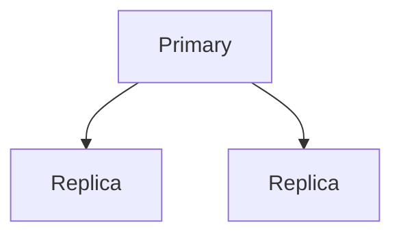

---

# Layer 9: Load Balancing

Distributes traffic.

---

# Load Balancer Architecture

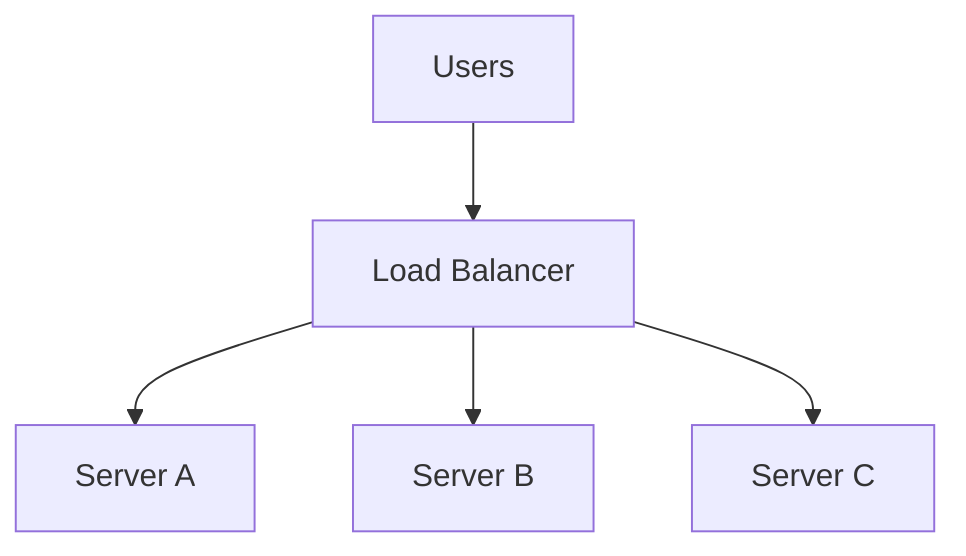

---

# Responsibilities

```text
Traffic Distribution

TLS Termination

Health Checks

Failover
```

---

# Layer 10: Identity & Access Management

IAM secures cloud infrastructure.

---

# IAM Architecture

```mermaid
graph TD

USER["User"]

USER --> IAM["IAM"]

IAM --> RESOURCE["Resource"]
```

---

# IAM Components

```text
Users

Roles

Policies

Permissions
```

---

# Layer 11: Observability

Production requires visibility.

---

# Observability Architecture

```mermaid
graph TD

APPLICATION["Application"]

APPLICATION --> LOGS["Logs"]

APPLICATION --> METRICS["Metrics"]

APPLICATION --> TRACES["Traces"]

LOGS --> DASHBOARD["Observability"]
```

---

# Typical Stack

```text
Prometheus

Grafana

Loki

Tempo

OpenTelemetry
```

---

# Layer 12: Automation

Cloud is API-driven.

Everything is automated.

---

# Infrastructure as Code

```mermaid
graph TD

CODE["Terraform"]

CODE --> CLOUD["Cloud API"]

CLOUD --> INFRA["Infrastructure"]
```

---

# Modern Cloud Workflow

```text
Git Push
    ↓
CI/CD
    ↓
Terraform
    ↓
Cloud API
    ↓
Infrastructure
```

---

# Multi-Region Infrastructure

Large systems span regions.

---

# Multi-Region Architecture

```mermaid
graph TD

USERS["Users"]

USERS --> REGION1["US"]

USERS --> REGION2["EU"]

USERS --> REGION3["Asia"]
```

---

# Disaster Recovery Architecture

```mermaid
graph TD

PRIMARY["Primary Region"]

PRIMARY --> REPLICA["Replica Region"]

PRIMARY --> BACKUP["Backup Storage"]
```

---

# Cloud Request Flow

A real production request:

```mermaid
flowchart LR

USER["User"]

USER --> DNS["DNS"]

DNS --> CDN["CDN"]

CDN --> WAF["WAF"]

WAF --> LB["Load Balancer"]

LB --> K8S["Kubernetes"]

K8S --> POD["Pod"]

POD --> DATABASE["Database"]

DATABASE --> STORAGE["Storage"]
```

---

# Cloud Service Layers

```mermaid
graph TD

SAAS["SaaS"]

SAAS --> PAAS["PaaS"]

PAAS --> CAAS["CaaS"]

CAAS --> IAAS["IaaS"]

IAAS --> HARDWARE["Hardware"]
```

---

# Shared Responsibility Model

```mermaid
graph TD

PROVIDER["Cloud Provider"]

PROVIDER --> HARDWARE["Hardware"]

PROVIDER --> NETWORK["Network"]

PROVIDER --> HYPERVISOR["Hypervisor"]

CUSTOMER["Customer"]

CUSTOMER --> APPLICATION["Application"]

CUSTOMER --> DATA["Data"]

CUSTOMER --> ACCESS["Access Control"]
```

---

# Complete Cloud Infrastructure Map

```mermaid
mindmap
  root((Cloud))

    Datacenter
      Racks
      Servers
      Networking

    Linux
      Kernel
      Processes
      Storage

    Virtualization
      KVM
      Xen

    Compute
      VMs
      Containers

    Kubernetes
      Pods
      Nodes

    Networking
      VPC
      Subnets
      Load Balancers

    Storage
      Block
      Object
      File

    Security
      IAM
      Security Groups

    Observability
      Metrics
      Logs
      Traces

    Automation
      Terraform
      CI/CD
```

---

# Common Cloud Failures

### Compute

```text
CPU Exhaustion

Memory Exhaustion

Node Failure
```

---

### Networking

```text
Routing Issues

DNS Failures

Load Balancer Problems
```

---

### Storage

```text
Disk Full

High Latency

Replication Lag
```

---

### Security

```text
Misconfigured IAM

Exposed Storage

Open Security Groups
```

---

# Engineering Mindset

Beginners see:

```text
AWS

Azure

GCP
```

Engineers see:

```text
Linux
   ↓
Virtualization
   ↓
Networking
   ↓
Storage
   ↓
Containers
   ↓
Kubernetes
   ↓
Automation
   ↓
Cloud
```

Cloud is not a separate world.

Cloud is Linux infrastructure at massive scale.

---

# Interview Questions

### What is cloud computing?

### How does a cloud provider work?

### Why is Linux important in cloud?

### What is a hypervisor?

### Difference between VM and container?

### What is a VPC?

### What is block storage?

### What is object storage?

### What is IAM?

### How do load balancers work?

### What is Infrastructure as Code?

### What is the shared responsibility model?

### How does Kubernetes fit into cloud?

### How does a cloud request flow work?

### What powers modern cloud infrastructure?

---

# One-Page Architecture Summary

```text
Datacenter
      ↓
Physical Servers
      ↓
Linux
      ↓
Hypervisor
      ↓
Virtual Machines
      ↓
Containers
      ↓
Kubernetes
      ↓
Applications
      ↓
Cloud Platform
```

---

# Final Takeaway

Cloud is not magic.

Cloud is the evolution of:

```text
Linux

Virtualization

Networking

Storage

Distributed Systems

Automation
```

at enormous scale.

Every cloud service ultimately rests on the same foundations:

```text
Physical Hardware
Linux
Networking
Storage
Security
Automation
```

Master these foundations, and every cloud platform becomes easier to understand, design, troubleshoot, and scale.
