# Database Internals

## From SQL Queries to Storage Engines, B-Trees, WAL, MVCC, Replication, and Distributed Databases

---

# Why This Exists

Most engineers use databases every day.

They write:

```sql
SELECT * FROM users;

INSERT INTO orders VALUES (...);

UPDATE products SET stock = stock - 1;
```

and the database simply returns results.

But what actually happens inside?

When you execute:

```sql
SELECT * FROM users WHERE email='vip@example.com';
```

the database performs an incredible amount of work:

```text
Parser
↓
Optimizer
↓
Execution Planner
↓
Index Lookup
↓
Buffer Cache
↓
Storage Engine
↓
Filesystem
↓
Linux Kernel
↓
Disk
```

Understanding database internals is essential for:

* Backend Engineers
* Database Engineers
* DevOps Engineers
* SREs
* Platform Engineers
* System Architects
* Startup Founders

Because most production bottlenecks eventually become:

```text
Database Bottlenecks
```

---

# The Core Mental Model

Most beginners think:

```text
Application
     ↓
Database
     ↓
Result
```

Reality:

```text
Application
     ↓
SQL Parser
     ↓
Optimizer
     ↓
Execution Plan
     ↓
Indexes
     ↓
Memory Cache
     ↓
Storage Engine
     ↓
Filesystem
     ↓
Disk
```

A database is not a file.

A database is:

```text
A Data Processing Engine
```

---

# The Big Picture

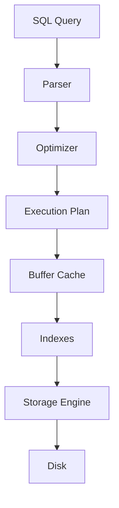

---

# Database Architecture Overview

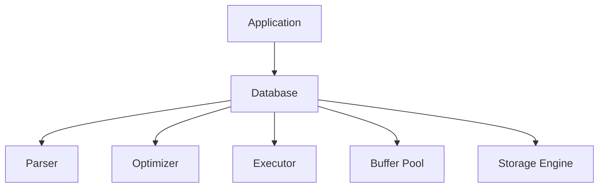

---

# The Journey of a Query

Example:

```sql
SELECT * FROM users WHERE id = 100;
```

The database does not immediately read a file.

Instead:

```text
Parse
Validate
Optimize
Execute
Return
```

---

# Query Lifecycle

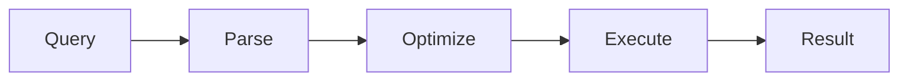

---

# Query Parser

The parser answers:

```text
Is this valid SQL?
```

---

# Parser Architecture

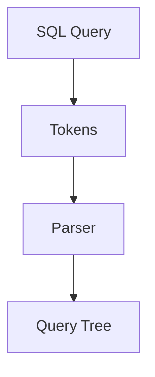

---

# Example

Input:

```sql
SELECT * FROM users;
```

Parser creates:

```text
Abstract Syntax Tree (AST)
```

---

# Query Optimizer

One of the most important database components.

---

# Optimizer Goal

```text
Fastest Query Plan
```

---

# Optimizer Architecture

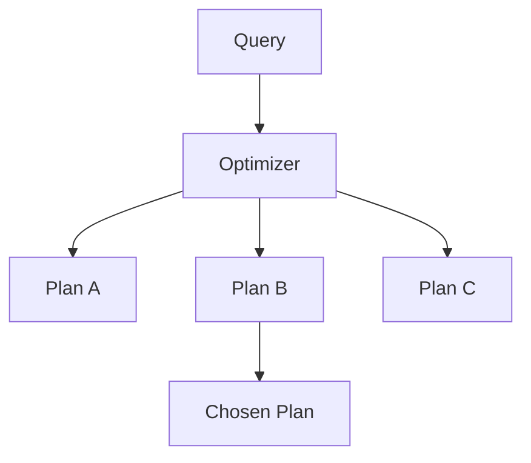

---

# Why Optimizers Exist

Consider:

```sql
SELECT * FROM users WHERE id=100;
```

Options:

```text
Scan Entire Table

Use Index
```

Optimizer chooses:

```text
Use Index
```

---

# Execution Engine

Executes the chosen plan.

---

# Execution Architecture

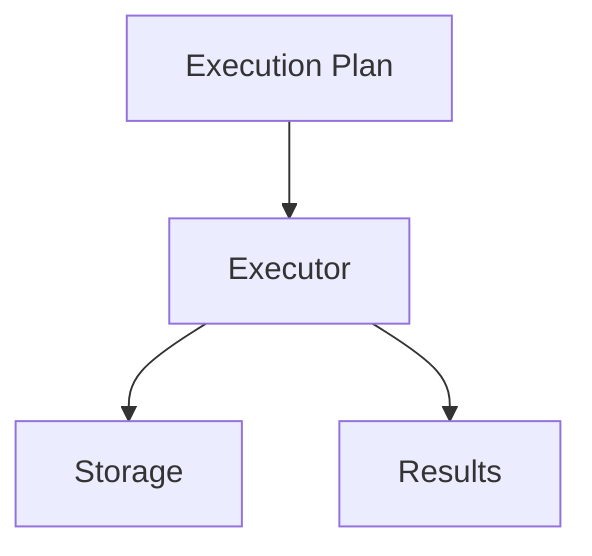

---

# Storage Engine

The storage engine manages data on disk.

---

# Responsibilities

```text
Reads

Writes

Indexes

Transactions

Recovery
```

---

# Storage Engine Architecture

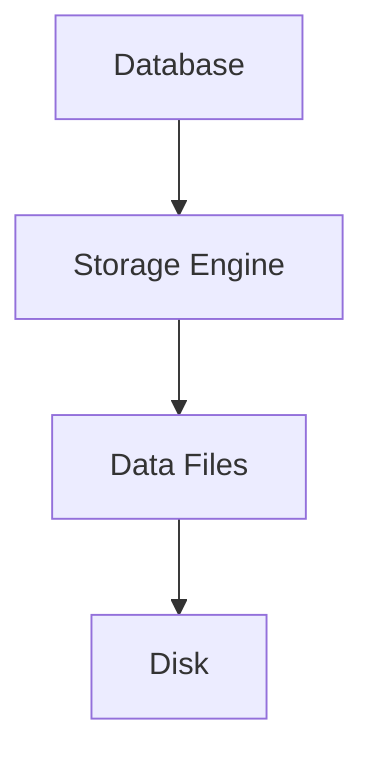

---

# Database Storage Layout

```text
Database
     ↓
Tables
     ↓
Pages
     ↓
Blocks
     ↓
Disk
```

---

# Why Databases Use Pages

Disks are slow.

Reading one row at a time is inefficient.

Databases read:

```text
Pages
```

instead.

Typically:

```text
4 KB

8 KB

16 KB
```

---

# Page Architecture

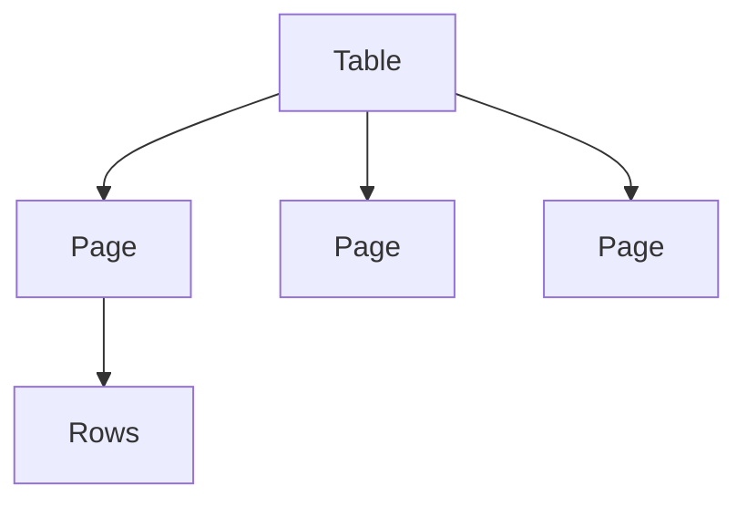

---

# B-Tree Indexes

The most important database structure.

---

# Why Indexes Exist

Without index:

```text
Find User
      ↓
Scan Entire Table
```

With index:

```text
Find User
      ↓
Jump Directly
```

---

# B-Tree Architecture

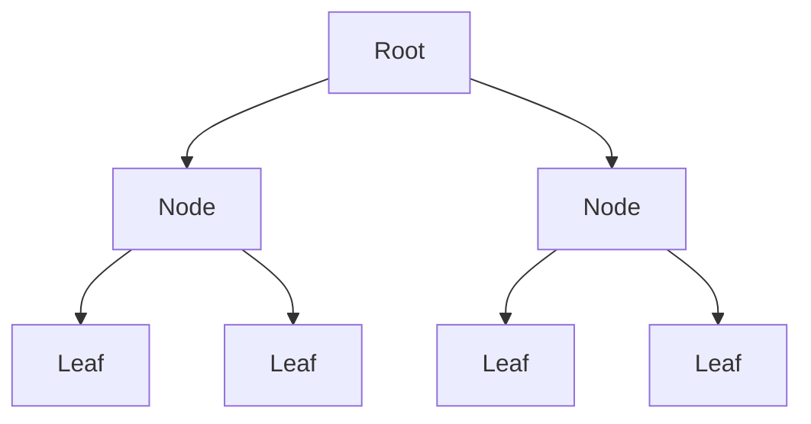

---

# Search Complexity

Table Scan:

```text
O(n)
```

Index Lookup:

```text
O(log n)
```

Huge difference.

---

# Index Lookup Flow

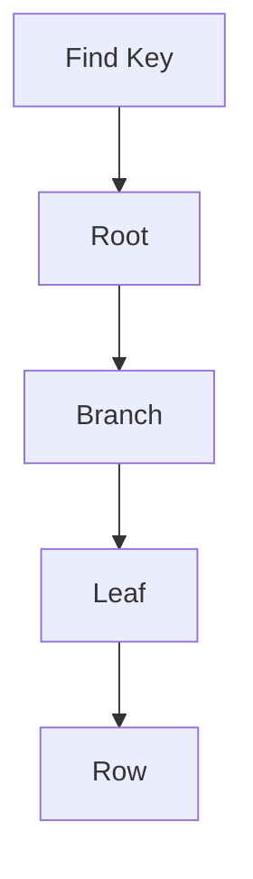

---

# Buffer Cache

Reading disks is expensive.

Databases cache frequently accessed pages.

---

# Cache Architecture

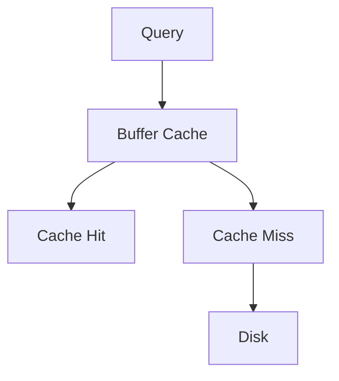

---

# Why Cache Matters

Disk latency:

```text
Milliseconds
```

Memory latency:

```text
Nanoseconds
```

Difference:

```text
Millions of Times Faster
```

---

# Buffer Pool Architecture

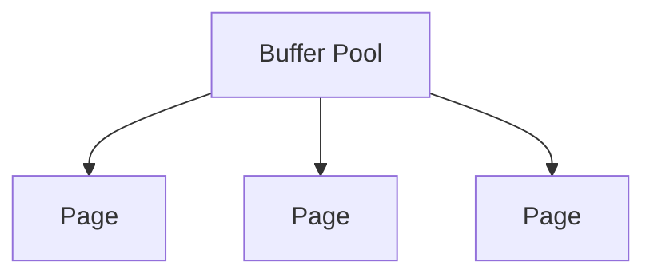

---

# Write-Ahead Logging (WAL)

One of the most important database concepts.

---

# Problem

What if power fails during a write?

---

# WAL Solution

Before changing data:

```text
Write Log First
```

---

# WAL Architecture

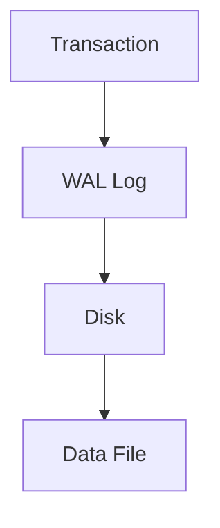

---

# WAL Benefits

```text
Crash Recovery

Durability

Replication

Consistency
```

---

# Crash Recovery

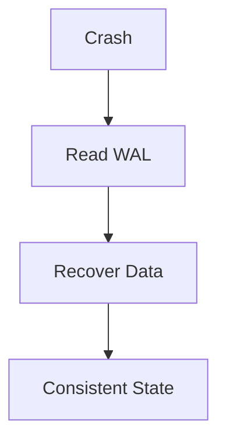

---

# ACID Transactions

Foundation of relational databases.

---

# ACID Model

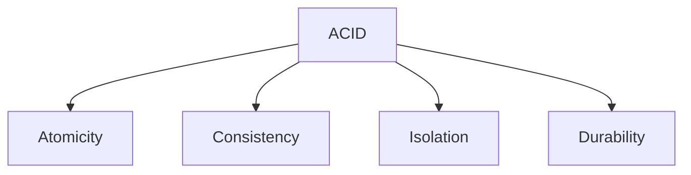

---

# Atomicity

```text
All

or

Nothing
```

---

# Example

Transfer money:

```text
Debit Account A

Credit Account B
```

Both succeed or neither succeeds.

---

# Durability

Once committed:

```text
Data Survives Crash
```

Thanks to WAL.

---

# Concurrency Problem

Multiple users access data simultaneously.

---

# Example

```text
User A Updates Row

User B Reads Row
```

How should database behave?

---

# Locking Architecture

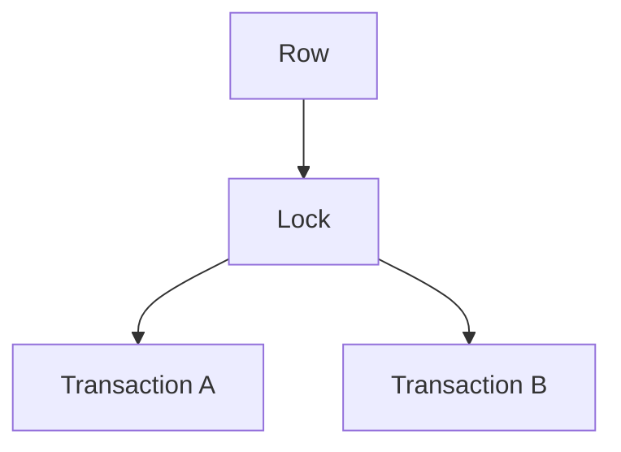

---

# Traditional Locking Problem

Too many locks:

```text
Blocking

Deadlocks

Reduced Throughput
```

---

# MVCC

Modern databases use:

```text
Multi-Version Concurrency Control
```

---

# MVCC Mental Model

Instead of changing rows:

```text
Create New Version
```

---

# MVCC Architecture

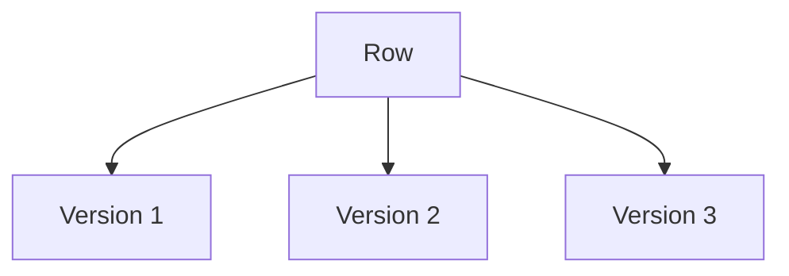

---

# Benefits

Readers:

```text
Don't Block Writers
```

Writers:

```text
Don't Block Readers
```

---

# PostgreSQL MVCC

Each row contains:

```text
xmin

xmax
```

Tracking transaction visibility.

---

# Query Execution Flow

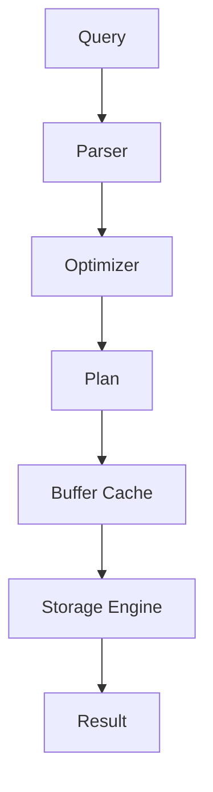

---

# Database Filesystem Relationship

Databases ultimately use:

```text
Linux Filesystems
```

---

# Storage Stack

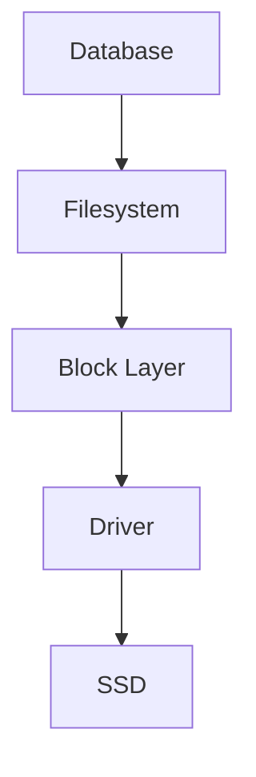

---

# Linux Page Cache

Interaction:

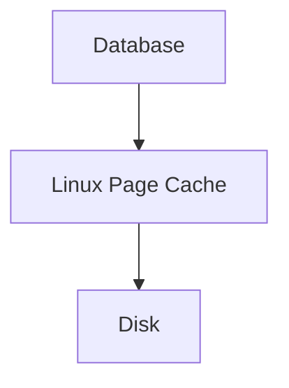

Some databases bypass page cache.

---

# Replication

Production systems need redundancy.

---

# Replication Architecture

```mermaid
graph TD

PRIMARY["Primary"]

PRIMARY --> REPLICA1["Replica"]

PRIMARY --> REPLICA2["Replica"]
```

---

# Replication Flow

```mermaid
flowchart LR

WRITE["Write"]

WRITE --> PRIMARY["Primary"]

PRIMARY --> WAL["WAL"]

WAL --> REPLICA["Replica"]
```

---

# Why Replication Exists

```text
High Availability

Read Scaling

Disaster Recovery
```

---

# Sharding

Single databases eventually become too large.

---

# Sharding Architecture

```mermaid
graph TD

USERS["Users"]

USERS --> SHARD1["Shard A"]

USERS --> SHARD2["Shard B"]

USERS --> SHARD3["Shard C"]
```

---

# Example

```text
User 1-1M → Shard A

User 1M-2M → Shard B

User 2M-3M → Shard C
```

---

# Distributed Databases

Multiple database nodes work together.

---

# Distributed Architecture

```mermaid
graph TD

NODE1["Node A"]

NODE2["Node B"]

NODE3["Node C"]

NODE1 --> NODE2

NODE2 --> NODE3
```

---

# New Problems Appear

```text
Network Failures

Consistency

Leader Election

Replication Lag
```

---

# CAP Theorem

Distributed databases must balance:

```mermaid
graph TD

CAP["CAP"]

CAP --> C["Consistency"]

CAP --> A["Availability"]

CAP --> P["Partition Tolerance"]
```

---

# Observability

Database health requires visibility.

---

# Metrics

```text
Query Latency

Connections

Cache Hit Ratio

Replication Lag

Transactions
```

---

# Observability Architecture

```mermaid
graph TD

DATABASE["Database"]

DATABASE --> METRICS["Metrics"]

DATABASE --> LOGS["Logs"]

DATABASE --> TRACES["Traces"]
```

---

# Common Production Bottlenecks

```text
Missing Indexes

Slow Queries

Lock Contention

Replication Lag

Disk Saturation

Connection Exhaustion
```

---

# Slow Query Example

Without index:

```sql
SELECT * FROM users WHERE email='vip@example.com';
```

Result:

```text
Full Table Scan
```

---

# With Index

```sql
CREATE INDEX idx_email
ON users(email);
```

Result:

```text
Index Lookup
```

---

# Database Troubleshooting Workflow

```mermaid
flowchart TD

SLOW["Slow Database"]

SLOW --> QUERY["Check Queries"]

QUERY --> INDEX["Check Indexes"]

INDEX --> CACHE["Check Cache"]

CACHE --> STORAGE["Check Disk"]

STORAGE --> FIX["Optimize"]
```

---

# Complete Database Internals Map

```mermaid
mindmap
  root((Database))

    Query Engine
      Parser
      Optimizer
      Executor

    Storage
      Pages
      Files

    Indexes
      B Trees

    Memory
      Buffer Cache

    Recovery
      WAL

    Transactions
      ACID
      MVCC

    Scaling
      Replication
      Sharding

    Distributed Systems
      CAP
      Consensus

    Observability
      Metrics
      Logs
```

---

# Engineering Mindset

Beginners see:

```text
SELECT *
```

Engineers see:

```text
Parser
   ↓
Optimizer
   ↓
Execution Plan
   ↓
Indexes
   ↓
Buffer Cache
   ↓
Storage Engine
   ↓
Filesystem
   ↓
Linux Kernel
   ↓
Disk
```

Every query is a journey through multiple subsystems.

---

# Interview Questions

### What happens when a SQL query is executed?

### What is a query optimizer?

### Why are indexes important?

### What is a B-Tree?

### What is WAL?

### Why does WAL exist?

### What is ACID?

### What is MVCC?

### Why does PostgreSQL use MVCC?

### What is replication?

### What is sharding?

### What is the CAP theorem?

### Why are databases memory-intensive?

### What causes slow queries?

### How do databases interact with Linux?

---

# One-Page Architecture Summary

```text
SQL Query
      ↓
Parser
      ↓
Optimizer
      ↓
Execution Plan
      ↓
Indexes
      ↓
Buffer Cache
      ↓
Storage Engine
      ↓
Filesystem
      ↓
Linux Kernel
      ↓
Disk
```

---

# Final Takeaway

A database is not just a place to store data.

It is a sophisticated execution engine built from:

```text
Query Processing

Indexes

Caching

Transactions

Recovery

Concurrency Control

Replication

Storage Engines
```

Every modern application, cloud platform, Kubernetes cluster, and distributed system ultimately depends on these database foundations.

Master database internals and you gain the ability to design scalable systems, diagnose production bottlenecks, optimize performance, and understand how data truly moves from memory to disk and across the world.
