# Docker Internals

## From `docker run` to Linux Namespaces, cgroups, OverlayFS, containerd, and runc

---

# Why This Exists

Most engineers use Docker every day.

They run commands like:

```bash
docker run nginx
docker ps
docker build .
docker compose up
```

and Docker appears to magically create containers.

But Docker is not magic.

When you execute:

```bash
docker run nginx
```

Docker does not create a virtual machine.

Docker does not create a new operating system.

Docker ultimately creates:

```text
Linux Process
+
Namespaces
+
cgroups
+
Filesystem Layers
+
Networking
```

Understanding Docker internals is important because:

* Containers are the foundation of Kubernetes
* Modern cloud platforms run containers
* Production debugging often requires Linux-level understanding
* Performance tuning requires understanding what Docker actually does

---

# The Core Mental Model

Most beginners think:

```text
Application
     ↓
Docker
     ↓
Container
```

Reality:

```text
Application
     ↓
Docker
     ↓
containerd
     ↓
runc
     ↓
Linux Kernel
     ↓
Namespaces
     ↓
cgroups
     ↓
Process
```

A container is ultimately:

```text
An isolated Linux process.
```

---

# The Big Picture

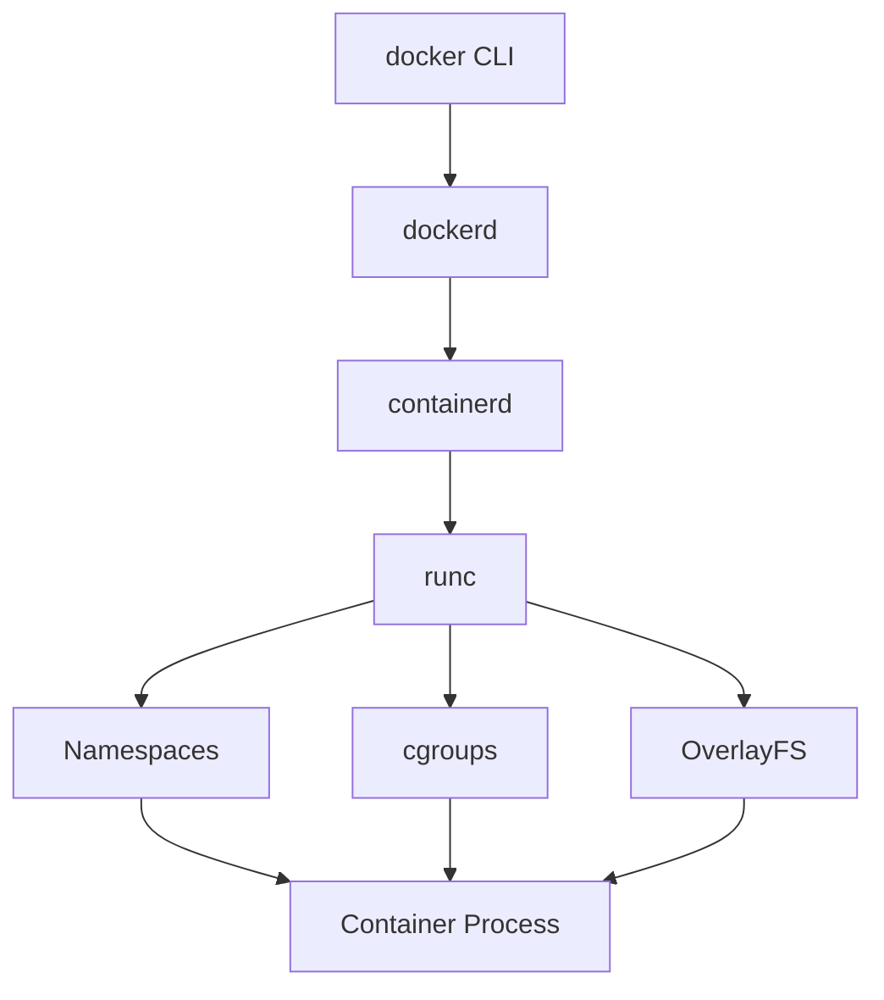

---

# Docker Architecture Overview

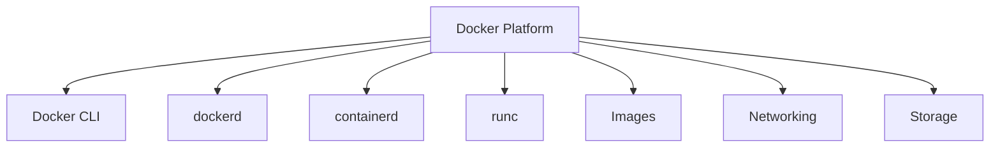

---

# Docker Components

Modern Docker consists of:

```text
Docker CLI

dockerd

containerd

runc

Linux Kernel
```

Each has a specific responsibility.

---

# Docker CLI

The command-line interface.

Example:

```bash
docker run nginx
```

The CLI itself does not create containers.

It sends API requests.

---

# CLI Architecture


---

# dockerd

Docker daemon.

Responsible for:

```text
Image Management

Networking

Volume Management

Container Lifecycle

API Management
```

---

# dockerd Architecture

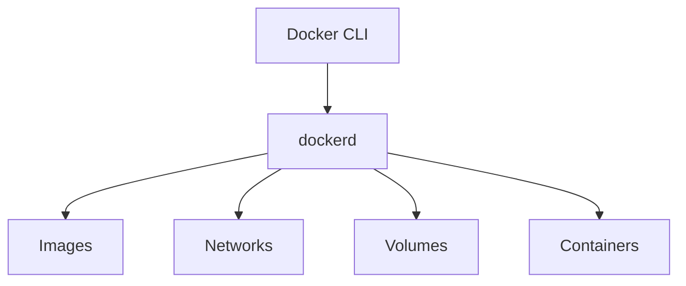

---

# containerd

A container lifecycle manager.

Docker delegates container management to containerd.

---

# Why containerd Exists

Historically:

```text
Docker Did Everything
```

Modern architecture:

```text
Docker
   ↓
containerd
   ↓
runc
```

This separation improves modularity.

---

# containerd Responsibilities

```text
Image Pulling

Container Lifecycle

Snapshots

Runtime Management
```

---

# containerd Architecture

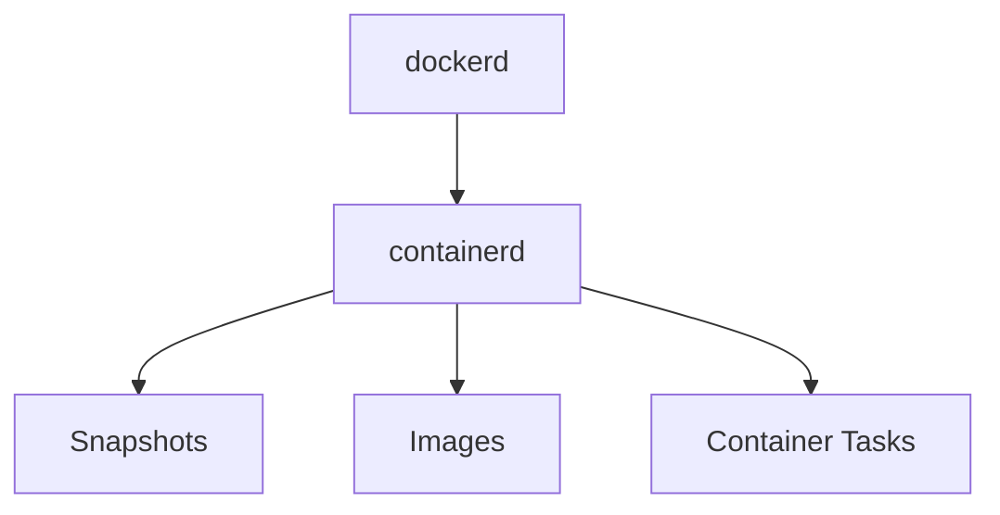

---

# runc

The actual low-level runtime.

---

# What runc Does

runc directly interacts with Linux kernel features.

Creates:

```text
Namespaces

cgroups

Container Process
```

---

# runc Architecture

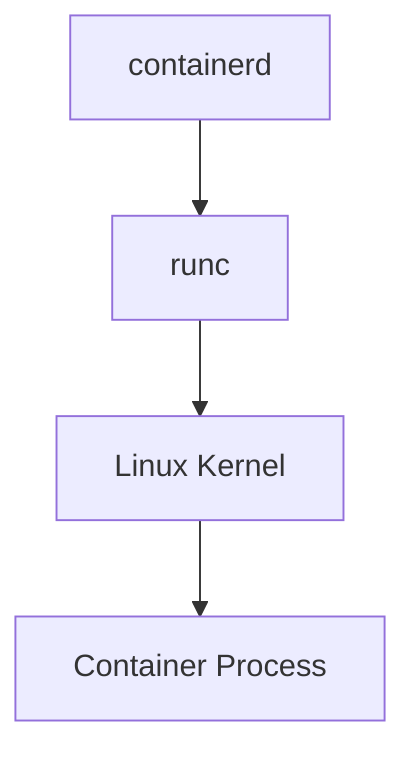

---

# The Complete Container Creation Flow

When you run:

```bash
docker run nginx
```

---

# Internal Flow

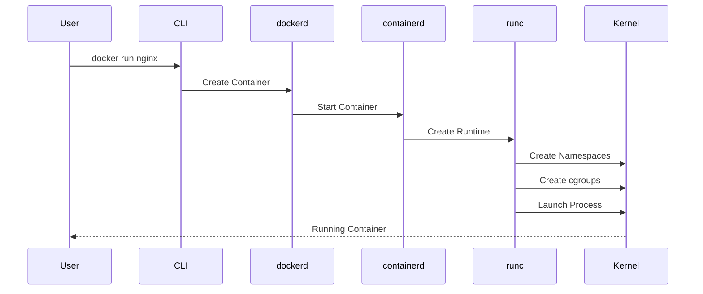

---

# Container = Process

The most important concept.

Container:

```text
Not VM

Not OS

Not Hypervisor
```

Container:

```text
Linux Process
```

---

# Verify This Yourself

Run:

```bash
docker run -d nginx
```

Then:

```bash
ps aux
```

You'll see Linux processes.

---

# Namespaces

Namespaces provide isolation.

---

# Namespace Types

```text
PID

Network

Mount

IPC

UTS

User
```

---

# Namespace Architecture

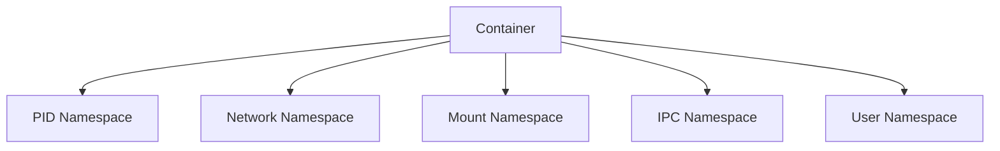

---

# PID Namespace

Creates process isolation.

Container sees:

```text
PID 1
PID 2
PID 3
```

Host sees:

```text
PID 2001
PID 2002
PID 2003
```

Same process.

Different view.

---

# PID Namespace Visualization

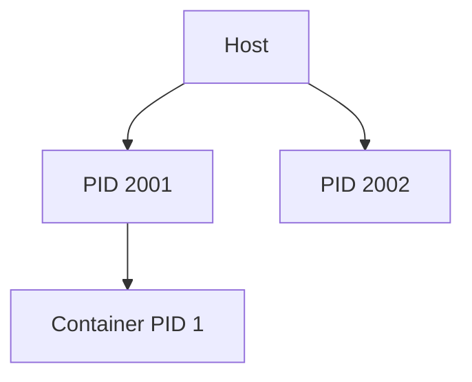

---

# Network Namespace

Each container gets:

```text
Network Interfaces

Routing Table

ARP Table

Firewall Rules
```

---

# Network Namespace Architecture

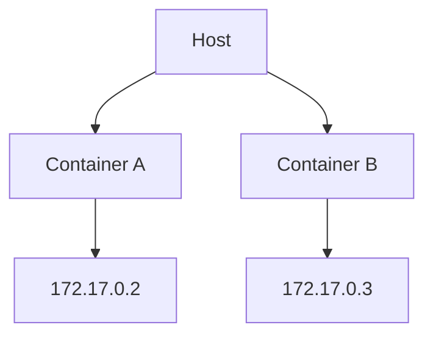

---

# Mount Namespace

Provides filesystem isolation.

---

# Mount Namespace Architecture

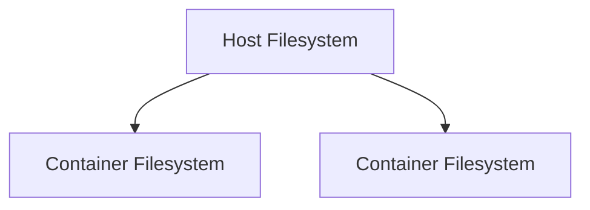

---

# UTS Namespace

Provides hostname isolation.

---

# Example

Container A:

```text
web
```

Container B:

```text
db
```

Different hostnames.

---

# User Namespace

Maps container users to host users.

---

# Security Benefit

Container root:

```text
UID 0
```

can map to:

```text
UID 100000
```

on host.

---

# cgroups

Namespaces isolate visibility.

cgroups limit resources.

---

# cgroup Architecture

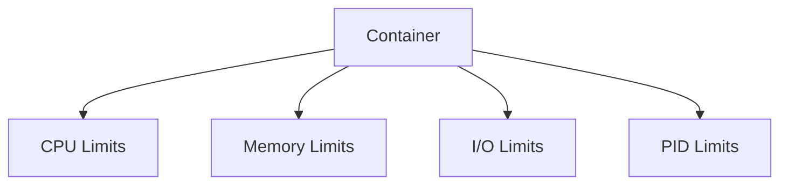

---

# Why cgroups Exist

Without limits:

```text
One Container
     ↓
Consumes Entire Server
```

---

# CPU Limits

Example:

```bash
docker run --cpus=2 nginx
```

Linux enforces via cgroups.

---

# Memory Limits

Example:

```bash
docker run -m 512m nginx
```

---

# Memory Flow

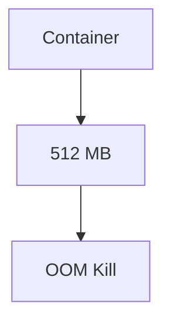

---

# OOM Kills

If memory limit exceeded:

```text
Linux OOM Killer
```

terminates process.

---

# Filesystem Isolation

Containers require isolated filesystems.

Docker uses:

```text
OverlayFS
```

---

# OverlayFS Architecture

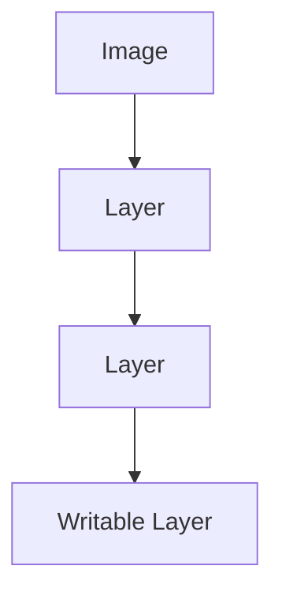

---

# Why Layers Exist

Benefits:

```text
Reuse

Caching

Fast Pulls

Reduced Storage
```

---

# Container Image Architecture

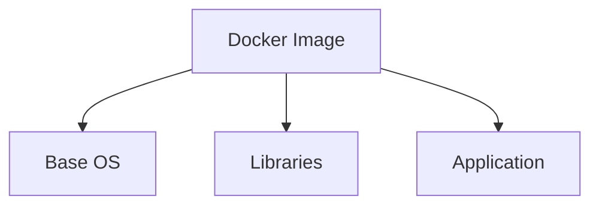

---

# Image Build Process

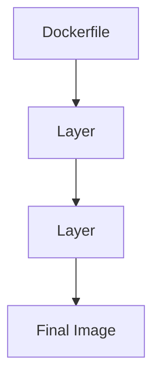

---

# Example Layering

```dockerfile
FROM ubuntu

RUN apt install nginx

COPY . .

CMD nginx
```

Creates multiple layers.

---

# Copy-On-Write

Containers share image layers.

Only changed data is stored separately.

---

# Copy-On-Write Architecture

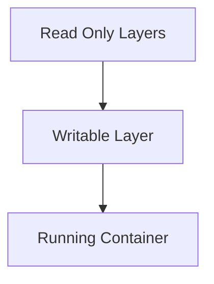

---

# Docker Networking

One of Docker's most important internals.

---

# Default Network Architecture


---

# Docker Networking Components

```text
veth Pair

Bridge

NAT

iptables
```

---

# veth Pair

Acts like a virtual cable.

---

# Visualization


---

# docker0 Bridge

Default virtual switch.

---

# Bridge Architecture

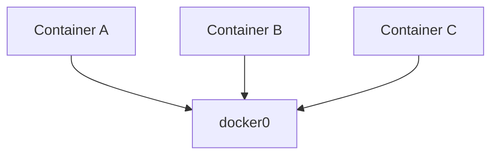

---

# NAT

Containers typically use private IPs.

Linux performs:

```text
Network Address Translation
```

for external access.

---

# Docker Storage

Persistent storage options:

```text
Volumes

Bind Mounts

tmpfs
```

---

# Volume Architecture

```mermaid
graph TD

CONTAINER["Container"]

CONTAINER --> VOLUME["Volume"]

VOLUME --> HOST["Host Storage"]
```

---

# Logging

Container stdout/stderr becomes logs.

---

# Logging Flow

```mermaid
graph TD

PROCESS["Application"]

PROCESS --> STDOUT["stdout"]

STDOUT --> DOCKER["Docker Logging Driver"]

DOCKER --> STORAGE["Logs"]
```

---

# Security Model

Containers use:

```text
Namespaces

Capabilities

seccomp

AppArmor

SELinux
```

---

# Security Architecture

```mermaid
graph TD

CONTAINER["Container"]

CONTAINER --> NAMESPACE["Namespaces"]

CONTAINER --> CAPS["Capabilities"]

CONTAINER --> SECCOMP["seccomp"]

CONTAINER --> SELINUX["SELinux"]
```

---

# seccomp

Restricts system calls.

---

# seccomp Flow

```mermaid
graph TD

APP["Application"]

APP --> SYSCALL["System Call"]

SYSCALL --> FILTER["seccomp"]

FILTER --> ALLOW["Allow"]

FILTER --> BLOCK["Block"]
```

---

# Docker and systemd

On most Linux systems:

```text
systemd
      ↓
dockerd
      ↓
containerd
      ↓
runc
      ↓
containers
```

---

# Runtime Hierarchy

```mermaid
graph TD

SYSTEMD["systemd"]

SYSTEMD --> DOCKERD["dockerd"]

DOCKERD --> CONTAINERD["containerd"]

CONTAINERD --> RUNC["runc"]

RUNC --> PROCESS["Container Process"]
```

---

# Docker and Kubernetes

Kubernetes typically does not talk directly to Docker anymore.

Modern stack:

```text
kubelet
     ↓
containerd
     ↓
runc
```

---

# Kubernetes Runtime Architecture

```mermaid
graph TD

KUBELET["kubelet"]

KUBELET --> CONTAINERD["containerd"]

CONTAINERD --> RUNC["runc"]

RUNC --> CONTAINER["Container"]
```

---

# Observability

Important tools:

```bash
docker ps

docker inspect

docker logs

docker stats

docker events
```

---

# Debugging Container Internals

View namespaces:

```bash
lsns
```

View cgroups:

```bash
systemd-cgls
```

View processes:

```bash
ps aux
```

View networking:

```bash
ip netns

ip addr
```

---

# Common Production Problems

```text
OOM Kills

Container Restarts

Image Bloat

Network Failures

Volume Issues

PID 1 Problems

File Descriptor Exhaustion
```

---

# Production Troubleshooting Flow

```mermaid
flowchart TD

ISSUE["Container Problem"]

ISSUE --> CPU["CPU?"]

ISSUE --> MEMORY["Memory?"]

ISSUE --> NETWORK["Network?"]

ISSUE --> STORAGE["Storage?"]

CPU --> STATS["docker stats"]

MEMORY --> OOM["OOM Investigation"]

NETWORK --> IP["Network Inspection"]

STORAGE --> DF["Disk Investigation"]
```

---

# The Complete Docker Internals Map

```mermaid
mindmap
  root((Docker))

    CLI
    dockerd
    containerd
    runc

    Linux
      Namespaces
      cgroups
      OverlayFS
      Networking

    Images
      Layers
      Copy On Write

    Networking
      veth
      Bridge
      NAT

    Security
      seccomp
      Capabilities
      SELinux

    Storage
      Volumes
      Bind Mounts
```

---

# Engineering Mindset

Beginners see:

```text
docker run nginx
```

Engineers see:

```text
Docker CLI
     ↓
dockerd
     ↓
containerd
     ↓
runc
     ↓
Namespaces
     ↓
cgroups
     ↓
OverlayFS
     ↓
Linux Process
```

Docker is not magic.

Docker is Linux engineering packaged into a developer-friendly experience.

---

# Interview Questions

### What happens when you run `docker run nginx`?

### Is a container a virtual machine?

### What is containerd?

### What is runc?

### What are namespaces?

### What are cgroups?

### What is OverlayFS?

### What is Copy-On-Write?

### How does Docker networking work?

### What is a veth pair?

### What is docker0?

### Why do containers share the kernel?

### How does Docker enforce memory limits?

### What causes OOMKilled containers?

### How does Kubernetes use containerd?

---

# One-Page Architecture Summary

```text
docker run
      ↓
Docker CLI
      ↓
dockerd
      ↓
containerd
      ↓
runc
      ↓
Namespaces
      ↓
cgroups
      ↓
OverlayFS
      ↓
Linux Kernel
      ↓
Container Process
```

---

# Final Takeaway

Docker is not a virtualization technology.

Docker is an orchestration layer built on Linux kernel primitives.

Everything Docker does ultimately relies on:

```text
Namespaces

cgroups

OverlayFS

veth Networking

Capabilities

seccomp

Linux Processes
```

Master Docker internals and you gain the foundation required to understand:

```text
Containers

Kubernetes

Cloud Platforms

Platform Engineering

Modern Infrastructure
```

because beneath every container platform lies the Linux kernel.
