# Internet Architecture

## The Complete Journey from a Linux Process to the Global Internet

---

# Why This Exists

You use the Internet every day.

You open:

```text
google.com
github.com
netflix.com
amazon.com
chatgpt.com
```

and things simply work.

But behind a single click lies one of the most complex engineering systems ever built.

When a user opens:

```text
https://example.com
```

thousands of components collaborate:

```text
Browser
↓
DNS
↓
TCP/IP
↓
Routers
↓
ISPs
↓
Fiber Networks
↓
CDNs
↓
Load Balancers
↓
Linux Servers
↓
Databases
↓
Storage Systems
```

The Internet is not one network.

The Internet is:

```text
A Network of Networks
```

Understanding Internet Architecture is essential for:

* Linux Engineers
* Backend Engineers
* DevOps Engineers
* Cloud Engineers
* SREs
* Platform Engineers
* System Architects
* Startup Founders

---

# The Core Mental Model

Most beginners think:

```text
Browser
   ↓
Website
```

Reality:

```text
Browser
   ↓
DNS
   ↓
Local Network
   ↓
ISP
   ↓
Routers
   ↓
Backbone Networks
   ↓
CDNs
   ↓
Load Balancers
   ↓
Linux Servers
   ↓
Application
```

The Internet is a giant packet delivery system.

---

# The Big Picture

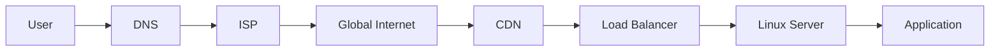

---

# What Is The Internet?

The Internet is:

```text
Millions of Networks

Connected Together

Using TCP/IP
```

---

# Internet Definition

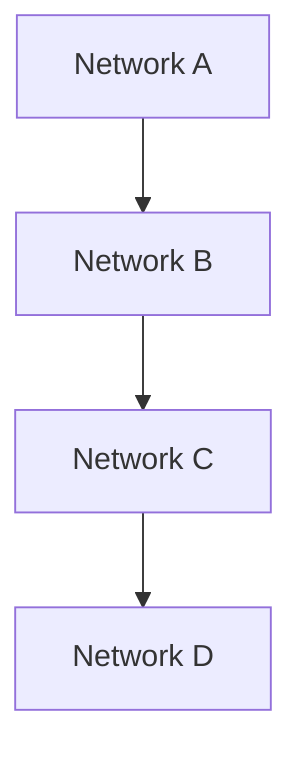

Every organization operates networks.

The Internet connects them.

---

# Internet Evolution

```text
ARPANET
    ↓
Academic Networks
    ↓
Commercial Internet
    ↓
Cloud Internet
    ↓
Global Digital Infrastructure
```

---

# The Layered Architecture

The Internet is built in layers.

---

# Internet Layer Model

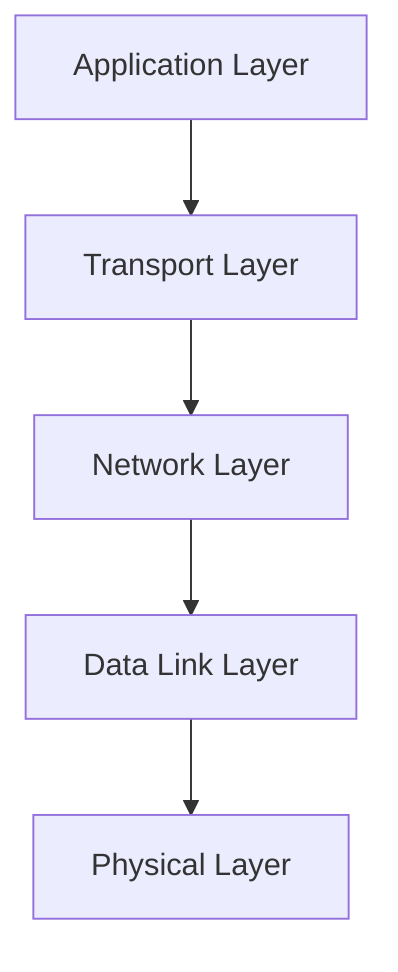

---

# OSI vs TCP/IP

---

## OSI Model

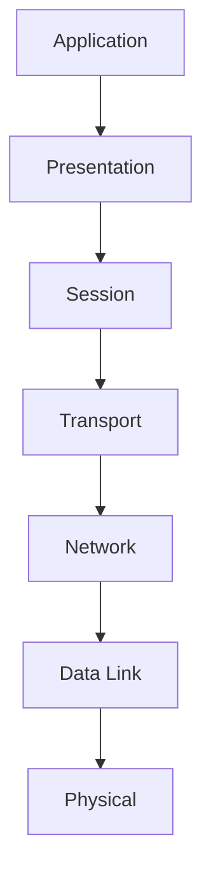

---

## TCP/IP Model

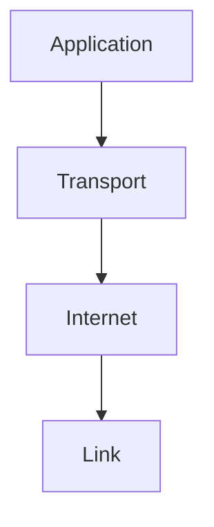

TCP/IP is what powers the Internet.

---

# Physical Internet

At the bottom:

```text
Fiber Optics

Submarine Cables

Routers

Switches

Wireless Links
```

---

# Physical Infrastructure

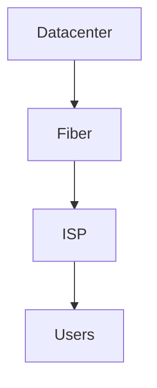

---

# Global Fiber Network

Most Internet traffic travels through:

```text
Undersea Fiber Cables
```

---

# Submarine Cable Architecture

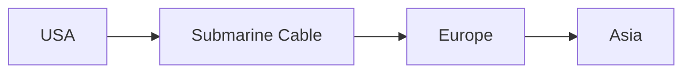

---

# Internet Service Providers (ISPs)

ISPs connect users to the Internet.

Examples:

```text
Airtel

Jio

Verizon

AT&T

BT
```

---

# ISP Architecture

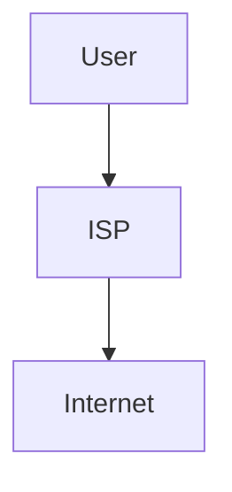

---

# Autonomous Systems (AS)

The Internet is built from Autonomous Systems.

---

# What Is An AS?

An Autonomous System is:

```text
A Network
Managed By One Organization
```

Examples:

```text
Google

Amazon

Cloudflare

Jio

Airtel
```

---

# AS Architecture

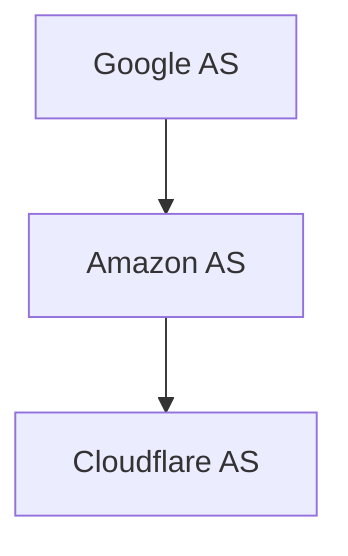

---

# BGP: The Internet's GPS

Routers must know:

```text
Where should packets go?
```

BGP solves this.

---

# BGP Architecture

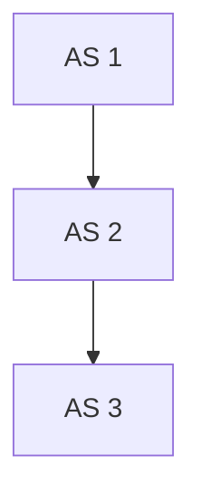

---

# BGP Decision Process

```text
Destination Network
       ↓
Best Route
       ↓
Forward Packet
```

---

# Why BGP Matters

Without BGP:

```text
No Global Routing

No Internet
```

---

# DNS Architecture

Humans use names.

Computers use IP addresses.

DNS translates between them.

---

# DNS Flow

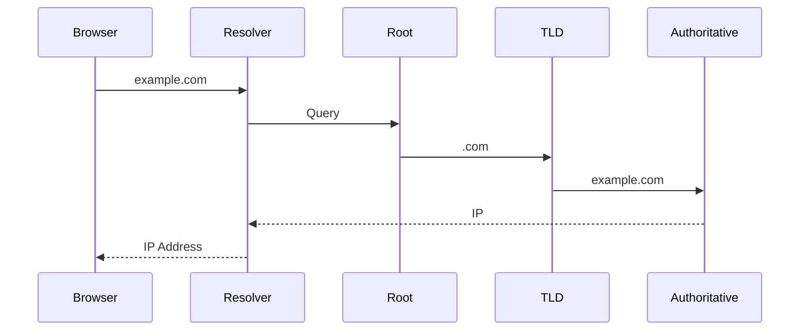

---

# DNS Hierarchy

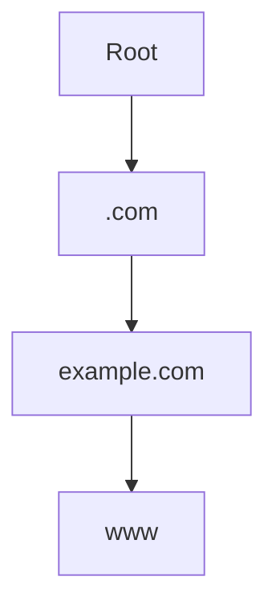

---

# Why DNS Exists

Without DNS:

```text
216.58.217.206
104.18.12.123
142.250.194.14
```

Humans cannot remember these.

---

# IP Addressing

Every Internet-connected device needs an address.

---

# IPv4

```text
192.168.1.10
```

---

# IPv6

```text
2001:db8::1
```

---

# Address Architecture

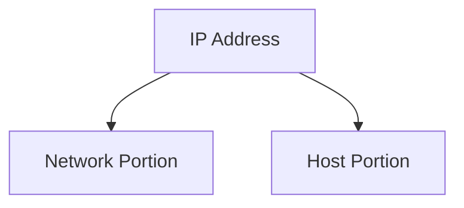

---

# Routing

Routers move packets between networks.

---

# Routing Architecture

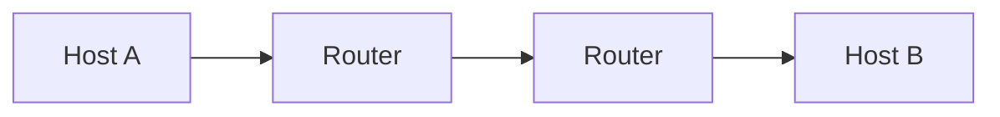

---

# Packet Journey

A packet may cross:

```text
10

20

50+

Routers
```

before reaching its destination.

---

# TCP/IP Foundation

The Internet is powered by:

```text
IP
+
TCP
```

---

# IP Responsibilities

```text
Addressing

Routing

Packet Delivery
```

---

# TCP Responsibilities

```text
Reliability

Ordering

Flow Control

Error Recovery
```

---

# TCP Architecture

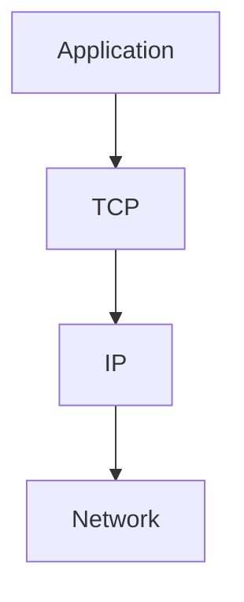

---

# TCP Handshake

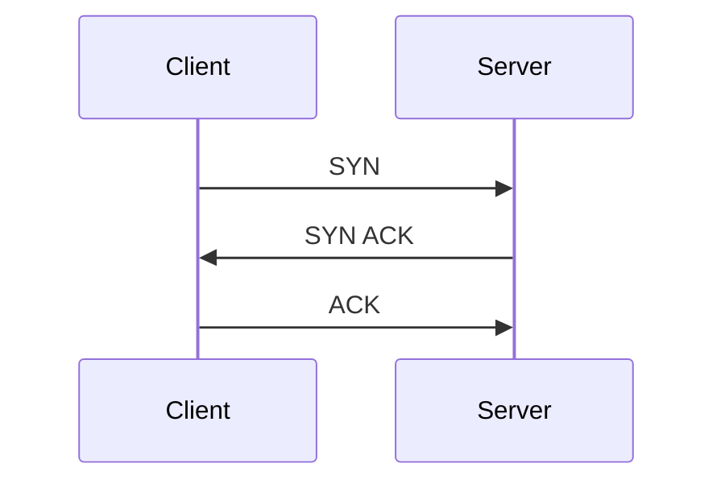

Connection established.

---

# UDP

Not all traffic needs reliability.

---

# UDP Model

```text
Fast

Connectionless

Best Effort
```

---

# UDP Use Cases

```text
DNS

Gaming

Video Streaming

VoIP
```

---

# HTTP Architecture

The modern web uses HTTP.

---

# HTTP Request Flow

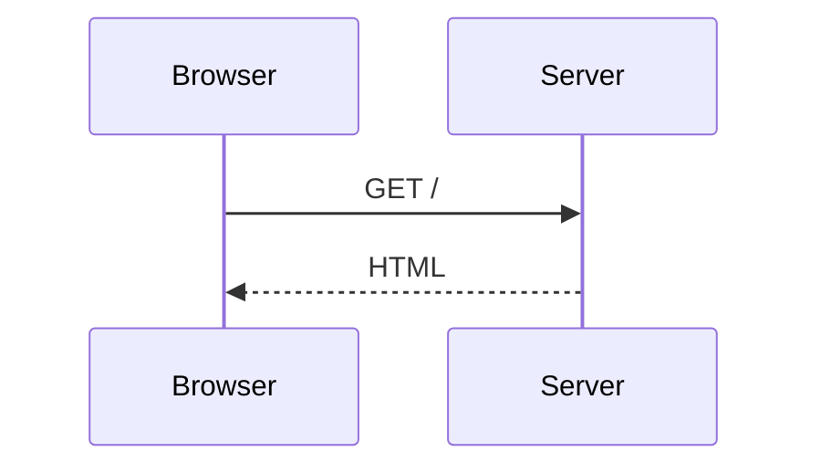

---

# HTTPS

HTTP + TLS.

---

# HTTPS Architecture

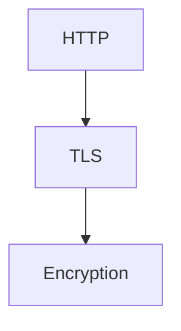

---

# TLS Handshake

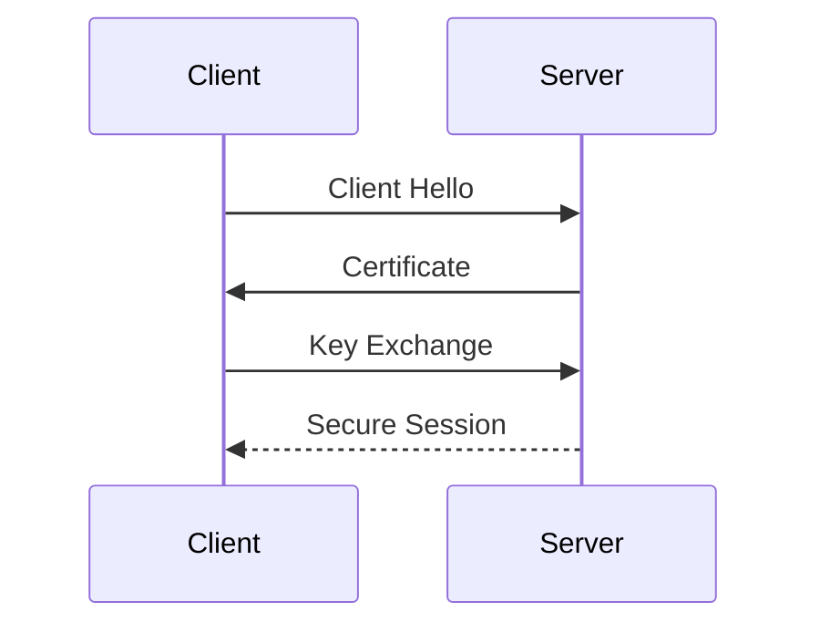

---

# CDN Architecture

Content Delivery Networks reduce latency.

---

# CDN Model

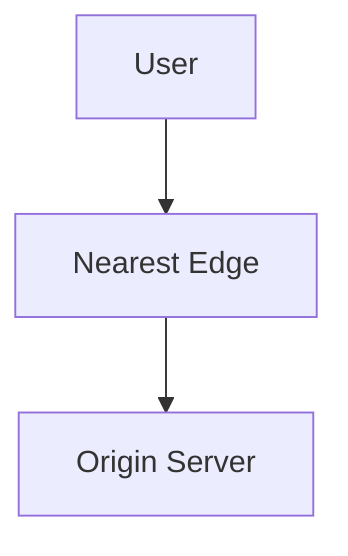

---

# Why CDNs Exist

Without CDN:

```text
India
    ↓
USA Datacenter
```

High latency.

With CDN:

```text
India
   ↓
Local Edge Server
```

Low latency.

---

# Cloudflare-Style Architecture

```mermaid
graph TD

USER["Users"]

USER --> EDGE["Global Edge"]

EDGE --> CACHE["Cache"]

CACHE --> ORIGIN["Origin"]
```

---

# Load Balancing

Traffic distribution layer.

---

# Load Balancer Architecture

```mermaid
graph TD

USERS["Users"]

USERS --> LB["Load Balancer"]

LB --> APP1["Server A"]

LB --> APP2["Server B"]

LB --> APP3["Server C"]
```

---

# Modern Web Request

```mermaid
flowchart LR

USER["User"]

USER --> DNS["DNS"]

DNS --> CDN["CDN"]

CDN --> WAF["WAF"]

WAF --> LB["Load Balancer"]

LB --> APP["Application"]

APP --> DATABASE["Database"]
```

---

# Datacenter Architecture

Where websites actually run.

---

# Datacenter Stack

```mermaid
graph TD

SERVERS["Servers"]

SERVERS --> STORAGE["Storage"]

SERVERS --> NETWORK["Networking"]

SERVERS --> POWER["Power"]
```

---

# Linux and The Internet

Most of the Internet runs on Linux.

Examples:

```text
Google

AWS

Azure

Meta

Netflix

Cloudflare

Uber
```

---

# Linux's Role

```mermaid
graph TD

APPLICATION["Application"]

APPLICATION --> LINUX["Linux"]

LINUX --> TCPIP["TCP/IP Stack"]

TCPIP --> INTERNET["Internet"]
```

---

# The Modern Internet Stack

```mermaid
graph TD

USER["User"]

USER --> BROWSER["Browser"]

BROWSER --> DNS["DNS"]

DNS --> INTERNET["Internet"]

INTERNET --> CDN["CDN"]

CDN --> LB["Load Balancer"]

LB --> K8S["Kubernetes"]

K8S --> POD["Pod"]

POD --> DATABASE["Database"]
```

---

# Internet Observability

How do we understand the Internet?

---

# Observability Stack

```mermaid
graph TD

NETWORK["Network"]

NETWORK --> METRICS["Metrics"]

NETWORK --> LOGS["Logs"]

NETWORK --> TRACES["Traces"]
```

---

# Common Internet Failures

```text
DNS Outages

BGP Leaks

Fiber Cuts

DDoS Attacks

Datacenter Failures

TLS Problems

Routing Loops
```

---

# Failure Propagation

```mermaid
flowchart TD

DNS["DNS Failure"]

DNS --> WEBSITE["Website Down"]

WEBSITE --> USERS["Users Impacted"]
```

---

# DDoS Architecture

```mermaid
graph TD

ATTACKERS["Attackers"]

ATTACKERS --> TRAFFIC["Massive Traffic"]

TRAFFIC --> TARGET["Target Service"]
```

---

# Internet Security Layers

```mermaid
graph TD

USER["User"]

USER --> TLS["TLS"]

TLS --> WAF["WAF"]

WAF --> FIREWALL["Firewall"]

FIREWALL --> APPLICATION["Application"]
```

---

# The Complete Internet Map

```mermaid
mindmap
  root((Internet))

    Physical
      Fiber
      Routers
      Datacenters

    Routing
      BGP
      Autonomous Systems

    Naming
      DNS

    Addressing
      IPv4
      IPv6

    Transport
      TCP
      UDP

    Applications
      HTTP
      HTTPS

    Distribution
      CDN
      Load Balancers

    Infrastructure
      Linux
      Kubernetes
      Cloud

    Security
      TLS
      WAF
      Firewalls
```

---

# Internet Request Lifecycle

```mermaid
flowchart TD

USER["User"]

USER --> DNS["DNS Resolution"]

DNS --> TCP["TCP Connection"]

TCP --> TLS["TLS Handshake"]

TLS --> ROUTING["Internet Routing"]

ROUTING --> CDN["CDN"]

CDN --> LOADBALANCER["Load Balancer"]

LOADBALANCER --> SERVER["Linux Server"]

SERVER --> APPLICATION["Application"]

APPLICATION --> DATABASE["Database"]

DATABASE --> RESPONSE["Response"]

RESPONSE --> USER
```

---

# Engineering Mindset

Beginners see:

```text
Website
```

Engineers see:

```text
DNS
 ↓
BGP
 ↓
TCP/IP
 ↓
TLS
 ↓
CDN
 ↓
Load Balancer
 ↓
Linux
 ↓
Application
 ↓
Database
```

The Internet is a giant distributed system built from networking, Linux, storage, security, and software engineering.

---

# Interview Questions

### What is the Internet?

### What is an Autonomous System?

### What is BGP?

### Why is DNS necessary?

### Explain DNS resolution.

### Explain TCP handshake.

### Difference between TCP and UDP?

### What is HTTPS?

### How does TLS work?

### What is a CDN?

### Why do CDNs improve performance?

### What happens when you type a URL?

### How do routers forward packets?

### Why is Linux important to the Internet?

### What are common Internet-scale failures?

---

# One-Page Architecture Summary

```text
User
 ↓
Browser
 ↓
DNS
 ↓
ISP
 ↓
BGP Routing
 ↓
Internet Backbone
 ↓
CDN
 ↓
Load Balancer
 ↓
Linux Servers
 ↓
Application
 ↓
Database
 ↓
Response
```

---

# Final Takeaway

The Internet is humanity's largest distributed system.

It is built from:

```text
Fiber Networks

Routers

Autonomous Systems

BGP

DNS

TCP/IP

CDNs

Load Balancers

Linux Servers

Cloud Infrastructure
```

Every website, API, cloud service, Kubernetes cluster, and distributed application ultimately relies on these foundations.

Master Internet Architecture and you gain the ability to understand how data travels across the planet—from a Linux process in one datacenter to a user on the other side of the world.
